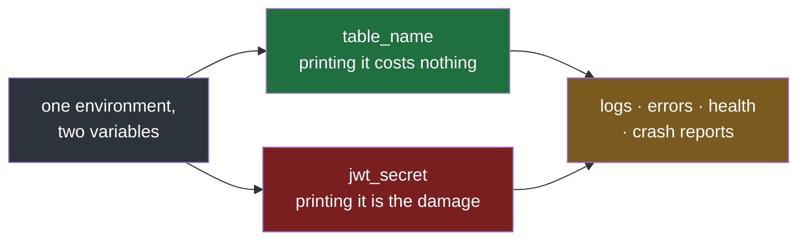

#config #pydantic #pydantic-settings #secrets #python

**A signing key and a table name arrive by exactly the same route, and the route cannot tell them apart.** So the code inherits the assumption that they are the same kind of value, and every ordinary way of printing settings carries one of them somewhere it should never go.

# Secrets Are Not Config

> [!info] A secret is a value whose disclosure is the damage: a signing key, a password, an API token. It arrives as an environment variable like everything else, which is the whole difficulty — nothing about how it is delivered marks it as different.

## Both arrive the same way, and only one of them can hurt you

Two fields, same type, same class, same source. Nothing in those two lines says one of them is different.

`src/config_lab/note04/a_both_arrive_the_same_way.py`:

```python
import json
import logging

from pydantic_settings import BaseSettings

logging.basicConfig(format="%(levelname)s %(message)s", level=logging.INFO)
logger = logging.getLogger("xarvis")


class Settings(BaseSettings):
    table_name: str = "xarvis-checkpoints"
    jwt_secret: str = "s3cr3t-signing-key"


settings = Settings()

logger.info("starting with %s", settings)
print("an error message:  ", f"failed to start with {settings}")
print("a health endpoint: ", settings.model_dump_json())
print("a crash report:    ", json.dumps(settings.model_dump()))
```

```
$ uv run python src/config_lab/note04/a_both_arrive_the_same_way.py
INFO starting with table_name='xarvis-checkpoints' jwt_secret='s3cr3t-signing-key'
an error message:   failed to start with table_name='xarvis-checkpoints' jwt_secret='s3cr3t-signing-key'
a health endpoint:  {"table_name":"xarvis-checkpoints","jwt_secret":"s3cr3t-signing-key"}
a crash report:     {"table_name": "xarvis-checkpoints", "jwt_secret": "s3cr3t-signing-key"}
```

One thing about that file before the output: the secret is written into the class as a default only so it runs with nothing set in the shell. A real class gives a secret **no default at all**, so a missing one is `Field required` at startup rather than a value somebody typed into the source. The same applies to every file in this note.

**Four routes out, and not one line was written intending to print a secret.** A startup log of the settings object, an error message that interpolates it, a health endpoint returning its own configuration, a crash reporter serialising local variables. Every one of those is a reasonable thing to write, and every one just sent the signing key to wherever logs go — usually a third-party service, retained for months, readable by anyone with a dashboard login.

Now put the two settings side by side and ask what is actually different about them.

| | `table_name` | `jwt_secret` |
|---|---|---|
| Where it comes from | an environment variable | an environment variable |
| What it costs to print | nothing | every session signed with it can be forged |
| What happens when it changes | a deploy | every existing token stops working |
| Who may see it | anyone | as few people as possible |
| How long it stays valid | until somebody renames the table | until it is rotated, which is now urgent |

**They arrive identically and behave nothing alike.** The first row is the reason for all the trouble and the only row where they agree.



> [!important] The difference has to be written down in the code, because nothing else knows it
> The environment does not mark it. The library does not guess it. The field name hints at it, and nothing that handles the value ever reads that hint. Until the difference is stated in the class, every part of the program is entitled to treat a signing key exactly as it treats a table name — and, as the run shows, it will.

## A type that hides the value and still says it is there

The difference has to be written into the class, and the way to write it is the field's type. `SecretStr` is a type from pydantic that holds a string and refuses to print it. One field changes, nothing else does.

`src/config_lab/note04/b_a_secret_type.py`:

```python
import json
import logging

from pydantic import SecretStr
from pydantic_settings import BaseSettings

logging.basicConfig(format="%(levelname)s %(message)s", level=logging.INFO)
logger = logging.getLogger("xarvis")


class Settings(BaseSettings):
    table_name: str = "xarvis-checkpoints"
    jwt_secret: SecretStr = SecretStr("s3cr3t-signing-key")


settings = Settings()

logger.info("starting with %s", settings)
print("an error message:  ", f"failed to start with {settings}")
print("a health endpoint: ", settings.model_dump_json())
print("the field alone:   ", settings.jwt_secret)
print("in an f-string:    ", f"{settings.jwt_secret}")
print("model_dump gives:  ", settings.model_dump())
try:
    print("a crash report:    ", json.dumps(settings.model_dump()))
except TypeError as exc:
    print("a crash report:    ", type(exc).__name__, exc)
print("asked for directly:", settings.jwt_secret.get_secret_value())
```

```
$ uv run python src/config_lab/note04/b_a_secret_type.py
INFO starting with table_name='xarvis-checkpoints' jwt_secret=SecretStr('**********')
an error message:   failed to start with table_name='xarvis-checkpoints' jwt_secret=SecretStr('**********')
a health endpoint:  {"table_name":"xarvis-checkpoints","jwt_secret":"**********"}
the field alone:    **********
in an f-string:    **********
model_dump gives:   {'table_name': 'xarvis-checkpoints', 'jwt_secret': SecretStr('**********')}
a crash report:     TypeError Object of type SecretStr is not JSON serializable
asked for directly: s3cr3t-signing-key
```

**Hidden, and still visibly present.** `jwt_secret=SecretStr('**********')` says the setting exists and is set, without saying what it is — and the mask is always ten stars, whatever the value's length, so not even the size leaks — so a missing secret and a present one still read differently in a log, which is the thing the log line was for.

**The masking is not one trick in one place.** Printing the object, formatting it into a string, printing the field on its own and dumping the model to JSON are four unrelated mechanisms, and the type answers all four. Compare that with the section above, where those same four lines each carried the key out of the process.

| The path | Plain `str` | `SecretStr` |
|---|---|---|
| a startup log of the settings object | the key | `SecretStr('**********')` |
| an error message interpolating settings | the key | `SecretStr('**********')` |
| `model_dump_json()`, a health endpoint | the key | `"**********"` |
| the field on its own, or in an f-string | the key | `**********` |
| `json.dumps(model_dump())`, a crash reporter | the key | **`TypeError`** |
| `get_secret_value()` | — | the key, deliberately |

Two rows in that table deserve more than a tick.

**The crash-report row does not mask — it breaks.** `model_dump()` hands back the `SecretStr` object rather than a string, so `json.dumps` refuses it. That is the better failure: hand-rolled serialisation of a settings object stops working loudly, at the moment somebody writes it, instead of quietly shipping the key to a crash service.

The two calls differ in what they hand back. `model_dump()` returns a dict of Python objects, so the `SecretStr` arrives intact and whatever you do with it afterwards decides what happens. `model_dump_json()` produces the JSON text itself, and that is where the masking is applied — which is why only the second one is safe to send anywhere.

**The last row is the door, and it is meant to be there.** Something has to sign the token eventually, so the real value must be reachable. What the type changes is that reaching it is now a **method call** rather than ordinary attribute access — so every deliberate use is one `grep get_secret_value` away, and nothing reaches the value by accident.

> [!important] What this closes, and what it does not
> Every path above is one nobody chose: a log line that happened to include settings, an error that interpolated them, an endpoint that serialised them. Those are the leaks that actually happen, and the type ends all of them at once, with one word per field and no discipline required afterwards.
>
> It closes nothing about the value once somebody asks for it. `get_secret_value()` returns a plain string, and a plain string has no protection of any kind — which is the next section.

## The protection ends at the unwrap

`get_secret_value()` hands back a plain string, and a plain string has no protection of any kind. So the question is not whether to call it — something has to sign the request — but **where**, because everything after that call is holding an ordinary value again.

`src/config_lab/note04/c_the_protection_ends_at_the_unwrap.py`:

```python
import logging

from pydantic import SecretStr
from pydantic_settings import BaseSettings

logging.basicConfig(format="%(levelname)s %(message)s", level=logging.INFO)
logger = logging.getLogger("xarvis")


class Settings(BaseSettings):
    hrms_token: SecretStr = SecretStr("tok_9f3a21")


def call_hrms(auth: SecretStr) -> str:
    real_header = f"Bearer {auth.get_secret_value()}"
    return f"the client sent {len(real_header)} characters it never logged"


settings = Settings()

logger.info("--- unwrapped early, then carried around")
token = settings.hrms_token.get_secret_value()
headers = {"Authorization": f"Bearer {token}"}
logger.info("calling the HRMS with headers=%s", headers)
logger.info("retrying with the same headers=%s", headers)

logger.info("--- kept wrapped, unwrapped inside the call")
carried = {"Authorization": settings.hrms_token}
logger.info("calling the HRMS with headers=%s", carried)
logger.info("%s", call_hrms(settings.hrms_token))
```

```
$ uv run python src/config_lab/note04/c_the_protection_ends_at_the_unwrap.py
INFO --- unwrapped early, then carried around
INFO calling the HRMS with headers={'Authorization': 'Bearer tok_9f3a21'}
INFO retrying with the same headers={'Authorization': 'Bearer tok_9f3a21'}
INFO --- kept wrapped, unwrapped inside the call
INFO calling the HRMS with headers={'Authorization': SecretStr('**********')}
INFO the client sent 17 characters it never logged
```

**Nobody logged a secret in the first half either.** Somebody logged `headers`, which is an ordinary and useful thing to log when an upstream call misbehaves. By then the token was a plain string inside a dict, indistinguishable from a URL or a content type.

**The second half is the same log line, masked**, because what sits in the dict is still the wrapped object. The unwrap happens inside `call_hrms`, in a local that is never logged and never returned.

| Where the value is | What protects it |
|---|---|
| `settings.hrms_token` | every path, automatically |
| passed to a function as a `SecretStr` | every path, automatically |
| unwrapped inside the call, in a local | that it is never stored or logged |
| unwrapped into a name near the top of a function | **nothing at all** |

> [!warning] An early unwrap does not leak once
> Look at the two log lines in the first half. The same dict is logged again on the retry, and would be logged again by the next error path, and by anything it is passed to. One misplaced call turns a protected value back into an ordinary string for the whole remaining scope, and every later line that touches it is a fresh copy of the secret in the logs.

So the call belongs as deep and as late as possible: in the client, the signer, the driver connection — and its result belongs in an expression, not a variable. Seeing it in a startup log, an error handler, or a function that builds a structure somebody else will log is the leak, already written, waiting for the next person to log the thing it went into.

## A committed `.env` is permanent, and deleting it is not a fix

Everything so far has been about a secret escaping while the program runs. This one escapes before the program ever runs, which is why no field type can help: the value was already published, by the repository.

Git does not store changes. It stores **snapshots**, and a commit is immutable — its identity is a hash of its content, so a commit that contained `.env` goes on containing it forever. Removing the file later cannot reach back into that commit. It adds a new commit in which the file is absent and leaves the old one exactly as it was: still there, still reachable, still readable by anyone with the repository.

Three things are therefore true at the same moment, right after the cleanup:

| | |
|---|---|
| the working tree | clean — no `.env`, and the diff looks like a fix |
| `git show <the earlier commit>:.env` | prints the key |
| everyone who cloned or forked before the removal | has it, and always will |

This is the one claim in this folder with no lab file behind it, because demonstrating it means committing a secret on purpose. Run it yourself in a throwaway directory instead — nothing here touches the config lab:

```bash
mkdir -p /tmp/secret-history-demo && cd /tmp/secret-history-demo
git init -q
printf 'JWT_SECRET=s3cr3t-signing-key\n' > .env
git add .env && git commit -qm "add config"

printf '.env\n' > .gitignore
git rm --cached -q .env && git commit -qm "remove the committed .env"

git show HEAD~1:.env
git grep -n "s3cr3t" $(git rev-list --all)
```

The last two lines are the whole rung. `git show HEAD~1:.env` prints the secret out of a repository where that file no longer exists, and `git grep` across `git rev-list --all` finds it without being told where to look — which is exactly what an automated scanner does, and what anyone curious can do in one command.

**Rewriting history does not undo it either.** A rewrite changes your copy. It does not reach clones, forks, the pull-request refs a host keeps, or its caches — on GitHub an unreachable commit stays fetchable by its hash long after nothing points at it.

## Rotation is the remedy, and removal is the tidying

Which settles what to do, and the order matters more than the actions.

| What you do | What it achieves |
|---|---|
| delete the file and commit | the working tree is clean, the value is still readable in history |
| add it to `.gitignore` | it stops happening again, nothing about what already happened |
| rewrite history | your copy is clean; clones, forks and host caches are not |
| **rotate the value** | **the copies that exist everywhere stop being worth anything** |

**Only the last row changes what an attacker holds.** The first three change what is convenient to find, which is worth doing and is not the fix.

> [!warning] The clock starts at the push, not at the discovery
> A secret is compromised from the moment it leaves the machine, not from the moment somebody notices. Between those two points it sat in a hosting provider, in every CI run that cloned the repository, in whatever caches and backups the host keeps, and in the laptop of everyone who pulled.
>
> So rotate first, while the cleanup is still being argued about. A rotated key in a public commit is a string that no longer opens anything; an unrotated key in a private repository is one leaked access token away from being live.

## The file was the wrong place in production anyway

Everything above treats the `.env` file as a given and works on making it safer. In production it is usually the wrong mechanism, for two reasons that belong to [[06-Baked-Or-Passed-In]] and are worth stating here in one paragraph.

**A file inside the project ends up inside the image**, and an image is a snapshot that gets copied to every machine that runs the service, kept in caches, and stored under old tags — the same permanence as the git history above, in a second store. **And changing the value means rebuilding that image**, so rotating a secret costs a commit, a review with the secret in the diff, a build and a deploy. The rotation section said rotation is the only real remedy; baking the value into the artifact makes that remedy the expensive option, and expensive remedies get postponed.

## What replaces the file: a mount, or a manager

Both fixes do the same one thing — **the value is delivered when the container starts, from somewhere outside the image** — and they differ only in where it is kept.

### A mounted file

The values live outside the image, and the platform attaches them into the container at a path you choose:

```python
model_config = SettingsConfigDict(env_file="/run/secrets/app.env")
```

From the program's side nothing changes. It is a file, read exactly as the project's own `.env` was read in [[01-Declared-Not-Fetched]]. What changed is that the file is no longer part of the artifact, and no longer part of the repository — the environment file with real values simply stops existing in the source tree.

Who puts the file there depends on where the service runs:

| Where it runs | How the file gets there |
|---|---|
| a single machine | somebody copies it once, or the provisioning does |
| docker compose | the file sits on the host and is mounted in, read-only |
| a cluster | the values are stored in the platform and written into every container automatically |

The name and path have nothing to do with what the file was called in the repository. It is mounted where you say, and the settings class is pointed at that path.

### A secret manager

The values live in a service built for the job — AWS Secrets Manager, Vault, and the like — rather than on the machine. At start, either the platform fetches them and hands them to the process as environment variables, or the code asks for them during startup.

| | A mounted file | A secret manager |
|---|---|---|
| Where the value lives | on the machine, outside the image | in a central service |
| Rotation | replace the file, restart | change it once, centrally |
| Who may read it | whoever can read the file | a permission granted per service |
| A record of who read it, and when | none | yes, an audit log |
| What can go wrong | nothing beyond the file being missing | if the service is unreachable, nothing starts |

**That last row is the real trade.** The manager buys central control and a record of every read, and charges you a dependency at the least forgiving moment — startup.

> [!important] Neither of them changes the settings class
> A mounted file is still a file, and a manager's value almost always arrives as an environment variable. Both are things `jwt_secret: SecretStr` already reads, through the same four sources from [[01-Declared-Not-Fetched]]. **The delivery mechanism changes and the code does not**, which is the reason this folder spent its time on the class rather than on the deployment.

And the properties that made this section necessary hold in every shape above: the image never contains the value, so the registry, the layer caches and the old tags have nothing to leak — and changing the value is replace-and-restart rather than rebuild-and-deploy, which is what makes rotation cheap enough to actually happen.
