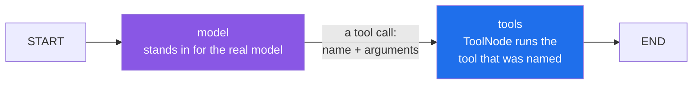
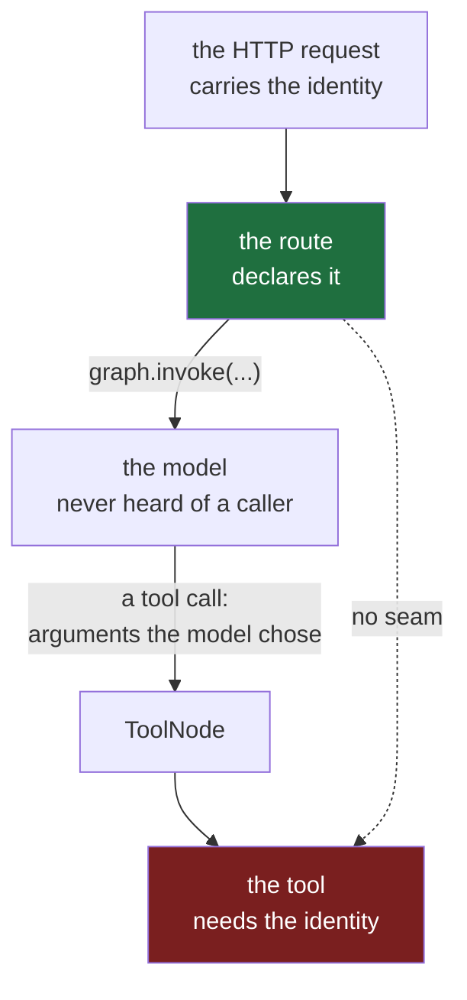

#dependency-injection #langgraph #fastapi #architecture

**A web framework hands a function what it asked for only when the framework is the one calling.** An agent's tools are called by something else entirely, so everything the previous notes built stops at that line. This note is about what carries across it.

# Past The Framework Edge

> [!info] Three words used throughout. A **tool** is a plain function an agent can choose to run, such as looking up a salary. A **tool call** is the model's request for one: a tool's name plus the arguments it picked. A **graph** is the loop that runs an agent — it calls the model, runs whatever tools the model asked for, and goes round again.

## The model's loop is the caller, not the framework

[[03-Declared-At-The-Door]] ended at a wall: a declaration is an instruction to the web framework, and it has no effect where the framework is not making the call. An agent's tools live on the other side of that wall. Here is the smallest honest picture of who calls them.



`src/wiring_lab/note05/a_the_model_loop_is_the_caller.py`:

```python
from langchain_core.messages import AIMessage
from langgraph.graph import END, START, MessagesState, StateGraph
from langgraph.prebuilt import ToolNode


def salary_for(employee_id: str) -> int:
    """Look up one employee's salary."""
    print(f"  tool ran, employee_id={employee_id!r}")
    return {"1000": 900_000}[employee_id]


def model(state: MessagesState) -> dict:
    print("  model asked for salary_for(employee_id='1000')")
    call = {
        "name": "salary_for",
        "args": {"employee_id": "1000"},
        "id": "call_1",
        "type": "tool_call",
    }
    return {"messages": [AIMessage(content="", tool_calls=[call])]}


# ty cannot see that a TypedDict satisfies StateT's bound. False positive,
# and the same one Xarvis carries in its own graph builders.
builder = StateGraph(MessagesState)  # ty: ignore[invalid-argument-type]
builder.add_node("model", model)
builder.add_node("tools", ToolNode([salary_for]))
builder.add_edge(START, "model")
builder.add_edge("model", "tools")
builder.add_edge("tools", END)
graph = builder.compile()

result = graph.invoke({"messages": []})
print("  tool result ->", result["messages"][-1].content)
```

Four things in that file are worth naming before the output.

**The state** is the one object a graph carries from node to node; `MessagesState` is a ready-made one holding the list of messages a chat accumulates. The comment above the graph is honest about a wart: the type checker rejects a `TypedDict` here even though it is exactly what the library wants, so the line carries a suppression. Each of the three files in this note that builds a graph carries the same one.

**The tool** is an ordinary function. Its docstring is what a real model reads when deciding whether to call it.

**The model node** is a stand-in that always asks for the same tool, so the example needs no API key and no network. What it returns is worth reading closely: a **request**, carrying a name and arguments. It does not call `salary_for`.

**`ToolNode`** is the piece that receives such requests and runs the tool whose name matches.

```
$ uv run python src/wiring_lab/note05/a_the_model_loop_is_the_caller.py

  model asked for salary_for(employee_id='1000')
  tool ran, employee_id='1000'
  tool result -> 900000
```

The tool ran. Now look for the line that called it — every mention of `salary_for` in the file:

| Where it appears | What that line does |
|---|---|
| `def salary_for(...)` | defines it |
| inside the model node's `print` | text |
| `"name": "salary_for"` | names it in the request, as a string |
| `ToolNode([salary_for])` | hands the function over, without calling it |

**Nothing calls it.** The last lines invoke the graph, the model node produced a request naming the tool, and `ToolNode` matched that name and made the call.

| | A route, in the previous notes | A tool, here |
|---|---|---|
| who calls it | the web framework, when a URL matches | `ToolNode`, when the model names it |
| what triggers the call | an HTTP request arriving | a tool call the model chose |
| does a `Depends` declaration reach it | yes | no — the framework is not involved |

> [!important] A tool is reached by a different road into your code
> The request to run a tool comes from the model, as a name and a set of arguments, and a part of the graph library makes the call. Every mechanism the earlier notes relied on sits on the other side of that line, which is why a tool cannot simply declare what it needs and expect the web framework to supply it.

## The global is the only thing both sides can see

A real tool checks who is asking before it answers, which means it needs the caller's identity. Follow where that identity lives and where it is needed:



The route has it and the tool needs it, and nothing joins them. The route cannot pass it, because a tool's arguments are chosen by the model. `Depends` cannot reach across, as the previous section showed. What both ends **can** see is a module-level variable, so the route writes it and the tool reads it.

`src/wiring_lab/note05/b_the_global_that_bridges.py`:

```python
from typing import Annotated

from fastapi import Depends, FastAPI, Header
from fastapi.testclient import TestClient
from langchain_core.messages import AIMessage
from langgraph.graph import END, START, MessagesState, StateGraph
from langgraph.prebuilt import ToolNode

CURRENT_CALLER: dict[str, str] = {}

SALARIES = {"1000": 900_000, "2000": 1_500_000}


def salary_for(employee_id: str) -> str:
    """Look up one employee's salary."""
    caller_id = CURRENT_CALLER["employee_id"]
    if caller_id != employee_id:
        return f"{caller_id} may not read the salary of {employee_id}"
    return f"{employee_id} earns {SALARIES[employee_id]}"


def model(state: MessagesState) -> dict:
    call = {
        "name": "salary_for",
        "args": {"employee_id": "1000"},
        "id": "call_1",
        "type": "tool_call",
    }
    return {"messages": [AIMessage(content="", tool_calls=[call])]}


# ty cannot see that a TypedDict satisfies StateT's bound. False positive.
builder = StateGraph(MessagesState)  # ty: ignore[invalid-argument-type]
builder.add_node("model", model)
builder.add_node("tools", ToolNode([salary_for]))
builder.add_edge(START, "model")
builder.add_edge("model", "tools")
builder.add_edge("tools", END)
graph = builder.compile()


def get_caller_id(x_employee_id: Annotated[str, Header()]) -> str:
    return x_employee_id


app = FastAPI()


@app.post("/ask")
def ask(caller_id: Annotated[str, Depends(get_caller_id)]) -> dict[str, str]:
    CURRENT_CALLER["employee_id"] = caller_id
    result = graph.invoke({"messages": []})
    return {"answer": result["messages"][-1].content}


client = TestClient(app)

print("employee 1000 asks about 1000")
print("  ->", client.post("/ask", headers={"X-Employee-Id": "1000"}).json())

print("employee 2000 asks about 1000")
print("  ->", client.post("/ask", headers={"X-Employee-Id": "2000"}).json())
```

The route's first line is the declared identity from [[04-Protected-By-Default]]. Its second line puts that identity somewhere the tool can reach, and its third hands off to the loop.

```
$ uv run python src/wiring_lab/note05/b_the_global_that_bridges.py

employee 1000 asks about 1000
  -> {'answer': '1000 earns 900000'}

employee 2000 asks about 1000
  -> {'answer': '2000 may not read the salary of 1000'}
```

**It works, and it works correctly.** The model asked about employee `1000` on both requests — the tool call is identical — and the answers differ because the caller differs. The second caller is refused.

| What to ask of this arrangement | The answer |
|---|---|
| is the identity real | yes, read from the request and declared by the route |
| does the check work | yes, employee 2000 is refused the record |
| is `salary_for`'s promise complete | **no** — its `def` line says `employee_id`, and its body reads two things |

That last row is the broken promise from [[01-Hidden-Inputs]], arrived at honestly. Nobody was careless here: the global is the only mechanism that spans a boundary the web framework cannot cross, so it goes in, and it does the job it was put there to do.

> [!important] The global is a correct workaround, not a mistake
> It exists because a tool cannot be handed anything by the route that started it, and something has to carry the caller across. That is why agent codebases arrive at this shape by reasoning rather than by neglect — and why the next section is about what it costs rather than about who to blame.

## The cost lands on the security rule

Here is the tool on its own, in a module that runs nothing when imported. That is the realistic shape: a tool lives in its own file, and the global it reads is filled by whatever started the graph.

`src/wiring_lab/note05/c_the_tool_module.py`:

```python
CURRENT_CALLER: dict[str, str] = {}
SALARIES = {"1000": 900_000, "2000": 1_500_000}


def salary_for(employee_id: str) -> str:
    """Look up one employee's salary."""
    caller_id = CURRENT_CALLER["employee_id"]
    if caller_id != employee_id:
        return f"{caller_id} may not read the salary of {employee_id}"
    return f"{employee_id} earns {SALARIES[employee_id]}"
```

Now write the test most worth having. Not the happy path — the refusal. An employee must not be able to read somebody else's salary, and those two middle lines are the only thing enforcing it.

`src/wiring_lab/note05/d_testing_the_rule.py`:

```python
from wiring_lab.note05.c_the_tool_module import salary_for

print("employee 2000 must not read 1000's salary")
print("  ->", salary_for("1000"))
```

```
$ uv run python src/wiring_lab/note05/d_testing_the_rule.py

employee 2000 must not read 1000's salary
Traceback (most recent call last):
  File "/Users/home/Desktop/projects/wiring-lab/src/wiring_lab/note05/d_testing_the_rule.py", line 16, in <module>
    print("  ->", salary_for("1000"))
                  ~~~~~~~~~~^^^^^^^^
  File "/Users/home/Desktop/projects/wiring-lab/src/wiring_lab/note05/c_the_tool_module.py", line 16, in salary_for
    caller_id = CURRENT_CALLER["employee_id"]
                ~~~~~~~~~~~~~~^^^^^^^^^^^^^^^
KeyError: 'employee_id'
```

As in [[01-Hidden-Inputs]], each lab file opens with a comment header explaining what it demonstrates, and those headers are left out of the code shown here — which is why the line numbers in this note's output are larger than the code above them.

It never reaches the rule. This is the same `KeyError` as [[01-Hidden-Inputs]], and the same bill arrives with it: to run this at all you must import the global, write the right key into it, and remember to empty it afterwards or the next test inherits whichever caller you left behind.

What is different is where it landed:

| | The example in note 1 | Here |
|---|---|---|
| what the hidden input is | a dictionary of salaries | **who is calling** |
| what the function does with it | looks up a number | **decides whether to refuse** |
| what a test would have proved | the lookup works | **that one employee cannot read another's salary** |

> [!warning] The hidden input is the one the security check reads
> Tools are where authorization lives in an agent, because a tool is the thing that actually reaches an employee's record. So the arrangement that makes a function awkward to test lands hardest on exactly the functions whose behaviour most needs proving — and the first thing it blocks is the test for the refusal.

## One shared key, and two requests crossing

The testing cost is the one this folder has been building towards. The global has a second cost that is not about testing at all, and it arrives the first time two requests overlap.

No web server is needed to show it: two concurrent tasks are the same thing.

`src/wiring_lab/note05/e_two_requests_one_global.py`:

```python
import asyncio

CURRENT_CALLER: dict[str, str] = {}


def salary_tool() -> str:
    return CURRENT_CALLER["employee_id"]


async def handle_request(caller_id: str) -> None:
    CURRENT_CALLER["employee_id"] = caller_id
    await asyncio.sleep(0.05)
    print(f"  request from {caller_id}: the tool saw {salary_tool()}")


async def main() -> None:
    await asyncio.gather(handle_request("1000"), handle_request("2000"))


asyncio.run(main())
```

Setting the global is the route writing the caller. The `await` stands for the model call or the HRMS request, and in an agent it is always there.

```
$ uv run python src/wiring_lab/note05/e_two_requests_one_global.py

  request from 1000: the tool saw 2000
  request from 2000: the tool saw 2000
```

**Read the first line twice.** Employee `1000` made a request, and their tool ran as employee `2000`. While the first request waited at its `await`, the second overwrote the value.

The cause is exact: **both requests write the same key.** `CURRENT_CALLER["employee_id"]` is one fixed string, so the second write lands on top of the first.

## Give each request its own key, and the tool cannot find it

If a shared key is the problem, the obvious repair is a key per request.

`src/wiring_lab/note05/f_a_key_per_request.py`:

```python
import asyncio

CALLERS: dict[str, str] = {}


def salary_tool(request_id: str) -> str:
    return CALLERS[request_id]


async def handle_request(request_id: str, caller_id: str) -> None:
    CALLERS[request_id] = caller_id
    await asyncio.sleep(0.05)
    seen = salary_tool(request_id)
    print(f"  request {request_id} from {caller_id}: the tool saw {seen}")


async def main() -> None:
    await asyncio.gather(handle_request("r1", "1000"), handle_request("r2", "2000"))
    print("  the dictionary now holds:", CALLERS)


asyncio.run(main())
```

```
$ uv run python src/wiring_lab/note05/f_a_key_per_request.py

  request r1 from 1000: the tool saw 1000
  request r2 from 2000: the tool saw 2000
  the dictionary now holds: {'r1': '1000', 'r2': '2000'}
```

**It works.** Neither request overwrites the other, and both entries sit side by side.

The cost has moved into the tool's signature: `salary_tool` now takes `request_id`, because a value stored under a per-request key can only be read back by something holding that key. So who holds it?

A tool's arguments are chosen by the model. Registering this tool and asking what the model is expected to provide settles it.

`src/wiring_lab/note05/g_who_supplies_the_key.py`:

```python
from langchain_core.tools import StructuredTool


def salary_tool(request_id: str, employee_id: str) -> str:
    """Look up one employee's salary."""
    return f"salary of {employee_id} for request {request_id}"


tool = StructuredTool.from_function(
    func=salary_tool,
    name="salary_tool",
    description="Look up one employee's salary.",
)

print("  the model is asked to fill:", sorted(tool.args))
```

```
$ uv run python src/wiring_lab/note05/g_who_supplies_the_key.py

  the model is asked to fill: ['employee_id', 'request_id']
```

**The model would have to invent the request id.** It has no idea what one is, and nothing stops it sending another request's. The key that makes the dictionary safe is itself something the tool cannot be handed — the same gap as before, one level down.

## The key can be the task, and that is what a ContextVar is

There is a key that needs nobody to supply it: the task the code is running in. The route's write and the tool's read happen inside the same task, so if the task is the key, neither end has to know it.

That is a `ContextVar`. It looks like a global and holds a separate value per task.

`src/wiring_lab/note05/h_the_key_is_the_task.py`:

```python
import asyncio
from contextvars import ContextVar

current_caller: ContextVar[str] = ContextVar("current_caller")


def salary_tool() -> str:
    return current_caller.get()


async def handle_request(caller_id: str) -> None:
    current_caller.set(caller_id)
    await asyncio.sleep(0.05)
    task = asyncio.current_task()
    task_name = task.get_name() if task else "unknown task"
    print(f"  running in {task_name}: set {caller_id}, the tool saw {salary_tool()}")


async def main() -> None:
    await asyncio.gather(handle_request("1000"), handle_request("2000"))


asyncio.run(main())

print("now call the tool from a test, with no request running:")
try:
    print("  ->", salary_tool())
except LookupError:
    print("  LookupError: the ContextVar has no value in this task")
```

```
$ uv run python src/wiring_lab/note05/h_the_key_is_the_task.py

  running in Task-2: set 1000, the tool saw 1000
  running in Task-3: set 2000, the tool saw 2000
now call the tool from a test, with no request running:
  LookupError: the ContextVar has no value in this task
```

The task names in that output are the keys. `.get()` means give me the value belonging to whichever task is asking, and the leak is closed.

The last two lines are the same attempt as the previous section: call the tool with no request running. The exception changes its name and nothing else changes.

| | `CURRENT_CALLER["employee_id"]` | `CALLERS[request_id]` | `current_caller.get()` |
|---|---|---|---|
| what the key is | one fixed string | one per request | the running task |
| who supplies the key | nobody — it is the same for everyone | whoever calls the tool, so the model | Python, invisibly |
| two requests at once | **identities cross** | kept apart | kept apart |
| calling the tool from a test | `KeyError` | needs a key invented by hand | `LookupError` |
| does the tool's `def` line say what it needs | no | no | no |

> [!important] A ContextVar fixes the leak and changes nothing about the design
> It is the per-request key with the key chosen for you, and it is the right repair for two requests crossing. The bottom row is what survives it: the tool still reaches for something its `def` line never mentions, so the test still cannot run and the promise is still broken. The value is simply stored somewhere safer.

## The tool declares the caller, and the graph hands it over

Every storage shape so far left the same row unfixed: the tool's `def` line never says it needs a caller. The repair is the one this folder has used at every other boundary — put it on the `def` line — and the graph library provides the way to do it.

Three things change. A small class describes what a turn needs to know. The graph is told that shape with `context_schema`. And the tool takes a parameter of type `ToolRuntime`, which is how the graph hands that context to it.

`src/wiring_lab/note05/i_the_context_is_declared.py`:

```python
import asyncio
from dataclasses import dataclass

from langchain_core.messages import AIMessage
from langgraph.graph import END, START, MessagesState, StateGraph
from langgraph.prebuilt import ToolNode, ToolRuntime

SALARIES = {"1000": 900_000, "2000": 1_500_000}


@dataclass
class Caller:
    employee_id: str


def salary_for(employee_id: str, runtime: ToolRuntime[Caller]) -> str:
    """Look up one employee's salary."""
    caller_id = runtime.context.employee_id
    if caller_id != employee_id:
        return f"{caller_id} may not read the salary of {employee_id}"
    return f"{employee_id} earns {SALARIES[employee_id]}"


def model(state: MessagesState) -> dict:
    call = {
        "name": "salary_for",
        "args": {"employee_id": "1000"},
        "id": "call_1",
        "type": "tool_call",
    }
    return {"messages": [AIMessage(content="", tool_calls=[call])]}


# ty cannot see that a TypedDict satisfies StateT's bound. False positive.
builder = StateGraph(MessagesState, context_schema=Caller)  # ty: ignore[invalid-argument-type]
builder.add_node("model", model)
builder.add_node("tools", ToolNode([salary_for]))
builder.add_edge(START, "model")
builder.add_edge("model", "tools")
builder.add_edge("tools", END)
graph = builder.compile()


async def handle_request(caller_id: str) -> None:
    caller = Caller(employee_id=caller_id)
    result = await graph.ainvoke({"messages": []}, context=caller)
    print(f"  request from {caller_id}: {result['messages'][-1].content}")


async def main() -> None:
    await asyncio.gather(handle_request("1000"), handle_request("2000"))


asyncio.run(main())
```

The caller is passed once, where the turn begins: `context=caller` on the invoke. There is no module-level variable anywhere in the file.

Two different lifetimes meet on that line. The caller is built per request, out of what this request carried. Anything a tool needs that is built once and reused — a service object, a database client — is built by the composition root of [[02-Composition-Root]] and travels in the same context, constructed at startup rather than per turn.

```
$ uv run python src/wiring_lab/note05/i_the_context_is_declared.py

  request from 1000: 1000 earns 900000
  request from 2000: 2000 may not read the salary of 1000
```

Those are two concurrent requests, the same pair that crossed over earlier. Each gets its own answer, and the refusal rule works — but this time not because the storage is cleverer. **There is nothing shared to overwrite.** Each turn carries its own caller from the moment it starts.

Read `salary_for`'s first line and compare it with every earlier version:

| The tool's `def` line | What it actually needs |
|---|---|
| `salary_for(employee_id)` reading `CURRENT_CALLER[...]` | an employee id **and** a caller nobody mentioned |
| `salary_for(employee_id)` reading `current_caller.get()` | an employee id **and** a caller nobody mentioned |
| `salary_for(employee_id, runtime: ToolRuntime[Caller])` | exactly what it says |

That is the complete promise from [[01-Hidden-Inputs]], arriving at the boundary neither of the earlier mechanisms could cross. `ToolRuntime[Caller]` also names the shape, so a checker and a reader can both see what a turn is expected to carry.

> [!important] The same move, at the boundary the web framework could not reach
> A route states what it needs and the web framework supplies it. A tool states what it needs and the graph supplies it — one typed object, handed over once when the turn begins, rather than left in a place both ends agree to look.

## The model is never asked for it

Adding a parameter to a tool should be alarming, because an earlier section showed exactly why: a tool's parameters are filled by the model, and `request_id` landed in the list the model was asked to provide. So does `runtime` land there too?

The same measuring instrument answers it. Two tools, one of each shape.

`src/wiring_lab/note05/j_what_the_model_is_asked_for.py`:

```python
from dataclasses import dataclass

from langchain_core.tools import StructuredTool
from langgraph.prebuilt import ToolRuntime


@dataclass
class Caller:
    employee_id: str


def keyed_by_request(request_id: str, employee_id: str) -> str:
    """Look up one employee's salary."""
    return f"salary of {employee_id} for request {request_id}"


def with_runtime(employee_id: str, runtime: ToolRuntime[Caller]) -> str:
    """Look up one employee's salary."""
    return f"salary of {employee_id}, asked by {runtime.context.employee_id}"


for func in (keyed_by_request, with_runtime):
    tool = StructuredTool.from_function(
        func=func, name=func.__name__, description=func.__doc__ or ""
    )
    print(f"  {func.__name__:<18} the model is asked to fill: {sorted(tool.args)}")
```

```
$ uv run python src/wiring_lab/note05/j_what_the_model_is_asked_for.py

  keyed_by_request   the model is asked to fill: ['employee_id', 'request_id']
  with_runtime       the model is asked to fill: ['employee_id']
```

**The runtime parameter is not there.** Both functions take two parameters; the model is offered two in one case and one in the other.

| The tool's second parameter | Who fills it | What the model is shown |
|---|---|---|
| `request_id: str` | whoever calls the tool, so the model | asked to invent a request id |
| `runtime: ToolRuntime[Caller]` | the graph | not mentioned at all |

That difference is what makes the mechanism usable rather than absurd. A parameter the model can see is a parameter the model can get wrong, invent, or borrow from another request. This one is filled by the graph from the context handed in at invoke time, so the model cannot fill it, cannot be confused by it, and is never even told it exists.

## The test that could not run

Earlier, the most valuable test in an agent — that one employee cannot read another's salary — failed before it reached the rule, because the tool fetched its caller from somewhere nothing had filled. Here is the same tool with the caller declared, in a module that runs nothing when imported.

`src/wiring_lab/note05/k_the_declared_tool_module.py`:

```python
from dataclasses import dataclass

from langgraph.prebuilt import ToolRuntime

SALARIES = {"1000": 900_000, "2000": 1_500_000}


@dataclass
class Caller:
    employee_id: str


def salary_for(employee_id: str, runtime: ToolRuntime[Caller]) -> str:
    """Look up one employee's salary."""
    caller_id = runtime.context.employee_id
    if caller_id != employee_id:
        return f"{caller_id} may not read the salary of {employee_id}"
    return f"{employee_id} earns {SALARIES[employee_id]}"
```

And the test. No server, no graph, no model, no API key — the tool, called with a caller written out by hand.

`src/wiring_lab/note05/l_testing_the_rule_now.py`:

```python
from langgraph.prebuilt import ToolRuntime

from wiring_lab.note05.k_the_declared_tool_module import Caller, salary_for


def runtime_for(caller_id: str) -> ToolRuntime[Caller]:
    return ToolRuntime(
        state={"messages": []},
        context=Caller(employee_id=caller_id),
        config={},
        stream_writer=lambda _: None,
        tool_call_id="test",
        store=None,
    )


print("employee 2000 must not read 1000's salary")
print("  ->", salary_for("1000", runtime_for("2000")))

print("employee 1000 may read their own")
print("  ->", salary_for("1000", runtime_for("1000")))
```

```
$ uv run python src/wiring_lab/note05/l_testing_the_rule_now.py

employee 2000 must not read 1000's salary
  -> 2000 may not read the salary of 1000
employee 1000 may read their own
  -> 1000 earns 900000
```

Both directions of the rule are checked. Choosing who is asking is an ordinary argument, written on the line that makes the call, where a reader can see which caller was used.

Building a `ToolRuntime` by hand means filling its six fields, and only `context` matters to this tool — the rest are what a real turn would carry. That is a small, honest cost, and it is paid in the open rather than by reaching into a shared place and remembering to empty it afterwards.

| Checking the refusal rule | Caller fetched from a global | Caller declared on the tool |
|---|---|---|
| what the test must arrange first | import the global, write the right key, clear it afterwards | build a context and pass it |
| what happens if the arrangement is forgotten | `KeyError` before the rule is reached | the type checker names the missing parameter |
| where the choice of caller is visible | in whatever last wrote the global | on the call itself |
| what a second test inherits | whatever the previous one left behind | nothing |

> [!important] Both boundaries now declare what they need
> A request reaches a route, which states the caller and the services it needs and is handed them by the web framework. That route starts a turn, handing the graph one typed context. The graph hands that context to each tool that asked for it. At no point does anything fetch a collaborator from a place agreed on in advance — and the function holding the security rule can be called, on its own, by a test.
