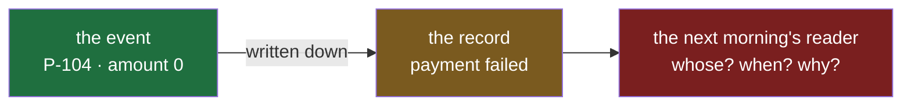
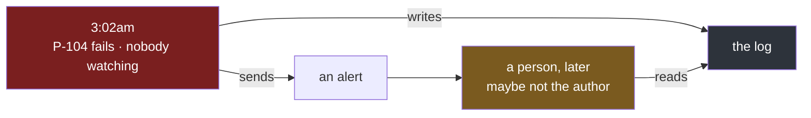
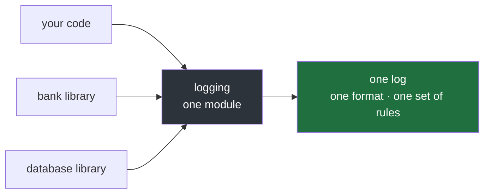

#logging #python #events #print

**A program that fails at 3am leaves exactly one witness: whatever it wrote down at the time.** Everything about finding that failure later depends on what those lines carry.

# What A Log Is

## Things happen, and then they are gone

While a program runs, things happen. A request arrives. A payment goes through. A call to a bank fails. Each of these is an **event**.

An event lasts an instant. Once the program has moved on to the next payment, the last one is gone — there is no screen to scroll back through, no recording to replay. **If it was not written down when it happened, nothing can find it out afterwards.**

So a program keeps a **log**: its written record of its events, made at the moment each one happens. It is the program's diary, written as things occur, read later by someone who was not there.

The example used throughout this note is a small program that handles payments. Each payment has an ID and an amount, and the program sends it on to a bank. A payment with an amount of zero or less cannot be sent, so it fails. The smallest way to keep a record of what happens is `print()` — five payments, one of which fails, each reported as it is handled:

`src/logging_lab/note01/a_what_print_leaves.py`:

```python
1  payments = [("P-101", 500), ("P-102", 1200), ("P-103", 300), ("P-104", 0), ("P-105", 750)]
2
3  for payment_id, amount in payments:
4      if amount <= 0:
5          print("payment failed")
6          continue
7      print("payment ok")
```

```
$ uv run python src/logging_lab/note01/a_what_print_leaves.py
payment ok
payment ok
payment ok
payment failed
payment ok
```

Five events, each written at the moment it happened — so this is a record. Now read it the way it will actually be read: the next morning, because a customer has complained that their payment failed.

| What you need to know | What the record says |
|---|---|
| **Whose** payment failed | nothing — `P-104` is in the program, not in the line |
| **When** it failed | nothing — no line carries a time |
| **Why** it failed | nothing — `failed` with no reason |
| **How serious** it is | nothing — the failure looks exactly like the four lines around it |

**Every answer is missing, and every one was known to the program at the moment it wrote the line.** The payment ID, the amount, the reason — all of it was in a variable one line above the `print()`. The record kept none of it.



> [!important] A record is only as useful as what it kept
> The program knew everything at the moment of the event and wrote down almost nothing. Nothing written later can recover it — the variables are gone the instant the loop moves on.

## A log line carries what made this one different

One entry in the log is a **log line**. A useful one holds two things: **what happened**, and **the details that make this occurrence different from every other one** — which payment, what amount, why it failed. The program has those details in variables at the moment it writes the line; the line just has to keep them.

`src/logging_lab/note01/b_details_in_the_line.py`:

```python
1  payments = [("P-101", 500), ("P-102", 1200), ("P-103", 300), ("P-104", 0), ("P-105", 750)]
2
3  for payment_id, amount in payments:
4      if amount <= 0:
5          print(f"payment {payment_id} failed: amount must be positive, got {amount}")
6          continue
7      print(f"payment {payment_id} ok: amount {amount}")
```

```
$ uv run python src/logging_lab/note01/b_details_in_the_line.py
payment P-101 ok: amount 500
payment P-102 ok: amount 1200
payment P-103 ok: amount 300
payment P-104 failed: amount must be positive, got 0
payment P-105 ok: amount 750
```

| What you need to know | Before | Now |
|---|---|---|
| **Whose** payment failed | missing | `P-104` |
| **Why** it failed | missing | the amount was `0` |
| **When** it failed | missing | **still missing** |
| **How serious** it is | missing | **still missing** — the failure has the same shape as every `ok` line |

**Half the questions are answered by putting the details in the line.** The other half cannot be fixed that way: no variable in the loop holds the time, and nothing in the line marks the failure as more important than the successes around it. Those two have to come from somewhere other than the event's own details.

## `print()` is for now, a log is for later

`print()` and a log both write lines of text, so the difference is not in the text. It is in **who reads it, and when**.

| | `print()` | a log |
|---|---|---|
| Who reads it | the person running the program | someone investigating, often not the author |
| When | right now, as the lines appear | hours or days later |
| How it is read | top to bottom, as it scrolls past | searched, for one line among thousands |
| What the reader already knows | everything — they are watching it happen | nothing — they were not there |

That last row is why the two missing answers matter so differently. The person watching knows **when** a line happened, because it is happening now. They know **how serious** it is, because they can see the situation unfold with a handful of lines on screen. **The person reading the next day has none of that context**, so every line has to carry its own time and its own seriousness, because nothing else will supply them.

> [!important] Write every line for a reader who was not there
> A line that makes sense only to someone watching it appear is a `print()`. A log line has to make sense to a stranger, later, with nothing else to go on.

## Nobody is watching when it happens

The payment program above runs once, while somebody watches it. A real payment system does not. It runs as a **service**: a program that stays running on a **server** — a computer that is kept switched on so that other people's programs can send it work — waiting for payments to arrive. Nobody starts it and then watches its screen. It starts once and runs day and night, often as several copies at the same time, so that no single copy has to handle every payment.

So picture the payment service at 3:02am, when payment `P-104` fails. **Nobody is looking at the screen.** Services are usually set up to send an **alert** when something goes wrong — an automatic message to a person's phone or team chat. Whoever receives it arrives after the event, so they are not watching it happen; they are reading what was written while it happened. That reader may not be the person who wrote the code at all: a colleague, someone on call that week, or someone who joined after the author left.



> [!important] The log is the only witness
> In a service there is no person watching the screen. Every line it writes is read later, by someone who was not there and may never have seen the code — so every line is written for a stranger.

## A search can only filter on what was written

A service does not keep its lines on its own screen. They are collected into a **log store**: one central place where every line from every copy of the service is kept and can be searched.

The person who got the alert opens the log store. The night's work wrote **50,000 lines**. Nobody reads 50,000 lines — they **filter**, to get from all of them down to the one that matters. And every filter needs something in the line to work on.

With every line shaped like `payment P-104 failed: amount must be positive, got 0`:

| Filter they want | Possible? | Why |
|---|---|---|
| this payment | only as a text search for `P-104` | it works only because the ID happens to be typed into the sentence |
| between 3:00 and 3:10am | **no** | no line carries a time |
| only the failures | **no** | nothing marks a line as serious — `failed` is just a word in a sentence |
| which part of the code wrote it | **no** | no line says where it came from |

**A search cannot invent information a line does not carry.** Time, seriousness and origin have to be in every single line, written the same way every time, or no tool can filter on them. That is a lot to remember to type into every `print()` — and Python has a tool built for exactly that.

## One module, used by everyone

Typing the time, the seriousness and the origin into every `print()` by hand is tedious, easy to forget, and done slightly differently by every person who does it. So Python ships a standard module for the job, `logging`. You write the event, and the module can add the rest to every line, the same way every time — though not until it is told to. Used untouched, it adds none of it, as note 2 shows; note 3 shows how to switch it on.

What makes it matter is that **every library uses it too.** A library is code someone else wrote that your program uses — the code that talks to the bank over the internet, the code that talks to the database. When a library has something to report, it reports through the same `logging` module as your own code.

Picture the opposite: your code uses `logging`, the bank library invents its own way of writing lines, and the database library invents a third.

| What the next day's reader tries | With three home-made formats |
|---|---|
| one filter for 3:00–3:10am | impossible — three ways of writing a time, or none |
| read what happened just before the failure, across all three | the lines cannot be put in order |
| show only the serious lines | only your own lines obey; the other two ignore the rule |



> [!important] One module means one place to decide
> Because every part of the program reports through `logging`, a single setting decides what every line looks like and which lines are kept — yours and every library's. The last note of this folder is exactly that setting.

---

> **Recall:** What is an event? · What is a log, and why must it be written at the moment of the event? · What does a useful log line hold? · Who reads `print()`, and who reads a log? · Why is every line in a service written for a stranger? · What is a log store, and why can a search only filter on what lines carry? · What goes wrong if every library writes lines its own way?
