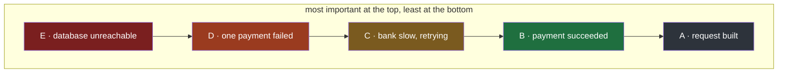
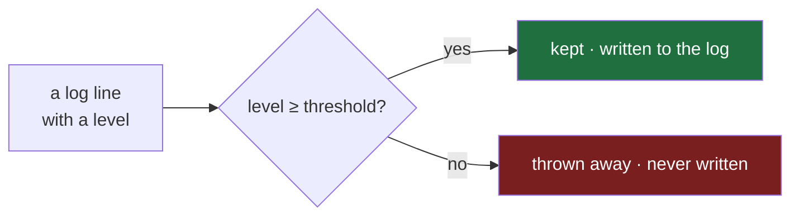
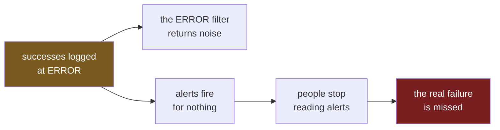

#logging #python #levels #severity

**Note 1 ended with three things every log line still lacked: when it happened, how serious it was, and where in the code it came from.** This note answers the second: how serious.

# How Important

## Not every event matters the same

Here are five lines the payment service from note 1 might write in a single night:

```
A.  built the request for the bank: payment P-101, amount 500
B.  payment P-101 succeeded
C.  the bank answered slowly, trying payment P-102 again
D.  payment P-104 failed: amount must be positive, got 0
E.  cannot reach the database at all, no payment can be processed
```

All five are events, and all five could be written to the log. They do not matter equally, and ranking them from most to least important makes the difference concrete:

| Rank | Line | Why it ranks there | Who wants to see it |
|---|---|---|---|
| 1 | **E** database unreachable | without it every payment fails, not just one | someone, right now, even at 3am |
| 2 | **D** P-104 failed | one payment failed, one customer is affected | the team, soon |
| 3 | **C** bank slow, retrying | nothing broke yet — a yellow light that may turn red or may not | the team, eventually, if it keeps happening |
| 4 | **B** P-101 succeeded | the system doing its job — a green light | anyone checking that things work |
| 5 | **A** request built | detail with no judgement in it — a road with no traffic lights at all | a developer chasing a bug |

So besides its details — and besides the time and origin note 1 showed are still missing — every log line needs one more piece of information: **how important it is**. That importance is called the line's **level**, also called its **severity**.



> [!important] Importance is decided when the line is written
> The person writing the log call knows whether this event is a disaster, a failure, a warning or routine. The next day's reader does not — so the level has to travel inside the line, decided at the moment of writing.

## Five names for five levels

Python gives those ranks fixed names, and the ranking above lines up with them one to one:

| Line | Level | What the level means |
|---|---|---|
| **E** database unreachable | **CRITICAL** | the program itself may not be able to keep running |
| **D** P-104 failed | **ERROR** | something it was supposed to do has failed |
| **C** bank slow, retrying | **WARNING** | something unexpected happened, but it is still working |
| **B** P-101 succeeded | **INFO** | confirmation that things are working as expected |
| **A** request built | **DEBUG** | detail that is only useful when diagnosing a problem |

Lines are written through an object called a **logger**, which a program gets with `logger = logging.getLogger(__name__)`. What a logger is, and what `__name__` means, is note 3's subject; here it is simply the thing a program logs through. Writing a line at a level means calling the logger's method of the same name: `logger.debug(...)`, `logger.info(...)`, `logger.warning(...)`, `logger.error(...)`, `logger.critical(...)`.

Three more lines, placed with those definitions:

| Line | Level | Why |
|---|---|---|
| `service started, waiting for payments` | **INFO** | normal operation, worth a record |
| `disk is 92% full` | **WARNING** | nothing has failed yet, but it will if this continues |
| `bank refused payment P-110 three times, giving up` | **ERROR** | the payment could not be made |

The method is `warning`, spelled out. `logger.warn(...)` still exists in Python 3.13, but only as an old spelling kept for compatibility:

```
$ uv run python -c "import logging; logging.getLogger('demo').warn('disk is 92% full')"
<string>:1: DeprecationWarning: The 'warn' method is deprecated, use 'warning' instead
disk is 92% full
```

Deprecated means it is scheduled to go away; code written today uses `warning`.

## Each level is a number

Behind each name, Python stores the level as a number. `logging.getLevelNamesMapping()` returns that table — each name with the number it stands for:

`src/logging_lab/note02/a_levels_are_numbers.py`:

```python
1  import logging
2
3  for name in ["DEBUG", "INFO", "WARNING", "ERROR", "CRITICAL"]:
4      print(f"{name:8} = {logging.getLevelNamesMapping()[name]}")
```

```
$ uv run python src/logging_lab/note02/a_levels_are_numbers.py
DEBUG    = 10
INFO     = 20
WARNING  = 30
ERROR    = 40
CRITICAL = 50
```

The more important the level, the bigger the number — the same order as the ranking of lines A to E, with A at 10 and E at 50.

The reason for numbers is that **numbers have an order, and names do not.** Asking for everything at least as important as a warning becomes one comparison, `level >= 30`, and ERROR at 40 and CRITICAL at 50 are included automatically. With names alone, some list would have to spell out that ERROR and CRITICAL count as at least WARNING, and every piece of code that filters would need its own copy of that list.

| Question | With numbers | With names only |
|---|---|---|
| is this line at least a warning? | `level >= 30` | look it up in a hand-written list of names |
| which of two lines is more important? | the bigger number | look both up and compare their positions |

## A threshold decides what is kept

The minimum level a line must have to be written is the **threshold**. A line at or above the threshold is **kept**. A line below it is **thrown away** — never written anywhere, so no one can ever read it.

The same five lines, under three different thresholds:

| Line | Level | Threshold INFO (20) | Threshold WARNING (30) | Threshold ERROR (40) |
|---|---|---|---|---|
| **A** request built | DEBUG 10 | thrown away | thrown away | thrown away |
| **B** P-101 succeeded | INFO 20 | kept | thrown away | thrown away |
| **C** bank slow, retrying | WARNING 30 | kept | kept | **thrown away** |
| **D** P-104 failed | ERROR 40 | kept | kept | kept |
| **E** database unreachable | CRITICAL 50 | kept | kept | kept |

The last column is the one to look at. With the threshold at ERROR, line C is never written — and C is the yellow light. If the bank later goes down completely, the log shows the failure with no trace of the slow answers that came before it, which were the earliest sign that something was going wrong.



> [!important] A thrown-away line is gone for good
> The threshold is applied when the line is written, not when it is read. Raising it does not hide lines that could be fetched later — it means they never existed.

## When nothing is configured, the threshold is WARNING

A program that never sets a threshold still has one. Two log calls through a logger, with nothing configured:

`src/logging_lab/note02/b_nothing_configured.py`:

```python
1  import logging
2
3  logger = logging.getLogger(__name__)
4  logger.info("payment started")
5  logger.error("payment failed")
```

```
$ uv run python src/logging_lab/note02/b_nothing_configured.py
payment failed
```

The INFO line was thrown away and the ERROR line was kept, so the threshold sits somewhere above INFO (20) and at or below ERROR (40). **That output alone cannot say whether it is WARNING or ERROR** — both would produce it. Telling them apart takes one more line, at WARNING:

`src/logging_lab/note02/c_which_threshold.py`:

```python
1  import logging
2
3  logger = logging.getLogger(__name__)
4  logger.info("payment started")
5  logger.warning("bank answered slowly, retrying")
6  logger.error("payment failed")
7  print("threshold when nothing is configured:", logging.getLevelName(logging.getLogger().level))
```

```
$ uv run python src/logging_lab/note02/c_which_threshold.py
bank answered slowly, retrying
payment failed
threshold when nothing is configured: WARNING
```

The WARNING line is kept, so the threshold cannot be ERROR — and the last line confirms it directly. `logging.getLogger()`, with nothing in the brackets, fetches the logger whose threshold applies when nothing else is configured — where it sits is note 4's subject: **when nothing is configured, Python's threshold is WARNING.** That is why a fresh program's `logger.info(...)` calls print nothing at all, which surprises almost everyone the first time.

| Level of the call | Number | Against the default WARNING (30) |
|---|---|---|
| `info` | 20 | thrown away |
| `warning` | 30 | kept |
| `error` | 40 | kept |

## The level decided, but was not written down

Look again at the two lines that survived:

```
bank answered slowly, retrying
payment failed
```

Note 1 listed what the next day's reader needs every line to carry so they can filter on it: when it happened, how serious it was, and where in the code it came from. Against that list, these lines carry nothing but their message:

| Needed in every line | In these lines? |
|---|---|
| when it happened | **no** |
| how serious it was | **no** |
| where in the code it came from | **no** |

The strange part is the middle row. **The logging module knew the level of each line** — it used that level a moment earlier to decide which lines to keep and which to throw away. It simply did not write it into the line. The time and the origin were known as well, and left out too.

So at this point `logging` is no better than `print()` from note 1 — the same bare sentences — except that it silently drops some of them. Nothing has told the module what a line should look like yet; that is note 3.

> [!important] Using the level and writing the level are two separate things
> The threshold uses a line's level to decide whether the line exists at all. Whether the level also appears inside the line is a separate decision, about the line's shape — and with nothing configured, the answer is no.

## One setting moves the line, no log call changes

The threshold is a single setting, and every log call in the program obeys it. That is what makes it useful.

Setting the threshold is one line at the start of a program — `logging.basicConfig(level=logging.INFO)` — which note 3 introduces properly. Instead of the default WARNING, the payment service in normal operation sets it to **INFO**: it writes successes, warnings and failures, and skips the DEBUG detail — which would otherwise be thousands of lines like A every hour. Then one night payments start failing for a reason nobody understands, and exactly those DEBUG lines are what is needed.

The `logger.debug(...)` calls are already in the code; they have been there all along, being thrown away. So the fix is to **lower the threshold to DEBUG** — and nothing else. **Not one log call changes.** The calls describe what could be said; the threshold decides how much of it is said right now.

The catch is the one from the threshold section. Lowering the threshold affects only the lines written **from that moment on**. The DEBUG lines from the failures that already happened were thrown away when they happened, so the problem has to occur again while the threshold is low before those details exist.

| | Threshold at INFO | Threshold lowered to DEBUG |
|---|---|---|
| log calls in the code | unchanged | unchanged |
| DEBUG lines from earlier failures | thrown away | still gone — they were never written |
| DEBUG lines from the next failure | thrown away | written |

> [!important] Write the detail now, decide later whether to keep it
> Because the threshold can be lowered without touching the code, `logger.debug(...)` calls cost nothing to leave in place. They are the detail you will want on the night something breaks — as long as the threshold is lowered before it breaks again.

## Choosing a level is choosing who must look

Every log call written from here on picks a level, and the clearest way to pick is to ask **who needs to see this line, and how urgently**:

| Level | Who needs it, and when |
|---|---|
| **CRITICAL** | someone must act now, even at 3am — the program cannot keep working |
| **ERROR** | something failed, and the team needs to look soon |
| **WARNING** | nothing has failed yet, but it will if this keeps happening |
| **INFO** | a normal thing happened, worth a record |
| **DEBUG** | detail only a developer chasing a bug wants |

A worked example of getting it wrong: `logger.error("payment P-120 succeeded on the second attempt")`.

Two events are hiding in that one line. The first attempt failed, and the second succeeded. Written properly, they are two calls at two levels:

```python
1  logger.warning("bank refused payment P-120, trying again")
2  logger.info("payment P-120 succeeded on the second attempt")
```

Squeezed into one line at ERROR, the retry disappears and a success is reported as a failure. If a whole team logs this way, ERROR stops meaning that something failed:

- The next day's reader filters for ERROR to find failures, and gets successes mixed in — the filter no longer finds anything.
- Services are usually set up to send an alert when ERROR lines appear, so someone is woken at 3am for payments that worked.
- After enough false alarms, people learn to ignore ERROR alerts — and the night a real failure happens, it is ignored with the rest.



> [!important] A level is a promise to the reader
> ERROR promises that something failed; CRITICAL promises that someone must act now. A level used for anything else breaks that promise — not just for that line, but for every line that uses the level honestly.

---

> **Recall:** Why does every line need a level? · Name the five levels in order, with what each means. · Why are levels numbers? · What is a threshold, and what happens to a line below it? · Why does lowering the threshold not recover earlier detail? · What is the threshold when nothing is configured, and how can an experiment prove it? · Why do the surviving lines still lack their level? · What goes wrong when a team logs successes at ERROR?
