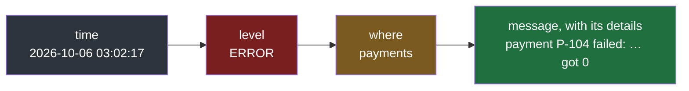
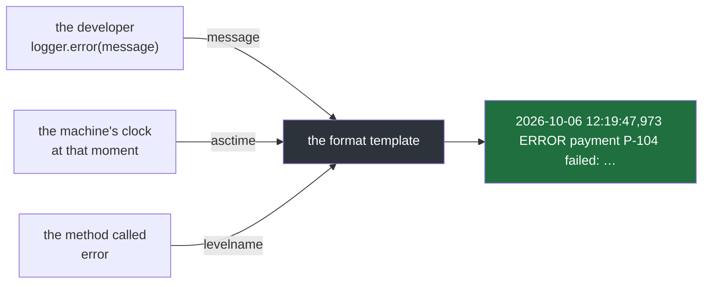
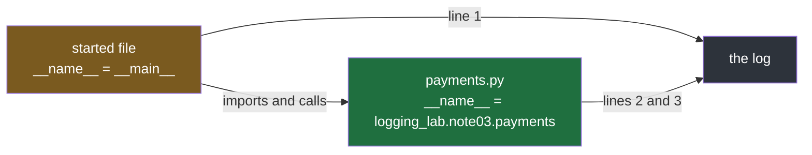
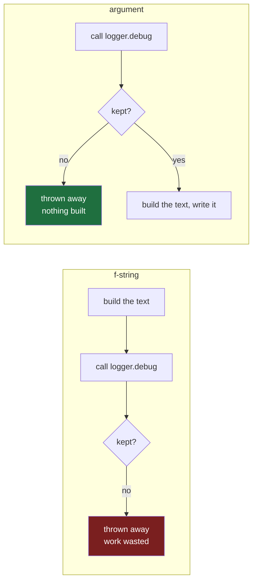
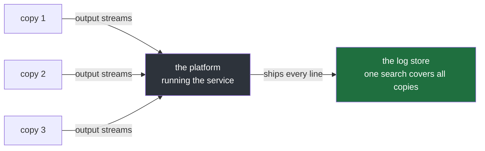
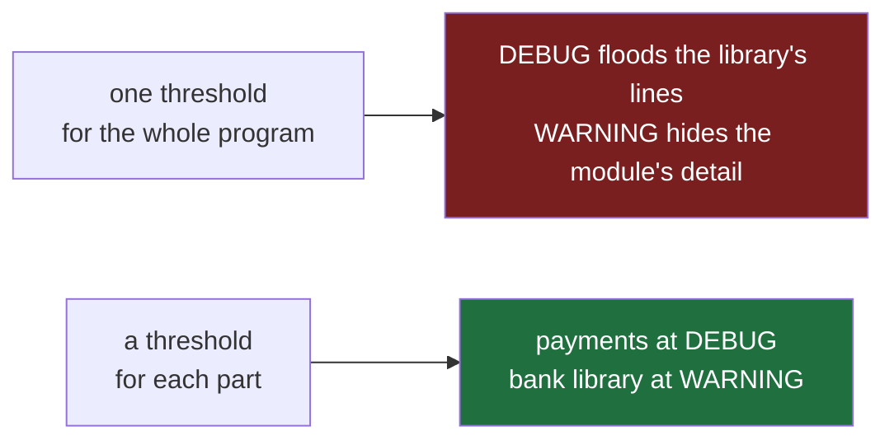

#logging #python #format #basicconfig

**Note 2 gave every log line a level, and showed the line still does not display it — nor its time, nor where it came from.** This note puts all three into the line.

# What A Line Says

## A line needs more than its message

Line D from note 2, the way Python writes it with nothing configured:

```
payment P-104 failed: amount must be positive, got 0
```

Designing it from the next day's reader's side — someone filtering 50,000 lines, as in note 1 — gives a first version:

```
2026-10-06 03:02 ERROR payment P-104 failed: amount must be positive
```

**The order is right.** The time comes first, because time is what lines are sorted and narrowed by. The level comes next, so the serious lines stand out and can be filtered on. Then the message. Three things still need adjusting:

| Gap                                         | Why it matters                                                                                                                | Fix                                                                                 |
| ------------------------------------------- | ----------------------------------------------------------------------------------------------------------------------------- | ----------------------------------------------------------------------------------- |
| the detail `got 0` was dropped              | it is the reason the payment failed — the detail note 1 showed a log line must carry                                          | keep every detail of the message; new fields go in front of it, never instead of it |
| `03:02` has no seconds and no time zone     | a busy service writes hundreds of lines in one minute, and the server's clock may be in a different time zone from the reader | write seconds at least, and make the time zone known                                |
| nothing says where in the code it came from | note 1's reader wanted to narrow down by which part of the program wrote a line                                               | add the name of the part of the program that wrote it                               |

Which gives the shape to aim for:

```
2026-10-06 03:02:17 ERROR payments  payment P-104 failed: amount must be positive, got 0
```



> [!important] New fields are added in front of the message, never instead of it
> The time, level and origin are what the reader filters on; the message and its details are what the reader needs once the filter has found the line. A line needs both.

## One call sets the threshold and the shape

Python has one function that sets up both: `logging.basicConfig(...)`. It is called **once, at the start of the program**, and every log call after it follows what it set.

`src/logging_lab/note03/a_basic_config.py`:

```python
1  import logging
2
3  logging.basicConfig(level=logging.INFO, format="%(asctime)s %(levelname)s %(message)s")
4
5  logger = logging.getLogger(__name__)
6  logger.debug("built the request for the bank: payment P-101, amount 500")
7  logger.info("payment P-101 succeeded")
8  logger.error("payment P-104 failed: amount must be positive, got 0")
```

```
$ uv run python src/logging_lab/note03/a_basic_config.py

2026-10-06 12:19:47,973 INFO payment P-101 succeeded
2026-10-06 12:19:47,973 ERROR payment P-104 failed: amount must be positive, got 0
```

The one call changed two separate things:

| Part of the call | What it decides | Effect here |
|---|---|---|
| `level=logging.INFO` | the threshold — **which lines appear** | INFO and above are kept; the DEBUG line (10) is below INFO (20), so it is thrown away |
| `format="..."` | the shape — **what each line looks like** | every kept line now starts with its time, down to the millisecond (`,973`), then its level |

Set against note 2's run with nothing configured, the difference is the whole point:

| | Nothing configured | With `basicConfig` |
|---|---|---|
| threshold | WARNING, the default | INFO, chosen |
| the INFO line | thrown away | kept |
| what a kept line shows | its message only | time, level, message |

> [!important] Called once, at the start
> `basicConfig` sets things up for the whole program, so it belongs at the very beginning, before anything logs. A log call made earlier than that runs with the defaults from note 2.

## The format is a template

The format string from the previous section is a **template**:

```
"%(asctime)s %(levelname)s %(message)s"
```

Each `%( … )s` is a **placeholder** — a named slot. For every line, the logging module fills each slot with a value and writes the result. The spaces between the slots are plain text and are copied as they are.

| Placeholder | Filled with | Where the value comes from |
|---|---|---|
| `%(asctime)s` | the date and time the line was written | the logging module reads the machine's clock |
| `%(levelname)s` | the line's level, such as `INFO` or `ERROR` | the method that was called: `info`, `error`, … |
| `%(message)s` | the text passed to the log call | the developer |

These are three of many placeholders the module knows; one more, `%(name)s`, gets its own section below.

A log call such as `logger.error(...)` runs at the moment the program reaches that line of code — which is the moment the event happens. So the clock the module reads is the time of the event itself. It reads the machine's local clock, though, and `%(asctime)s` does not write which time zone that is — the gap from the first section is still open here. Note 5 closes it: structured lines record the time in UTC, marked as UTC.

That closes note 1's first gap. There, the time was missing because someone would have had to remember to type it into every `print()`. Here **nobody types it**: the developer writes only the message, and the module adds the time to every line, the same way every time.



> [!important] The developer writes the message; the module writes everything else
> Only the message depends on remembering. Time and level are filled in automatically, so they are present in every line whether or not anyone thought about them.

## Every line can say which file wrote it

The third missing piece is **where in the code** a line came from. A Python program is split into **modules**: each `.py` file is one module. Two of them here — one that does the paying, and one that is run and calls it.

`src/logging_lab/note03/payments.py`:

```python
 1  import logging
 2
 3  logger = logging.getLogger(__name__)
 4
 5
 6  def pay(payment_id: str, amount: int) -> None:
 7      if amount <= 0:
 8          logger.error(f"payment {payment_id} failed: amount must be positive, got {amount}")
 9          return
10      logger.info(f"payment {payment_id} succeeded")
```

`src/logging_lab/note03/b_where_it_came_from.py`:

```python
 1  import logging
 2
 3  from logging_lab.note03 import payments
 4
 5  logging.basicConfig(level=logging.INFO, format="%(asctime)s %(levelname)s %(name)s %(message)s")
 6
 7  logger = logging.getLogger(__name__)
 8  logger.info("nightly run started")
 9  payments.pay("P-101", 500)
10  payments.pay("P-104", 0)
```

```
$ uv run python src/logging_lab/note03/b_where_it_came_from.py
2026-10-06 12:25:16,876 INFO __main__ nightly run started
2026-10-06 12:25:16,876 INFO logging_lab.note03.payments payment P-101 succeeded
2026-10-06 12:25:16,876 ERROR logging_lab.note03.payments payment P-104 failed: amount must be positive, got 0
```

What happens when the second file is run:

1. `from logging_lab.note03 import payments` loads `payments.py`, which creates its own logger, named after itself.
2. `basicConfig(...)` sets the threshold to INFO and a format with one new placeholder, `%(name)s`.
3. The file that was run creates its own logger and writes `nightly run started` — line 1.
4. `payments.pay("P-101", 500)` runs `pay`; the amount is fine, so the payments logger writes `succeeded` — line 2.
5. `payments.pay("P-104", 0)` runs `pay`; the amount is 0, so the payments logger writes `failed` — line 3.

Three pieces make the origin appear:

| Piece | What it is |
|---|---|
| `__name__` | a variable Python fills in automatically in every module with that module's name — the folders and the file joined by dots, here `logging_lab.note03.payments` |
| `logging.getLogger(__name__)` | gives the module its own **logger**, named after the module |
| `%(name)s` | writes the name of the logger that wrote the line |

The target line in the first section showed the origin as just `payments`; the real value is the module's full dotted name, `logging_lab.note03.payments`, which is longer but unambiguous. And the first line says `__main__` rather than the file's real name.

> [!info] The file a program is started with is always named `__main__`
> `__main__` means the main program, whatever the file is actually called. Every module it imports gets its real dotted name instead. In a service, the started file is only the entry point, and almost every line comes from an imported module — so almost every line carries a real module name.



> [!important] Name the logger after the module, every time
> `logging.getLogger(__name__)` costs one line per file and makes every line say which file wrote it — the third thing note 1's reader needed to filter on.

## Details go in as arguments, not pre-built text

`payments.py` builds its messages with **f-strings**, such as `f"payment {payment_id} failed: …"`. There is a second way to pass the same details:

```python
1  logger.debug(f"sending {request}")   
 # f-string: the text is built first, then handed over
 
2  logger.debug("sending %s", request)   
# argument: a template and the value, handed over separately
```

In the second form `%s` is a slot, and `request` travels separately. The logging module fills the slot itself — and only if it decides to keep the line.

This `%s` is a different slot from the `%(asctime)s` kind in the format. **A slot in the message is filled from the arguments passed to the log call; a placeholder in the format is filled by the module** — time, level, name. The message is built first, from its arguments, and then dropped into the format's `%(message)s`.

The difference is visible with an object that announces when its text is being built. `__str__` is the method Python calls when it needs an object as text; this one also prints a note, to show when it runs. Both calls are at DEBUG, and the threshold is INFO, so both lines are thrown away:

`src/logging_lab/note03/c_built_even_when_thrown_away.py`:

```python
 1  import logging
 2
 3  logging.basicConfig(level=logging.INFO, format="%(levelname)s %(message)s")
 4  logger = logging.getLogger(__name__)
 5
 6
 7  class BankRequest:
 8      def __str__(self) -> str:
 9          print("  (building the text of the bank request)")
10          return "BankRequest(payment=P-101, amount=500)"
11
12
13  request = BankRequest()
14
15  print("f-string:")
16  logger.debug(f"sending {request}")
17
18  print("argument:")
19  logger.debug("sending %s", request)
```

```
$ uv run python src/logging_lab/note03/c_built_even_when_thrown_away.py

f-string:
  (building the text of the bank request)
argument:
```

**Neither line was written, but only one of them did the work.** The difference is when the threshold is checked:

| | f-string | argument |
|---|---|---|
| what is handed to `logger.debug` | finished text | a template and the unbuilt value |
| when the text is built | before the call, always | inside the call, only if the line is kept |
| threshold checked | after the work is already done | before any work is done |
| a thrown-away line costs | the full cost of building its text | almost nothing |



One wasted string is nothing. A busy service makes thousands of DEBUG calls a second, and with f-strings every one of them builds its text only to throw it away — work that slows every request down for lines nobody will read.

`payments.py`, shown earlier, was written with f-strings, so its two calls are the slow kind. Rewritten with arguments, they are:

```python
1  logger.error("payment %s failed: amount must be positive, got %s", payment_id, amount)
2  logger.info("payment %s succeeded", payment_id)
```

Every example after this section passes its details as arguments.

> [!important] Pass details as arguments
> Write `logger.info("payment %s failed", payment_id)`, not `logger.info(f"payment {payment_id} failed")`. The output is identical when the line is kept, and nothing is built when it is not.

## When something crashes, keep the traceback

When an operation fails badly in Python, it **raises an exception**: an error that stops what the code was doing. A `try:` … `except ConnectionError:` block **catches** it, so the program can deal with it — log it, for instance — and carry on.

Two catches, identical except for the log call:

`src/logging_lab/note03/d_when_it_crashes.py`:

```python
 1  import logging
 2
 3  logging.basicConfig(
 4      level=logging.INFO,
 5      format="%(asctime)s %(levelname)s %(name)s %(message)s",
 6  )
 7  logger = logging.getLogger(__name__)
 8
 9
10  def send_to_bank(payment_id: str) -> None:
11      raise ConnectionError("bank closed the connection")
12
13
14  try:
15      send_to_bank("P-107")
16  except ConnectionError:
17      logger.error("payment %s could not be sent", "P-107")
18
19  try:
20      send_to_bank("P-108")
21  except ConnectionError:
22      logger.exception("payment %s could not be sent", "P-108")
```

```
$ uv run python src/logging_lab/note03/d_when_it_crashes.py
2026-10-06 12:48:45,204 ERROR __main__ payment P-107 could not be sent
2026-10-06 12:48:45,204 ERROR __main__ payment P-108 could not be sent
Traceback (most recent call last):
  File "~/Desktop/projects/logging-lab/src/logging_lab/note03/d_when_it_crashes.py", line 20, in <module>
    send_to_bank("P-108")
    ~~~~~~~~~~~~^^^^^^^^^
  File "~/Desktop/projects/logging-lab/src/logging_lab/note03/d_when_it_crashes.py", line 11, in send_to_bank
    raise ConnectionError("bank closed the connection")
ConnectionError: bank closed the connection
```

> [!info] `exception` is not a sixth level
> There are still exactly five levels, and both lines above say ERROR. `logger.exception(...)` is a shortcut: it writes at ERROR **and** attaches the **traceback** of the exception being handled. It only makes sense inside an `except` block, where there is an exception to attach.

> A **traceback** **is the chain of calls that led to the crash**, read top to bottom: the program called `send_to_bank` at line 20, and inside it, at line 11, the error was raised. The last line names the error and its message.

| | `logger.error(...)` | `logger.exception(...)` |
|---|---|---|
| level written | ERROR | ERROR — the same level |
| traceback attached | no | yes |
| the next day's reader learns | that P-107 failed | that P-108 failed, which error it was, and the exact file and line where it happened |

The `__main__` on both ERROR lines is unchanged — it is still the logger's name, written by `%(name)s`. The file paths and line numbers belong to the traceback, which is added below the line.


> [!important] Inside an `except` block, use `logger.exception`
> The traceback is the difference between knowing that something failed and knowing where to start fixing it — and it is only available at the moment the exception is caught. Once the `except` block ends, it is gone.

## Where the lines go

Every line so far went to the terminal. One more `basicConfig` option, `filename=`, sends them to a file instead. Line 5 deletes any old copy of the file first, so each run starts clean:

`src/logging_lab/note03/e_into_a_file.py`:

```python
 1  import logging
 2  from pathlib import Path
 3
 4  log_file = Path("payments.log")
 5  log_file.unlink(missing_ok=True)
 6
 7  logging.basicConfig(
 8      level=logging.INFO,
 9      format="%(asctime)s %(levelname)s %(name)s %(message)s",
10      filename=log_file,
11  )
12  logger = logging.getLogger(__name__)
13  logger.info("payment %s succeeded", "P-101")
14  logger.error("payment %s failed: amount must be positive, got %s", "P-104", 0)
15
16  print("nothing above this line came from logging")
17  print(f"contents of {log_file}:")
18  print(log_file.read_text(), end="")
```

```
$ uv run python src/logging_lab/note03/e_into_a_file.py
nothing above this line came from logging
contents of payments.log:
2026-10-06 12:39:18,677 INFO __main__ payment P-101 succeeded
2026-10-06 12:39:18,677 ERROR __main__ payment P-104 failed: amount must be positive, got 0
```

Nothing from logging reached the screen; both lines went into `payments.log`. That works for a program on one machine. A service is different — note 1 described it as several copies at once, on servers, with its lines collected into a **log store**. Give each of three copies its own `payments.log` on its own server, and the next day's reader runs into this:

| Problem | Why |
|---|---|
| which file has the line? | the failure is on one of three servers, and nothing says which |
| what happened in order? | three files have to be merged by time before the story can be read |
| the file may be gone | servers are restarted and replaced; many platforms throw away a copy's disk when it restarts, often right after the crash worth investigating |
| the disk fills up | a file that grows all night can fill the disk and take the service down with it |

So a service does not write files. It writes its lines to its **output streams**, and here a detail matters: every program has **two**. **Standard output** is where `print()` writes. **Standard error** is a second stream, meant for messages about the program rather than its results — and it is where `logging` writes by default. In a terminal both appear mixed together, so they look like one. Throwing one of them away shows they are not — `2>` names standard error and `1>` names standard output, and `/dev/null` is a place that discards whatever is sent to it:

`src/logging_lab/note03/f_two_streams.py`:

```python
1  import logging
2
3  logger = logging.getLogger(__name__)
4
5  print("printed: payment P-101 succeeded")
6  logger.warning("logged: bank answered slowly, retrying")
```

```
$ uv run python src/logging_lab/note03/f_two_streams.py
logged: bank answered slowly, retrying
printed: payment P-101 succeeded
$ uv run python src/logging_lab/note03/f_two_streams.py 2>/dev/null
printed: payment P-101 succeeded
$ uv run python src/logging_lab/note03/f_two_streams.py 1>/dev/null
logged: bank answered slowly, retrying
```

Discarding standard error removes the logged line; discarding standard output removes the printed one. The first run shows something stranger: the logged line came out **before** the printed one, although `print()` ran first. The two streams are delivered separately — standard output is held back and sent in batches, standard error goes out at once — so their lines can arrive out of order. Which of the two a service should log to is note 6's question.

On a server there is no terminal; the **platform running the service reads its output streams** and ships every line to the log store, where one search covers every copy.



> [!important] A service writes to its output streams and lets the platform collect them
> That is what `logging` already does when no file is given — it writes to standard error. Writing to files is for a program on one machine; for a service it scatters the record across servers that may not survive the night.

## What one call cannot do

`basicConfig` sets **one** threshold, **one** format and **one** destination, for the whole program. For a small program that is enough. A service soon needs more, and one situation shows where it runs out.

Payments are failing for a reason nobody understands, so DEBUG lines are needed from the program's own `payments` module. But the library that talks to the bank is chatty: at DEBUG it writes thousands of lines a minute about every network exchange. From that library, only WARNING and above are wanted.

| `basicConfig(level=...)` | The `payments` module | The bank library |
|---|---|---|
| `logging.DEBUG` | its DEBUG lines appear — wanted | thousands of DEBUG lines a minute flood the log — not wanted |
| `logging.WARNING` | its DEBUG lines are thrown away — the detail needed is lost | quiet — wanted |

**Neither setting works, because there is only one threshold for everything.** What the situation needs is a separate threshold for each part of the program — DEBUG for one, WARNING for another.



`basicConfig` is the simple front of something made of separate parts underneath — and those parts are what allow a threshold per part of the program, a different format for each destination, and more. They are note 4.

> [!important] `basicConfig` is the shortcut, not the machine
> One call, one threshold, one format, one destination. A real service configures the parts underneath it instead.

---

> **Recall:** Which three things must a line carry besides its message, and in what order? · What does `basicConfig` set, and when is it called? · What is a placeholder, and where do the values for `%(message)s`, `%(asctime)s` and `%(levelname)s` come from? · What does `__name__` hold, and why is the started file `__main__`? · Why pass details as arguments rather than f-strings? · What does `logger.exception` add, and is it a level? · Why does a service write to its output streams rather than a file? · What are standard output and standard error, and which does `logging` use by default? · What can one `basicConfig` call not do?
