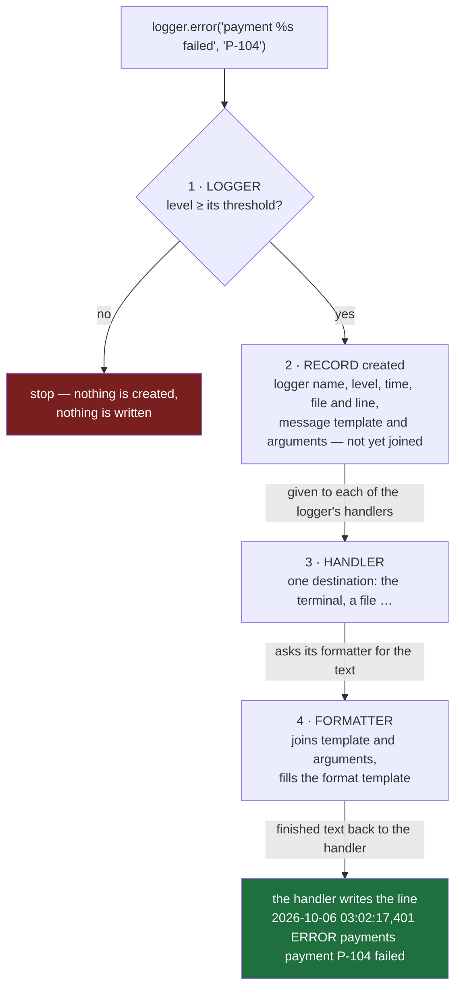
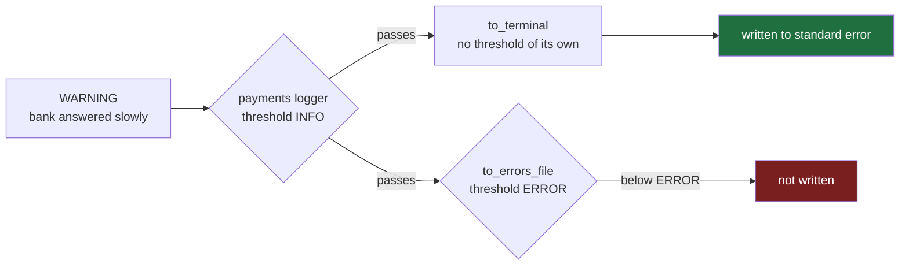
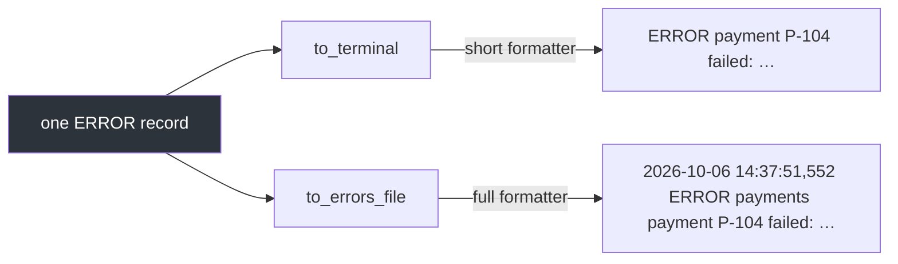
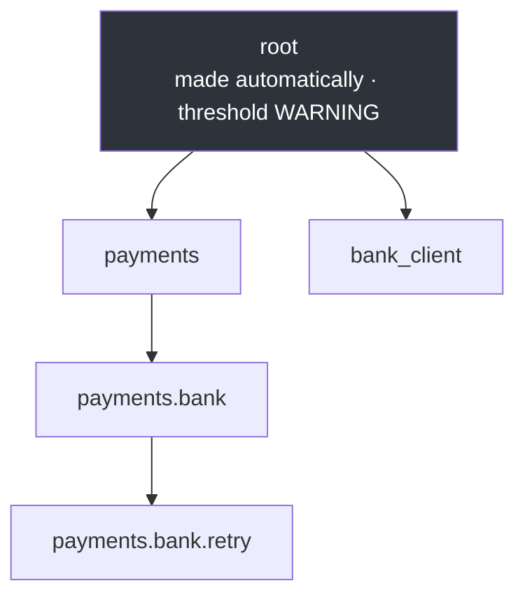
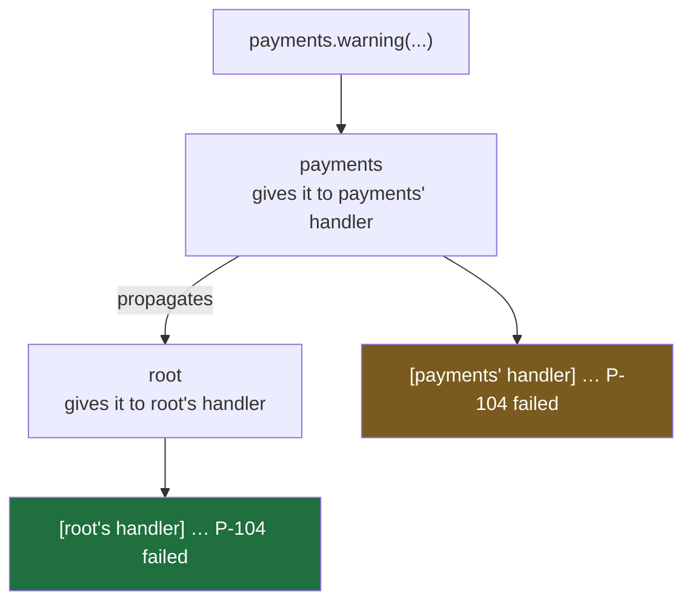
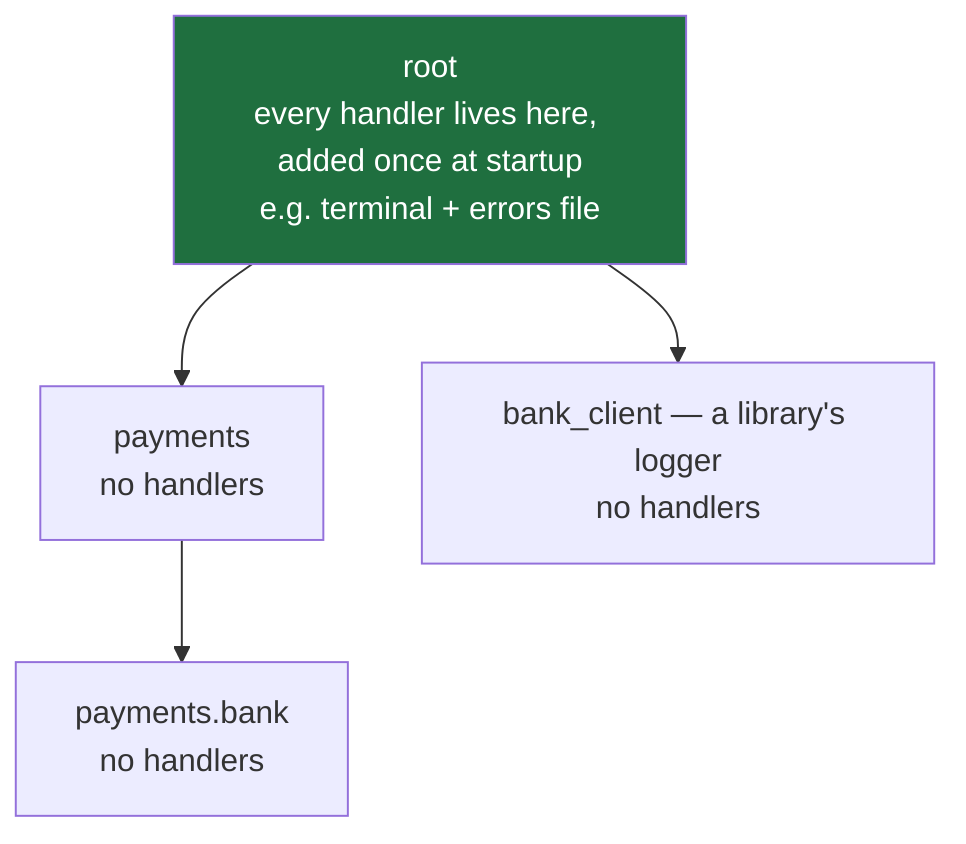

#logging #python #logger #handler #formatter #record

**Note 3 ended where one `basicConfig` call runs out: it cannot give each part of a program its own threshold.** Doing that means looking at the parts `basicConfig` assembles behind the scenes.

# Who Speaks, Where It Goes

## The four parts every log line passes through

A log call such as `logger.error("payment %s failed", "P-104")` passes through four parts, in this order. The order below is taken from Python 3.13's own `logging` source, not from memory, and it matters — getting it wrong makes note 3's f-string argument look false.



| Part | Answers | What it does |
|---|---|---|
| **logger** | who is speaking, and is it worth saying? | checks the line's level against its threshold — the first gate |
| **record** | what happened? | one bundle holding every fact about the event |
| **handler** | where does it go? | sends the record to one destination; a logger can have several handlers |
| **formatter** | what does the line look like? | builds the text — the message from its template and arguments, then the full line from the format template |

What each step is, in Python's source (`logging/__init__.py`, Python 3.13):

| Step | Source |
|---|---|
| the logger checks its threshold first | `Logger.error`: `if self.isEnabledFor(ERROR): self._log(...)` — below the threshold, `_log` never runs |
| only then is the record created | `Logger._log`: `record = self.makeRecord(self.name, level, fn, lno, msg, args, ...)` — `fn` and `lno` are the file and line number of the log call |
| each handler receives it | `Logger.callHandlers`: `hdlr.handle(record)` |
| the handler asks its formatter | `Handler.format`: `fmt = self.formatter` … `return fmt.format(record)` |
| the formatter joins message and arguments | `LogRecord.getMessage`: `msg = msg % self.args`, called from inside `Formatter.format` |

> [!important] The threshold is checked before anything is built
> Nothing is created for a line below the threshold — no record, no text. That is why passing details as arguments, as note 3 recommended, costs almost nothing for a thrown-away line: the template and its arguments are joined only in the last step, by the formatter, and only for lines that got that far.

## `basicConfig` builds all four in one call

Note 3's call, `logging.basicConfig(level=..., format=..., filename=...)`, maps onto those parts one setting at a time:

| Setting | Part | What `basicConfig` does with it |
|---|---|---|
| `level=` | **logger** | sets that logger's threshold |
| no setting | **record** | nothing — records are created per log call, by the logger |
| `filename=` | **handler** | builds a handler that writes to that file — or, with no filename, one that writes to an output stream |
| `format=` | **formatter** | builds a formatter from the template and attaches it to the handler |

The source of `basicConfig` shows exactly that, in these lines:

```python
1  h = FileHandler(filename, mode, ...)
2  h = StreamHandler(stream)
3  fmt = Formatter(fs, dfs, style)
4  h.setFormatter(fmt)
5  root.addHandler(h)
6  root.setLevel(level)
```

Line 1 is used when a filename is given and line 2 when it is not; either way the result is a handler. Line 3 builds the formatter from the template, line 4 attaches it to the handler, line 5 attaches the handler to a logger, and line 6 sets that logger's threshold. `root` **is one particular logger** — the one at the top of every program's loggers; a later section covers it.

> [!important] `basicConfig` is four parts assembled for you
> One handler, one formatter, attached to one logger with one threshold. Everything the rest of this note does is assembling those parts by hand — which is what makes a threshold per part of the program possible.

## Each logger has its own threshold

Every logger is its own first gate, with its own threshold, set with `.setLevel(...)`. That is exactly what note 3's problem needed: DEBUG from the program's own payments code, and only WARNING and above from the chatty bank library. Here `bank_client` stands in for that library — a library gets its logger the same way, with `getLogger(__name__)` inside its own files.

`src/logging_lab/note04/a_threshold_per_logger.py`:

```python
 1  import logging
 2
 3  logging.basicConfig(level=logging.WARNING, format="%(levelname)s %(name)s %(message)s")
 4
 5  payments = logging.getLogger("payments")
 6  bank_client = logging.getLogger("bank_client")
 7
 8  payments.setLevel(logging.DEBUG)
 9  bank_client.setLevel(logging.WARNING)
10
11  payments.debug("Request for the bank: payment %s, amount %s", "P-101", 500)
12  bank_client.debug("opened a connection to the bank, sent 412 bytes")
13  bank_client.warning("bank answered slowly, retrying payment %s", "P-102")
14  payments.error("payment %s failed: amount must be positive, got %s", "P-104", 0)
```

```
$ uv run python src/logging_lab/note04/a_threshold_per_logger.py

DEBUG payments Request for the bank: payment P-101, amount 500

WARNING bank_client bank answered slowly, retrying payment P-102

ERROR payments payment P-104 failed: amount must be positive, got 0
```

| Line | Logger | Its threshold | Result |
|---|---|---|---|
| 11 · DEBUG | `payments` | DEBUG (line 8) | **kept** — the detail wanted from our own code |
| 12 · DEBUG | `bank_client` | WARNING (line 9) | thrown away — the library's noise stays out |
| 13 · WARNING | `bank_client` | WARNING | kept |
| 14 · ERROR | `payments` | DEBUG | kept |

**Two thresholds, one per logger — note 3's impossible case.**

Delete line 8 and run it again, and the `payments` DEBUG line disappears while the other two remain. The reason is visible by asking the logger directly:

```
payments own threshold:       NOTSET
payments threshold in effect: WARNING
```

Without line 8, `payments` has no threshold of its own — `NOTSET` — so it **borrows the threshold of the logger above it**: `root`, which `basicConfig` set to WARNING on line 3. Everything logged through `payments`, from every file that uses it, then loses everything below WARNING. Which logger is above which is a later section of this note.

> [!info] A logger with no threshold of its own borrows one
> `NOTSET` means no threshold has been set on this logger. It then uses the threshold of the nearest logger above it that has one — here `root`.

One thing in that run should look odd: `basicConfig` attached its handler to `root`, not to `payments` or `bank_client`, yet their lines were written. How a line travels from its own logger to a handler attached elsewhere is also a later section.

## A handler is where a line goes

So far `basicConfig` built the handler. Built by hand, a logger can have **several**, each a separate destination. Here every line goes to the terminal, and only errors also go into a file:

`src/logging_lab/note04/b_two_handlers.py`:

```python
 1  import logging
 2  from pathlib import Path
 3
 4  Path("errors.log").unlink(missing_ok=True)
 5
 6  payments = logging.getLogger("payments")
 7  payments.setLevel(logging.INFO)
 8
 9  to_terminal = logging.StreamHandler()
10  to_errors_file = logging.FileHandler("errors.log")
11  to_errors_file.setLevel(logging.ERROR)
12
13  payments.addHandler(to_terminal)
14  payments.addHandler(to_errors_file)
15
16  payments.info("payment %s succeeded", "P-101")
17  payments.warning("bank answered slowly, retrying payment %s", "P-102")
18  payments.error("payment %s failed: amount must be positive, got %s", "P-104", 0)
```

| Line | What it does |
|---|---|
| 9 | `StreamHandler()` — a handler that writes to an output stream; with no argument, standard error |
| 10 | `FileHandler("errors.log")` — a handler that writes into a file |
| 11 | gives the file handler **a threshold of its own**, ERROR |
| 13–14 | `addHandler` attaches both to the `payments` logger, so every record the logger keeps is given to both |

Each destination, looked at on its own:

```
$ uv run python src/logging_lab/note04/b_two_handlers.py
payment P-101 succeeded
bank answered slowly, retrying payment P-102
payment P-104 failed: amount must be positive, got 0
$ cat errors.log
payment P-104 failed: amount must be positive, got 0
```

The three lines from the run are what the terminal handler wrote, on standard error. `cat errors.log` displays the file, which received only the ERROR line.

| Line | `to_terminal` → standard error | `to_errors_file` → errors.log |
|---|---|---|
| INFO · P-101 succeeded | written | not written |
| WARNING · bank answered slowly | written | **not written** |
| ERROR · P-104 failed | written | written |

The WARNING row is the one to read. On its way to the file, the line passed **two gates**: the logger's threshold (INFO — passed), then that handler's own threshold (ERROR — stopped). The terminal handler has no threshold of its own, so the same line went through to it.



> [!important] Two gates on the way to each destination
> A line must pass its logger's threshold, and then the threshold of each handler it is given to. The logger decides whether the line exists at all; each handler decides whether it goes to that handler's destination.

The lines are bare again — no time, no level — because these hand-made handlers have no formatter yet. Without one, a handler writes the message alone.

## Each handler has its own formatter

The formatter belongs to the **handler**, not the logger — so the same record can look different in each destination. `logging.Formatter("...")` takes the same template note 3 introduced; `basicConfig(format=...)` was building one of these.

`src/logging_lab/note04/c_formatter_per_handler.py`:

```python
 1  import logging
 2  from pathlib import Path
 3
 4  Path("errors.log").unlink(missing_ok=True)
 5
 6  payments = logging.getLogger("payments")
 7  payments.setLevel(logging.INFO)
 8
 9  to_terminal = logging.StreamHandler()
10  to_terminal.setFormatter(logging.Formatter("%(levelname)s %(message)s"))
11
12  to_errors_file = logging.FileHandler("errors.log")
13  to_errors_file.setLevel(logging.ERROR)
14  to_errors_file.setFormatter(
15      logging.Formatter("%(asctime)s %(levelname)s %(name)s %(message)s")
16  )
17
18  payments.addHandler(to_terminal)
19  payments.addHandler(to_errors_file)
20
21  payments.info("payment %s succeeded", "P-101")
22  payments.error("payment %s failed: amount must be positive, got %s", "P-104", 0)
```

Each destination, looked at on its own:

```
$ uv run python src/logging_lab/note04/c_formatter_per_handler.py
INFO payment P-101 succeeded
ERROR payment P-104 failed: amount must be positive, got 0
$ cat errors.log
2026-10-06 14:37:51,552 ERROR payments payment P-104 failed: amount must be positive, got 0
```

The first two lines are the terminal handler's, written to standard error with the short formatter from line 10 — level and message, for a person glancing at a screen. `cat errors.log` displays the file, written by the file handler with the full formatter from lines 14–16 — time, level, logger name and message, for someone searching later.

| The ERROR record, written to | By | With formatter | Looks like |
|---|---|---|---|
| the terminal | `to_terminal` | short — line 10 | `ERROR payment P-104 failed: …` |
| `errors.log` | `to_errors_file` | full — lines 14–16 | `2026-10-06 14:37:51,552 ERROR payments payment P-104 failed: …` |



> [!important] One record, one formatter per destination
> The record carries every fact once. Each handler's formatter chooses which of those facts its destination shows, and how — so the terminal can stay short while the file keeps everything.

## The record already knows where the call came from

Suppose the errors file should also show which line of code wrote each line. Nothing needs to be passed in for that, because the record already holds it. When a log call is made, the logger looks up who called it and puts that file and line into the record itself — in Python's source, `Logger._log` does `fn, lno, func, sinfo = self.findCaller(...)` and then `record = self.makeRecord(self.name, level, fn, lno, msg, args, ...)`.

So only the formatter changes. The record offers more placeholders than note 3's four; among them:

| Placeholder | Filled with |
|---|---|
| `%(filename)s` | the file the log call is in |
| `%(lineno)d` | the line number of the log call — `d` because it is a number, not text |
| `%(funcName)s` | the function the log call is in |
| `%(module)s` | the module, which is the file name without `.py` |

The same program as the previous section, with only the file handler's template changed:

`src/logging_lab/note04/d_line_in_the_file.py`, line 15:

```python
15      logging.Formatter("%(asctime)s %(levelname)s %(filename)s:%(lineno)d %(message)s")
```

```
$ cat errors.log
2026-10-06 14:41:27,764 ERROR d_line_in_the_file.py:22 payment P-104 failed: amount must be positive, got 0
```

`d_line_in_the_file.py:22` is the `payments.error(...)` call. Of the four parts, only one changed:

| Part | Changed? | Why |
|---|---|---|
| logger | no | it already finds the caller for every record |
| record | no | it already holds the file and line |
| handler | no | it decides where the line goes, not what it says |
| formatter | **yes** | it chooses which of the record's facts appear in the line |

> [!important] Facts live in the record; the formatter chooses which to show
> A record carries far more than any line displays — file, line, function, module, time, logger name. Showing one more of them is always a change to the formatter's template, and never a change to the log calls.

## Loggers form a tree, with root at the top

Earlier sections twice pointed at the logger above another one: `payments` borrowed `root`'s threshold, and its lines reached a handler attached to `root`. Above means this: **loggers form a tree, built from the dots in their names.**

`src/logging_lab/note04/e_the_tree.py`:

```python
 1  import logging
 2
 3  names = ["payments.bank.retry", "payments.bank", "payments", "bank_client"]
 4  loggers = [logging.getLogger(name) for name in names]
 5
 6  for logger in loggers:
 7      parent = logger.parent.name if logger.parent else None
 8      print(f"{logger.name:20} → parent: {parent}")
 9
10  root = logging.getLogger()
11  print(f"{'getLogger()':20} → {root.name}, parent: {root.parent}")
```

```
$ uv run python src/logging_lab/note04/e_the_tree.py
payments.bank.retry  → parent: payments.bank
payments.bank        → parent: payments
payments             → parent: root
bank_client          → parent: root
getLogger()          → root, parent: None
```



`payments.bank` is a child of `payments` because its name starts with `payments.`; a name with no dots sits directly under `root`. The tree depends only on the names, not on the order loggers are created in — line 3 creates `payments.bank.retry` before its parent exists, and it still ends up under `payments.bank`.

> [!info] Every program has exactly one `root` logger
> The logging module creates it itself, as soon as `logging` is imported, before any code asks for a logger. `logging.getLogger()` with nothing in the brackets returns it — the same one every time — and every named logger hangs somewhere beneath it. Its threshold, until someone changes it, is WARNING.

That last fact is note 2's default, explained: with nothing configured, the WARNING threshold that dropped the INFO line was `root`'s, and the program's loggers, having none of their own, used it.

Because `getLogger(__name__)` names each logger after its module — `logging_lab.note03.payments`, for instance — the tree of loggers mirrors the folder structure of the code.

## Which threshold a logger uses

A logger with no threshold of its own borrows one — and the rule for where it looks is Python's `Logger.getEffectiveLevel`:

```python
1  logger = self
2  while logger:
3      if logger.level:
4          return logger.level
5      logger = logger.parent
```

Start with the logger itself; if it has a threshold, use it. If not — its threshold is `NOTSET`, which is stored as 0, so line 3 is false — move to its parent and ask again. `root` always has a threshold, so the climb always ends.

`src/logging_lab/note04/f_borrowing.py`:

```python
 1  import logging
 2
 3  payments = logging.getLogger("payments")
 4  bank = logging.getLogger("payments.bank")
 5  retry = logging.getLogger("payments.bank.retry")
 6
 7  payments.setLevel(logging.DEBUG)
 8
 9  for logger in [retry, bank, payments, logging.getLogger()]:
10      own = logging.getLevelName(logger.level)
11      used = logging.getLevelName(logger.getEffectiveLevel())
12      print(f"\n {logger.name:40} own threshold: {own:20} threshold used: {used}")
```

```
$ uv run python src/logging_lab/note04/f_borrowing.py

 payments.bank.retry                      own threshold: NOTSET               threshold used: DEBUG

 payments.bank                            own threshold: NOTSET               threshold used: DEBUG

 payments                                 own threshold: DEBUG                threshold used: DEBUG

 root                                     own threshold: WARNING              threshold used: WARNING
```

The climb for `payments.bank.retry` passes `payments.bank` (no threshold) and stops at `payments` (DEBUG). So **one `setLevel` on `payments` sets the threshold of everything beneath it** — every module of the payments code at once — and `root`'s WARNING never comes into play for them.

Give `payments.bank` a threshold of its own, WARNING, and the climb stops there instead: `payments.bank.retry` then uses WARNING, while `payments` stays at DEBUG.

> [!important] The nearest threshold above wins
> A logger uses its own threshold if it has one, otherwise the first one found climbing toward `root`. Setting a threshold on a parent therefore sets it for the whole branch beneath it, until some logger lower down sets its own.

## A record climbs the tree to every handler on the way

Here only `root` gets a handler; `payments` gets none. The handler's format starts with `[root's handler]` to show who writes each line:

`src/logging_lab/note04/g_climbs_to_root.py`:

```python
1  import logging
2
3  root_handler = logging.StreamHandler()
4  root_handler.setFormatter(logging.Formatter("[root's handler] %(name)s: %(message)s"))
5  logging.getLogger().addHandler(root_handler)
6
7  payments = logging.getLogger("payments")
8  payments.warning("payment %s failed", "P-104")
```

```
$ uv run python src/logging_lab/note04/g_climbs_to_root.py
[root's handler] payments: payment P-104 failed
```

The line was logged through `payments`, which has no handler, and written by `root`'s. After the logger's threshold check, the record **climbs the tree**: it is given to the handlers of the logger that made it, then to the handlers of its parent, and so on up to `root`. This climb is called **propagation**.

Give `payments` a handler of its own as well, and one log call writes two lines:

`src/logging_lab/note04/h_every_handler_on_the_way.py`:

```python
 1  import logging
 2
 3  root_handler = logging.StreamHandler()
 4  root_handler.setFormatter(logging.Formatter("[root's handler] %(name)s: %(message)s"))
 5  logging.getLogger().addHandler(root_handler)
 6
 7  payments = logging.getLogger("payments")
 8  payments_handler = logging.StreamHandler()
 9  payments_handler.setFormatter(logging.Formatter("[payments' handler] %(name)s: %(message)s"))
10  payments.addHandler(payments_handler)
11
12  payments.warning("payment %s failed", "P-104")
```

```
$ uv run python src/logging_lab/note04/h_every_handler_on_the_way.py
[payments' handler] payments: payment P-104 failed
[root's handler] payments: payment P-104 failed
```

**The climb does not stop at the first handler.** It visits every logger up to `root` and gives the record to every handler it finds — the opposite of the threshold climb in the previous section:

| | Climbing for a threshold | Climbing for handlers — propagation |
|---|---|---|
| stops when | the first logger with a threshold is found | never early — it goes all the way to `root` |
| uses | that one threshold | every handler on the way |
| on the way, checks | — | each handler's own threshold, never the thresholds of the loggers it passes |

That last row explains a result from earlier in this note. In the threshold-per-logger program, `root`'s threshold was WARNING, yet the `payments` DEBUG line was written by `root`'s handler: the line passed `payments`' own threshold, and from then on only handlers' thresholds were checked — `root`'s own threshold never was. In Python's source, `Logger.callHandlers` checks `if record.levelno >= hdlr.level` for each handler and then moves on with `c = c.parent`, up to `root` — unless it meets a logger whose **`propagate`** switch is off. Every logger has that switch; it is on by default, which is what makes lines climb, and switched off it stops the climb at that logger.



## Handlers belong on root, and only there

The doubled line in the previous run is not a bug — it is propagation doing exactly what it does, with two handlers on the record's path writing to the same destination, standard error. The way to avoid it is not to give each logger its own handler but the opposite: **put every handler on `root`, and none anywhere else.** Python's own Logging HOWTO puts it this way:

> Child loggers propagate messages up to the handlers associated with their ancestor loggers.

and, for code written as a library:

> It is strongly advised that you do not add any handlers other than `NullHandler` to your library's loggers. This is because the configuration of handlers is the prerogative of the application developer who uses your library.



Every line, from every logger, then climbs to `root` and meets each handler exactly once — one copy per destination. Two refinements:

- **Several handlers on `root` are fine** when they go to different destinations — the terminal and an errors file give one copy in each, which is the point. A line is duplicated when two handlers write to the **same** destination, which is what happens when a handler is added lower in the tree as well as on `root`.
- **A handler lower in the tree sees only its own branch.** A handler on `payments` never sees `bank_client`'s lines, which climb a different branch. Handlers on `root` see everything.

Switching `propagate` off — `propagate = False` — is for the rare logger whose lines must go somewhere separate and nowhere else.

> [!important] Loggers get names; root gets handlers
> Every module's logger is just `getLogger(__name__)`, perhaps with a threshold. The handlers — where lines go and what they look like — are set up once, on `root`, by the program that runs everything.

## With no handler anywhere, a last resort writes the line

Every logger starts with no handlers — `root` included:

```
handlers on root, before anyone adds one:     []
handlers on payments, before anyone adds one: []
the built-in last-resort handler:             <_StderrHandler <stderr> (WARNING)>
```

When a record climbs all the way to `root` and finds no handler at all, Python uses a built-in emergency handler, `logging.lastResort`: it writes to standard error, only lines at WARNING or above, and only the message. In `Logger.callHandlers` that is the branch `if (found == 0): ... lastResort.handle(record)`.

That is note 2's first experiment, finally fully explained. With nothing configured, the INFO line was below `root`'s threshold of WARNING and never became a record; the ERROR line passed, climbed to `root`, found no handler anywhere, and was written by the last resort — bare, because the last resort writes the message alone.

> [!info] The last resort is a safety net, not a setup
> It exists so that a program which never configured logging still shows its warnings and errors somewhere. A program that configures logging puts its own handler on `root`, and the last resort is never used.

## Taking over a library that brings its own handler

A **library** is code someone else wrote that a program uses. Most follow the rule and add no handlers, but some add their own anyway. This one is written to behave badly on purpose, so every line of it is visible. It names its logger with a fixed name, `noisy_library`, instead of `getLogger(__name__)` — a short name keeps the output readable, and the logger behaves the same either way:

`src/logging_lab/note04/noisy_library.py`:

```python
 1  import logging
 2
 3  logger = logging.getLogger("noisy_library")
 4
 5  its_own_handler = logging.StreamHandler()
 6  its_own_handler.setFormatter(logging.Formatter("noisy_library says: %(message)s"))
 7  logger.addHandler(its_own_handler)
 8  logger.propagate = False
 9
10
11  def connect() -> None:
12      logger.warning("connection to the bank is slow")
```

Lines 5–7 give the library's logger its own handler with its own format. Line 8 switches off its `propagate` switch, so its lines stop climbing at its own logger.

A program that does everything by the rule — one handler, on `root`:

`src/logging_lab/note04/i_a_library_with_its_own_handler.py`:

```python
 1  import logging
 2
 3  from logging_lab.note04 import noisy_library
 4
 5  our_handler = logging.StreamHandler()
 6  our_handler.setFormatter(logging.Formatter("[ours] %(levelname)s %(name)s %(message)s"))
 7  logging.getLogger().addHandler(our_handler)
 8
 9  payments = logging.getLogger("payments")
10
11  payments.warning("payment %s is waiting", "P-102")
12  noisy_library.connect()
```

```
$ uv run python src/logging_lab/note04/i_a_library_with_its_own_handler.py
[ours] WARNING payments payment P-102 is waiting
noisy_library says: connection to the bank is slow
```

**Two formats in one log** — note 1's problem again. The `payments` line climbed to `root` and got the program's format. The library's line was written by the library's own handler and then stopped climbing, so it never reached `root`:

```
noisy_library.connect() → warning("connection to the bank is slow")
  1. noisy_library's own handler   → written, in the library's format
  2. propagate is False            → the climb stops here
  3. root's handler                → never reached
```

The library's file belongs to someone else, so the fix has to come from the program, undoing both things the library did. Doing only the first half shows why the second is needed:

`src/logging_lab/note04/j_taking_it_over.py`:

```python
 1  import logging
 2
 3  from logging_lab.note04 import noisy_library
 4
 5  our_handler = logging.StreamHandler()
 6  our_handler.setFormatter(logging.Formatter("[ours] %(levelname)s %(name)s %(message)s"))
 7  logging.getLogger().addHandler(our_handler)
 8
 9  library_logger = logging.getLogger("noisy_library")
10
11  print("--- step 1: remove its handlers only", flush=True)
12  library_logger.handlers.clear()
13  noisy_library.connect()
14
15  print("--- step 2: also switch its propagation back on", flush=True)
16  library_logger.propagate = True
17  noisy_library.connect()
```

`flush=True` sends each `print()` line out at once, so the markers stay in order with the log lines, which travel on the other output stream.

```
$ uv run python src/logging_lab/note04/j_taking_it_over.py 2>&1
--- step 1: remove its handlers only
connection to the bank is slow
--- step 2: also switch its propagation back on
[ours] WARNING noisy_library connection to the bank is slow
```

After step 1 the library's line has no handler at its own logger and still cannot climb, so no handler is found anywhere and the last resort from the previous section writes it — bare. After step 2 it climbs to `root` and the program's handler writes it in the program's format.

| The library did | The program undoes it with | Without this half |
|---|---|---|
| its own handler, lines 5–7 | `library_logger.handlers.clear()` | the library's format stays |
| propagation off, line 8 | `library_logger.propagate = True` | the line never reaches `root`; the last resort writes it bare |

> [!important] Taking over a library's logs takes both halves
> Remove its handlers so its own format disappears, and switch its propagation back on so its lines climb to `root`. Then every line, from every library, meets the same handlers and comes out in one format.

---

> **Recall:** In what order do logger, record, handler and formatter act, and why does the order make argument-style calls cheap? · Which part does each `basicConfig` setting build? · How does a logger with no threshold find one? · What is `root`, and where does it come from? · What is propagation, and how does it differ from the threshold climb? · Why do handlers belong on `root` only, and what causes duplicate lines? · What happens when no handler is found anywhere? · What two things must a program undo to take over a library's logs?
