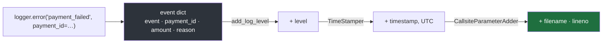
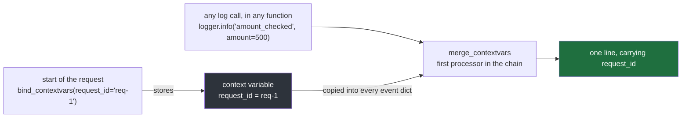
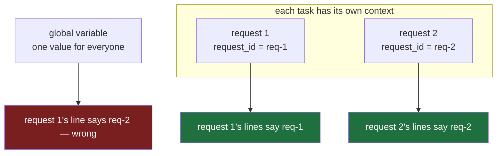

#logging #python #structured-logging #json #structlog

**Note 4 ended with every line from every part of a program in one format.** Every line is still a sentence, though — and a sentence is easy for a person to read and hard for a search to take apart.

# Lines Machines Can Read

## A sentence hides its details

Different people write log messages differently, as in any team. Five lines from the payment service:

`src/logging_lab/note05/a_sentences.py`:

```python
 1  import logging
 2
 3  logging.basicConfig(level=logging.INFO, format="%(levelname)s %(message)s")
 4  logger = logging.getLogger(__name__)
 5
 6  logger.info("payment %s succeeded, amount %s", "P-101", 500)
 7  logger.error("payment %s failed: amount must be positive, got %s", "P-104", 0)
 8  logger.error("Payment failed for P-106 (amount=%s): bank refused", 2400)
 9  logger.info("paid %s rupees for payment %s", 1200, "P-102")
10  logger.error("could not pay %s, bank timeout after %ss, amount %s", "P-107", 30, 1800)
```

```
$ uv run python src/logging_lab/note05/a_sentences.py
INFO payment P-101 succeeded, amount 500
ERROR payment P-104 failed: amount must be positive, got 0
ERROR Payment failed for P-106 (amount=2400): bank refused
INFO paid 1200 rupees for payment P-102
ERROR could not pay P-107, bank timeout after 30s, amount 1800
```

Each line is perfectly readable. Now a question of the kind the next day's reader actually gets: **every failed payment where the amount was over 1,000.** Saving the lines to a file first — logging writes to standard error, so `2>` is the redirection that captures them, as in note 3 — the search goes like this:

```
$ uv run python src/logging_lab/note05/a_sentences.py 2> lines.txt
```


```
$ grep "^ERROR" lines.txt
ERROR payment P-104 failed: amount must be positive, got 0
ERROR Payment failed for P-106 (amount=2400): bank refused
ERROR could not pay P-107, bank timeout after 30s, amount 1800

$ grep "^ERROR" lines.txt | grep "amount"
ERROR payment P-104 failed: amount must be positive, got 0
ERROR Payment failed for P-106 (amount=2400): bank refused
ERROR could not pay P-107, bank timeout after 30s, amount 1800
```

`grep` keeps only the lines matching a pattern; `^ERROR` means lines starting with `ERROR`. The first step works, and the reason matters: **the level always sits in the same place, written the same way**, because the formatter puts it there. The second step finds the word `amount` in all three lines and cannot say which amounts are over 1,000. Comparing needs the number pulled out first — and the amount is written three different ways:

| Line | How the amount appears | Problem for a search |
|---|---|---|
| P-104 | `got 0` | the word `amount` is not next to the number |
| P-106 | `amount=2400` | one phrasing |
| P-107 | `amount 1800` | another phrasing — in a line that also holds a second number, `30s` |

Answering the question means writing a separate pattern for every way any developer ever phrased an amount — and it silently misses the next new phrasing.

> [!important] A detail inside a sentence has no fixed place
> The level can be filtered because the formatter always puts it in one place. The amount, the payment ID and the reason live wherever each author happened to put them, so no single search can find and compare them.

## Give every detail a name

The fix is to stop putting details inside a sentence, and to write each one **under a name**, the same way every time. The usual way to write named values is **JSON** — a standard text format, `{"name": value, ...}`, that every log tool understands. One event becomes **one JSON object on one line**. The five events again, built by hand for now with `json.dumps`, which turns a Python dict into a JSON string:

`src/logging_lab/note05/b_named_values.py`:

```python
 1  import json
 2
 3  events = [
 4      {"level": "info", "event": "payment_succeeded", "payment_id": "P-101", "amount": 500},
 5      {"level": "error", "event": "payment_failed", "payment_id": "P-104", "amount": 0, "reason": "amount_not_positive"},
 6      {"level": "error", "event": "payment_failed", "payment_id": "P-106", "amount": 2400, "reason": "bank_refused"},
 7      {"level": "info", "event": "payment_succeeded", "payment_id": "P-102", "amount": 1200},
 8      {"level": "error", "event": "payment_failed", "payment_id": "P-107", "amount": 1800, "reason": "bank_timeout"},
 9  ]
10
11  for event in events:
12      print(json.dumps(event))
```

```
$ uv run python src/logging_lab/note05/b_named_values.py > lines.json
$ cat lines.json
{"level": "info", "event": "payment_succeeded", "payment_id": "P-101", "amount": 500}
{"level": "error", "event": "payment_failed", "payment_id": "P-104", "amount": 0, "reason": "amount_not_positive"}
{"level": "error", "event": "payment_failed", "payment_id": "P-106", "amount": 2400, "reason": "bank_refused"}
{"level": "info", "event": "payment_succeeded", "payment_id": "P-102", "amount": 1200}
{"level": "error", "event": "payment_failed", "payment_id": "P-107", "amount": 1800, "reason": "bank_timeout"}
```

The same question — every failed payment over 1,000 — asked with **`jq`**, a command-line tool for querying JSON:

```
$ jq -c 'select(.level == "error" and .amount > 1000)' lines.json
{"level":"error","event":"payment_failed","payment_id":"P-106","amount":2400,"reason":"bank_refused"}
{"level":"error","event":"payment_failed","payment_id":"P-107","amount":1800,"reason":"bank_timeout"}
```

Exactly the right two, from one query with no patterns. `select(...)` keeps the lines for which the condition is true; `.amount` reads the value named `amount`. And every failure caused by a bank timeout:

```
$ jq -c 'select(.level == "error" and .reason == "bank_timeout")' lines.json
{"level":"error","event":"payment_failed","payment_id":"P-107","amount":1800,"reason":"bank_timeout"}
```

Two symbols are easy to mix up. `:` is how JSON writes a value under a name, as in `"reason": "bank_timeout"`. `==` is how a query compares a value, as in `.reason == "bank_timeout"`. Writing `.reason : "bank_timeout"` in a query is a syntax error.

| | Sentence lines | Named values |
|---|---|---|
| where the amount is | wherever its author put it | always under `amount` |
| what the amount is | a few characters inside text | a number |
| failures over 1,000 | a pattern per phrasing, and still unreliable | one query: `.level == "error" and .amount > 1000` |

Log stores work the same way at scale: they index the names, so a question about any named value becomes a query across millions of lines rather than a text search through them. This is called **structured logging**.

> [!important] Named values turn a search into a query
> When every detail is written under its own name, any question about it — equal to, greater than, one of these — can be asked directly. A detail inside a sentence can only be pattern-matched, and every new phrasing breaks the pattern.

## A library that keeps every detail's name

Building JSON by hand with `json.dumps` is clumsy. **structlog** is a library built for this: log calls stay ordinary, and every detail passed to them keeps its name. Its most basic use, with no setup at all:

`src/logging_lab/note05/c_first_structlog_call.py`:

```python
1  import structlog
2
3  logger = structlog.get_logger()
4
5  logger.info("payment_succeeded", payment_id="P-101", amount=500)
6  logger.error("payment_failed", payment_id="P-104", amount=0, reason="amount_not_positive")
```

```
$ uv run python src/logging_lab/note05/c_first_structlog_call.py
2026-10-08 10:53:07 [info     ] payment_succeeded              amount=500 payment_id=P-101
2026-10-08 10:53:07 [error    ] payment_failed                 amount=0 payment_id=P-104 reason=amount_not_positive
```

Run with structlog 26.1.0. `structlog.get_logger()` plays the part `logging.getLogger(...)` played in the earlier notes: it returns the object the log calls are made on. Two things differ from those calls:

| | `logging` | structlog |
|---|---|---|
| first argument | a sentence, with `%s` slots for the details | the event's name — a short fixed label, `payment_failed` |
| the details | arguments that fill the slots, then disappear into the text | passed by name — `amount=0` — and written out under that name |

The time and level are added automatically, as `logging` did. This default look is meant for a person at a terminal; the same calls can produce JSON lines instead, without changing a single call — a later section.

**A fixed event name matters as much as the named details.** In the first section, the same failure was phrased three ways — `failed`, `Payment failed for`, `could not pay`. With one event name, counting last night's failures is a single query, `.event == "payment_failed"`, whoever wrote the call.

> [!important] Name the event, then name its details
> The event is a fixed label for what happened; everything that varies — which payment, what amount, why — goes in as a named value. Then every question about the event, or about any detail, is one query.

## A log call builds a dict, not a line

What structlog actually builds from a call can be seen with `capture_logs()`, structlog's own testing tool, which catches each call's data before anything is printed:

`src/logging_lab/note05/d_the_event_dict.py`:

```python
1  import structlog
2  from structlog.testing import capture_logs
3
4  logger = structlog.get_logger()
5
6  with capture_logs() as captured:
7      logger.error("payment_failed", payment_id="P-104", amount=0, reason="amount_not_positive")
8
9  print(captured[0])
```

```
$ uv run python src/logging_lab/note05/d_the_event_dict.py
{'payment_id': 'P-104', 'amount': 0, 'reason': 'amount_not_positive', 'event': 'payment_failed', 'log_level': 'error'}
```

That is the **event dict**: an ordinary Python dictionary holding everything about the event.

| Key | Comes from |
|---|---|
| `event` | the first argument of the call |
| `payment_id`, `amount`, `reason` | the named details, exactly as passed |
| `log_level` | the method that was called, `.error` |

Nothing has been turned into text yet — it is data with names. Turning it into a line is a separate, later step.

The line printed in the previous section started with a time; this dict has none. structlog's own source says why: `capture_logs` disables all configured processors while it is active — and adding the time is one of those processors' jobs.

> [!important] The call makes data; text comes later
> A structlog call produces a dictionary of named values. Every later step — adding the time, choosing how the line looks — works on that dictionary, so the details keep their names right up to the moment the line is written.

## Processors add what the call did not say

structlog does not have one settings call like `basicConfig`. It has a **chain of processors**: small functions that each take the event dict, add or change something, and pass it on. Its default chain, listed by asking structlog itself (`structlog.get_config()["processors"]`):

| # | Default processor | What it does |
|---|---|---|
| 1 | `merge_contextvars` | covered in a later section |
| 2 | `add_log_level` | adds the level |
| 3 | `StackInfoRenderer` | adds a stack trace, only when a call asks for one |
| 4 | `set_exc_info` | attaches the exception being handled, for `.exception(...)` calls |
| 5 | `TimeStamper` | adds the time |
| 6 | `ConsoleRenderer` | turns the dict into the readable text line — the last step, the next section |

That is where the time in the earlier output came from. A chain of three, with the dict caught after it has run — `capture_logs(processors=...)` runs the given processors before catching:

`src/logging_lab/note05/e_processors.py`:

```python
 1  import structlog
 2  from structlog.processors import CallsiteParameter, CallsiteParameterAdder
 3  from structlog.testing import capture_logs
 4  from structlog.typing import Processor
 5
 6  chain: list[Processor] = [
 7      structlog.processors.add_log_level,
 8      structlog.processors.TimeStamper(fmt="iso", utc=True),
 9      CallsiteParameterAdder([CallsiteParameter.FILENAME, CallsiteParameter.LINENO]),
10  ]
11
12  logger = structlog.get_logger()
13
14  with capture_logs(processors=chain) as captured:
15      logger.error("payment_failed", payment_id="P-104", amount=0, reason="amount_not_positive")
16
17  for name, value in captured[0].items():
18      print(f"{name:12} {value!r}")
```

```
$ uv run python src/logging_lab/note05/e_processors.py
payment_id   'P-104'
amount       0
reason       'amount_not_positive'
event        'payment_failed'
level        'error'
timestamp    '2026-10-08T05:28:44.691058Z'
filename     'e_processors.py'
lineno       15
log_level    'error'
```

Line 6's `chain: list[Processor]` only tells the type checker what the list holds — a **type checker** being a tool, mypy here, that reads code without running it and checks that every value is used as the type it was declared to be. Each processor added its own entries, in chain order:

| Processor | Added |
|---|---|
| `add_log_level` | `level` |
| `TimeStamper(fmt="iso", utc=True)` | `timestamp`, as `2026-10-08T05:28:44.691058Z` |
| `CallsiteParameterAdder([...FILENAME, ...LINENO])` | `filename` and `lineno` — line 15 is the `logger.error(...)` call |

`log_level` at the end is added by `capture_logs` itself, for testing; in a real chain only `level` exists.

**This closes note 3's time-zone gap.** `utc=True` writes the time in **UTC**, the reference clock the world's time zones are defined from, and the `Z` at the end marks it as UTC. Every server writes the same clock, whatever country it runs in.

Adding `CallsiteParameter.FUNC_NAME` to the list on line 9 adds `func_name`, the function the call was made in — `pay` for a call inside `def pay()`, and `<module>`, Python's name for the file itself, for a call outside any function.



> [!important] Each processor does one small job
> The chain is read top to bottom, and each step only adds or changes entries in the dict. Wanting one more fact in every line — the function name, the request ID — means adding one processor, never touching the log calls.

## The last processor writes the line

Every chain so far ended with a step that was not explained. The **last** processor is the **renderer**: it takes the finished dict and turns it into the actual text line. The same two calls with two renderers — this program picks one by whether the word `json` was typed after the command:

`src/logging_lab/note05/f_renderer.py`:

```python
 1  import sys
 2
 3  import structlog
 4  from structlog.typing import Processor
 5
 6  renderer: Processor
 7  if "json" in sys.argv:
 8      renderer = structlog.processors.JSONRenderer()
 9  else:
10      renderer = structlog.dev.ConsoleRenderer(colors=True)
11
12  structlog.configure(
13      processors=[
14          structlog.processors.add_log_level,
15          structlog.processors.TimeStamper(fmt="iso", utc=True),
16          renderer,
17      ]
18  )
19
20  logger = structlog.get_logger()
21  logger.info("payment_succeeded", payment_id="P-101", amount=500)
22  logger.error("payment_failed", payment_id="P-104", amount=0, reason="amount_not_positive")
```

The pieces that pick the renderer:

| Line | What it does |
|---|---|
| 6 | `renderer: Processor` gives the variable no value; it only tells the type checker what kind of thing lines 8 and 10 will put in it — two different kinds of renderer |
| 7 | `sys.argv` is the list of words typed to run the program, filled in by Python — `['src/logging_lab/note05/f_renderer.py', 'json']` when run with `json` — so `"json" in sys.argv` asks whether `json` was typed |
| 8–10 | an ordinary `if`/`else`: the JSON renderer if `json` was typed, the console renderer otherwise |
| 12–18 | `structlog.configure(processors=[...])` sets the chain once, at startup, as `basicConfig` did for `logging`: the level, the time in UTC, and the chosen renderer last |

Run both ways — the first shown with its colour codes removed, since a page cannot show colours:

```
$ uv run python src/logging_lab/note05/f_renderer.py
2026-10-08T05:36:30.762920Z [info     ] payment_succeeded              amount=500 payment_id=P-101
2026-10-08T05:36:30.763149Z [error    ] payment_failed                 amount=0 payment_id=P-104 reason=amount_not_positive
$ uv run python src/logging_lab/note05/f_renderer.py json
{"payment_id": "P-101", "amount": 500, "event": "payment_succeeded", "level": "info", "timestamp": "2026-10-08T05:36:30.828067Z"}
{"payment_id": "P-104", "amount": 0, "reason": "amount_not_positive", "event": "payment_failed", "level": "error", "timestamp": "2026-10-08T05:36:30.828325Z"}
```

**Same calls, same dict, two renderers, two looks.** `ConsoleRenderer` writes readable columns, in colour, for a person at a terminal. `JSONRenderer` writes one JSON object per line — exactly what `jq` and log stores can query.

Choosing between them for a laptop and a server changes **only the renderer**. The log calls, the event dict and every other processor in the chain stay exactly the same.

`colors=True` is right for a screen and wrong anywhere else. Captured into a file or sent to a log store, the same line carries the colour codes as raw characters:

```
^[[2m2026-10-08T05:36:13.449691Z^[[0m [^[[32m^[[1minfo     ^[[0m] ^[[1mpayment_succeeded …
```

So colour belongs only on output that is actually a terminal — a choice note 6 automates.

> [!important] The renderer is the only part that differs between a laptop and a server
> Everything before it produces the same dict either way. Readable text for a person, JSON for the log store — one line of configuration, and no log call changes.

## The request ID in every line, passed to no function

Note 1 left one question open: which request was a line part of? A service handles many requests at once — each one a single job, such as paying P-104 — and the next day's reader needs every line to say which request it belongs to, so that one request's lines can be pulled out together.

The obvious way is to pass `request_id=...` into every log call. But a request runs through many functions, and each of them would need the ID handed to it only so it could log it. structlog stores it once instead:

`src/logging_lab/note05/g_request_id_everywhere.py`:

```python
 1  import structlog
 2
 3  structlog.configure(
 4      processors=[
 5          structlog.contextvars.merge_contextvars,
 6          structlog.processors.add_log_level,
 7          structlog.processors.JSONRenderer(),
 8      ]
 9  )
10  logger = structlog.get_logger()
11
12
13  def check_amount(amount: int) -> None:
14      logger.info("amount_checked", amount=amount)
15
16
17  def send_to_bank(payment_id: str) -> None:
18      logger.info("sent_to_bank", payment_id=payment_id)
19
20
21  def handle_request(request_id: str, payment_id: str, amount: int) -> None:
22      structlog.contextvars.clear_contextvars()
23      structlog.contextvars.bind_contextvars(request_id=request_id)
24      check_amount(amount)
25      send_to_bank(payment_id)
26
27
28  handle_request("req-1", "P-101", 500)
29  handle_request("req-2", "P-102", 1200)
```

```
$ uv run python src/logging_lab/note05/g_request_id_everywhere.py
{"amount": 500, "event": "amount_checked", "request_id": "req-1", "level": "info"}
{"payment_id": "P-101", "event": "sent_to_bank", "request_id": "req-1", "level": "info"}
{"amount": 1200, "event": "amount_checked", "request_id": "req-2", "level": "info"}
{"payment_id": "P-102", "event": "sent_to_bank", "request_id": "req-2", "level": "info"}
```

`check_amount` and `send_to_bank` were never given the request ID, yet every line they wrote carries it. Two pieces do this:

| Piece | Job |
|---|---|
| `bind_contextvars(request_id=...)`, line 23 | **stores** the ID once, at the start of the request, in a **context variable** — a Python feature for holding a value that belongs to the current piece of work. Line 22, `clear_contextvars()`, first wipes anything left from a previous request. |
| `merge_contextvars`, line 5 | a **processor**, first in the chain: for every log call, it copies everything stored into that call's event dict |

Both are needed. Remove line 5 and keep the bind, and the ID is still stored but no line shows it:

```
{"amount": 500, "event": "amount_checked", "level": "info"}
{"payment_id": "P-101", "event": "sent_to_bank", "level": "info"}
```

In structlog's source, `bind_contextvars` creates a `contextvars.ContextVar` for each name and stores the value with `var.set(v)`; `merge_contextvars` adds each stored value with `event_dict.setdefault(name, value)` — so a value the log call passes itself, under the same name, is kept rather than overwritten.



> [!important] Bind once per request; the chain stamps it on every line
> `bind_contextvars` is called once, where a request starts. From then on, every line written during that request — from any function, however deep — carries the request ID, because `merge_contextvars` copies it in. No function has to pass it along.

## Each request keeps its own copy

A real service handles many requests at the same time. In Python that is commonly done with **`asyncio`**: each request runs as a **task**, and whenever one task is waiting — for the bank to answer, say — Python switches to another and carries on with it. Two requests' lines end up interleaved.

That raises a fair worry: if request 1 binds `req-1`, and request 2 binds `req-2` while request 1 is still waiting, does request 1's next line say `req-2`? The test below compares a context variable with an ordinary global variable, written into each line as `global_variable`:

`src/logging_lab/note05/h_two_requests_at_once.py`:

```python
 1  import asyncio
 2
 3  import structlog
 4
 5  structlog.configure(
 6      processors=[
 7          structlog.contextvars.merge_contextvars,
 8          structlog.processors.JSONRenderer(),
 9      ]
10  )
11  logger = structlog.get_logger()
12
13  current_request_id = ""
14
15
16  async def handle_request(request_id: str, payment_id: str) -> None:
17      global current_request_id
18      current_request_id = request_id
19      structlog.contextvars.bind_contextvars(request_id=request_id)
20
21      logger.info("request_started", payment_id=payment_id, global_variable=current_request_id)
22      await asyncio.sleep(0.1)
23      logger.info("bank_answered", payment_id=payment_id, global_variable=current_request_id)
24
25
26  async def main() -> None:
27      await asyncio.gather(
28          handle_request("req-1", "P-101"),
29          handle_request("req-2", "P-102"),
30      )
31
32
33  asyncio.run(main())
```

Four pieces of `asyncio` appear in it. `async def` declares a function that can pause partway through. `await` marks the point where it pauses — here `await asyncio.sleep(0.1)`, which stands in for waiting on the bank — and while it is paused, Python runs another task. `asyncio.gather(...)` starts both requests as tasks and waits until both have finished. `asyncio.run(main())` starts the whole thing.

```
$ uv run python src/logging_lab/note05/h_two_requests_at_once.py
{"payment_id": "P-101", "global_variable": "req-1", "event": "request_started", "request_id": "req-1"}
{"payment_id": "P-102", "global_variable": "req-2", "event": "request_started", "request_id": "req-2"}
{"payment_id": "P-101", "global_variable": "req-2", "event": "bank_answered", "request_id": "req-1"}
{"payment_id": "P-102", "global_variable": "req-2", "event": "bank_answered", "request_id": "req-2"}
```

The third line is request 1's — payment `P-101` — after the bank answered. Its `global_variable` says `req-2`, which is wrong; its `request_id` says `req-1`, which is right. Step by step:

| Step | What happens | Global variable | Request 1's context variable | Request 2's context variable |
|---|---|---|---|---|
| 1 | request 1 starts, stores and binds `req-1`, logs, waits | `req-1` | `req-1` | — |
| 2 | Python switches to request 2, which stores and binds `req-2`, logs, waits | **`req-2`** — request 1's value overwritten | `req-1` — untouched | `req-2` |
| 3 | request 1 resumes and logs `bank_answered` | `req-2` — wrong | `req-1` — right | `req-2` |

**A global variable is one value shared by everything, so the last request to write it wins. A context variable gives each task its own copy**: request 2 binding `req-2` changes only its own copy.



> [!important] Request-scoped values belong in context variables, never globals
> With many requests in flight, a global holds whichever request wrote last. Following that ID the next day would pull in another customer's lines. A context variable stays with the request that set it.

## A processor that masks secrets

Note 1 warned that logs leak: they are kept for months and read by many people. A password, a one-time code or a card number must never reach a line — even when somebody logs one carelessly. Every line passes through the processor chain, so a processor is the place to catch them, and a processor is just a function anyone can write:

`src/logging_lab/note05/i_masking_secrets.py`:

```python
 1  import structlog
 2  from structlog.typing import EventDict, WrappedLogger
 3
 4  SENSITIVE = {"password", "otp", "card_number"}
 5
 6
 7  def mask_secrets(_logger: WrappedLogger, _method_name: str, event_dict: EventDict) -> EventDict:
 8      for name in event_dict:
 9          if name in SENSITIVE:
10              event_dict[name] = "[MASKED]"
11      return event_dict
12
13
14  structlog.configure(
15      processors=[
16          mask_secrets,
17          structlog.processors.JSONRenderer(),
18      ]
19  )
20  logger = structlog.get_logger()
21
22  logger.info("portal_login", username="asha", password="hunter2", otp="481902")
23  logger.info("payment_sent", payment_id="P-101", card_number="4111111111111111")
```

```
$ uv run python src/logging_lab/note05/i_masking_secrets.py
{"username": "asha", "password": "[MASKED]", "otp": "[MASKED]", "event": "portal_login"}
{"payment_id": "P-101", "card_number": "[MASKED]", "event": "payment_sent"}
```

| Lines | What they do |
|---|---|
| 2 | `EventDict` and `WrappedLogger` are structlog's names for the types of a processor's inputs — the event dict, and the logger the call was made on — imported only so the type checker can check line 7 |
| 7 | every processor has this shape: it receives the logger, the name of the method called, and the event dict, and returns the event dict. The leading `_` marks the first two as deliberately unused |
| 8–10 | every name in the dict that is in `SENSITIVE` gets its value replaced with `[MASKED]` |
| 16 | the processor sits **before** the renderer, so the secret is gone before the line is written |

The careless calls on lines 22 and 23 were left as they were, and the secrets still never reached the log.

Matching names exactly is too narrow. A name like `portal_password` is not `password`, and `bankOtp` is not `otp`. Comparing the two rules on the same call:

`src/logging_lab/note05/j_masking_by_name_ending.py`:

```python
 1  import structlog
 2  from structlog.typing import EventDict, WrappedLogger
 3
 4  SENSITIVE = {"password", "otp", "card_number"}
 5
 6
 7  def exact_names(_logger: WrappedLogger, _method_name: str, event_dict: EventDict) -> EventDict:
 8      for name in event_dict:
 9          if name in SENSITIVE:
10              event_dict[name] = "[MASKED]"
11      return event_dict
12
13
14  def name_endings(_logger: WrappedLogger, _method_name: str, event_dict: EventDict) -> EventDict:
15      for name in event_dict:
16          if name.lower().endswith(tuple(SENSITIVE)):
17              event_dict[name] = "[MASKED]"
18      return event_dict
19
20
21  for rule in (exact_names, name_endings):
22      structlog.configure(processors=[rule, structlog.processors.JSONRenderer()])
23      logger = structlog.get_logger()
24      print(f"--- {rule.__name__}:", flush=True)
25      logger.info("portal_login", portal_password="hunter2", bankOtp="481902")
```

```
$ uv run python src/logging_lab/note05/j_masking_by_name_ending.py
--- exact_names:
{"portal_password": "hunter2", "bankOtp": "481902", "event": "portal_login"}
--- name_endings:
{"portal_password": "[MASKED]", "bankOtp": "[MASKED]", "event": "portal_login"}
```

The exact rule leaks both. The second rule, line 16, lowercases each name — so `bankOtp` becomes `bankotp` — and asks whether it **ends with** any sensitive word; `tuple(...)` is there only because `endswith` takes a tuple. Both are caught.

One limit no rule can lift: **masking works on names, never on free text.** In `logger.info("login failed for password hunter2")` the secret is part of the event text, and no processor can pick it out safely. So the rule for whoever writes the call is to keep secrets out of the event text and pass them as named values, where the processor catches them.

> [!important] Mask in the chain, by name, before the renderer
> A masking processor protects every line, from every call, without trusting each author to remember. It can only see named values — so secrets go in as named values, never inside the event text.

---

> **Recall:** Why can a search not compare a detail written inside a sentence? · What does JSON give each detail? · In `jq`, what is the difference between `:` and `==`? · What does a structlog call produce before any text exists? · What does a processor do, and in what order do they run? · What closes the time-zone gap? · What does the renderer decide, and what is the only thing that differs between a laptop and a server? · What two pieces put a request ID in every line, and why is each needed? · Why do concurrent requests need context variables rather than a global? · Where does a masking processor go, and what can it never see?
