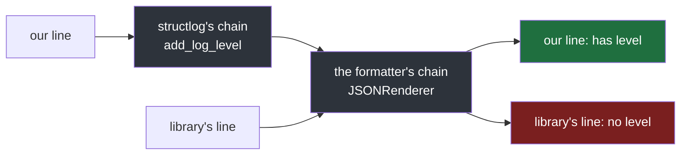
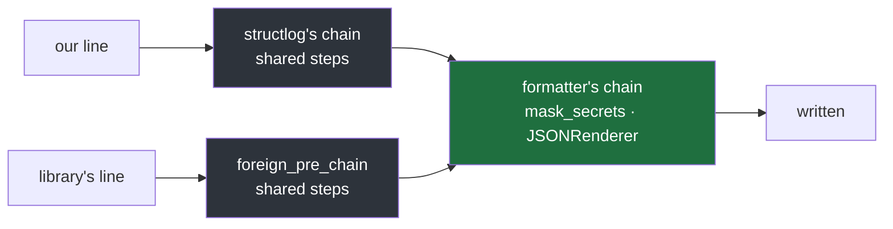
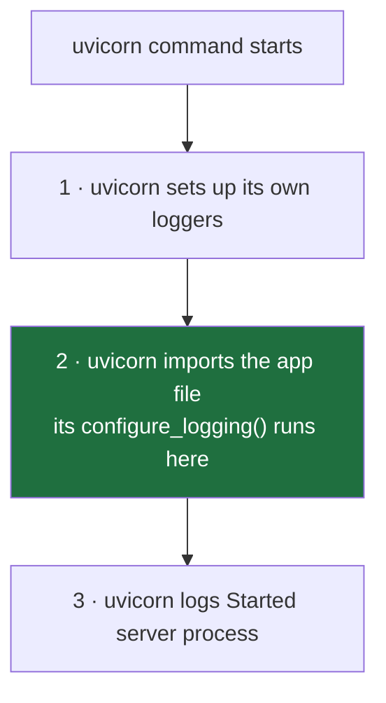
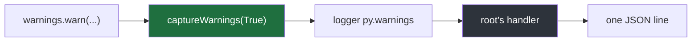
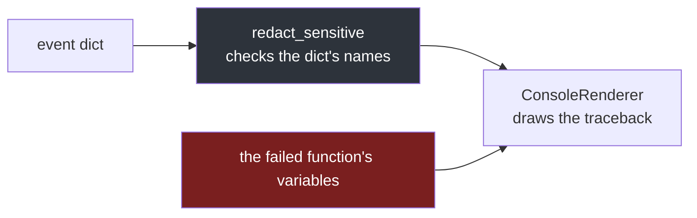

#logging #python #structlog #uvicorn #configuration

**Note 5 gave a program's own lines names, a chain of processors and a JSON renderer.** But a program's own lines are not the only ones in its log, and this note makes every line — from every library — come out the same way. It ends by reading, line by line, the function that does it in a real service.

# One Pipeline For Everyone

## Two logging systems in one program

A program's own code can log with structlog. The **libraries** it uses log through Python's standard `logging` — the one from notes 2 to 4 — because a library cannot know whether the program using it has chosen structlog. Here `bank_library` stands in for any such library:

`src/logging_lab/note06/bank_library.py`:

```python
1  import logging
2
3  logger = logging.getLogger(__name__)
4
5
6  def send(payment_id: str) -> None:
7      logger.warning("bank answered slowly for %s", payment_id)
```

`src/logging_lab/note06/a_two_formats.py`:

```python
 1  import logging
 2
 3  import structlog
 4
 5  from logging_lab.note06 import bank_library
 6
 7  logging.basicConfig(level=logging.INFO, format="%(levelname)s %(name)s %(message)s")
 8  structlog.configure(
 9      processors=[
10          structlog.processors.add_log_level,
11          structlog.processors.JSONRenderer(),
12      ]
13  )
14
15  logger = structlog.get_logger()
16
17  logger.info("payment_started", payment_id="P-102")
18  bank_library.send("P-102")
19  logger.info("payment_succeeded", payment_id="P-102")
```

```
$ uv run python src/logging_lab/note06/a_two_formats.py 2>&1
{"payment_id": "P-102", "event": "payment_started", "level": "info"}
WARNING logging_lab.note06.bank_library bank answered slowly for P-102
{"payment_id": "P-102", "event": "payment_succeeded", "level": "info"}
```

**One log, two formats.** The program's own lines went through structlog's chain and became JSON. The library's line went through `logging`'s handler — the one `basicConfig` built on line 7 — and became plain text. Two systems, each formatting its own lines.

They even go to **different output streams**, because the two libraries chose different defaults:

| Library | Default output stream | In its source |
|---|---|---|
| structlog's `PrintLogger`, its default | standard output | `self._file = file or stdout` |
| Python `logging`'s `StreamHandler` | standard error | `if stream is None: stream = sys.stderr` |

`2>&1` joins standard error into standard output before anything reads them, which is why the three lines above arrive in the order they were written. Read as two separate streams — as a terminal window or an editor's run console may do — the library's line can appear out of place, because nothing orders lines across two streams. structlog does send each line at once (`print(message, file=f, flush=True)` in its source); the reordering happens on the receiving side.

What the mixture does to a query, with the lines saved to `mixed.log`:

```
$ jq -c "select(.level == \"info\")" mixed.log
jq: parse error: Invalid numeric literal at line 2, column 8
{"payment_id":"P-102","event":"payment_started","level":"info"}
(jq exit code: 5)
```

`jq` read line 1, met line 2, which is not JSON, and **stopped**. Line 3 — `payment_succeeded`, an INFO line the query should have returned — never came back. One text line does not just look different: it can cut off everything after it. A log store either rejects such lines or stores them as unsearchable text.

> [!important] Every line has to come out of one pipeline
> Libraries will keep logging through `logging`, whatever a program's own code uses. So the fix cannot be in the libraries; it has to be in the setup — making `logging`'s lines and structlog's lines pass through the same steps and the same renderer, to the same stream.

## structlog can hand its lines to `logging`

The fix reverses the direction. Instead of two systems writing separately, structlog's lines travel **through `logging`**, so that one `logging` handler can write everything — the program's lines and every library's. The first step is to make structlog hand its lines to `logging` at all. The handler's format starts with `[logging's handler]`, to show who writes the line:

`src/logging_lab/note06/c_structlog_into_logging.py`:

```python
 1  import logging
 2
 3  import structlog
 4
 5  logging.basicConfig(level=logging.INFO, format="[logging's handler] %(message)s")
 6
 7  structlog.configure(logger_factory=structlog.stdlib.LoggerFactory())
 8
 9  logger = structlog.get_logger()
10  logger.info("payment_started", payment_id="P-102")
```

```
$ uv run python src/logging_lab/note06/c_structlog_into_logging.py
[logging's handler] 2026-10-08 11:32:09 [info     ] payment_started                payment_id=P-102
```

The output is shown with structlog's colour codes removed. **The one new thing is line 7**: `logger_factory=structlog.stdlib.LoggerFactory()` tells structlog not to write its lines itself but to hand each one to a standard `logging` logger — the same kind libraries log through. The prefix proves it: `logging`'s handler from line 5 wrote the line.

Two things made that one line, one after the other:

| Step | Made by | Produced |
|---|---|---|
| 1 | structlog's chain | finished text: time, level, event name, `payment_id=P-102` |
| 2 | `logging`'s handler | the prefix, with structlog's finished text as its `%(message)s` |

**By the time `logging` received the line, it was already plain text** — the named values flattened into a sentence. For one JSON format across every line, `logging`'s side needs the named values themselves, not text made from them.

## Hand over the dict, not the text

The same program, with one change: structlog's chain now ends with `wrap_for_formatter` instead of a renderer.

`src/logging_lab/note06/d_hand_over_the_dict.py`:

```python
 1  import logging
 2
 3  import structlog
 4
 5  logging.basicConfig(level=logging.INFO, format="[logging's handler] %(message)s")
 6
 7  structlog.configure(
 8      processors=[
 9          structlog.processors.add_log_level,
10          structlog.stdlib.ProcessorFormatter.wrap_for_formatter,
11      ],
12      logger_factory=structlog.stdlib.LoggerFactory(),
13  )
14
15  logger = structlog.get_logger()
16  logger.info("payment_started", payment_id="P-102")
```

```
$ uv run python src/logging_lab/note06/d_hand_over_the_dict.py
[logging's handler] {'payment_id': 'P-102', 'event': 'payment_started', 'level': 'info'}
```

**Line 10, `wrap_for_formatter`, is the last step of structlog's chain, and it renders nothing.** It hands the event dict itself to `logging` — in its source it returns `(event_dict,)`, so the dict travels as the log message. `logging`'s handler received the dict, names intact, and printed it raw only because its plain formatter from line 5 does not know what to do with a dict. Ugly as it looks, this is the point: the named values survived the hand-over, so they can still become JSON.

Line 9 raises a fair question, because the previous section printed `[info]` without it. Removing it shows what it does:

```
$ uv run python src/logging_lab/note06/d_hand_over_the_dict.py   # with line 9 removed
[logging's handler] {'payment_id': 'P-102', 'event': 'payment_started'}
```

The line still appears — but its dict has no `level`. Two separate things are at work, the same two note 2 kept apart: the threshold decides whether a line is kept at all, and the shape of the line decides whether its level is written into it:

| Question | Decided by | Without line 9 |
|---|---|---|
| does the INFO line appear at all? | `logging`'s threshold, `level=logging.INFO` on line 5 | it still appears |
| is the level written into the line? | `add_log_level`, line 9 | it is not: no `level` in the dict |

The previous section set only `logger_factory`, so structlog kept its whole default chain — `merge_contextvars`, `add_log_level`, `StackInfoRenderer`, `set_exc_info`, `TimeStamper`, `ConsoleRenderer` — which already adds the level and the time. Passing `processors=[...]` **replaces** the default chain entirely, so every step wanted has to be listed again.

> [!important] Passing `processors` replaces the default chain
> structlog's defaults apply only when no chain is given. Once a program lists its own processors, nothing else runs — the level, the time, anything — unless it is in that list.

## A formatter that knows what to do with a dict

`logging`'s side now receives the dict, but its plain formatter printed it raw. What it needs is a formatter that runs processors on the dict instead of filling in a template. structlog provides one, `ProcessorFormatter`. Everything else is the handler setup from note 4, done by hand instead of by `basicConfig`:

`src/logging_lab/note06/e_a_formatter_for_the_dict.py`:

```python
 1  import logging
 2  import sys
 3
 4  import structlog
 5
 6  structlog.configure(
 7      processors=[
 8          structlog.processors.add_log_level,
 9          structlog.stdlib.ProcessorFormatter.wrap_for_formatter,
10      ],
11      logger_factory=structlog.stdlib.LoggerFactory(),
12  )
13
14  formatter = structlog.stdlib.ProcessorFormatter(
15      processors=[
16          structlog.stdlib.ProcessorFormatter.remove_processors_meta,
17          structlog.processors.JSONRenderer(),
18      ],
19  )
20
21  handler = logging.StreamHandler(sys.stdout)
22  handler.setFormatter(formatter)
23
24  root = logging.getLogger()
25  root.addHandler(handler)
26  root.setLevel(logging.INFO)
27
28  logger = structlog.get_logger()
29  logger.info("payment_started", payment_id="P-102")
```

```
$ uv run python src/logging_lab/note06/e_a_formatter_for_the_dict.py
{"payment_id": "P-102", "event": "payment_started", "level": "info"}
```

**One JSON line, written by `logging`'s handler.** Lines 6 to 12 are the previous section's structlog setup, unchanged. Lines 14 to 26 are the same three steps note 4 used to build a handler by hand:

| Step | Note 4 | Here | What changed |
|---|---|---|---|
| make a formatter | `logging.Formatter("%(levelname)s %(message)s")` | `ProcessorFormatter(processors=[...])`, lines 14–19 | a list of processors instead of a template, because the message arriving is a dict |
| make a handler and give it the formatter | `StreamHandler()`, then `setFormatter` | lines 21–22 | `sys.stdout` instead of the default standard error, chosen on purpose and explained later in this note |
| put the handler on `root`, with a threshold | `addHandler`, `setLevel` | lines 24–26 | nothing |

The formatter's own chain, lines 16 and 17, runs in order:

| Line | Processor | Does |
|---|---|---|
| 16 | `remove_processors_meta` | deletes two bookkeeping entries structlog adds during the hand-over |
| 17 | `JSONRenderer` | turns the dict into the JSON line, the same renderer as in note 5 |

Removing line 16 shows the bookkeeping it deletes:

```
$ uv run python src/logging_lab/note06/e_a_formatter_for_the_dict.py   # with line 16 removed
{"payment_id": "P-102", "event": "payment_started", "level": "info", "_record": "<LogRecord: __main__, 20, /Users/home/Desktop/projects/logging-lab/src/logging_lab/note06/e_a_formatter_for_the_dict.py, 28, \"{'payment_id': 'P-102', 'event': 'payment_started', 'level': 'info'}\">", "_from_structlog": true}
```

`_record` is the whole `logging` record and `_from_structlog` marks where the line came from. `ProcessorFormatter` adds both before its processors run, so they are available to any processor that needs them; in structlog's source, `remove_processors_meta` is just `del event_dict["_record"]` and `del event_dict["_from_structlog"]`. Nobody searching the log needs them, so they are deleted just before rendering.

**Why the handler goes on `root`** is note 4's rule doing its job. Every logger's records propagate up to `root`, so a handler there sees every line in the program: the program's own lines, which structlog now hands to a standard logger, and every library's lines, which were always logged through one. The same rule prevents the other problem from note 4: with the handler only on `root`, each line meets it exactly once, so nothing is written twice.

> [!important] One handler on `root` is the meeting point
> Both paths, structlog's and every library's, end at `root`. A handler placed there, with a formatter that can render a dict, is the single place every line passes through on its way out.

## A library's line skips structlog's chain

The same program, with `bank_library` from the first section called at the end:

`src/logging_lab/note06/f_a_library_line.py`:

```python
 1  import logging
 2  import sys
 3
 4  import structlog
 5
 6  from logging_lab.note06 import bank_library
 7
 8  structlog.configure(
 9      processors=[
10          structlog.processors.add_log_level,
11          structlog.stdlib.ProcessorFormatter.wrap_for_formatter,
12      ],
13      logger_factory=structlog.stdlib.LoggerFactory(),
14  )
15
16  formatter = structlog.stdlib.ProcessorFormatter(
17      processors=[
18          structlog.stdlib.ProcessorFormatter.remove_processors_meta,
19          structlog.processors.JSONRenderer(),
20      ],
21  )
22
23  handler = logging.StreamHandler(sys.stdout)
24  handler.setFormatter(formatter)
25
26  root = logging.getLogger()
27  root.addHandler(handler)
28  root.setLevel(logging.INFO)
29
30  logger = structlog.get_logger()
31  logger.info("payment_started", payment_id="P-102")
32  bank_library.send("P-102")
```

```
$ uv run python src/logging_lab/note06/f_a_library_line.py
{"payment_id": "P-102", "event": "payment_started", "level": "info"}
{"event": "bank answered slowly for P-102"}
```

Both lines are JSON now, but **the library's line has no `level`**, although it was a WARNING. The program now has two chains of processors, and they do not see the same lines:

| Chain | Lines 9–12, structlog's | Lines 17–20, the formatter's |
|---|---|---|
| decides | what goes into the dict | how the dict is rendered |
| runs for | only lines written through structlog | every line that reaches the handler |

`add_log_level` is on line 10, in structlog's chain. The library logs through plain `logging` and never calls structlog, so it skips that chain entirely:



For a line that did not come from structlog, `ProcessorFormatter` builds a fresh dict holding only the message. In structlog's source: `ed = {"event": record.getMessage(), "_record": record, "_from_structlog": False}`. Everything else structlog's chain would have added is missing.

## `foreign_pre_chain` gives library lines the steps they missed

`ProcessorFormatter` has a slot for exactly this, `foreign_pre_chain`. Foreign means not from structlog: the processors listed there run **only on library lines**, before the formatter's own chain. One line added, line 17:

`src/logging_lab/note06/g_foreign_pre_chain.py`:

```python
16  formatter = structlog.stdlib.ProcessorFormatter(
17      foreign_pre_chain=[structlog.processors.add_log_level],
18      processors=[
19          structlog.stdlib.ProcessorFormatter.remove_processors_meta,
20          structlog.processors.JSONRenderer(),
21      ],
22  )
```

```
$ uv run python src/logging_lab/note06/g_foreign_pre_chain.py
{"payment_id": "P-102", "event": "payment_started", "level": "info"}
{"event": "bank answered slowly for P-102", "level": "warning"}
```

**The library's line now has its level.** It got it from the same processor our own lines use, `add_log_level`, run in a different place. In structlog's source, the foreign branch ends with `for proc in self.foreign_pre_chain or (): ed = proc(logger, meth_name, ed)`, and the `or ()` is why nothing ran before line 17 existed.

> [!important] Whatever structlog's chain adds, `foreign_pre_chain` must add too
> Every step that fills in the dict, such as the level or the time, has to be listed in both places: in structlog's chain for the program's own lines, and in `foreign_pre_chain` for every library's. Missing it from one means half the log lacks it.

## One shared list, used by both chains

A real setup fills in more than the level: the time and the logger's name too, and later the request ID. Each of those steps has to be in both places. Written out twice, the two lists drift apart: someone adds a step to one and forgets the other, and only half the log gets it. So the steps are written **once**, in one list, and both chains use that list:

`src/logging_lab/note06/h_one_shared_list.py`:

```python
 1  import logging
 2  import sys
 3
 4  import structlog
 5  from structlog.typing import Processor
 6
 7  from logging_lab.note06 import bank_library
 8
 9  shared: list[Processor] = [
10      structlog.processors.add_log_level,
11      structlog.stdlib.add_logger_name,
12      structlog.processors.TimeStamper(fmt="iso", utc=True),
13  ]
14
15  structlog.configure(
16      processors=[
17          *shared,
18          structlog.stdlib.ProcessorFormatter.wrap_for_formatter,
19      ],
20      logger_factory=structlog.stdlib.LoggerFactory(),
21  )
22
23  formatter = structlog.stdlib.ProcessorFormatter(
24      foreign_pre_chain=shared,
25      processors=[
26          structlog.stdlib.ProcessorFormatter.remove_processors_meta,
27          structlog.processors.JSONRenderer(),
28      ],
29  )
30
31  handler = logging.StreamHandler(sys.stdout)
32  handler.setFormatter(formatter)
33
34  root = logging.getLogger()
35  root.addHandler(handler)
36  root.setLevel(logging.INFO)
37
38  logger = structlog.get_logger()
39  logger.info("payment_started", payment_id="P-102")
40  bank_library.send("P-102")
```

```
$ uv run python src/logging_lab/note06/h_one_shared_list.py
{"payment_id": "P-102", "event": "payment_started", "level": "info", "logger": "__main__", "timestamp": "2026-10-08T06:38:45.145151Z"}
{"event": "bank answered slowly for P-102", "level": "warning", "logger": "logging_lab.note06.bank_library", "timestamp": "2026-10-08T06:38:45.145426Z"}
```

**Both lines now carry the same four fields:** level, logger, timestamp, event. The list is used in two places:

| Line | Used as | Runs for |
|---|---|---|
| 17 | `*shared` inside structlog's chain | the program's own lines |
| 24 | `foreign_pre_chain=shared` | every library's lines |

On line 17, the `*` in front of `shared` copies the list's items into the surrounding list, one by one, so structlog's chain becomes `add_log_level, add_logger_name, TimeStamper, wrap_for_formatter`. Without the `*`, the whole list would be put in as a single item, and a list is not a processor.

Line 11, `add_logger_name`, is new: it adds the logger's name, the same name note 3 printed with `%(name)s`. Our line says `__main__`, because it was written from the file the program was started with; the library's says `logging_lab.note06.bank_library`, its module's `__name__`. With that one field, a search can tell the program's lines from each library's.

> [!important] Write each fill-in step once
> The steps that fill in the dict live in one list. structlog's chain unpacks it, `foreign_pre_chain` takes it, and adding a step to the list adds it to every line in the log.

## Masking goes in the formatter's chain

Note 5 masked secrets with a processor. In this setup there are two chains it could go in: the shared list, which runs on each path before the two meet, or the formatter's own chain, which runs after they meet. **The formatter's chain is the natural place, because every line passes through it**, the program's own and every library's, and it is the last step before a line is written:



The program from the previous section, with note 5's masking processor added to the formatter's chain on line 37, and a line that carries a password:

`src/logging_lab/note06/i_masking_in_the_formatter.py`, lines 9–16, 33–40 and 49–51:

```python
 9  SENSITIVE = ("password", "otp", "card_number")
10
11
12  def mask_secrets(_logger: WrappedLogger, _method_name: str, event_dict: EventDict) -> EventDict:
13      for name in event_dict:
14          if name.lower().endswith(SENSITIVE):
15              event_dict[name] = "[MASKED]"
16      return event_dict
```

```python
33  formatter = structlog.stdlib.ProcessorFormatter(
34      foreign_pre_chain=shared,
35      processors=[
36          structlog.stdlib.ProcessorFormatter.remove_processors_meta,
37          mask_secrets,
38          structlog.processors.JSONRenderer(),
39      ],
40  )
```

```python
49  logger = structlog.get_logger()
50  logger.info("portal_login", portal_password="hunter2")
51  bank_library.send("P-102")
```

```
$ uv run python src/logging_lab/note06/i_masking_in_the_formatter.py
{"portal_password": "[MASKED]", "event": "portal_login", "level": "info", "logger": "__main__", "timestamp": "2026-10-08T06:41:53.184912Z"}
{"event": "bank answered slowly for P-102", "level": "warning", "logger": "logging_lab.note06.bank_library", "timestamp": "2026-10-08T06:41:53.185187Z"}
```

Placed there, it runs once, in one place, on every line, and only after the shared steps have added everything they add. Nothing can be added to a line after it has been masked.

> [!important] Mask where every line passes, last
> Masking belongs in the formatter's chain, just before the renderer: the one place both paths share, after every step that adds values has run.

> [!info] Masking by name only sees named values
> `mask_secrets` checks the names in the dict. A library line arrives as a dict holding only its message text, so a password written into that text is not caught: a library calling `warning("login failed, password=%s", "hunter2")` is written as `{"event": "login failed, password=hunter2", ...}`. Masking protects the values a program passes by name; a library that puts secrets into its message text has to be quietened with its logger's threshold instead.

## Setting up twice must not add a second handler

All of this setup belongs in one function, `configure_logging()`, called when the program starts. But a function can be called more than once, and tests often do exactly that. Here the setup is in a function, called twice:

`src/logging_lab/note06/j_configured_twice.py`:

```python
 1  import logging
 2  import sys
 3
 4  import structlog
 5
 6
 7  def configure_logging() -> None:
 8      structlog.configure(
 9          processors=[
10              structlog.processors.add_log_level,
11              structlog.stdlib.ProcessorFormatter.wrap_for_formatter,
12          ],
13          logger_factory=structlog.stdlib.LoggerFactory(),
14      )
15      formatter = structlog.stdlib.ProcessorFormatter(
16          processors=[
17              structlog.stdlib.ProcessorFormatter.remove_processors_meta,
18              structlog.processors.JSONRenderer(),
19          ],
20      )
21      handler = logging.StreamHandler(sys.stdout)
22      handler.setFormatter(formatter)
23      root = logging.getLogger()
24      root.addHandler(handler)
25      root.setLevel(logging.INFO)
26
27
28  configure_logging()
29  configure_logging()
30
31  print("handlers on root:", logging.getLogger().handlers)
32  logger = structlog.get_logger()
33  logger.info("payment_started", payment_id="P-102")
```

```
$ uv run python src/logging_lab/note06/j_configured_twice.py
handlers on root: [<StreamHandler <stdout> (NOTSET)>, <StreamHandler <stdout> (NOTSET)>]
{"payment_id": "P-102", "event": "payment_started", "level": "info"}
{"payment_id": "P-102", "event": "payment_started", "level": "info"}
```

**One log call, two lines.** `root` is one logger for the whole program, and it keeps its handlers between calls. Each call runs every line of the function again:

| Call | Line 21 makes | Line 24 leaves root holding |
|---|---|---|
| first, line 28 | handler A | `[A]` |
| second, line 29 | a new handler, B | `[A, B]` |

When the function ends, its variable `handler` is gone, but `root` still holds the handler it was given. Root then gives every line to each handler on its list, so A and B both write it: note 4's two handlers writing to the same place.

`addHandler` does try to prevent duplicates. Its source is `if not (hdlr in self.handlers): self.handlers.append(hdlr)`, which skips a handler only if that **same object** is already on the list. Each call builds a new object on line 21, so the check never catches it.

## Name the handler, and replace it

The fix gives the handler a name and, before adding it, removes any handler on `root` with that name:

`src/logging_lab/note06/k_named_and_replaced.py`, lines 6 and 23–32:

```python
 6  HANDLER_NAME = "society_tax_agent"
```

```python
23      handler = logging.StreamHandler(sys.stdout)
24      handler.setFormatter(formatter)
25      handler.set_name(HANDLER_NAME)
26
27      root = logging.getLogger()
28      for old in root.handlers[:]:
29          if old.get_name() == HANDLER_NAME:
30              root.removeHandler(old)
31      root.addHandler(handler)
32      root.setLevel(logging.INFO)
```

```
$ uv run python src/logging_lab/note06/k_named_and_replaced.py
handlers on root: [<StreamHandler <stdout> (NOTSET)>]
{"payment_id": "P-102", "event": "payment_started", "level": "info"}
```

Called twice, root holds one handler, and the line is written once.

| Line | Does |
|---|---|
| 25 | names the new handler |
| 28 | `root.handlers[:]` loops over a copy of the list, because removing items from a list while looping over that same list skips some of them |
| 29–30 | removes any handler from an earlier call, found by its name |
| 31 | adds the new one |

**It replaces rather than skips.** Skipping, keeping the old handler when one with that name exists, would also stop the duplicate. But then a second call could never change anything: a test that calls `configure_logging()` again to send lines somewhere it can read them would be silently ignored, and the old handler would keep writing. Replacing means the most recent call always wins.

Only the program's own handler is touched. Any other handler on `root`, one a test framework added to capture lines for example, has a different name and stays.

> [!important] Setup must be safe to run twice
> A setup function that adds a handler will be called more than once sooner or later. Give the handler a name, remove any handler with that name, then add the new one: however many calls, one handler.

> [!info] Calling it from one place does not make it run once
> Moving the call into a web app's startup step, in FastAPI its lifespan, does not help: that step runs every time the app starts, and tests start the app many times. A run with three tests each starting the app printed `lifespan startup, call 1`, `call 2`, `call 3`. Only the function itself can make repeated calls safe.

## uvicorn runs the app, and sets up its own logging

Every program so far ran once and finished. A service has to wait for requests arriving over the network, possibly thousands of them, and hand each one to the code that answers it. The program that does that waiting is a **web server**, and **uvicorn** is one. The code that answers is called the **app**; uvicorn runs it. Here the app is a FastAPI app with one route, using the `configure_logging()` built in the previous sections:

`src/logging_lab/note06/l_uvicorn_app.py`, lines 41–50:

```python
41  configure_logging()
42  logger = structlog.get_logger()
43
44  app = FastAPI()
45
46
47  @app.get("/pay")
48  def pay() -> str:
49      logger.info("payment_started", payment_id="P-102")
50      return "ok"
```

uvicorn is started in one terminal and keeps running; a request is sent from a second terminal with `curl localhost:8000/pay`, and `Ctrl+C` stops the server:

```
$ uv run uvicorn logging_lab.note06.l_uvicorn_app:app
INFO:     Started server process [82456]
INFO:     Waiting for application startup.
INFO:     Application startup complete.
INFO:     Uvicorn running on http://127.0.0.1:8000 (Press CTRL+C to quit)
{"payment_id": "P-102", "event": "payment_started", "level": "info", "logger": "logging_lab.note06.l_uvicorn_app"}
INFO:     127.0.0.1:51606 - "GET /pay HTTP/1.1" 200 OK
INFO:     Shutting down
INFO:     Waiting for application shutdown.
INFO:     Application shutdown complete.
INFO:     Finished server process [82456]
```

**Two formats again**: the app's line is JSON, uvicorn's are text. uvicorn is the program that was started; the app file is only imported by it, the way a program imports a library. And like a program, uvicorn sets up logging for itself, because it has to show its lines even when the app configures nothing. Started with that setup skipped, through `uvicorn.run(app, log_config=None)`, and an app that configures nothing, uvicorn printed nothing at all, not even `Uvicorn running on`: note 2's default WARNING threshold dropped every one of its INFO lines.

Its setup, in uvicorn's source, gives its own loggers their own handlers and switches their propagation off. It never touches `root`:

```python
"loggers": {
    "uvicorn":        {"handlers": ["default"], "level": "INFO", "propagate": False},
    "uvicorn.error":  {"level": "INFO"},
    "uvicorn.access": {"handlers": ["access"], "level": "INFO", "propagate": False},
},
```

So uvicorn's lines are written by uvicorn's handlers and never climb to `root`, where the program's handler waits. `uvicorn.error` despite its name carries all of uvicorn's general lines, startup included; it has no handler of its own and propagates to its parent, `uvicorn`. `uvicorn.access` writes one line per request.

## The guest runs second, so it gets the last word

Started with the `uvicorn` command, uvicorn sets up its loggers first and imports the app second. In its source, uvicorn 0.54.0, `Config.__init__` calls `self.configure_logging()` (config.py line 303), and the server imports the app later with `config.load()` (server.py line 97):



The app's `configure_logging()` runs after uvicorn's setup, so whatever it changes on uvicorn's loggers stays changed. Started the other way, as a Python file that calls `uvicorn.run(app)` at the bottom, the order flips: the file runs first, its `configure_logging()` with it, and `uvicorn.run` then sets up uvicorn's loggers, overwriting those changes. Run both ways with the takeover in the next section, the `uvicorn` command gave all-JSON output and `uvicorn.run(app)` brought uvicorn's text lines back.

> [!important] Whatever sets up logging last wins
> uvicorn is the host and the app is its guest, but the guest is loaded after the host's setup. Started with the `uvicorn` command, the app's setup runs last and can take over uvicorn's loggers.

## Taking over uvicorn's loggers

uvicorn's logger is in the same state as note 4's `noisy_library`: its own handler, propagation off. The fix is note 4's two halves, `handlers.clear()` and `propagate = True`, added at the end of `configure_logging()`:

`src/logging_lab/note06/m_taking_over_uvicorn.py`, lines 37–42:

```python
37      root.addHandler(handler)
38      root.setLevel(logging.INFO)
39
40      uvicorn_logger = logging.getLogger("uvicorn")
41      uvicorn_logger.handlers.clear()
42      uvicorn_logger.propagate = True
```

```
$ uv run uvicorn logging_lab.note06.m_taking_over_uvicorn:app
{"event": "Started server process [82371]", "level": "info", "logger": "uvicorn.error"}
{"event": "Waiting for application startup.", "level": "info", "logger": "uvicorn.error"}
{"event": "Application startup complete.", "level": "info", "logger": "uvicorn.error"}
{"event": "Uvicorn running on http://127.0.0.1:8000 (Press CTRL+C to quit)", "level": "info", "logger": "uvicorn.error"}
{"payment_id": "P-102", "event": "payment_started", "level": "info", "logger": "logging_lab.note06.m_taking_over_uvicorn"}
INFO:     127.0.0.1:51604 - "GET /pay HTTP/1.1" 200 OK
{"event": "Shutting down", "level": "info", "logger": "uvicorn.error"}
{"event": "Waiting for application shutdown.", "level": "info", "logger": "uvicorn.error"}
{"event": "Application shutdown complete.", "level": "info", "logger": "uvicorn.error"}
{"event": "Finished server process [82371]", "level": "info", "logger": "uvicorn.error"}
```

Every `uvicorn.error` line is now JSON, written by the program's handler on `root`, with its level and logger name from `foreign_pre_chain`. One line is still text: the access line. `uvicorn.access` has its own handler and its own `propagate: False`, and the takeover above changed only its parent, `uvicorn`. A child's own handlers and switch are its own; changing the parent changes neither.

## The access line is switched off, not taken over

An **access line** is the one line uvicorn writes each time it answers a request, from its logger `uvicorn.access`. Its format, in uvicorn's source, is `'%(levelprefix)s %(client_addr)s - "%(request_line)s" %(status_code)s'`:

```
INFO:     127.0.0.1:51604 - "GET /pay HTTP/1.1" 200 OK
          ───────┬─────── ─────────┬──────── ───┬───
           who asked       what was asked for  the answer
```

As uvicorn writes it, it carries no request ID, so among a thousand requests at once nothing connects it to the other lines of its own request. Taking it over can add one. With `merge_contextvars` in the shared list, a middleware binding a `request_id` for each request, and `uvicorn.access` taken over like `uvicorn`, the access line picks up the request ID like every other line. A middleware is code that runs around every request, before and after the route; the section after next builds one:

```
$ uv run uvicorn logging_lab.note06.n_access_line_with_request_id:app
{"payment_id": "P-102", "event": "payment_started", "request_id": "41dc3985", "level": "info", "logger": "logging_lab.note06.n_access_line_with_request_id"}
{"event": "127.0.0.1:51624 - \"GET /pay HTTP/1.1\" 200", "request_id": "41dc3985", "level": "info", "logger": "uvicorn.access"}
```

The uvicorn lines are left out of that output. One thing is still wrong with this line, and taking it over cannot fix it: **its details are one sentence.** Method, path and status are all inside `event`, as text, which is note 5's problem: no query such as status 500 and above, no named values to filter on. It also has no duration at all.

So the society tax agent switches the access line off and writes its own line per request, with the method, path, status, duration and request ID each as a named value. Switching off uses the same two settings as the takeover, with the switch the other way:

`src/logging_lab/note06/n_access_line_off.py`, lines 40–46:

```python
40      uvicorn_logger = logging.getLogger("uvicorn")
41      uvicorn_logger.handlers.clear()
42      uvicorn_logger.propagate = True
43
44      access_logger = logging.getLogger("uvicorn.access")
45      access_logger.handlers.clear()
46      access_logger.propagate = False
```

```
$ uv run uvicorn logging_lab.note06.n_access_line_off:app
{"event": "Started server process [82900]", "level": "info", "logger": "uvicorn.error"}
{"event": "Waiting for application startup.", "level": "info", "logger": "uvicorn.error"}
{"event": "Application startup complete.", "level": "info", "logger": "uvicorn.error"}
{"event": "Uvicorn running on http://127.0.0.1:8000 (Press CTRL+C to quit)", "level": "info", "logger": "uvicorn.error"}
{"payment_id": "P-102", "event": "payment_started", "level": "info", "logger": "logging_lab.note06.n_access_line_off"}
{"event": "Shutting down", "level": "info", "logger": "uvicorn.error"}
{"event": "Waiting for application shutdown.", "level": "info", "logger": "uvicorn.error"}
{"event": "Application shutdown complete.", "level": "info", "logger": "uvicorn.error"}
{"event": "Finished server process [82900]", "level": "info", "logger": "uvicorn.error"}
```

Every line is JSON, and the access line is gone. With no handler of its own (line 45) and no climb to `root` (line 46), its record finds no handler anywhere, so note 4's last resort takes it, and the last resort writes only WARNING and above. The access line is INFO, so nothing is written. Line 46 matters by itself too: uvicorn's own setup already switches propagation off, but only when that setup runs; setting it here keeps the access line off however uvicorn was started.

| Logger | `handlers.clear()` | `propagate` | Result |
|---|---|---|---|
| `uvicorn` | its text format removed | `True` | its lines climb to `root`, written as JSON |
| `uvicorn.access` | its text format removed | `False` | its lines reach no handler, dropped |

> [!important] Take over what is useful, switch off what is replaced
> A library's lines that carry something the program needs are taken over and come out in the program's format. A line the program writes better itself, here one per request with every detail a named value, is switched off instead.

## The app writes its own line per request

Note 5 cleared and bound the request ID at the start of a `handle_request()` function. In a web app, the place for that is **middleware**: code that wraps every request, running before the route, then letting the route run, then running again after it. Here the middleware binds the request ID before the route and writes one line after it, replacing the access line switched off above. `merge_contextvars` is now first in the shared list, so the request ID reaches every line:

`src/logging_lab/note06/o_own_request_line.py`, lines 57–74:

```python
57  @app.middleware("http")
58  async def request_line(
59      request: Request, call_next: Callable[[Request], Awaitable[Response]]
60  ) -> Response:
61      structlog.contextvars.clear_contextvars()
62      structlog.contextvars.bind_contextvars(request_id=uuid.uuid4().hex[:8])
63      started = time.perf_counter()
64
65      response = await call_next(request)
66
67      logger.info(
68          "request_finished",
69          method=request.method,
70          path=request.url.path,
71          status=response.status_code,
72          duration_ms=round((time.perf_counter() - started) * 1000, 1),
73      )
74      return response
```

| Lines | When | Does |
|---|---|---|
| 61–62 | before the route | note 5's two lines: clear the previous request's values so they cannot leak into this one, then bind a new request ID. The lab makes a short random one; a real service reuses the caller's ID when it is safe, as `15-Request-And-Trace-IDs` note 1 shows |
| 63 | before the route | starts a timer |
| 65 | | `call_next` runs the route |
| 67–73 | after the route | one line, every detail a named value |

Two requests to `/pay` and one to a path that does not exist, with the uvicorn lines left out:

```
$ uv run uvicorn logging_lab.note06.o_own_request_line:app --port 8010
{"payment_id": "P-102", "event": "payment_started", "request_id": "be082fff", "level": "info", "logger": "logging_lab.note06.o_own_request_line"}
{"method": "GET", "path": "/pay", "status": 200, "duration_ms": 2.4, "event": "request_finished", "request_id": "be082fff", "level": "info", "logger": "logging_lab.note06.o_own_request_line"}
{"payment_id": "P-102", "event": "payment_started", "request_id": "5e309873", "level": "info", "logger": "logging_lab.note06.o_own_request_line"}
{"method": "GET", "path": "/pay", "status": 200, "duration_ms": 0.6, "event": "request_finished", "request_id": "5e309873", "level": "info", "logger": "logging_lab.note06.o_own_request_line"}
{"method": "GET", "path": "/missing", "status": 404, "duration_ms": 0.2, "event": "request_finished", "request_id": "a2a09045", "level": "info", "logger": "logging_lab.note06.o_own_request_line"}
```

Both of the access line's problems become queries, with the output saved to `requests.log`:

```
$ jq -c 'select(.status >= 400)' requests.log
{"method":"GET","path":"/missing","status":404,"duration_ms":0.2,"event":"request_finished","request_id":"a2a09045","level":"info","logger":"logging_lab.note06.o_own_request_line"}

$ jq -c 'select(.request_id == "be082fff")' requests.log
{"payment_id":"P-102","event":"payment_started","request_id":"be082fff","level":"info","logger":"logging_lab.note06.o_own_request_line"}
{"method":"GET","path":"/pay","status":200,"duration_ms":2.4,"event":"request_finished","request_id":"be082fff","level":"info","logger":"logging_lab.note06.o_own_request_line"}
```

The first finds every failed request; the second finds everything that happened in one request.

> [!info] This version writes its line before the body is sent
> `call_next` returns as soon as the route has produced its status; in Starlette's source the body follows afterwards, as `_StreamingResponse(status_code=message["status"], content=body_stream(), ...)`. For a body sent in one piece, as every response of the society tax agent is today, that makes no difference, and its own middleware is this simple version. Once it streams responses that last a long time, the middleware has to watch the response's pieces as they leave instead, so its duration covers the whole body and it can record whether the last piece was ever sent; that change is planned for when streaming arrives.

## Is a person watching? `isatty()`

JSON suits `jq` and a log store; it is tiring to read for a person watching a terminal, and note 5 rendered coloured text for that person instead. Which one a line should get depends on who is reading it, and Python can ask: `sys.stdout.isatty()`. A tty is the old name for a terminal; Python's documentation says the method returns True if the stream is interactive, that is, connected to a terminal.

`src/logging_lab/note06/p_is_a_person_watching.py`:

```python
1  import sys
2
3  print("standard output is a terminal:", sys.stdout.isatty())
```

The same file, with its standard output sent three different places:

```
$ uv run python src/logging_lab/note06/p_is_a_person_watching.py
standard output is a terminal: True

$ uv run python src/logging_lab/note06/p_is_a_person_watching.py | cat
standard output is a terminal: False

$ uv run python src/logging_lab/note06/p_is_a_person_watching.py > out.txt; cat out.txt
standard output is a terminal: False
```

| Output goes | Read by | `isatty()` |
|---|---|---|
| straight to the terminal | a person, as it happens | `True` |
| through `\|` into another program | that program | `False` |
| through `>` into a file | nobody, until later | `False` |

A service's output never goes straight to a terminal: whatever runs it collects the output, as in the second and third rows. So `isatty()` is `True` exactly when a developer runs the service in their own terminal, and `False` in every deployed environment, with no setting to remember.

## `isatty()` picks the renderer, unless told otherwise

Only the last processor in the formatter's chain has to change: coloured text when a person is watching, JSON otherwise.

`src/logging_lab/note06/q_json_or_text.py`, lines 20–32:

```python
20  renderer: Processor
21  if sys.stdout.isatty():
22      renderer = structlog.dev.ConsoleRenderer()
23  else:
24      renderer = structlog.processors.JSONRenderer()
25
26  formatter = structlog.stdlib.ProcessorFormatter(
27      foreign_pre_chain=shared,
28      processors=[
29          structlog.stdlib.ProcessorFormatter.remove_processors_meta,
30          renderer,
31      ],
32  )
```

```
$ uv run python src/logging_lab/note06/q_json_or_text.py | cat
{"payment_id": "P-102", "event": "payment_started", "level": "info", "logger": "__main__", "timestamp": "2026-10-08T07:24:32.400191Z"}
{"event": "bank answered slowly for P-102", "level": "warning", "logger": "logging_lab.note06.bank_library", "timestamp": "2026-10-08T07:24:32.400465Z"}
```

Everything before the renderer, the shared steps and the masking, is the same either way. Choosing by `isatty()` rather than by a setting such as an environment name has one big advantage: it works without anyone remembering to set anything.

`isatty()` is a guess, though, and it can be wrong. An editor's Run button, PyCharm's for example, shows the output in its own window, but the program's output goes to the editor, not to a terminal:

```
/opt/homebrew/bin/uv run /Users/home/Desktop/projects/logging-lab/.venv/bin/python /Users/home/Desktop/projects/logging-lab/src/logging_lab/note06/p_is_a_person_watching.py
standard output is a terminal: False
```

A person is watching, and the answer is `False`. So the guess is only the default, and the caller can override it:

`src/logging_lab/note06/r_json_logs_override.py`, lines 8–16 and 35–36:

```python
 8  def configure_logging(*, json_logs: bool | None = None) -> None:
 9      if json_logs is None:
10          json_logs = not sys.stdout.isatty()
11
12      renderer: Processor
13      if json_logs:
14          renderer = structlog.processors.JSONRenderer()
15      else:
16          renderer = structlog.dev.ConsoleRenderer()
```

```python
35  configure_logging(json_logs=False)
36  structlog.get_logger().info("payment_started", payment_id="P-102")
```

```
$ uv run python src/logging_lab/note06/r_json_logs_override.py | cat
[info     ] payment_started                payment_id=P-102
```

The output was sent to another program, so `isatty()` would have said JSON, but line 35 asked for text and got it (shown with its colour codes removed). `None`, the default on line 8, means nobody decided, and only then does line 10 guess. The `*` before `json_logs` makes it keyword-only: a call must spell out `json_logs=False`, never a bare `False` whose meaning a reader would have to look up.

Established code does the same. uvicorn's formatter takes `use_colors: bool | None = None`, obeys it when it is `True` or `False`, and otherwise falls back to `self.use_colors = sys.stdout.isatty()`; its override is the `--use-colors` and `--no-use-colors` flags. Python decides whether to colour its own tracebacks in `_colorize.can_colorize`, checking the environment variables `PYTHON_COLORS`, `NO_COLOR` and `FORCE_COLOR` first and calling `os.isatty(...)` only as the last fallback.

> [!important] Guess by default, obey when told
> Detecting the terminal means nobody has to remember a setting, and an explicit override covers the cases where the detection is wrong. The override is checked first; the guess runs only when nobody has decided.

## Standard output, not standard error

`logging`'s `StreamHandler` writes to standard error unless given a stream, which is why every handler this note builds by hand is `logging.StreamHandler(sys.stdout)`; only the `basicConfig` examples at the start use the default. Three reasons:

| Reason | Source |
|---|---|
| it is the common convention for services: each running process writes its event stream to standard output, and whatever runs it collects that stream | The Twelve-Factor App: each running process writes its event stream, unbuffered, to `stdout` |
| some platforms judge a line by its stream | Google Kubernetes Engine's documentation: by default, logs written to the standard output are on the `INFO` level and logs written to the standard error are on the `ERROR` level |
| one stream keeps lines in order | the first section of this note: nothing orders lines across two streams |

The second reason has a real cost. On such a platform, a service writing ordinary INFO lines to standard error produces thousands of ERROR entries an hour; the alert for too many errors fires constantly, people learn to ignore it, and the real errors are ignored with it.

Writing everything to standard output moves the risk the other way: by that same default, a real error on standard output would be labelled INFO. Structured lines solve it, because each one carries its own level, so the platform does not have to guess from the stream. Google's Cloud Logging reads a JSON line's `severity` field to set its level; the lines in this note call that field `level`, and whether Cloud Logging also accepts `level` could not be confirmed from its documentation, so on that platform one more processor would copy `level` into `severity`. Other log stores simply query the `level` field. Either way, the stream only decides the default, and the level inside the line is what counts.

> [!important] Every line on standard output
> One stream for every line: it is what a service's platform expects to collect, it does not turn ordinary lines into errors, and it keeps lines in the order they were written.

## Python's warnings join the pipeline

A **warning** is Python's way of saying something works now but is off, most often that a feature will be removed in a future version. It is not an error, and the program carries on. Warnings come from their own module, `warnings`, not from `logging`, so they skip the pipeline entirely:

`src/logging_lab/note06/s_python_warnings.py`, lines 14–18:

```python
14  handler = logging.StreamHandler(sys.stdout)
15  handler.setFormatter(formatter)
16  logging.getLogger().addHandler(handler)
17
18  warnings.warn("rate_limit will be removed in version 3", stacklevel=1)
```

```
$ uv run python src/logging_lab/note06/s_python_warnings.py 2>/dev/null

$ uv run python src/logging_lab/note06/s_python_warnings.py 2>&1 >/dev/null
/Users/home/Desktop/projects/logging-lab/src/logging_lab/note06/s_python_warnings.py:18: UserWarning: rate_limit will be removed in version 3
  warnings.warn("rate_limit will be removed in version 3", stacklevel=1)
```

The first run shows standard output only, and it is empty; the second shows standard error only. The warning is plain text, on standard error, across two lines, with no level and no logger: every problem from this note in one message. One added line, line 17, turns every warning into a log line:

`src/logging_lab/note06/t_capture_warnings.py`, lines 16–19:

```python
16  logging.getLogger().addHandler(handler)
17  logging.captureWarnings(True)
18
19  warnings.warn("rate_limit will be removed in version 3", stacklevel=1)
```

```
$ uv run python src/logging_lab/note06/t_capture_warnings.py 2>/dev/null
{"event": "/Users/home/Desktop/projects/logging-lab/src/logging_lab/note06/t_capture_warnings.py:19: UserWarning: rate_limit will be removed in version 3\n  warnings.warn(\"rate_limit will be removed in version 3\", stacklevel=1)\n", "level": "warning", "logger": "py.warnings"}
```

One JSON line on standard output, at WARNING. In Python's source, with capturing on, each warning becomes `getLogger("py.warnings")` followed by `logger.warning(str(s))`: an ordinary `logging` call, which climbs to `root` like any library's line.



> [!important] Two message systems, one pipeline
> `logging` and `warnings` are separate. `captureWarnings(True)` turns every warning into a `logging` call, so warnings, from the program or any library, come out in the same format, on the same stream, with a level.

## Reading the society tax agent's `configure_logging()`

Every line of the real function is now one of the sections above, apart from a handful of small additions. Two names come from elsewhere in the same `logging.py`: `_HANDLER_NAME`, the handler's name, `"society_tax_agent"`; and `redact_sensitive`, note 5's masking processor, matching names that end in `password`, `otp`, `authorization`, `token` or `cookie`. `RequestContextMiddleware`, named in the comment on line 57, is the service's version of the per-request middleware above.

The society tax agent's `logging.py`, lines 14–70:

```python
14  def configure_logging(
15      *, json_logs: bool | None = None, stream: TextIO | None = None
16  ) -> None:
17      if json_logs is None:
18          json_logs = not sys.stdout.isatty()
19
20      shared: list[Processor] = [
21          structlog.contextvars.merge_contextvars,
22          structlog.stdlib.add_logger_name,
23          structlog.stdlib.add_log_level,
24          structlog.processors.TimeStamper(fmt="iso", utc=True),
25      ]
26      structlog.configure(
27          processors=[
28              structlog.stdlib.filter_by_level,
29              *shared,
30              structlog.stdlib.ProcessorFormatter.wrap_for_formatter,
31          ],
32          logger_factory=structlog.stdlib.LoggerFactory(),
33          wrapper_class=structlog.stdlib.BoundLogger,
34      )
35
36      handler = logging.StreamHandler(stream or sys.stdout)
37      handler.set_name(_HANDLER_NAME)
38      handler.setFormatter(
39          structlog.stdlib.ProcessorFormatter(
40              foreign_pre_chain=shared,
41              processors=[
42                  structlog.stdlib.ProcessorFormatter.remove_processors_meta,
43                  redact_sensitive,
44                  *_renderer(json_logs=json_logs),
45              ],
46          )
47      )
48      root = logging.getLogger()
49      for old in [h for h in root.handlers if h.get_name() == _HANDLER_NAME]:
50          root.removeHandler(old)
51      root.addHandler(handler)
52      root.setLevel(logging.INFO)
53      logging.captureWarnings(True)
54
55      logging.getLogger("uvicorn").handlers.clear()
56      logging.getLogger("uvicorn").propagate = True
57      # RequestContextMiddleware writes the access line instead, with the request ID.
58      logging.getLogger("uvicorn.access").handlers.clear()
59      logging.getLogger("uvicorn.access").propagate = False
60
61
62  def _renderer(*, json_logs: bool) -> list[Processor]:
63      if json_logs:
64          return [
65              structlog.processors.format_exc_info,
66              structlog.processors.JSONRenderer(),
67          ]
68      # Local variables can hold passwords, so tracebacks never show them.
69      traceback = structlog.dev.RichTracebackFormatter(show_locals=False)
70      return [structlog.dev.ConsoleRenderer(exception_formatter=traceback)]
```

| Lines | Where they come from |
|---|---|
| 15 `json_logs`, 17–18 | `isatty()` picks the renderer, unless told otherwise |
| 20–25 | one shared list, used by both chains; `merge_contextvars` from the per-request line |
| 29, 30, 32 | hand over the dict, not the text |
| 36 `sys.stdout` | standard output, not standard error |
| 37, 48–51 | name the handler, and replace it; the handler belongs on `root` |
| 38–42 | a formatter that knows what to do with a dict; `foreign_pre_chain` |
| 43 | masking goes in the formatter's chain, just before the renderer |
| 52 | note 4's threshold on `root` |
| 53 | Python's warnings join the pipeline |
| 55–56 | taking over uvicorn's loggers |
| 57–59 | the access line, switched off; the middleware writes its own |
| 62–70 | the renderer, JSON or text |

The additions:

| Line | Does | Why |
|---|---|---|
| 15 `stream` | where lines go, standard output unless a caller passes another stream | tests pass a stream they can read back; line 36's `stream or sys.stdout` takes the left side when it has a value |
| 23 `structlog.stdlib.add_log_level` | the same function as `structlog.processors.add_log_level`: `is` between the two returns `True` | |
| 28 `filter_by_level` | structlog's own threshold check, run first | note 4's order: check the threshold before doing any work. In its source it returns the dict when the level is at or above the logger's effective level and otherwise raises `DropEvent`; its docstring says it should be the first processor |
| 33 `wrapper_class` | chooses what kind of object `structlog.get_logger()` returns | `structlog.stdlib.BoundLogger` has the methods of a `logging` logger, and the type checker knows them |
| 49 | builds a new list of matching handlers, then removes them | the same job as the `root.handlers[:]` loop: never remove from the list being looped over |

## Two lines for tracebacks

Lines 65 and 69 matter only when a line carries a traceback, from `logger.exception(...)`.

**Line 65, `format_exc_info`, on the JSON side.** The same failure logged without it and with it:

`src/logging_lab/note06/u_tracebacks_json.py`, lines 18–21:

```python
18      try:
19          log_in(portal_password=secret)
20      except ConnectionError:
21          structlog.get_logger().exception("login_failed")
```

```
$ uv run python src/logging_lab/note06/u_tracebacks_json.py
--- with format_exc_info: False
{"exc_info": true, "event": "login_failed", "level": "error"}
--- with format_exc_info: True
{"event": "login_failed", "level": "error", "exception": "Traceback (most recent call last):\n  File \"/Users/home/Desktop/projects/logging-lab/src/logging_lab/note06/u_tracebacks_json.py\", line 19, in <module>\n    log_in(portal_password=secret)\n    ~~~~~~^^^^^^^^^^^^^^^^^^^^^^^^\n  File \"/Users/home/Desktop/projects/logging-lab/src/logging_lab/note06/u_tracebacks_json.py\", line 6, in log_in\n    raise ConnectionError(\"portal unreachable\")\nConnectionError: portal unreachable"}
```

Without it, the traceback is lost and only `"exc_info": true` remains. `format_exc_info` writes the traceback as text into an `exception` field, which JSON can carry.

**Line 69, `show_locals=False`, on the console side.** Locals are the variables a function was holding when it failed. structlog's pretty tracebacks draw them by default, `show_locals: bool = True` in its source, and a function's variables can hold passwords:

`src/logging_lab/note06/v_tracebacks_console.py`, lines 4–12:

```python
 4  def log_in(portal_password: str) -> None:
 5      raise ConnectionError("portal unreachable")
 6
 7
 8  formatters = (
 9      structlog.dev.RichTracebackFormatter(),
10      structlog.dev.RichTracebackFormatter(show_locals=False),
11  )
12  secret = "hunter2"
```

The part of each traceback for `log_in`, with colour codes removed:

```
$ COLUMNS=80 uv run python src/logging_lab/note06/v_tracebacks_console.py
--- show_locals=True
│ ❱  5 │   raise ConnectionError("portal unreachable")                         │
│ ╭────────── locals ───────────╮                                              │
│ │ portal_password = 'hunter2' │                                              │
│ ╰─────────────────────────────╯                                              │
ConnectionError: portal unreachable

--- show_locals=False
│ ❱  5 │   raise ConnectionError("portal unreachable")                         │
ConnectionError: portal unreachable
```

Masking does not catch it. `redact_sensitive` checks the names in the event dict, but the locals box is drawn by the renderer, from the failed function's variables, after masking has run:



Deleting line 69 would print any password a failing function held, in console mode only, so on a developer's terminal, and only for lines with a traceback. The JSON side's `format_exc_info` never prints locals.

> [!important] Tracebacks need their own care
> In JSON, a traceback survives only if `format_exc_info` turns it into text. In the console, the pretty traceback shows every local variable unless `show_locals=False`, and masking cannot reach what the renderer adds after it.

---

> **Recall:** Why does a program with structlog still get plain-text lines from its libraries? · What does `LoggerFactory` change, and why is it not enough on its own? · What does `wrap_for_formatter` hand to `logging`, and what does `ProcessorFormatter` do with it? · Why does the one handler go on `root`? · Why does a library's line miss the level, and what fixes it? · Why is the fill-in list written once and used twice? · Why does masking go in the formatter's chain, and what can it not see? · What goes wrong when setup runs twice, and why replace rather than skip? · Why can the app take over uvicorn's loggers when started with the `uvicorn` command, but not with `uvicorn.run(app)`? · Why is the access line switched off rather than taken over? · What does `isatty()` decide, and when is it wrong? · Why standard output? · What does `captureWarnings(True)` do? · What do `format_exc_info` and `show_locals=False` each protect?
