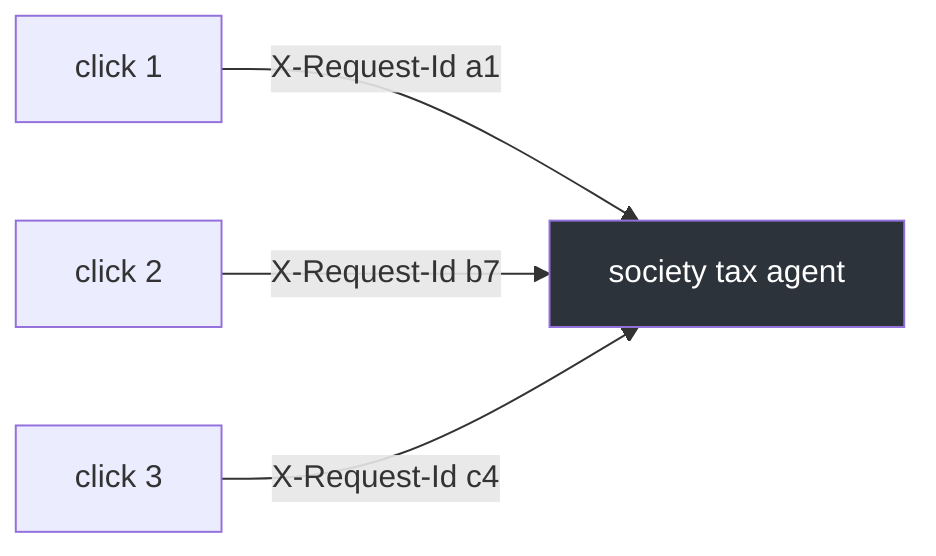
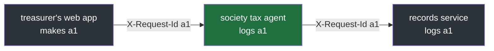

#ids #request-id #correlation #uuid

**A service answers many requests at the same time, and their log lines arrive mixed together.** A request ID in every line is what sorts them back out, and where that ID comes from decides whether it can follow a request beyond one service.

# One Request, One ID

## Lines from many requests interleave

Logging note 5 bound a `request_id` with context variables, so every line written during a request carries it, and logging note 6 wrote one line per request with it. The reason is concurrency: a service handles many requests at once, so the lines of request A sit between the lines of request B in the log. Without an ID in every line, nothing says which line belongs to which request. With one, a single query returns everything one request did.

That leaves the question this note answers: where does the ID come from?

## Use the caller's ID, or make one

A request can arrive already carrying an ID, in a header called `X-Request-Id`. The society tax agent uses that ID when it is safe, and makes a new one otherwise:

`src/ids_lab/note01/a_choose_request_id.py`:

```python
 1  import re
 2  import uuid
 3
 4  VALID_REQUEST_ID = re.compile(r"[A-Za-z0-9._:-]{1,128}")
 5
 6
 7  def choose_request_id(sent: str | None) -> str:
 8      if sent is not None and VALID_REQUEST_ID.fullmatch(sent):
 9          return sent
10      return str(uuid.uuid7())
11
12
13  for sent in ["abc-123", None, "not a valid id", "x" * 200, "abc\ninjected"]:
14      print(f"{sent!r:22.22} -> {choose_request_id(sent)}")
```

```
$ uv run python src/ids_lab/note01/a_choose_request_id.py
'abc-123'              -> abc-123
None                   -> 01a11acf-f214-71bb-8a66-4345511a99cc
'not a valid id'       -> 01a11acf-f214-71bb-8a66-43468a77c6ed
'xxxxxxxxxxxxxxxxxxxxx -> 01a11acf-f214-71bb-8a66-434799f89c68
'abc\ninjected'        -> 01a11acf-f214-71bb-8a66-43485bf0032b
```

| Header sent | Result | Why |
|---|---|---|
| `abc-123` | kept | valid |
| none | new ID | nothing to reuse |
| `not a valid id` | new ID | contains spaces |
| 200 `x` characters | new ID | longer than 128 |
| `abc`, a line break, `injected` | new ID | contains a line break |

| Line | Does |
|---|---|
| 4 | the allowed shape: 1 to 128 characters, each a letter, digit, `.`, `_`, `:` or `-` |
| 8 | a header was sent and the whole of it fits that shape |
| 9 | reuse it |
| 10 | otherwise make a new one |

A new ID is a **UUIDv7**: a random 128-bit ID whose first part is the time it was made, so IDs sort in creation order. The four new IDs above share their first characters for exactly that reason: they were made within the same millisecond or so. Python 3.14 has `uuid.uuid7()` in its standard library; Python 3.13 does not, so a service on 3.13 uses a package such as `uuid-utils`.

## Check a header before trusting it

A header comes from outside the service, and anyone can send anything in it. Whatever is accepted is copied into every log line of that request and into the response's `X-Request-Id` header. A million characters would bloat every line; a line break followed by text shaped like a log line would forge a line in the log. So the value must match a fixed shape, and the whole value, not just its start:

`src/ids_lab/note01/b_match_or_fullmatch.py`:

```python
1  import re
2
3  VALID_REQUEST_ID = re.compile(r"[A-Za-z0-9._:-]{1,128}")
4
5  print("match:    ", VALID_REQUEST_ID.match("abc def"))
6  print("fullmatch:", VALID_REQUEST_ID.fullmatch("abc def"))
```

```
$ uv run python src/ids_lab/note01/b_match_or_fullmatch.py
match:     <re.Match object; span=(0, 3), match='abc'>
fullmatch: None
```

`match` succeeds as soon as the start of the text fits, here `abc`, and ignores the rest. `fullmatch` succeeds only when the entire text fits, so the space rejects it.

> [!important] Never trust an incoming ID unchecked
> A request ID from a header ends up in every log line and in the response. Accept it only if the whole value matches a short, fixed set of characters; otherwise make a new one.

## The caller makes a new ID for every call

The caller is whatever made the HTTP request: the treasurer's web app in a browser, or another service. It makes a **new** ID for each request it sends, not one per user. A treasurer who clicks five buttons sends five requests with five different IDs:



Grouping many requests by who made them needs a different ID, one whose scope is the user or the session; note 2 places those.

## One ID across every service

Reusing the caller's ID matters when one click passes through several services. The treasurer's click goes to the society tax agent, which calls the society's records service, the source of truth for every flat and payment:



Every service reuses the same `a1`, so one query for it finds that click in all three. An ID used this way, made once at the start and carried unchanged through every service, is called a **correlation ID**. Had the agent made its own new ID instead, the records service's lines and the agent's lines for the same click would share nothing.

It works only if all of these hold:

| # | Condition |
|---|---|
| 1 | the first caller makes an ID for every request and sends it |
| 2 | every service reuses an incoming ID rather than replacing it |
| 3 | every service forwards it on every call it makes |
| 4 | every service writes it into its own log lines |
| 5 | all services log into the same log store, under the same field name |

When they hold, one query returns every line of the click from every service, in time order: what was asked, what the agent did, what the records service did.

What a correlation ID cannot show is **timing and shape**: which service called which, and which of two calls was the slow one. That needs spans, in note 3.

> [!important] A correlation ID finds, it does not explain
> One ID, made once and reused by every service, finds every line of one click everywhere. It does not show who called whom or where the time went.

---

> **Recall:** Why does a service need a request ID in every line? · When is the caller's ID reused, and when is a new one made? · What is a UUIDv7, and why does it sort? · What could an unchecked header do, and why `fullmatch` rather than `match`? · Does a caller send one ID per user or per request? · What is a correlation ID, and what five conditions must hold for it to work across services? · What can it not show?
