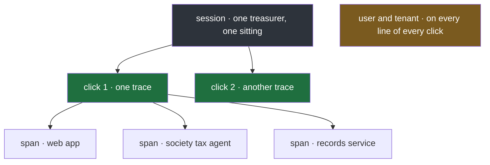

#ids #tracing #session #tenant #idempotency

**Production services carry many kinds of ID, and they are easy to confuse until each is placed by its scope.** The scope of an ID is the set of work over which it stays the same: one call, one operation across services, one user, one customer.

# Many IDs, Many Scopes

## IDs for following one request

| ID | Stays the same for | How it travels | In production |
|---|---|---|---|
| **request ID**, or correlation ID | one request, reused as-is by every service it passes through | the `X-Request-Id` header, a widely used convention rather than a formal standard | Heroku's router makes one for every incoming request and passes it to the app as `X-Request-ID`, so router logs and app logs for the same request can be matched |
| **trace ID** | every hop of one operation, across all services | the trace-id part of the W3C `traceparent` header | W3C Trace Context defines it as the ID that identifies a whole distributed trace; OpenTelemetry log records carry it as `TraceId` |
| **span ID** | one hop, one piece of work | the parent-id part of `traceparent`, which W3C defines as the ID of this request as known by the caller | OpenTelemetry log records carry it as `SpanId` |
| **vendor trace header** | the same idea, in one cloud's format | for AWS, `X-Amzn-Trace-Id: Root=1-67891233-abcdef012345678912345678` | AWS's load balancer adds or updates it on every request: `Root` is the trace, `Self` the current hop |

Note 3 separates the first three properly; they look alike until spans are in the picture.

## IDs for grouping requests by who made them

| ID | Stays the same for | Comes from |
|---|---|---|
| **session ID** | everything one user does in one sitting, such as five clicks in a row | the web app or the sign-in system, sent with every call |
| **user ID** | everything one user ever does | the auth token, after sign-in |
| **tenant ID** | everything one customer organisation does | the auth token; for the society tax agent, the society |
| **baggage** | any such values, carried across services together | the W3C `baggage` header, defined as user-defined properties associated with a distributed request, for example `userId=alice` |

## IDs with a different job

These appear in logs too, but they are not for following requests:

| ID | Job |
|---|---|
| **idempotency key** | makes a retry safe. The client makes a key and sends it with a request that changes something; per Stripe's documentation, the server saves the first result for that key and returns it to any repeat, so a request retried after a dropped connection is not performed twice |
| **job ID** | names one piece of background work, which has no HTTP request and so no request ID |
| **message ID** | names one message on a queue, so a consumer can recognise one it has already handled |
| **business IDs** | the domain's own IDs, for the society tax agent a flat, a payment such as `P-101`, a tax receipt; logged as named values so they can be searched |

> [!important] An idempotency key is not a tracing ID
> It exists so that doing something twice has the effect of doing it once. That its value also identifies a request is incidental.

## How the scopes nest

A session holds many clicks; each click is one trace, made of one span per service; the request ID, where one is used, has the same scope as the trace. The user and tenant IDs cut across all of it, which is what lets a query ask for everything one treasurer, or one society, did.

> [!info] Choosing comes later
> This note only places the IDs. Which of them the society tax agent needs is note 4.

---

> **Recall:** What is an ID's scope? · Which IDs follow one request, and which group requests by who made them? · What does baggage carry? · What does an idempotency key protect against, and why is it not a tracing ID? · Why does a background job need its own ID? · How do session, trace and span nest?
