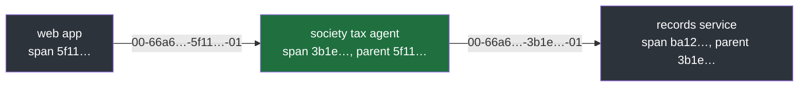

#ids #tracing #spans #traceparent

**A trace ID and a request ID do the same job: one value, the same in every service a click passes through.** What makes tracing more than a label is the span ID, which is different for every piece of work and records what started it.

# Traces And Spans

## A trace ID is a request ID in a standard format

A **trace ID** stays the same across every hop of one operation, exactly like the request ID of note 1. The difference is the format. A request ID can look like anything; a trace ID follows W3C Trace Context, 32 hexadecimal characters carried in a header named `traceparent`, so every tracing tool can read it.

## A request ID cannot show where the time went

One click through the three services, where the records service also calls the bank twice. With a request ID only, every line carries the same label and nothing else:

```
web app             request_id=R1   submit clicked
society tax agent   request_id=R1   filing started
records service     request_id=R1   calling bank
records service     request_id=R1   calling bank
records service     request_id=R1   bank answered
```

Every line can be found, but nothing says which bank call was slow, or which service called which.

## Spans give each piece of work an ID, a parent and a duration

A **span** is one piece of work. It has its own **span ID**, the span ID of its **parent**, the span that started it, and its own start and end time. The same click, as spans, with illustrative timings:

```
trace T1, the same in every span

span A   web app             parent none   0 ms ──────────────────────── 2400 ms
span B   society tax agent   parent A        20 ms ────────────────────── 2380 ms
span C   records service     parent B          40 ms ──────────────────── 2350 ms
span D   bank call 1         parent C            60 ms ── 160 ms
span E   bank call 2         parent C                       170 ms ─────── 2300 ms
```

The parents turn the spans into a tree, and the times turn the tree into a **waterfall**, the view tracing tools draw. Bank call 2 took over two seconds, and the waterfall shows it at a glance.

| ID | Same or different at each hop | Adds |
|---|---|---|
| request ID | same | a label to find every line |
| trace ID | same | the same label, in a format every tracing tool reads |
| span ID | different for every piece of work | who called whom, and how long each took |
| vendor trace header | its root part is a trace ID, its self part the current hop | the same idea, in one cloud's format |

## Every span has its own ID, even siblings

The run below follows one click through the three services and the records service's two bank calls, printing every ID:

`src/ids_lab/note03/a_three_hops.py`, lines 4–14:

```python
 4  def new_trace_id() -> str:
 5      return secrets.token_hex(16)
 6
 7
 8  def new_span_id() -> str:
 9      return secrets.token_hex(8)
10
11
12  def read(traceparent: str) -> tuple[str, str]:
13      _version, trace_id, parent_span_id, _flags = traceparent.split("-")
14      return trace_id, parent_span_id
```

```
$ uv run python src/ids_lab/note03/a_three_hops.py
web app            span 5f1140ad00a634ce  parent -
  sends traceparent: 00-66a69430577cc4f0a9fdc947e11e44c8-5f1140ad00a634ce-01
society tax agent  span 3b1e7c8b0d9063ef  parent 5f1140ad00a634ce
  sends traceparent: 00-66a69430577cc4f0a9fdc947e11e44c8-3b1e7c8b0d9063ef-01
records service    span ba129274a746fcfd  parent 3b1e7c8b0d9063ef
  bank call 1      span ecfdcfe85c48bc26  parent ba129274a746fcfd
  bank call 2      span 577530c289bea633  parent ba129274a746fcfd
```

The two bank calls are **siblings**: the same parent, `ba129274a746fcfd`, and different span IDs. If they shared an ID, their times would merge and nothing could say that one of them was slow.

> [!important] Three rules
> One trace ID per operation, shared by every span. One span ID per piece of work, never shared. One parent span ID per span, pointing at the span that started it, so siblings share it.

## The trace ID is copied at every hop

`traceparent` carries the trace ID and the sender's span ID together, in one value: a version, the trace ID, the span ID, and flags, joined by `-`. In the run above, each service does the same three things:

| Step | Does |
|---|---|
| read | takes the incoming trace ID unchanged, and the sender's span ID as its parent |
| make | creates its own new span ID |
| send | passes on the same trace ID with its own span ID |



Only the span part of the header changes from hop to hop; the trace part, `66a69430577cc4f0a9fdc947e11e44c8`, is copied each time, which is how it reaches the last service intact.

## Without spans, a trace ID is only a label

A trace ID alone does what a request ID does. The spans, with their parents and their times, are what tracing is built on, and producing them, with OpenTelemetry, sampling and a tracing backend, is the subject of `02-Observability`. A correlation ID now and spans later fit together: the correlation ID finds every line today, and a trace ID can take its place when spans arrive.

---

> **Recall:** What does a trace ID add over a request ID? · What three things does a span record besides its name? · Which field turns spans into a tree, and what turns the tree into a waterfall? · Can two spans share an ID? Can they share a parent? · What does `traceparent` carry, and what changes at each hop? · What is a trace ID without spans?
