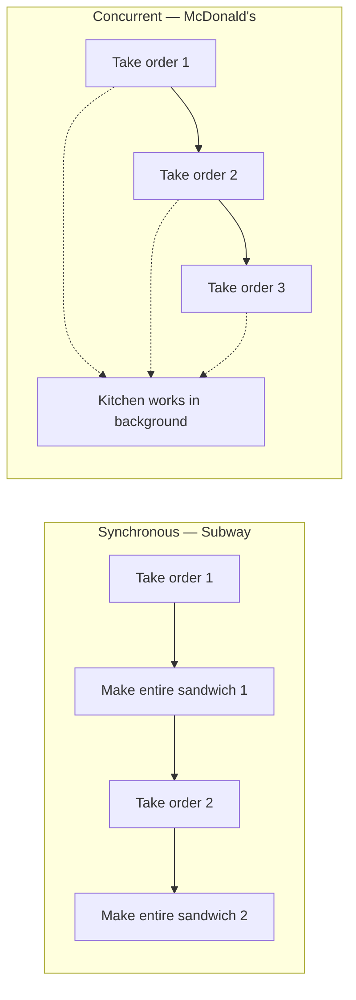
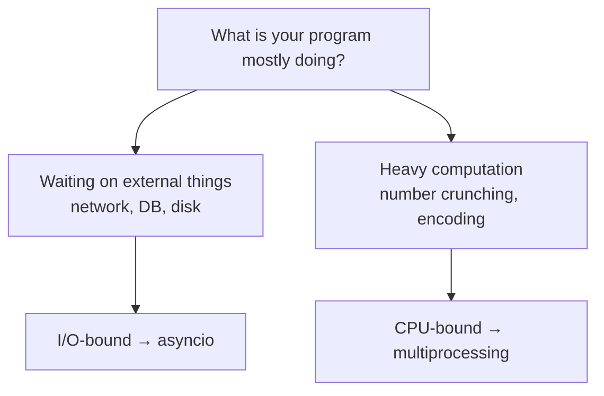

AsyncIO is Python's built-in library for writing **concurrent** code using the `async` / `await` syntax. It has a reputation for being intimidating — lots of terminology, lots of moving parts — but the core idea fits in one sentence: *stop sitting idle while you wait for slow things.*

Everything else is machinery for making that one idea work.

---

## Synchronous vs concurrent — the sandwich shops

The code we normally write is **synchronous**: one thing happens after another, each step running to completion before the next begins.

Think of a Subway restaurant. You place your order, and the person behind the counter makes your **entire sandwich from start to finish** — bread, fillings, toasting, wrapping — before they even look at the next customer. The queue moves exactly as fast as one complete sandwich at a time.

**Concurrent** code is a McDonald's. Someone takes your order and immediately **moves on to the next customer** while your food is being made in the background by someone (or something) else. Orders overlap. Nobody stands around watching a burger cook.

The confusion starts when people map this onto code, because of one persistent myth:

> [!danger] **Asynchronous does not automatically mean faster.** Async doesn't speed anything up by itself — it just means that while you're *waiting* on something slow (a network request, a database query, a file read), your program can do **other useful work** instead of sitting idle. If there's nothing to wait on, async buys you nothing.

The proof shows up immediately in real numbers: a script that fetches two things taking 1 second and 2 seconds runs in **3 seconds synchronously** (1 + 2, one after the other) and **2 seconds concurrently** (both waits overlap, total time = the longest single wait). The waiting is the only thing that shrank. The work didn't get faster — the *idle time* got reused. That worked example is the whole of the next-but-one note.

---

## I/O-bound vs CPU-bound — where async wins and where it loses

Because async's entire value is *reusing waiting time*, it only helps when your program actually waits. That gives us the dividing line:

- **I/O-bound tasks** — the program is waiting for something *external*: a network response, a database query, a file on disk. The CPU is idle during that wait. **This is asyncio's home turf.**
- **CPU-bound tasks** — the program is doing heavy computation. There is no waiting to reuse; the CPU is the bottleneck. For these you want **processes** (multiprocessing), not asyncio.

Why can't asyncio help with CPU-bound work? Because of *how* it achieves concurrency:

> [!info] AsyncIO is **single-threaded** and runs in a **single process**. It uses **cooperative multitasking** — tasks *voluntarily* give up control when they hit a wait, and the event loop hands the thread to whoever is ready to run. Nothing runs in parallel; things take turns *during each other's waits*.

That word *cooperative* is load-bearing. There's no scheduler forcibly interrupting tasks (the way the OS interrupts threads). A task keeps the single thread until it reaches a point where it explicitly says "I'm waiting now, someone else can go." If a task never says that — because it's crunching numbers, not waiting — every other task is stuck behind it. One greedy cook in the McDonald's kitchen and the whole restaurant stops.

---

## What this buys you — and what it doesn't

**What async gives you:**

- Overlapped waiting — total time collapses toward the *longest single wait* instead of the *sum of all waits*
- Massive connection counts on one thread — no per-thread memory cost, no thread-switching overhead
- No race conditions *between* awaits — only one task runs at any instant

**What it doesn't give you:**

- Faster computation — a single thread crunches numbers exactly as fast as before
- Parallelism — two things are never executing at the same moment; they *take turns during waits*
- Free speedups for synchronous code — libraries must be written for asyncio to participate (why is the subject of the next note)

> [!tip] Interview framing: "AsyncIO is single-threaded cooperative multitasking: tasks voluntarily yield control while waiting on I/O, and the event loop runs whoever's ready. So it shines for I/O-bound work — overlapping thousands of network waits on one thread — and does nothing for CPU-bound work, where I'd reach for multiprocessing instead. And async isn't automatically faster: it only wins when there's idle waiting to reclaim."

Before any of that machinery makes sense in code, there's a vocabulary to learn — event loops, awaitables, coroutines, tasks, futures. That's next.
