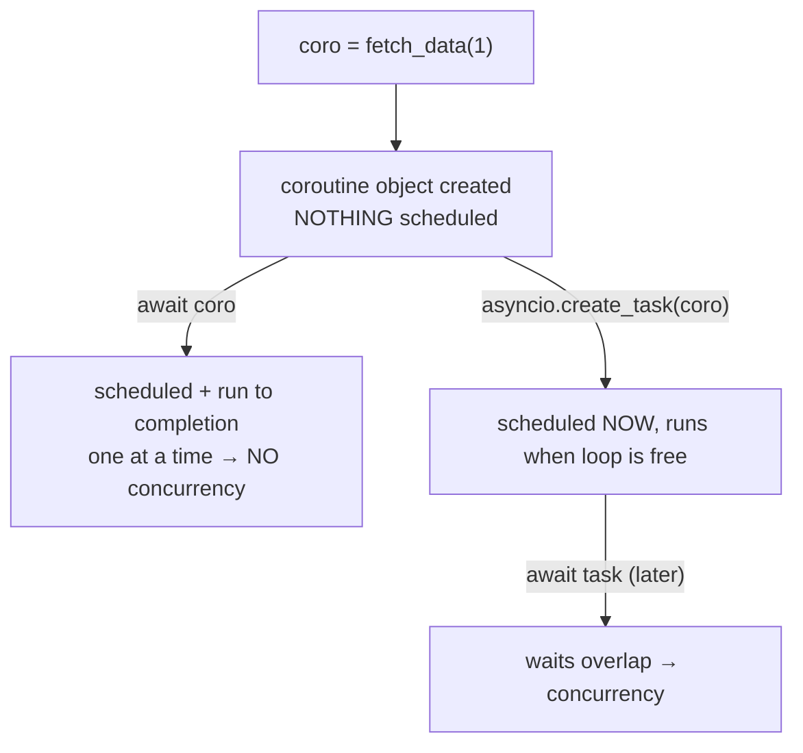

The vocabulary note ended on a warning: awaiting a coroutine directly means *scheduled and run to completion in one step*, while a task can *sit scheduled and wait its turn*. This note is that warning played out in code — the same little program written three ways, with real timings: **3.00 seconds, 3.00 seconds, 2.00 seconds**. The middle one is the trap: it uses `async`/`await` everywhere, it looks asynchronous, and it gets **zero concurrency**.

All three versions share the same shape: a `fetch_data(param)` function that pretends to be a slow call by sleeping for `param` seconds, called once with `1` and once with `2`. The theoretical floor is obvious — if both waits overlap, total time should be `max(1, 2) = 2` seconds. If they don't, it's `1 + 2 = 3`.

Each version comes with an animation (from the video's companion site) that shows three columns: the **Python Thread** executing code, the **Event Loop** with every scheduled coroutine and its state (Running / Ready / Suspended / Complete), and **Background I/O** where sleeps and timers actually live:

![[AI-Engineering/Python-Async/Images/01-Animation-Layout-Three-Columns.png]]

---

## Version 1 — synchronous baseline: 3.00 seconds

```python
import time

def fetch_data(param):
    print(f"Do something with {param}...")
    time.sleep(param)
    print(f"Done with {param}")
    return f"Result of {param}"

def main():
    result1 = fetch_data(1)
    print("Fetch 1 fully completed")
    result2 = fetch_data(2)
    print("Fetch 2 fully completed")
    return [result1, result2]

results = main()
```

No asyncio anywhere — no event loop, no tasks. The output is exactly what synchronous execution predicts:

```
Do something with 1...
Done with 1
Fetch 1 fully completed
Do something with 2...
Done with 2
Fetch 2 fully completed
['Result of 1', 'Result of 2']
Finished in 3.00 seconds
```

In the animation, the Event Loop column stays **empty for the whole run** — and look at where the program spends its life: parked on the `time.sleep` line while a blocking sleep runs in Background I/O. The Python thread does *nothing* for that entire second — it just stands there holding the sleep:

![[AI-Engineering/Python-Async/Images/02-Sync-Blocking-Sleep.png]]

Then the same thing again for two more seconds on the second call. **1 + 2 = 3 seconds**, of which almost all is idle waiting. That idle time is what we're trying to reclaim.

---

## Version 2 — the trap: async everywhere, still 3.00 seconds

Here's what a first attempt at converting this code usually looks like. Functions become coroutines (`async def`), `time.sleep` becomes `await asyncio.sleep`, and an event loop runs `main()`:

```python
import asyncio

async def fetch_data(param):
    print(f"Do something with {param}...")
    await asyncio.sleep(param)
    print(f"Done with {param}")
    return f"Result of {param}"

async def main():
    task1 = fetch_data(1)   # ← looks like starting a task...
    task2 = fetch_data(2)   # ← ...but is only creating a coroutine object
    result1 = await task1
    print("Task 1 fully completed")
    result2 = await task2
    print("Task 2 fully completed")
    return [result1, result2]

results = asyncio.run(main())
```

Run it:

```
Do something with 1...
Done with 1
Task 1 fully completed

Do something with 2...
Done with 2
Task 2 fully completed

['Result of 1', 'Result of 2']

Finished in 3.00 seconds
```

**Still three seconds.** All that `async`/`await` bought exactly nothing.

> [!danger] The misconception: people assume `task1 = fetch_data(1)` creates a task and schedules it running in the background. It doesn't. Calling a coroutine function only **creates the coroutine object** — nothing is scheduled, nothing runs. The variable name `task1` in this code is a lie.

So where does the time actually go? Follow the animation. When `await task1` executes, two things happen *at once*: the coroutine finally gets scheduled on the loop, and `main()` suspends until it finishes:

![[AI-Engineering/Python-Async/Images/03-Await-Schedules-And-Suspends.png]]

`fetch_data(1)` runs, hits its own `await asyncio.sleep(1)`, kicks off a timer in Background I/O, and suspends. And now look at the picture — this is the whole story in one frame:

![[AI-Engineering/Python-Async/Images/04-One-Timer-No-Concurrency.png]]

**One timer.** `main()` is suspended waiting on `fetch_data(1)`; `fetch_data(1)` is suspended waiting on its sleep; and `fetch_data(2)` is nowhere — it doesn't exist on the loop yet, because nothing scheduled it. The event loop scans for ready tasks and finds none. It has all this idle waiting time and **no other task to spend it on**.

Only after the timer fires does `fetch_data(1)` resume and complete; only then does `main()` wake, print, and reach `await task2` — which *now* schedules the second coroutine and runs *it* to completion, second timer, second sequential wait. One task at a time, every time: `1 + 2 = 3` seconds. The same performance as the synchronous version, with extra machinery.

> [!important] Awaiting coroutine objects directly serialises them: each one is scheduled *and driven to completion* inside its own `await`, so at any moment the loop only ever knows about one piece of work. Concurrency requires work to be **queued before you start waiting** — and that's exactly what this code never does.

---

## Version 3 — the fix: `asyncio.create_task`, 2.00 seconds

One change from Version 2 — wrap the coroutines in tasks:

```python
async def main():
    task1 = asyncio.create_task(fetch_data(1))
    task2 = asyncio.create_task(fetch_data(2))
    result1 = await task1
    print("Task 1 fully completed")
    result2 = await task2
    print("Task 2 fully completed")
    return [result1, result2]
```

```
Do something with 1...
Do something with 2...
Done with 1

Task 1 fully completed
Done with 2
Task 2 fully completed

['Result of 1', 'Result of 2']

Finished in 2.00 seconds
```

Read the first two lines of that output: **both fetches started before either finished.** And the clock: **2.00 seconds — `max(1, 2)`,** the time of the longest single wait. That's concurrency.

The animation shows why. `create_task` **schedules immediately, without suspending anything** — after the two `create_task` lines, `main()` is *still running* and both `fetch_data` tasks sit on the loop as Ready. This is the state Version 2 could never reach — work queued up *before* any waiting begins:

![[AI-Engineering/Python-Async/Images/05-Create-Task-Both-Ready-Main-Running.png]]

Now `await task1` suspends `main()`, and the loop goes looking for ready work. It finds `fetch_data(1)`, runs it to its sleep, suspends it — **and keeps looking**. This time there's more in the queue: it finds `fetch_data(2)`, runs it to *its* sleep, suspends it too. The frame below is the payoff — the money shot of the whole video:

![[AI-Engineering/Python-Async/Images/06-Both-Timers-Running-Concurrency.png]]

**Two timers in Background I/O, ticking at the same time.** Every coroutine is suspended; the loop is idle; both waits overlap. The 1-second and 2-second sleeps are being served *simultaneously* on a single thread.

From here it unwinds by wake-ups: the 1-second timer fires first, `fetch_data(1)` resumes, prints, returns, completes — while the 2-second timer is *still running in the background*:

![[AI-Engineering/Python-Async/Images/07-Task1-Complete-Timer2-Still-Running.png]]

Task 1's completion wakes `main()` (it was awaiting exactly that), which prints and moves to `await task2` — where there's nothing to do but wait for the second timer, most of which has *already elapsed*. Timer fires, `fetch_data(2)` completes, `main()` finishes. Total wall time: the longest wait, not the sum.

---

## The rule this leaves behind



**What Version 3 guarantees:** all scheduled waits overlap; total time collapses to the longest individual wait; work starts the moment the loop first gets control — even before you await anything.

**What it doesn't guarantee:** speedups without waits (this program was *pure* waiting — real code interleaves compute, which still runs one-at-a-time), and no protection if something inside a task blocks synchronously — a stray `time.sleep` instead of `asyncio.sleep` would hold the whole single thread hostage, timers or no timers.

> [!tip] Interview framing: "The classic asyncio mistake is awaiting coroutines directly — `await fetch()` schedules and runs each call to completion inside the await, so calls serialise and you get sync performance with async syntax. The fix is to schedule first, await after: `create_task` puts work on the loop *without* suspending, so when the first task hits its I/O wait, the loop already has the next task queued and the waits overlap. Two fetches of 1s and 2s: 3 seconds awaited directly, 2 seconds — max, not sum — as tasks."
