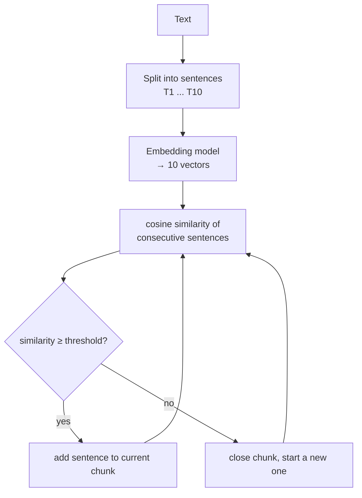

Every splitter so far — character, recursive, structure-based — decides where to cut by looking at **formatting**: a newline, a heading, a `def`, a nesting level. None of them ever reads the text. And that produces a very specific failure: a document where the *topic* changes without the *formatting* changing.

Take the course's demo text. Twelve sentences in one flat block: four about artificial intelligence, then four about pasta recipes (carbonara, guanciale, al dente), then four about climate change. No blank lines, no headings — just sentence after sentence. To every splitter you've met, this is one homogeneous slab; a `chunk_size` cut will happily produce a chunk that's half neural networks, half pasta. The embedding of that chunk represents neither topic well, so it matches neither an AI query nor a cooking query — retrieval quality dies precisely because the chunk has no single meaning.

What you actually want to say is: *cut where the meaning changes.* That's **semantic chunking** — chunks based on what the text means, not how it's formatted.

---

## How it works — sentences, embeddings, and a threshold

Semantic chunking builds chunks by measuring how similar consecutive sentences are *in meaning*, and starting a new chunk wherever the similarity dips. Step by step, with the course's worked example of a 10-sentence text:

**Step 1 — split into sentences.** The text becomes 10 pieces: T1, T2, … T10. This is the finest unit the algorithm thinks in.

**Step 2 — embed every sentence.** You can't compare the *meaning* of two raw strings — text has no arithmetic. So all 10 sentences go to an **embedding model**, which returns 10 **embedding vectors**: sets of numbers that hold the semantic meaning of each sentence in numeric form. (This is the same idea you'll meet full-depth in the embeddings module — for now: similar meaning ⇒ similar numbers.)

**Step 3 — compare consecutive sentences with cosine similarity.** Picture the vectors as arrows in space. The **cosine similarity** of two vectors measures the angle between them, and ranges from **−1 to 1**: 1 means highly similar meaning, 0 means unrelated, −1 means completely opposite. Two sentences about machine learning point in nearly the same direction; a sentence about ML and one about pasta point far apart.

**Step 4 — club or cut against a threshold.** Fix a threshold, say **0.5**, then walk the sentences in order:

```
similarity(T1, T2) = 0.7   → above 0.5  → club: chunk C1 = [T1, T2]
similarity(T2, T3) = 0.85  → above 0.5  → club: C1 = [T1, T2, T3]
similarity(T3, T4) = 0.1   → BELOW 0.5  → cut! C1 closes; T4 starts C2
similarity(T4, T5) = 0.6   → above 0.5  → club: C2 = [T4, T5]
...similarity dips again at T6 → C3 = [T6, T7, T8, T9]
...dips again at T10          → C4 = [T10]
```

Keep adding sentences to the current chunk **as long as they remain semantically similar**; the moment the similarity score dips below the threshold, close the chunk and start a new one. The result: C1's three sentences all carry the same meaning — that's exactly what made them a chunk.



> [!info] Notice what's *absent*: `chunk_size`. Semantic chunking doesn't care how long a chunk is — C3 got four sentences, C4 got one. The only thing that matters is that everything inside a chunk shares one semantic meaning. Chunk boundaries land where topics change, wherever that happens to be.

---

## The code — `SemanticChunker`

The implementation lives in **`langchain_experimental`** — not the main package (that word "experimental" is foreshadowing) — and needs a real embedding model, here OpenAI's, hence the API key via `.env`:

```python
from langchain_experimental.text_splitter import SemanticChunker
from langchain_openai import OpenAIEmbeddings
from dotenv import load_dotenv

load_dotenv()

chunker = SemanticChunker(
    embeddings=OpenAIEmbeddings(),
    breakpoint_threshold_type="standard_deviation",
    breakpoint_threshold_amount=0.1
)

chunks = chunker.split_text(text)   # the 12-sentence AI/pasta/climate text
```

Two knobs replace `chunk_size`:

- **`breakpoint_threshold_type`** — *how* "a dip in similarity" is defined. You don't hand-pick a raw 0.5; the chunker computes the similarity dips statistically. `"percentile"` (the default) cuts at the largest dips relative to the distribution; `"standard_deviation"` cuts where the dip is more than N standard deviations from the mean — a more sensitive setting.
- **`breakpoint_threshold_amount`** — *how big* a dip must be to trigger a cut.

---

## The honest result — it's not magic yet

The clean story says: three topics in, three chunks out. The live run said otherwise. On the first attempt the chunker produced **one single chunk** — it didn't split at all; twelve sentences about AI, pasta, and climate came back as one blob. Only after tuning `breakpoint_threshold_amount` down to `0.1` did it start cutting, and even then imperfectly: one chunk mixed **AI *and* pasta** together, with the cut landing inside the climate section instead of at the real topic boundaries.

> [!danger] This is the gap between the algorithm on the whiteboard and the library in production. The mechanism is exactly as described — but where the cuts actually land depends heavily on the embedding model's judgment and on threshold tuning. The class living in `langchain_experimental` is the library telling you the same thing: promising idea, not yet a dependable default. Expect to tune, and expect surprises.

---

## Where semantic chunking stands

**What it guarantees:** every chunk is built *from meaning* — sentences that belong together semantically end up together, regardless of formatting. When it works, retrieval quality improves for exactly the reason the formatting-based splitters fail: each chunk's embedding represents one coherent topic.

**What it doesn't guarantee:**

- **Cheap operation.** Every single sentence must be embedded *before* any splitting happens — for a big corpus that's a separate embedding call per sentence, and with a paid embedding model, real API cost. The character and recursive splitters cost essentially nothing; this one has a bill.
- **Predictable chunk sizes.** You cannot know in advance how long any chunk will be — a chunk is as long as the topic runs. Downstream systems that assume bounded chunk lengths (context budgeting, batching) lose that assumption.
- **Correct boundaries.** As the live run showed: thresholds need tuning, and even tuned, cuts can land badly.

> [!tip] Interview framing: "Semantic chunking splits on meaning instead of formatting: embed each sentence, walk pairwise cosine similarity, and cut where similarity dips below a threshold — so chunk boundaries align with topic changes, and chunk size is whatever the topic needs. The trade-offs I'd flag: it's computationally expensive since every sentence gets embedded up front, chunk sizes become unpredictable, and in practice the implementations are still experimental — LangChain literally ships it in `langchain_experimental` — so it needs threshold tuning and evaluation before I'd trust it over a recursive splitter."

There's one more way to cut on meaning, though. The weakness above traces back to *how* the meaning is judged — pairwise similarity of adjacent sentences is a very local, mechanical view of "topic." If you had a judge that actually *reads the whole document* and understands where topics begin and end… you do. It's called an LLM.
