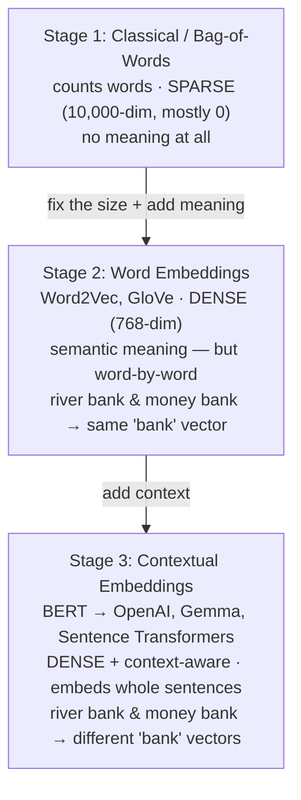

Classical bag-of-words gave us numbers, but the wrong kind: vectors as long as the whole vocabulary, mostly zeros, and carrying word *counts* rather than word *meaning*. Fixing both of those is the story of the next two stages — and they arrive in that order, because the fix for size came first and the fix for meaning came last.

---

## Stage 2 — word embeddings: dense, and finally about meaning

The second generation of techniques is **word embeddings**. The two names to know are **Word2Vec** and **GloVe** (short for *Global Vectors*). Where classical methods were built on plain counting — really a machine-learning-era idea — word embeddings are a **deep-learning-based** technique. A neural network is trained on huge amounts of text and learns, for each word, a vector that captures something about that word's meaning.

The first thing that changes is the shape of the vector. Word2Vec represents each word as a vector of **768 numbers**. Compare that to the 10,000-plus of a bag-of-words vector — it is dramatically smaller. And crucially, those 768 numbers are not mostly zero. Every position holds a real, non-zero value. A vector that is small and full is called a **dense vector**, the opposite of the sparse vectors from stage one.

> [!info] Sparse vs dense. A **sparse** vector is long and mostly zeros (bag-of-words: 10,000 dimensions, a few non-zero). A **dense** vector is short and every dimension carries information (Word2Vec: 768 dimensions, all non-zero). Going from sparse to dense is the headline upgrade of word embeddings.

That single change buys two concrete wins:

- **Reduced dimensionality → fewer calculations.** Similarity is computed element-wise across the vector. At 768 dimensions you do 768 operations per comparison instead of 10,000 — the work shrinks by more than an order of magnitude, and none of it is the wasted `× 0` kind.
- **Every feature holds information.** All 768 dimensions are non-zero and meaningful, so you are storing a genuinely rich description of the word in a fraction of the space.

And unlike counting, word embeddings actually capture **semantic meaning** — the network places words with related meanings near each other. This is the real leap: numbers that mean something.

---

## What "semantic meaning" actually is — and what it buys RAG

Be precise about the word *semantic*, because it's easy to blur. Semantic meaning is the meaning of a **word on its own**, and its concrete payoff is this: **two *different* words that mean related things land near each other** in the space.

```
login  ≈  password  ≈  username  ≈  sign-in     (different words, one topic — all nearby)
cat    ≈  kitten    ≈  pet                        (different words, related meaning)
```

That is a genuine leap for retrieval, and you can see it best against what it replaces. Bag-of-words could only match **identical** words. So a query `login issue in app` against a chunk about `password recovery` — which share **no words at all** — scored a flat zero under bag-of-words. Dead, despite being obviously about the same thing:

```
Query:  "login issue in app"
Chunk:  "password recovery"      ← zero shared words

bag-of-words  →  similarity 0    (no word overlap — invisible to counting)
word embeddings → real similarity (login ≈ password: related meaning)
```

Word embeddings know `login` and `password` *mean* related things, so the query and chunk now show real similarity **with no shared words**. This word-level semantic meaning is exactly what lets RAG retrieve a chunk that talks *around* a topic instead of parroting the query. Stage two handles "**different words, similar meaning**" — and that alone is most of why we left bag-of-words behind.

---

## The crack in word embeddings — one word, one vector, forever

There is a catch hiding in the name: *word* embeddings work **word by word.** Each word is embedded on its own, independently of the words around it. That sounds harmless until you watch it handle a word that means different things in different company.

Take two phrases, `river bank` and `money bank`:

![[AI-Engineering/RAG/03-Embeddings/Images/02-Word-Embeddings-Bank.png]]

In `river bank`, `river` gets its own embedding `E1` and `bank` gets `E2` — here `bank` means the edge of a river, a *location*. Now `money bank`: `money` gets some embedding `E3`, and `bank`… gets `E2` **again** — the very same vector, even though here `bank` means a financial *institution*. The model embedded `bank` without ever looking at whether it sat next to `river` or `money`. One word, one fixed vector, no matter what it means in the sentence.

> [!danger] The one line to hold onto — the exact boundary of stage two:
> - **Different words, similar meaning → captured.** `login` ≈ `password` sit near each other. ✅
> - **Same word, different meaning by context → NOT captured.** `bank` in `river bank` vs `money bank` gets one shared vector. ❌
>
> Word embeddings capture **semantic** meaning (word-level, fixed) but lose **contextual** meaning (sense decided by neighbours). Different-words-same-meaning: yes. Same-word-different-meaning: no.

## Why that gap matters for RAG

You might shrug at `bank` — but a word's sense in RAG constantly depends on its sentence, and the isolation blinds word embeddings in two ways that hurt retrieval:

- **Wrong-sense matches.** A user asks about their *bank account*; a chunk describes a *river bank* bursting its edges. Word embeddings handed `bank` the **same** vector both times, so the finance query can be dragged toward the geography chunk — a false match born purely from a shared word that was never read in context.
- **Meaning lives in whole phrases, not lone words.** `password recovery` *as a phrase* means "a login problem" — but that meaning is in the two words **together**, not in `password` or `recovery` alone. Because word embeddings embed each word separately, they get you the semantic *nearness* (from the last section) but never form the phrase's overall intent. They read a bag of related words, not a single thought.

Both problems have the same root — no awareness of context — and the same fix: read the words **together**, in context. That is stage three.

---

## Stage 3 — contextual embeddings: the same word, read in context

The third and current stage is **contextual embeddings**, also called **context-aware embeddings**. Like word embeddings they hand back dense vectors — but these vectors carry the *contextual* meaning of the text. The embedding of a word now depends on the words around it.

Run the same example again. Under contextual embeddings, `money bank` and `river bank` no longer collide:

```
money bank  →  bank embedded as E1   (context: finance)
river bank  →  bank embedded as E2   (context: geography)
                     E1 ≠ E2 — completely separate
```

The model looks at the whole phrase, notices which sense of `bank` is in play, and produces a different vector for each. Context that stage two discarded is now encoded into the numbers.

There is a second, quieter upgrade: contextual models don't stop at single words. They embed **whole sentences and even whole paragraphs** into a vector. That matters for RAG, because the thing you actually want to embed is a *chunk*, not a word.

The names to know here: an early, famous example is **BERT**. The models you would reach for today are the **OpenAI embedding models**, **Gemma embedding models** (open-source), and **Sentence Transformers** (available from Hugging Face). These are what a modern RAG pipeline uses to turn each chunk — and each incoming query — into a context-aware dense vector.



> [!important] The three-stage arc in one breath: classical methods fixed *nothing about meaning* and gave sparse vectors; word embeddings made vectors **dense** and captured **semantic** meaning — *different words with similar meaning sit near each other* (`login` ≈ `password`) — but embedded each word in isolation, so they could not handle *one word meaning different things by context* (`bank`); contextual embeddings keep the dense vectors and add **context-awareness**, so the same word gets different vectors in different sentences — and they embed entire chunks, not just words. Modern RAG runs entirely on stage three.

**What contextual embeddings guarantee:** dense, context-aware vectors where meaning shifts with surrounding words, and whole chunks (not just words) can be embedded.
**What they don't guarantee:** that you can read the 768 (or 512, or 1536) dimensions and know what each one "means" — the features are learned by a deep network and are not human-labelled; you trust that similar text lands on similar vectors, which is what the next note is about.
