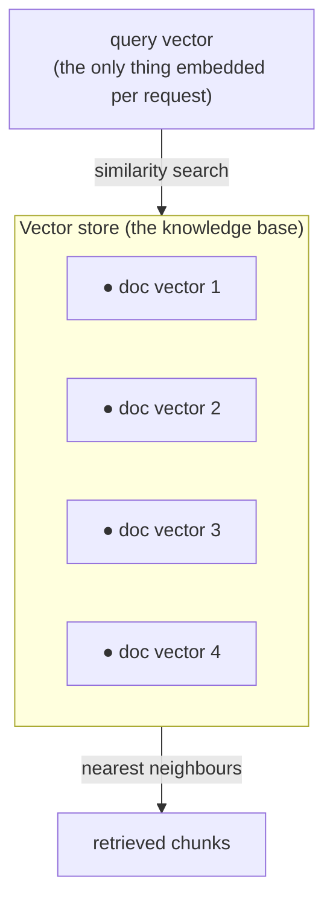
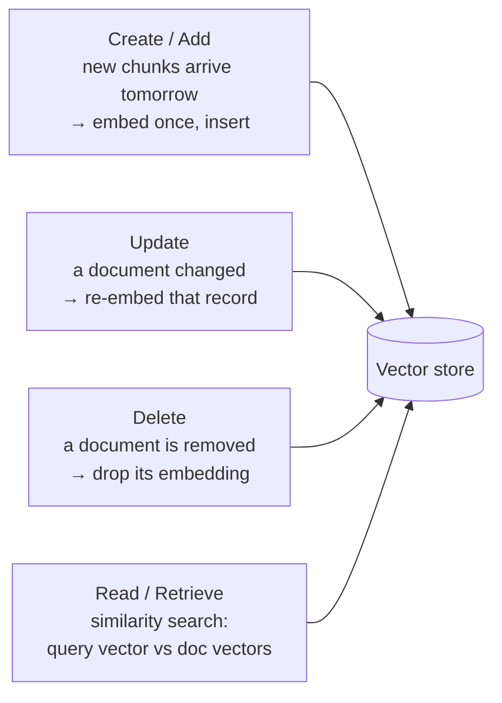

we can turn every chunk of our knowledge into a dense vector, and we can turn a user's question into a vector too — but *where do all those chunk-vectors actually live* so that a query can search them? That home is the fourth component of the RAG pipeline, and it goes by two names that mean the same thing: a **vector store** (LangChain's term) or a **vector database**.

---


## The problem that forces a vector store

Picture the naive version with no vector store at all. A query comes in. To search, you need the document vectors — so you load your documents, chunk them, and run all the chunks through the embedding model to produce their vectors, then compare. Fine. Then the *next* query comes in… and you do the whole thing again. And again, for every single query.

Re-embedding your entire corpus on every request is the mistake, and the numbers make it obvious. A real knowledge base isn't 30 chunks. Imagine a company that has dumped all its documents, policies, and product data in — that's easily **5 lakh (500,000) chunks**, and one to ten **million** is entirely normal.

![[AI-Engineering/RAG/04-Vector-Stores/Images/01-Why-Persist-Embeddings.png]]

Now walk it through: every query would push all 5 lakh chunks back through the embedding model to regenerate their vectors before you can even start searching. Running a deep-learning embedding model over half a million chunks is **costly** (it's real compute, and with a paid API it's a real bill) and **slow** — a genuinely **time-taking process**. You'd make the user wait minutes for work you *already did last query*. Reaching into a plain database to recompute them doesn't save you either; the recomputation is the expense.

The fix is the obvious one once you see the waste: the document embeddings never change, so **compute them once, save them, and reuse them forever.** You embed each chunk a single time, park the vector in persistent storage, and from then on every query just reads the stored vectors instead of rebuilding them. That persistent storage for embeddings *is* the vector store.

> [!important] A vector store exists to **persist embeddings so they're computed once, not per query.** 
> Document embeddings are fixed — the same chunk always produces the same vector — so re-embedding the whole corpus on every request is pure waste. 
> At 5 lakh–10 million chunks that waste is minutes of compute and real money per query. 
> The vector store embeds each chunk once, stores the vector, and serves it back on every future search. 
> Only the *query* still gets embedded live — and that's a single vector, not the whole corpus.

Notice what shrinks. With the store in place, per-query work drops from "embed 500,000 chunks" to "embed **1** query vector, then search." The heavy, repeated job is gone; only the cheap, unavoidable job remains.

---

## What a vector store actually is — a multi-dimensional space of persisted vectors

So concretely, a vector store is a place that holds your document embeddings and keeps them around. Picture each stored embedding as a green dot sitting in a space; the store is the box that holds all those dots and *persists* them — saves them to disk so they survive and can be reused, query after query. This is the component your RAG diagram labels the **knowledge base**.



The space those dots live in is **multi-dimensional**, and there's a precise answer to *how many* dimensions it has: exactly as many as your embedding vectors. If your embedding model produces 768-dimensional vectors, the store is a 768-dimensional space; 1536-dim vectors make a 1536-dimensional space.

![[AI-Engineering/RAG/04-Vector-Stores/Images/02-Multidimensional-Space.png]]

That isn't a coincidence, and the reason is the similarity search itself. To compare the query vector against a document vector with **dot product**, you multiply them **element-wise** — first number times first number, second times second, all the way down, then sum. That only works if both vectors line up slot-for-slot, which means they must have the **same dimensionality**. The query vector and the document vectors must live in a space of identical width, so the store's dimensionality is pinned to the embeddings' dimensionality.

> [!info] The vector store is a **multi-dimensional space whose dimensionality equals the embedding size.** 
> Document vectors are stored as points in that space,the query vector is dropped into the *same* space so it can be compared against them. 
> 
> They must share a dimensionality because dot-product / cosine similarity is an **element-wise** operation — position *i* of the query only compares against position *i* of the document, so the two vectors have to be the same length.

---

## It stores more than the vectors — text and metadata too

Here's the part that surprises people: a vector store does **not** hold only embeddings. The numbers alone are useless for the last step of RAG.

Think about what the vector is *for* versus what the rest of the pipeline needs. The embedding is a bundle of numbers — perfect for the **mathematical** side, the similarity search that finds the nearest chunks. But once you've found them, what do you feed the LLM? Not the numbers. The **augmentation** step — building the prompt that goes to the model — needs the **actual text** of those chunks. The LLM reads English, not a 768-dimensional vector.

![[AI-Engineering/RAG/04-Vector-Stores/Images/03-Stores-Text-And-Metadata.png]]

So each record in the vector store carries several things side by side:

```
one vector-store record
├── embedding        → the vector, used for the similarity-search math
├── document text    → the chunk's actual page_content, used to build the augmented prompt
├── metadata         → source, page, tags — the dictionary from the loader stage
└── id               → a handle to address this record (for update/delete)
```

That's why the metadata we carefully preserved back at the loader stage finally earns its keep: it rides along in the store, so at retrieval time you know not just *what* text matched but *where it came from* — and you can filter on it. The embedding is for **finding**; the text is for **augmenting**; the metadata is for **attribution and filtering**.

> [!important] A vector store record is **embedding + document text + metadata + id**, not just the embedding.
>  The embedding drives the similarity search (the math) 
>  
>  The **actual text** is what gets injected into the LLM prompt during augmentation (the model can't read vectors) 
>  
>  The metadata carries source/attribution and enables filtering. 
>  
>  Storing only the vectors would let you *find* the right chunk but leave you with nothing to *show* the model.

---

## What you can do to it — the CRUD operations

Because it's a store, it behaves like one — it supports the full set of create/read/update/delete operations, just specialised for vectors:



**Create/Add** is how the store grows over time — tomorrow more documents come in, and you just embed the new chunks once and insert them; you never re-touch the existing ones. 

**Delete** removes an embedding when its source document is gone. **Update** re-embeds a record whose text changed. And **Read/Retrieve** is the one you'll lean on most — the similarity search itself: take the query vector, search it against the stored document vectors, and return the nearest matches. 

---

## What it guarantees — and what it doesn't

**What a vector store gives you:**

- **Embed-once economics** — document vectors are computed a single time and reused on every query, so per-request work collapses from "re-embed the whole corpus" to "embed one query vector + search."
- **Fast nearest-neighbour search** in a multi-dimensional space, over hundreds of thousands to millions of vectors.
- **The full record, not just the vector** — the actual chunk text (for augmentation) and metadata (for attribution and filtering) sit alongside each embedding.
- **A living store** — add, update, and delete embeddings as your knowledge changes, without rebuilding everything.

**What it does not do:**

- **It doesn't embed your query for you conceptually** — you still run the query through the embedding model to get a query vector; the store just searches with it.
- **It isn't the retriever** — the store *supports* similarity search, but the polished retrieval logic (how many to fetch, filtering, re-ranking) is the next component.
- **It doesn't fix a bad embedding model** — if the vectors are low quality, nearest-neighbour search returns confidently wrong chunks. Garbage in, garbage out still holds.

> [!tip] Interview framing: "A vector store is the RAG pipeline's persistent home for document embeddings. Its whole reason to exist is *embed once, reuse forever* — 
> re-embedding a 500k-chunk corpus on every query would be slow and expensive, so you compute the vectors once and store them. 
> It is a multi-dimensional space whose dimensionality matches the embedding size (needed because similarity search is element-wise), and each record holds the embedding *plus* the original text and metadata — the vector for finding, the text for feeding the LLM during augmentation. It supports CRUD, and the read path is the similarity search that the retriever component builds on."

