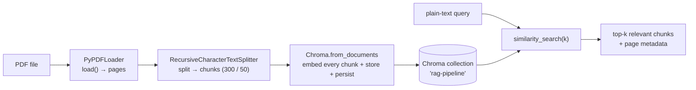

## The imports — every component in one place

The import block reads like a table of contents for the whole course so far:

```python
import os
from pathlib import Path

from dotenv import load_dotenv
from langchain_chroma import Chroma
from langchain_community.document_loaders import PyPDFLoader
from langchain_openai import OpenAIEmbeddings
from langchain_text_splitters import RecursiveCharacterTextSplitter
```

`PyPDFLoader` (the loaders module), `RecursiveCharacterTextSplitter` (the splitters module), `OpenAIEmbeddings` (the embeddings module), and `Chroma` (this module). Four components, four lines.

---

## Configuration — paths and a fresh collection

Resolve the project root, then lay out the paths: where the PDF lives, where Chroma should persist, and what to name the collection. Note the collection is a new one, `"rag-pipeline"`, separate from the `"demo_2"` collection of the CRUD notebook — the same database can hold many collections side by side.

```python
project_root = Path.cwd()
if project_root.name == "notebooks":
    project_root = project_root.parent

env_path = project_root / ".env"
pdf_path = project_root / "documents" / "beyond-chatbots-ai-agents-next-real-shift.pdf"
persist_directory = project_root / "notebooks" / "chroma_langchain_db"
collection_name = "rag-pipeline"
```

Load the API key (needed for embedding) and create the embedding model — the same `text-embedding-3-small` used throughout:

```python
load_dotenv(dotenv_path=env_path)

if not os.getenv("OPENAI_API_KEY"):
    raise ValueError("Please add your OPENAI_API_KEY to the .env file before running this notebook.")

embeddings = OpenAIEmbeddings(model="text-embedding-3-small")
```

---

## Step 1 — load the PDF

The loader turns a PDF file into `Document` objects, one per page, each with the page's text as `page_content` and page/source info as `metadata`:

```python
loader = PyPDFLoader(str(pdf_path))
docs = loader.load()

print(f"Total pages loaded: {len(docs)}")
```

`len(docs)` is the number of pages. Peek at the first one to see the shape you're working with:

```python
print(f"First page preview: {docs[0].page_content[:120]}")
print(f"First page metadata: {docs[0].metadata}")
```

The `page_content` is the raw text of page one, and the `metadata` carries things like the source filename and the page number — metadata that will ride along all the way into the store, exactly as note 01 described.

---

## Step 2 — split into chunks

A whole page is too big to embed as one unit (embedding compresses text, and a page holds too many distinct ideas to squeeze into one vector cleanly — the reasoning from the text-splitters module). So we cut the pages into overlapping chunks:

```python
text_splitter = RecursiveCharacterTextSplitter(
    chunk_size=300,
    chunk_overlap=50,
)

chunked_docs = text_splitter.split_documents(docs)

print(f"Total chunks created: {len(chunked_docs)}")
```

`chunk_size=300` caps each chunk's length; `chunk_overlap=50` repeats the last 50 characters of one chunk at the start of the next, so an idea straddling a boundary isn't cut in half. The page count (small) becomes a chunk count (much larger) — those chunks are what actually get embedded and searched.

---

## Step 3 — embed and store in one call

In the CRUD note we built the store empty and then called `add_documents`. Here there's a tidier one-shot method for going straight from documents to a populated store: `Chroma.from_documents`.

```python
vector_store = Chroma.from_documents(
    documents=chunked_docs,
    embedding=embeddings,
    collection_name=collection_name,
    persist_directory=str(persist_directory),
)

print(f"Stored {len(chunked_docs)} chunks in the '{collection_name}' collection.")
```

`from_documents` does three things in a single call: it creates the store, embeds every chunk with the given `embedding` model, and inserts them all — persisting to disk as it goes. It's the natural fit for ingestion, where you have a batch of documents ready and just want them in the store.

> [!info] `Chroma.from_documents(...)` is the one-shot ingest: create + embed + insert + persist, all at once. 
> Contrast with the CRUD note's two-step `Chroma(...)` then `add_documents(...)` — `from_documents` is the shortcut when you already have your chunks in hand. (Note the argument is `embedding=` here, versus `embedding_function=` on the plain `Chroma(...)` constructor — an easy detail to trip on.)

---

## Step 4 — retrieve relevant chunks

The store is now a searchable knowledge base built from a real document. Query it in plain English:

```python
query = "How do AI agents use tools and memory?"

results = vector_store.similarity_search(query, k=3)
```

Chroma embeds the query, runs the HNSW nearest-neighbour search, and hands back the three chunks whose meaning is closest to the question — the passages of the PDF that actually discuss agents, tools, and memory, pulled out of the whole document by semantic similarity.

And with scores, so you can see how strong each match is:

```python
retrieved_docs = vector_store.similarity_search_with_score(query, k=2)

for doc, score in retrieved_docs:
    print(f"Score: {score:.4f}")
    print(f"Content preview: {doc.page_content}")
    print(f"page_no. {doc.metadata.get('page_label')}")
    print()
```

Each result comes back as `(Document, score)` — a lower score means a closer match — and because the metadata travelled with the chunk the whole way, you can print exactly which **page** of the PDF each retrieved passage came from. That page attribution is the seed of RAG's source-citation ability: you don't just get an answer, you get to say where in the document it came from.

---

## What just happened — the whole pipeline in one view

Step back and look at the arc. A PDF on disk became a searchable semantic index in four moves:



Every component you learned in isolation is doing its one job in a chain: the loader unifies the file into `Document`s, the splitter makes them embed-sized, `from_documents` embeds and persists them, and `similarity_search` retrieves by meaning. That chain — **load → split → embed → store → retrieve** — is the ingestion-and-retrieval heart of every RAG system.


---

## What the vector store does — and where it hands off

**What this pipeline gives you:**

- A **real document** turned into a persistent, searchable semantic index, entirely from local components.
- **Meaning-based retrieval** — a plain-text query returns the passages that are *about* it, not just ones sharing keywords.
- **Source attribution** — metadata (page, source) rides with every chunk, so retrieved answers can point back to where they came from.
- **Persistence** — built with a `persist_directory`, so the index is embed-once and reusable across sessions.

**What it doesn't yet do:**

- **It isn't the full RAG answer.** The store *retrieves* relevant chunks; it doesn't generate a response. Feeding those chunks to an LLM to compose an answer is the generation step still ahead.
- **It isn't the polished retriever.** `similarity_search` is the raw search; the **retriever** component (next in the course) wraps it with the niceties — how many to fetch, metadata filtering, re-ranking, and a standard interface the rest of a LangChain pipeline plugs into.

