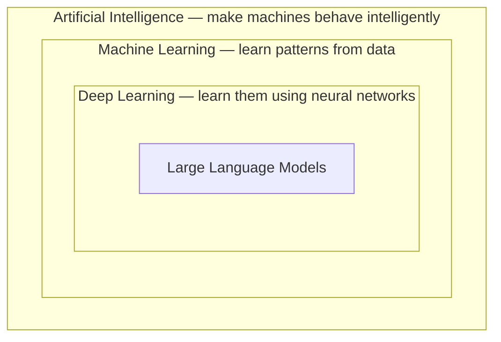
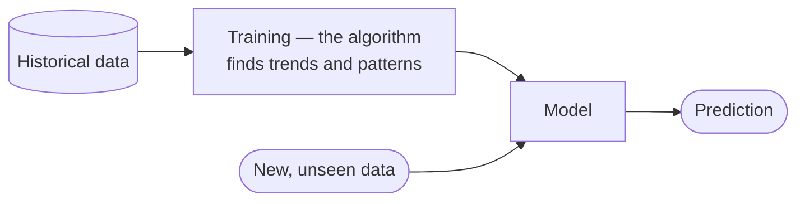
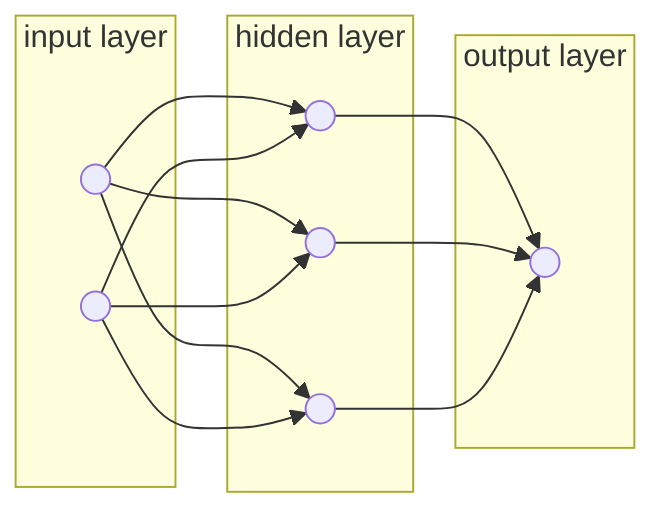

Ask a room of engineers what an LLM is and you get answers like *"the brain of AI"*, *"a model trained on a huge amount of data"*, *"a next-token predictor"*. All three are pointing at something real. None of them is the definition, because they skip the word that carries all the weight.

**LLM** stands for **large language model**. Of those three words, the most important is **model**.

Because that immediately raises a better question: *what kind of model?*

The answer is that it is a **neural network** — a deep learning model. And that means you cannot understand what an LLM is without first understanding the three nested fields it sits inside.

---

## The nesting

Each ring is a **subset** of the one outside it. Read it as four sentences: an LLM is a deep learning model; deep learning is a kind of machine learning; machine learning is a technique for building artificial intelligence; artificial intelligence is the goal.

---

## Artificial intelligence — the outer ring

**Artificial intelligence** is a broad field of computer science concerned with building systems capable of performing tasks that would otherwise require human intelligence. It is not one algorithm. It is a large collection of different techniques, activities and algorithms whose shared aim is making machines smarter.

The lecture motivates it by asking how *humans* acquire knowledge, since that is what we are trying to imitate.

> Teach a child to cross the road. You start with a set of rules — look left, look right, look left again. Then the child applies judgement on top of the rules: is anything coming, is it moving too fast, is there time. Rules first, then learned judgement layered over them.

That is the whole spectrum of AI in one example. Some tasks are specific enough that **a few rules suffice**. Others are complex enough that the system has to **recognise patterns** or **understand trends** — and those are the ones that need machine learning.

---

## Machine learning — the middle ring

**Machine learning** is a set of algorithms where, instead of writing the rules yourself, you feed the system a dataset and let it derive the rules.

The shape is always the same:

### A worked example

There is a dataset on Kaggle of exam paper leaks in India from 2014 to 2024. For each leak it records which state it happened in, which paper leaked, the reason for the leak, the date, and what action was taken.

Feed that to a machine learning algorithm and it finds trends:

- some states have frequent leaks, others essentially none
- **2020 has very few leaks** — and once you see that, you can infer *why*: it was COVID, it was lockdown, so many exams were never held. No exam, no leak.

Now hand the trained model a row it has never seen — a medical exam in Tamil Nadu in 2026 — and it will give you, with some probability, a prediction about whether it leaks.

### A second one, to show it is not a fluke

Predicting a stock market crash. The inputs are GDP figures, US debt, how gold is performing, how emerging markets are performing. The training data is every past crash: the dot-com bubble, 2007.

And notice this is exactly how a human learns economics. You look at what happened before, you ask what the crashes had in common, and you form a view about what might go wrong next. The model is doing the same thing, just mechanically.

> [!info] **Regression and classification** are the two shapes most of these problems take.
> **Regression** predicts a number — how much will this stock be worth. **Classification** predicts a category — will a crash happen or not.
>
> There are many algorithms in each family, and **every algorithm takes a different route** to finding patterns. Linear regression finds them one way; a decision tree finds them another. The goal is shared; the mechanism is not.

---

## Deep learning — the inner ring

**Deep learning** is a branch of machine learning that does the same job — find patterns in data — but takes a specific approach to it: it tries to **mimic the human brain**.

The human brain is made of **neurons**, individual cells, connected in enormous numbers, with electrical signals passing between them. Two details matter:

- **not every neuron activates for every action** — different tasks light up different parts
- neurons behave differently when you are *learning* something than when you are *performing* something

Deep learning imitates this with an architecture called a **neural network**. The name is the giveaway: *neural*, as in neurons.

The simplest version is the **artificial neural network** (ANN) — an input layer, one or more hidden layers, and an output layer, with connections carrying numbers between them.

What the hidden layer actually does is the subject of [[09-The-Training-Loop]] and, in far more depth, the second half of the course. For now the shape is enough.

---

## Why none of this happened in 1985

Here is the fact that surprises people: **neural networks are not new**. The theory is decades old. It was not invented in 2015, and neither was machine learning.

Two things were missing, and they are the same two things that will come up in every note in this folder:

| Missing ingredient | Why it blocked everything |
|---|---|
| **Data** | You cannot train a model without a large dataset. Before the internet, that data was not being collected at all. |
| **Compute** | Machines in the 1980s and 1990s could not run these algorithms over a huge dataset in any usable time. |

Both arrived in the same window. Data started accumulating with the internet from the 2000s onward. Compute caught up through the 2000s and 2010s to the point where even **consumer-grade machines** can train and run useful models.

> [!important] This is the single most repeated idea in the whole chapter, and it is worth internalising now: **data and compute are the two constraints on everything.** Every time this chapter explains why something happened when it happened — why transformers took five years to become ChatGPT, why base models are expensive, why the scaling law papers matter — the answer is some combination of these two.

---

## So what is an LLM

Putting it back together:

An LLM is a **neural network** — that is, a deep learning model — built on a specific architecture, trained on an enormous quantity of text. GPT, Claude, Gemini: every one of them is a neural network running on a particular architecture, which [[05-Transformers-And-Attention]] names and explains.

Two things to fix in your head before going further, because everything else is built on them:

1. **It is a neural network.**
2. **A neural network is a complex mathematical function** that has been prepared for you.

That second claim sounds like a simplification. It is not — it is the literal truth, and [[02-Neural-Networks-As-Function-Approximation]] derives it from scratch.

---

> [!tip] Interview framing
> "The word that matters in 'large language model' is *model* — specifically a neural network, which puts LLMs inside deep learning, inside machine learning, inside AI. Machine learning is the shift from writing rules to feeding a system data and letting it derive the rules; deep learning is the subset that does that using an architecture modelled loosely on neurons. The part I'd stress is that none of this theory is new — neural networks are decades old. What changed is that data became available with the internet and compute became cheap enough to train on it. That framing matters because the same two constraints, data and compute, turn out to explain almost every subsequent milestone, including why the transformer paper landed in 2017 but ChatGPT didn't arrive until late 2022."
