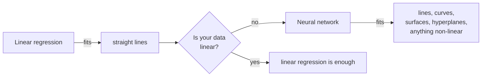

## The easy case: fitting a line

Suppose someone hands you a scatter of data points. Call the horizontal axis **x**, your input. Call the vertical axis **y**, your output.

```
 y │        ·
   │      ·   ·
   │    ·  ·
   │  · ·
   │ ·
   └──────────────── x
```

Your job: draw the one line that best approximates all of them.

You will not get it exact. Some points will sit close to whatever line you draw and some will sit far off — there will always be **some error**. That is fine. The question is which line has the least of it.

So draw two candidates and compare them. Call them **L1** and **L2**. Every line has an equation:

$$y = mx + c$$

so L1 is $y = m_1x + c_1$ and L2 is $y = m_2x + c_2$. What `m` and `c` mean geometrically does not matter here — what matters is that different values of `m` and `c` give you different lines, and there are infinitely many of them.

### Measuring which one is better

Take a single real data point from your dataset. Say that when **x = 10**, the true value was **y = 30**.

Now ask each line what *it* would have predicted at x = 10:

| | Predicted at x = 10 | True value | Absolute error |
|---|---|---|---|
| **L1** | −9 | 30 | \|−9 − 30\| = **39** |
| **L2** | 28 | 30 | \|28 − 30\| = **2** |

L2 is dramatically closer. At this point at least, it is the better approximation — L1 is wildly off, L2 is nearly right.

Then you do that for **every** point. If the dataset has 10,000 points, you compute the error at all 10,000 for each candidate line, and total them up.

> [!info] **The error measures have names.**
> **Absolute error** is what we just used: take the predicted value, subtract the true value, and take the modulus (drop the sign). 28 − 30 = −2, modulus 2.
>
> **Mean squared error** squares the differences instead of taking their modulus, then averages. Squaring punishes large misses much harder than small ones.
>
> Either way the principle is identical: turn "how wrong is this line" into a single number you can minimise.

**This procedure has a name: linear regression.** It is a machine learning algorithm, and it is the concrete version of that pattern-finding.

---

## Breaking it

Linear regression is fine — for data that actually lies along a line.

Now consider data that does not.

```
 y │    ··
   │   ·  ·
   │  ·    ·         ·
   │ ·      ·      ·
   │·        ·····
   └──────────────── x
```

No straight line approximates that. You need a **curve**. And curves have more complicated equations with more coefficients to find.

It gets worse in a way that is easy to miss. Everything so far has been two-dimensional because two dimensions are easy to draw. Real problems are not:

| Dimensions | What you are fitting |
|---|---|
| 2 | a line or a curve |
| 3 | a plane, or a curved surface — a **hyperplane** |
| 4, 5, … thousands | something you cannot picture at all |

> [!important] You can visualise two dimensions. You can just about visualise three. **You cannot visualise five**, and real models operate in thousands. The pictures are a teaching aid you abandon almost immediately — the mathematics does not care how many dimensions there are.

### Why you cannot just do it by hand

Suppose you decided to find the best curve manually. Think about what that involves:

- there are infinitely many candidate curves
- each has a **different equation**
- each equation has a **different set of coefficients**
- and you have no way of knowing in advance which set is best

You would be searching an infinite space by trial and error. It is not hard, it is infeasible.

**This is the job neural networks do.** A neural network is an algorithm that finds those coefficients for you — and it can approximate not just linear functions but **any non-linear function**, in any number of dimensions.



---

## Parameters — the thing that actually gets learned

Take a concrete non-linear function:

$$y = ax^2 + bx + c$$

Here `x` is your input and `y` is your output. **`a`, `b` and `c` are constants** — and they are what determines *which* curve you get.

Draw one curve with one set of values and a second curve with a different set. Both are parabolas; they are different parabolas. Same equation, different `a`, `b`, `c`.

So "learning" is precisely this: **finding the values of `a`, `b` and `c` that make the curve fit your data best.**

> [!important] Those constants are called **parameters**. In neural-network vocabulary they are **weights and biases**
>
> This is also where the *large* in large language model comes from. Our example has three parameters. A large language model has **billions or trillions** of them.

---

## The question that makes it concrete

> [!question]- We keep plotting `x` against `y` with nothing on the axes. In a real problem, what are `x` and `y`?
> Let **x be a company's earnings** and **y be its stock price**.
>
> You might expect a straight line — earn more, be worth more. Broadly the trend holds, but it is not clean. Sometimes earnings rise and the stock falls, because other factors intervene:
>
> > Google earns enormous sums from ads. But it also spends enormous sums — heavy capital expenditure. So the company's net cash in the bank can be *shrinking* while earnings grow. Investors dislike that, and the stock price drops.
>
> So the relationship between earnings and stock price is **real but not simple**. It is exactly the kind of complex, non-linear relationship you would want to approximate — and exactly the kind a straight line cannot capture.
