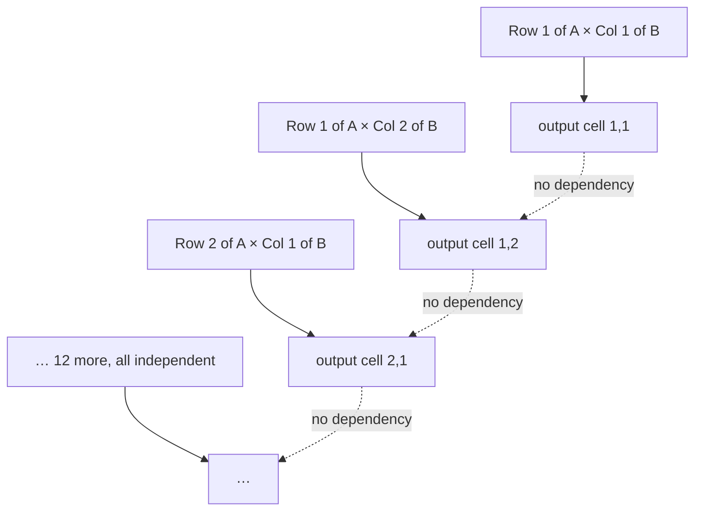

Everyone knows that training AI needs GPUs. Far fewer people can say *why* — why a graphics card, of all things, turned out to be the hardware that neural networks needed. The answer is a single property of a single operation, and once you see it the whole GPU industry makes sense.

---

## First, three words that get used loosely

These three come up constantly in this course and they are not interchangeable.

| Term | What it means | Physical hardware |
|---|---|---|
| **Compute** | your machine's capacity to *do calculations* | CPU or GPU |
| **Memory** | working space held while the machine is running | RAM |
| **Storage** | data that persists when the machine is off | hard disk, SSD |

> Give a computer `2 + 2`. It has to take both inputs, take the operator, and perform an operation to produce 4. **That is compute.**

When [[01-What-Is-An-LLM]] said the two constraints were data and compute, *compute* meant this — cycles, not disk space.

---

## The operation that dominates

Look inside almost any neural network architecture and one operation appears more than any other: **matrix multiplication**.

That is the school-level operation, unchanged. Take two matrices:

```
   matrix A                      matrix B
   3 rows × 4 columns            4 rows × 5 columns

   ┌             ┐               ┌                 ┐
   │ · · · ·     │               │ · · · · ·       │
   │ · · · ·     │      ×        │ · · · · ·       │
   │ · · · ·     │               │ · · · · ·       │
   └             ┘               │ · · · · ·       │
                                 └                 ┘
```

There is a rule about which matrices can be multiplied at all — sometimes called the **M × N rule**:

> [!important] To multiply **A × B**, the **number of columns in A must equal the number of rows in B**.
>
> Here A has 4 columns and B has 4 rows, so it works. The result has A's row count and B's column count — a **3 × 5** matrix, 15 output cells.

To compute one output cell you take **one row of A** and **one column of B**, multiply them element by element, and add the results. First row × first column gives the top-left output cell. First row × second column gives the next one. And so on until all 15 are filled.

---

## The insight

Now look carefully at those 15 output cells and ask a question the lecture keeps returning to:

**Does any output cell depend on any other output cell?**

No. Not one.

To compute the cell in row 2, column 4, you need row 2 of A and column 4 of B. That is all. You do not need the cell before it. You do not need any cell to have been computed already. Every output cell can be produced **from the inputs alone**.



> [!important] **Matrix multiplication does not require serial execution.**
>
> You do not have to compute this cell, then the next, then the next. You can compute **all of them at the same time** — if you have hardware that can do many things at once.

That "if" is the entire reason GPUs matter.

---

## What a GPU actually is

**GPU** stands for graphics processing unit, but the useful definition for our purposes is simpler:

> A GPU is **a large number of small CPU cores bundled together**, so that you can perform many calculations in parallel.

Compare against what is in an ordinary machine:

| Hardware | Cores |
|---|---|
| An old consumer machine | 2 — dual-core |
| A typical modern laptop | 6 or 8 — hexa-core, octa-core |
| A GPU | **thousands** |

And here is the constraint that makes core count decisive. **One core can perform exactly one operation at a time.** That is basic computer science and it does not bend.

> [!info] So how does a single-core machine appear to run many programs at once?
>
> It doesn't. It is **context switching** — the core rapidly swaps between tasks, giving each a slice of time. It feels parallel; it is not. With four real cores you get four genuinely parallel computations. Not before.

### The analogy

> You have 50 volunteers. Each one is responsible for exactly one calculation, and all of them work at the same time. Your matrix multiplication finishes 50 times sooner.

That is a GPU. Nothing more mysterious than that.

This is why **Nvidia** and **AMD** became central to AI, and note the ordering: all of this predates LLMs entirely. It is plain neural-network theory. Better GPUs made it practical to train large neural networks, and only then did the architectures in [[05-Transformers-And-Attention]] become trainable at scale.

---

## Then why do CPUs still exist?

A fair question, and the answer is a genuine trade-off rather than GPUs simply winning.

| | CPU | GPU |
|---|---|---|
| Performance of a **single unit** | high | lower |
| Number of units | few | thousands |
| Good at | **sequential** computation | **parallel** computation |

A single CPU core outperforms a single GPU core. The CPU's weakness is only that it cannot do many things at once. So work that is inherently sequential — one step genuinely depending on the last — belongs on a CPU, and no number of GPU cores helps.

> [!info] Two things flagged for later in the course, both worth remembering:
> - **The inference phase** — actually *using* a trained model, covered in [[10-The-Base-Model]] — has different hardware needs from training, and CPUs have a role there.
> - **Memory, not compute, is increasingly the bottleneck.** The constraint is shifting from "can we calculate fast enough" to "can we hold and move enough data".

And the same parallelism explains GPUs' original market: gaming and frame rates, video processing, high-end image processing. All of them are the same shape of problem — many independent calculations, all at once.

---

## Guarantees

**It guarantees** that any workload dominated by matrix multiplication will parallelise well, because the independence is a property of the mathematics rather than of any particular implementation.

**It does not guarantee** that more GPU always means faster. Work that is genuinely sequential gains nothing from extra cores, and a model that does not fit in GPU memory will not run faster for having more compute available.

**It does not mean GPUs are simply better.** Per-unit, a CPU core is stronger. GPUs win on throughput for parallel work, and lose everywhere else.

---

> [!tip] Interview framing
> "The reason neural networks need GPUs comes down to one property of matrix multiplication, which is the dominant operation inside almost every architecture. If you multiply a 3×4 matrix by a 4×5 matrix you get 15 output cells, and the key observation is that **no output cell depends on any other** — each one needs only a row of the first matrix and a column of the second. So there's no requirement for serial execution; every cell can be computed simultaneously. A CPU can't exploit that because a core does one operation at a time and six or eight cores is the ceiling — what looks like parallelism on a single core is just context switching. A GPU is essentially thousands of small cores, so it can. That's also why CPUs haven't gone away: a single CPU core is more powerful than a single GPU core, it just can't do many things at once, so sequential work still belongs there."
