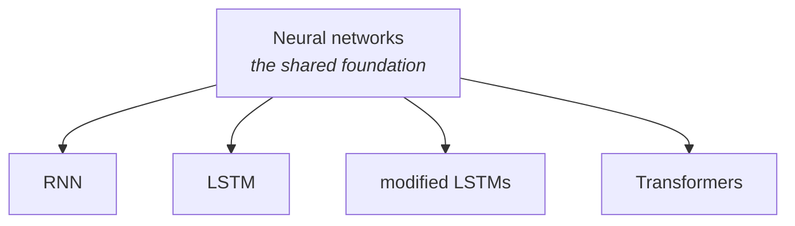
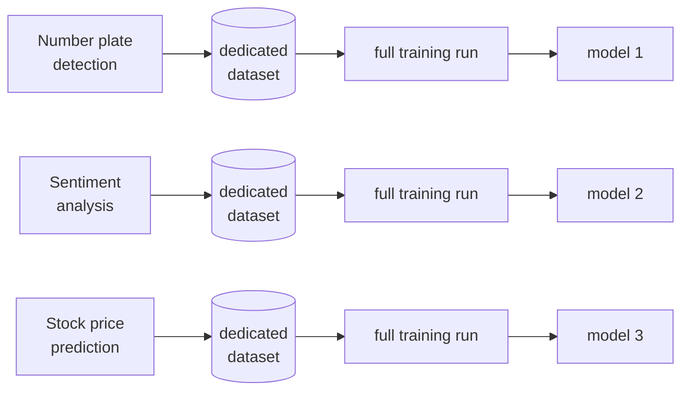
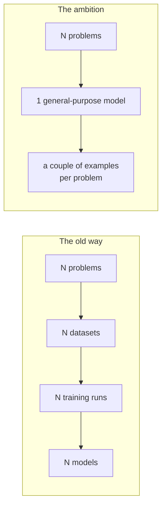

Neural networks work. [[02-Neural-Networks-As-Function-Approximation]] showed what they do and [[03-Why-GPUs]] showed why we can finally afford to run them. So why weren't we done in 2016?

Because of how they had to be *used*. This note is about the structural problem with deep learning as practised before LLMs — the problem LLMs exist to solve.

---

## First: what "recognising patterns" actually feels like

Before the problem, one more pass at the thing neural networks do, because the lecture gives an analogy that lands harder than any equation.

> **Trigonometry.** You had five, seven, maybe ten formulas. And then you solved hundreds of problems — five hundred, of every different type. Why?
>
> Not to memorise the answers. You were **training your brain** so that when a certain shape of equation appears, you recognise which trick applies to it.

Same story with integration: integration by parts, integration over exponentials, each a different type demanding a different move. Practising means seeing enough examples that a new one triggers the right technique.

And the same again with interview preparation:

> Sometimes the exact question you practised comes up, and if you memorised it you can just produce the answer. But usually they change it. So what do you do? You **approximate**: *this looks like a two-pointer problem, because it has these characteristics, and a two-pointer combined with some precomputation like a DP might work — let me try in that order.*

That is pattern recognition. **A neural network does the same thing.** The only difference is that where you use intuition built from practice, it uses mathematical equations to represent the same recognition.

> [!info] Reading this note and the ones after it, hold onto that image. Every stage of building an LLM in [[06-The-Three-Stages]] is a version of this — showing the system enough examples that it recognises what to do with a new one.

---

## Where deep learning had got to

By the mid-2010s the picture looked like this:

**RNN**, **LSTM**, its variants, and eventually **transformers** — all of them are different architectures resting on the same fundamental idea of a neural network. They are covered properly later in the course; what matters now is that they are siblings, not rivals from different families.

And deep learning had many applications. That was never the problem.

---

## The problem: one model, one job

The way these networks got used was **one network per task**. Someone would train a network to detect number plates in a car image — say, pulled from a video feed, for automated speed ticketing. Someone else would separately train a network for stock price prediction. Someone else for sentiment analysis, taking a piece of text and reporting whether the sentiment is positive or negative.

Each of these was trained **individually and separately**. And that carries a cost that compounds:

The standard approach around 2015–2016 was: take an existing neural network architecture, gather a large dataset for your specific problem, and **retrain the model**.

### The two costs

| Cost | Why it hurts |
|---|---|
| **Getting the dataset** | You need a dedicated dataset per problem, and it has to be *good* and large. Collecting and cleaning it is a project in itself. |
| **Training the model** | Training is not easy. You need powerful machines and a decent set of GPUs, which makes it an **expensive affair** — see [[03-Why-GPUs]] for why the hardware is the constraint. |

### The partial fix that wasn't enough

There is an optimisation called **transfer learning**: rather than training the whole model from scratch, you keep most of an existing trained model and train only a small part of it.

That genuinely helps with the second cost. It is covered later in the course.

> [!important] But **the fundamental problem stays the same**. Even with transfer learning, every individual problem still needs its own dedicated dataset with a good quantity of data, and still needs a training run. You have made each instance cheaper. You have not escaped having one instance per problem.

For small, well-defined tasks — a text summariser, a sentiment classifier — this is a perfectly reasonable way to live. The cost is proportionate to the job.

---

## The vision

So the question that motivated everything after it:

> What if you could have a **general-purpose model** — one that does a lot of different things, that you **do not have to retrain separately**, and that you **do not have to collect a new dataset for**? Something you could hand a couple of examples and have it do the task?

That is the ambition. One model, many tasks, no retraining, no new dataset. Give it a demonstration rather than a training run.

**This early-stage vision is what led to the discovery of everything around LLMs.** The architecture that made it achievable arrives in [[05-Transformers-And-Attention]].

---

## Guarantees

**It guarantees** nothing on its own — this note describes a *goal*, not a technique. Its value is diagnostic: it tells you what any proposed solution has to beat.

**The old approach is not obsolete.** Task-specific models remain the right answer when the task is narrow, the data is available, and the cost of a general-purpose model at inference time is not justified. [[14-Choosing-A-Model]] makes the same argument in its modern form.

**"No new dataset" turned out to be optimistic.** LLMs removed the per-task dataset — but only by requiring an enormous one-time dataset instead, which is what [[07-Pre-Training-The-Data]] is about. The cost moved; it did not vanish.
