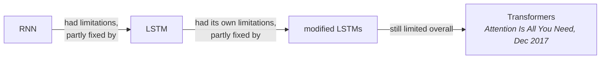
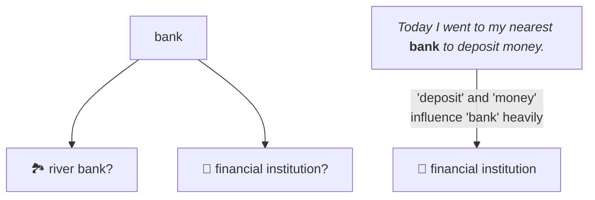
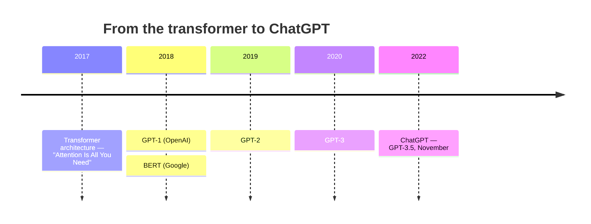

[[04-The-Problem-LLMs-Solved]] left off with an ambition: one general-purpose model instead of one model per task. This note is about the architecture that made it possible, and the single idea inside it that everything else rests on.

---

## The paper

In **December 2017** a research paper was published titled **"Attention Is All You Need"**.

To understand what it fixed, you need to know what came before. For **sequential modelling** — and in particular for **language translation** — the state of the art was **RNNs** and then **LSTMs**.

Each step improved on the last, and each still carried real limitations. The 2017 paper introduced a different neural-network architecture entirely: the **transformer**.

> [!important] **Transformers are fundamentally behind everything you are currently using.** GPT, Claude, Gemini, Qwen — every one of them is, at some level, built on the transformer architecture.
>
> And a transformer is still deep learning. It is a neural-network architecture, so everything in [[01-What-Is-An-LLM]] and [[02-Neural-Networks-As-Function-Approximation]] still applies to it.

---

## The problem the paper actually solved

Natural language has a property that makes it awkward for a machine.

**A word on its own often carries very little information.** What matters is the word *in the context of the other words around it*.

The example the lecture uses:

> Take the word **bank**.
>
> On its own it could mean anything. A **river bank**. A **financial institution**. Something else entirely.
>
> Now put it in a sentence: *"Today I went to my nearest **bank** to deposit money."*
>
> Now it unambiguously means the financial institution.

Nothing about the word changed. What changed is that **deposit** and **money** are sitting next to it.

> [!important] The principle, stated plainly: **a word's meaning is heavily influenced by its neighbours and by the context in which it is being said.**
>
> This is the fact the transformer paper takes on.

---

## Attention

The paper's answer is a mechanism called **attention**.

What it does:

> Attention lets the neural network **look at every other word in the sentence** and **decide how much each one should influence the current word** under consideration.

That is the whole idea in one sentence. Not "what does this word mean" but "given everything else here, how much does each other word matter for interpreting this one".

When a model applies this within a single sequence — every word attending to every other word in the same input — it is called **self-attention**.

> [!info] The mathematics of how attention is computed is deliberately deferred. It is covered in the second half of the course, alongside actually building a transformer. At this stage the conceptual statement is the load-bearing part, and it is enough to reason about everything in this chapter.

**Everything after 2017 is built on this.** The majority of research you will encounter sits on top of the transformer architecture rather than replacing it.

---

## What GPT stands for

Worth stopping on, because it is hiding in plain sight.

**GPT** = **G**enerative **P**re-trained **T**ransformer.

| Letter | Meaning | Where it is explained |
|---|---|---|
| **G** | Generative — it produces new output | [[10-The-Base-Model]] |
| **P** | **Pre-trained** — it went through a pre-training phase | [[07-Pre-Training-The-Data]] |
| **T** | **Transformer** — the architecture | this note |

So "ChatGPT" is not an opaque brand name. It is a description: a generative model, pre-trained, built on transformers.

---

## Why 2017 didn't feel like anything

Here is the question a student asked, and it is the right one:

> The transformer arrived in 2017. So why did the fuss about LLMs only start in **2022**, when ChatGPT launched?

Part of the answer is that Google was *already ahead* — they published the transformer architecture. But the constraint was the one from [[01-What-Is-An-LLM]] that keeps reappearing: **training these things is not cheap, and you need an enormous dataset**.

So the work was happening the whole time, quietly:

| Year | Release |
|---|---|
| 2017 | The transformer architecture |
| 2018 | **GPT-1** — which you almost certainly never used — and **BERT** from Google |
| 2019 | **GPT-2** |
| 2020 | **GPT-3** |
| Nov 2022 | **ChatGPT**, which was **GPT-3.5** |

> [!important] The point of the timeline: **this is not three years old.** People were working on it from 2017 onward, and the neural-network architecture underneath is very much older than that.
>
> What changed was not the discovery of a new idea in 2022. It was that enough compute became available, enough data became available, and the architecture had been improved to the point where it became **general-purpose** — which is exactly the ambition from [[04-The-Problem-LLMs-Solved]].
>
> A great deal happened in the gap. Most of it was **pre-training and post-training**, which [[06-The-Three-Stages]] onwards covers in full.

---

## Two honest caveats

**Are all the major models transformer-based?** As far as is publicly known, yes — Claude, GPT, all of them. There is research on other, simpler architectures, though they tend not to be as performance-efficient as the modern transformer-based models, and there may well be **hybrid architectures** in play.

**Transformers did not do something LSTMs could not.** This is worth being precise about. What transformers achieve, people were able to achieve *at some level* with LSTMs too. LSTMs solved a version of the same problem.

The difference is not capability in principle. It is that transformers are far higher on:

- overall **accuracy**
- overall **performance**
- overall **adaptability**
- their **general-purpose** nature

That last one is what actually mattered.

> [!info] And this may not last. Someone may introduce a new architecture tomorrow, and modern LLMs would move onto it — research in the field moves at a tremendous pace, so nobody knows. But for now, in **2026 and 2027**, the architectures you will deal with are transformer-based.

---

## Guarantees

**It guarantees** that context is available to the model — every token can be influenced by every other token in the input, rather than by a fixed window of neighbours.

**It does not guarantee correct interpretation.** Attention decides *how much* each word influences another; it does not guarantee those weights are right. A model can attend to the wrong context and produce a confidently wrong reading.

**It is not free.** Letting every word look at every other word is quadratic in sequence length — which is a large part of why long inputs cost more, a thread picked up in [[14-Choosing-A-Model]].

---

> [!tip] Interview framing
> "Transformers come from the December 2017 paper 'Attention Is All You Need'. Before it, sequential modelling and translation were done with RNNs and then LSTMs, each fixing some of the previous one's limitations and each still limited. The problem the paper attacked is that in natural language a word on its own often means little — 'bank' could be a river bank or a financial institution, and it's only 'deposit' and 'money' in the same sentence that disambiguate it. Attention is the mechanism that lets the network look at every other word and decide how much each should influence the current one. That's what GPT's T stands for, and the P is pre-trained. The thing I'd add is that transformers didn't do something LSTMs fundamentally couldn't — LSTMs solved a version of it too. What transformers won on was accuracy, adaptability and being genuinely general-purpose, and that's why the whole field moved onto them."
