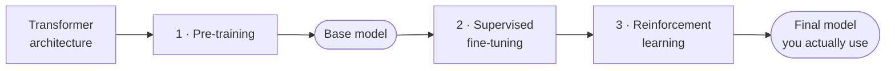
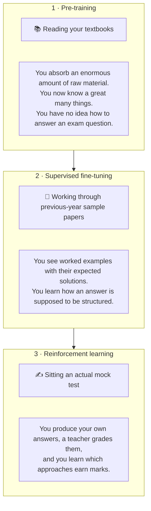

## The three stages

| Stage | What happens |
|---|---|
| **1 · Pre-training** | Expose the network to an enormous corpus of raw text and train it to predict the next token |
| **2 · Supervised fine-tuning** | Continue training on curated **conversations**, so it learns to behave like an assistant |
| **3 · Reinforcement learning** | Have it generate multiple answers and score them, so it learns which approaches are good |

Two pieces of vocabulary that get used constantly:

- The output of stage 1 is the **base model**.
- Stages 2 and 3 together are **post-training**.

---

## The analogy that holds all three together

This is the spine of the entire chapter, and it is worth memorising in this form.

> [!important] The reason this analogy is good is that it explains the **failure mode of each stage**, not just its purpose.
>
> A student who has memorised every sentence of the textbook still cannot answer an exam question, because they do not know *when to use which sentence*. That is precisely what is wrong with a base model, and precisely why stage 2 exists.
>
> A student who has read sample papers has seen good answers, but has never had their *own* work graded. That is what stage 3 adds.

---

## Where the effort goes

The three stages are not equal in cost.

| Stage | Relative cost | Why |
|---|---|---|
| Pre-training | **by far the most expensive** | months of compute over terabytes of data |
| Supervised fine-tuning | moderate | requires human-written conversations, which must be paid for |
| Reinforcement learning | moderate | requires human ranking of generated outputs |

Pre-training is described as *the first and one of the most expensive stages* of LLM training, and that framing matters — it is why almost nobody trains a base model, and why the economics look the way they do.

---

## What this means for you

Worth saying now rather than at the end, because it changes how you read the next six notes:

> [!info] For **90–95% of AI engineering work, how a model was trained does not matter to you.** You will not train one. What matters is understanding *what an LLM is* and *which LLM suits which task*.
>
> So read stages 1–3 for the understanding, not as a manual. The exception is fine-tuning, which does draw on this theory. The full version of this argument comes later.

---

> [!tip] Interview framing
> "Any general-purpose LLM goes through three stages. Pre-training exposes the network to a huge corpus of raw internet text and trains it to predict the next token — the output of that is called the base model. Then post-training, which is two stages: supervised fine-tuning on curated multi-turn conversations so it learns to behave like an assistant, and reinforcement learning where it generates multiple answers that get scored so it learns which approaches are good. The analogy I like is schooling — pre-training is reading the textbook, SFT is working through previous-year sample papers, and RL is sitting a mock test and having it graded. It's useful because it explains the failure modes: a student who memorised the whole textbook still can't structure an exam answer, which is exactly what's wrong with a base model."
