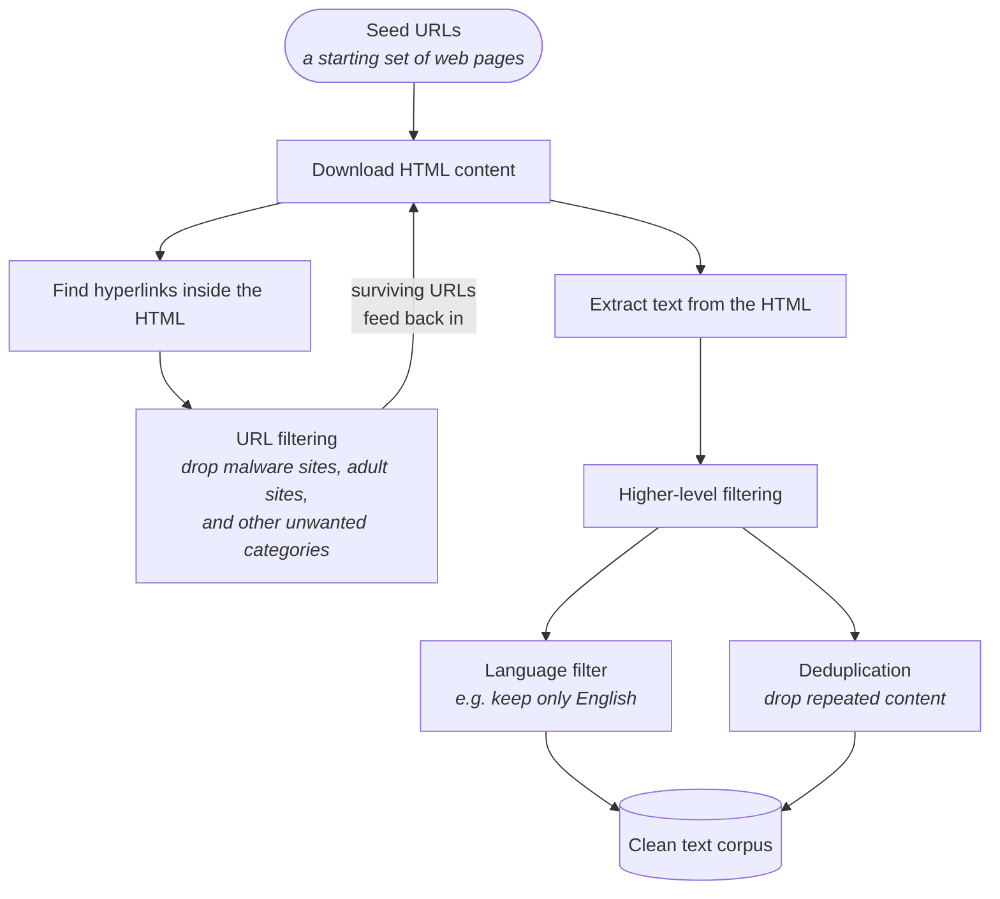

Stage one of the three in [[06-The-Three-Stages]]. **Pre-training** is where a network with random parameters becomes something that knows about the world — and it is described as the first and **one of the most expensive** stages of building an LLM.

Before any training can happen, you need the data. That turns out to be a substantial engineering problem in its own right, and it is what this note is about.

---

## What kind of data

Look at the early-generation LLMs and the answer is blunt: they were trained on **raw internet data**.

Not curated encyclopaedias. Not textbooks. The web, scraped.

> [!info] **Text, specifically.** LLMs are for natural-language interaction, so they need text-based data.
>
> This is not universal across AI. Most state-of-the-art image models are built on a different architecture — **CNNs**, convolutional neural networks — and need image data instead. The data you collect follows from what you are building.

---

## Common Crawl

**Common Crawl** is a non-profit organisation that routinely crawls the public web and provides the resulting datasets **freely to the public**.

It was founded around **2007** and has been scraping ever since. It holds **billions of web pages**.

That makes it the default starting point for anyone assembling a pre-training corpus — and its data, as far as is known, is free.

---

## How web scraping actually works

The instructor pauses here to build the crawler out, and notes it is also a **famous system design interview question**: *design a web crawler*.

Step by step:

1. **Start with seed URLs** — some starting set of web pages.
2. **Download their HTML content.**
3. **Find the hyperlinks** inside that HTML, which point at further URLs. This is the crawling loop: each page hands you more pages.
4. **Filter the URLs.** You do not want everything the web offers — malware sites, adult sites and similar categories get dropped before you ever fetch them.
5. **Extract the text** from the HTML you kept.
6. **Filter again, at a higher level.** Keep only one language if that is what you want — drop anything without English characters, say. And **remove duplicates**, since the web repeats itself relentlessly.

The output is a large corpus of text with spam and malware stripped, filtered to the languages you want, and deduplicated.

> [!important] Notice that the filtering happens **twice, at two different levels** — once on URLs before fetching, once on extracted text afterwards. That is not redundancy. Filtering URLs saves you the bandwidth of fetching junk; filtering text catches the junk that arrived from pages you did want.

---

## Hugging Face and FineWeb

**Hugging Face** is a name you will meet constantly. The useful one-line description:

> Hugging Face is **GitHub for AI engineering**.

It hosts a large number of models that you can find, download and build on top of, and it hosts datasets too.

One of those datasets is **FineWeb**, which describes itself as the finest collection of web text data at scale. Its numbers give you a sense of what "pre-training corpus" means in practice:

| FineWeb | |
|---|---|
| Size in tokens | **15 trillion** |
| Size on disk | **44 terabytes** |
| Derived from | **96 Common Crawl snapshots** |
| Claim | produces better-performing LLMs than other pre-training datasets |

*Tokens* is defined in [[08-Tokenization]]; for now read it as "units of text".

And the framing that comes with it is the thesis of this whole note:

> **The performance of a large language model depends heavily on the quality and the size of the pre-training dataset.**

---

## What the leading labs won't tell you

Here is a fact worth registering, because it shapes what you can and cannot learn from the open ecosystem:

> [!important] The pre-training datasets for state-of-the-art open models — **Llama 3** (Meta) and **Mixtral** among them — are **not publicly available**, and very little is known about how they were created.
>
> "Open weights" is not "open data". A lab can release a model you can download and run while keeping the corpus it was trained on entirely private. Not every company discloses what they trained on, and many deliberately keep it closed.

This is why datasets like FineWeb matter: they are among the few reproducible starting points.

---

## The companies that sell data

Common Crawl is not the only source. There is an entire industry supplying training data:

| Company | Role |
|---|---|
| **Common Crawl** | non-profit web crawl, freely available |
| **Hugging Face** | hosts datasets and models |
| **Scale AI** | data for training, including human annotation |
| **Together AI** | datasets, and also runs its own inference layer |
| **Surge AI** | data and annotation |

Some of this data is free — Common Crawl's, as far as is known. Others charge: there are **commercial data crawlers** and **human-annotation-based data companies** that sell their output.

These companies come back in [[11-Supervised-Fine-Tuning]], where the data being sold is human-written conversations rather than scraped text.

---

## Why the cleaning is not optional

It would be easy to treat filtering as housekeeping. It is not.

> [!danger] **Training these models costs millions of dollars.** You cannot compromise on the quality of the data.
>
> The data has to be refined, cleaned and filtered so that your model does not get trained on unnecessary material — and you only get one expensive shot at it. There is no cheap way to notice halfway through a multi-month run that the corpus was full of junk.

That is the real argument for the pipeline above. Every filter in it is there because the cost of *not* having it is a wasted training run.

---

## Guarantees

**It guarantees** a corpus large enough to train on. Scale is the one thing web crawling reliably delivers.

**It does not guarantee quality.** Raw internet text contains toxicity, factual errors and unstructured rambling — a point [[11-Supervised-Fine-Tuning]] returns to as the *misalignment trap*, because it is precisely what post-training has to correct.

**Filtering is lossy and opinionated.** Deciding which URLs are unwanted and which language to keep is a judgement, made once, that shapes everything the model will ever know. A corpus filtered to English produces a model that is worse in every other language, and no amount of later fine-tuning fully recovers that.

---

> [!tip] Interview framing
> "Pre-training is the first and most expensive stage, and it starts with getting the data — early LLMs were trained on raw internet text. Common Crawl is the canonical source: a non-profit that's been crawling the public web since around 2007 and publishes the datasets freely, billions of pages. The pipeline is basically the classic 'design a web crawler' interview question — seed URLs, download HTML, extract hyperlinks to keep crawling, filter out unwanted URLs, extract the text, then a second round of filtering for language and duplicates. FineWeb on Hugging Face is a good concrete example of the output: 15 trillion tokens, 44 terabytes, built from 96 Common Crawl snapshots. Two things I'd flag — the leading labs don't publish their corpora, so Llama 3 and Mixtral are open-weights but not open-data; and the filtering isn't housekeeping, it's essential, because a training run costs millions and you can't discover mid-run that the corpus was junk."
