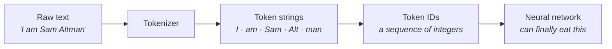
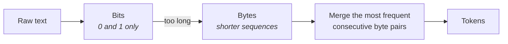

## The problem

A neural network is a **complex mathematical function**, and that fact is about to bite.

Write a function in front of someone:

$$y = ax^2 + bx + c$$

Now try to give it the word *photosynthesis* as `x`.

You cannot. **Mathematical functions do not take words.** Computers do not understand text as data. And the entire pre-training corpus is text.

So before anything can be trained, you need a mechanism to convert raw text into a **mathematical representation**.

---

## Tokenization

> **Tokenization** is the process of converting raw text into a sequence of integer IDs drawn from a given **vocabulary**.

And from it comes the unit everything else is measured in:

> **Tokens** are the fundamental unit that a neural network can process.



This applies at both ends of a model's life. Whether you are **training** it or **using** it, your text is never seen as text — it is converted first.

---

## Watching it happen

There are token visualiser tools that let you see this directly — OpenAI publishes one on its platform, and there are others.

### Four words, five tokens

Type in a simple sentence, using a name as the example:

> **I am Sam Altman**

That is four words to you. To the model it is **five tokens**:

```
│ I │ am │ Sam │ Alt │ man │
   1    2     3     4     5
```

Notice what happened. `I` is one token. `am` — with its leading space — is one token. But the **surname split in half**. The tokenizer had no single unit for it, so it broke it into pieces it did know.

> [!important] **A word is not a token.** This is the single most common misconception about tokenization.
>
> Some words are one token. Common ones usually are. Rarer words — names especially — get **fragmented into several**, because the vocabulary was built from what appears frequently in the training text, and an unusual name does not.

### Punctuation counts too

Try a longer one:

> **Large language models, LLMs are a great invention.**

Tokenise it and you find that even the **full stop is its own token**. So is the comma. Punctuation is not free; it occupies the sequence exactly like words do.

Most visualisers give you two views of the same thing:

| View | What it shows |
|---|---|
| **Text** | which substring of your sentence forms each token |
| **Token IDs** | the actual integer each token maps to |

The second view is the one that matters mechanically — that list of integers is literally what gets fed forward.

---

## How the tokens get chosen

There are several algorithms, and **modern language models rely almost universally on sub-word tokenization** — units smaller than a word, larger than a character.

| Algorithm | Used by | Basis |
|---|---|---|
| **Byte pair encoding (BPE)** | GPT-2, GPT-3, GPT-4, Llama, Mistral | raw **frequency** counts |
| **WordPiece** | Google BERT | **probabilistic** approach |

The two are structurally similar. The difference is what they optimise: BPE merges what occurs most *often*; WordPiece merges what is most *probable*.

### Byte pair encoding, in detail

BPE is a **bottom-up greedy compression algorithm**, adapted for text. In one sentence:

> It **iteratively merges the most frequent consecutive byte pairs into a single token.**

The word *byte* there is load-bearing, and it takes a short detour to see why:



You need a representation a computer can work with. The simplest is **bits** — pure binary. But binary is *long*: the bit representation of a number like **233** takes eight characters, while writing `233` takes three.

So you go one level up, to **bytes**, and get much shorter sequences. Then BPE looks across the corpus for byte pairs that occur together frequently, and merges them into single tokens.

That is why frequent words end up as one token and rare names end up in fragments — the merging was driven by how often things co-occurred in the training text.

> [!info] The full mechanics of BPE are revisited later, alongside the transformer architecture. What is needed here is the shape: text → bytes → merge frequent pairs → tokens.

---

## The quirks that matter

Each of these has practical consequences.

**Case matters.** `World` and `world` are **different tokens** with different IDs. The tokenizer does not know they are the same word.

**One word can become several tokens.** As with the surname above. How many depends entirely on the algorithm and the vocabulary.

**A given token always has the same ID.** If the token `the` appears in two different sentences, it carries the same ID both times. What varies between sentences is *how the text gets divided*, not what a token maps to once identified.

> [!danger] **A model is married to its tokenizer for life.**
>
> Once you train a model with a specific tokenizer, you are locked in — you must always use the same tokenization mechanism.
>
> Change it and the entire mathematical computation performed during pre-training becomes meaningless, because **the input has changed**. Every parameter was tuned against one mapping from text to integers. Swap the mapping and you have not adjusted the model; you have invalidated it.

---

## Questions worth keeping

> [!question]- Is tokenization just hashing — mapping strings to numbers?
> At some level, yes — you are mapping strings to numbers. But the real algorithms are considerably more complex than direct hashing.

> [!question]- Why not just give every word a single token ID and be done with it?
> Because different tokenization algorithms take different approaches. BPE decides by frequency, WordPiece by probability. Neither was designed around the idea that a word is the natural unit — sub-word units handle unseen words far better, which is exactly what the split surname demonstrates.

> [!question]- What happens to a word the tokenizer has never seen before?
> It gets divided. The tokenizer does not know the name, so it breaks it into pieces it does know. That is a feature: it means no input is ever untokenizable.

> [!question]- How does the tokenizer decide where to split?
> There is a useful comparison to the classic data-structures exercise of tokenizing a string. You could split on spaces. You could split on some other delimiter. Different rules give different tokens — but once a token is identified, **two identical tokens always share an ID**.

> [!important] **On minimising tokens.** The obvious conclusion from all this is that you should use as few tokens as possible.
>
> That statement is generally made about **cost** — the fewer tokens you process and generate, the less you pay, which gets quantified later.
>
> But it comes with a warning: **your LLM may underperform if you optimise on tokens unnecessarily.** Squeezing the token count is not free — it connects directly to chain-of-thought reasoning, where the "wasted" tokens are the thinking.

---

> [!tip] Interview framing
> "Tokenization exists because a neural network is a mathematical function and mathematical functions can't take words. So tokenization converts raw text into a sequence of integer IDs from a fixed vocabulary, and tokens are the fundamental unit a network processes. The thing worth stressing is that a token is not a word — 'I am Sam Altman' is four words but five tokens, because the surname isn't in the vocabulary and gets split. Punctuation is its own token too. Most modern models use sub-word tokenization: byte pair encoding for GPT, Llama and Mistral, WordPiece for BERT. BPE is a greedy compression algorithm — you go from text to bytes because bits are too long a representation, then iteratively merge the most frequent consecutive byte pairs. Two practical consequences: casing changes the token, so 'World' and 'world' differ; and a model is locked to its tokenizer permanently, because every parameter was tuned against that specific mapping and changing it invalidates the whole pre-training run."
