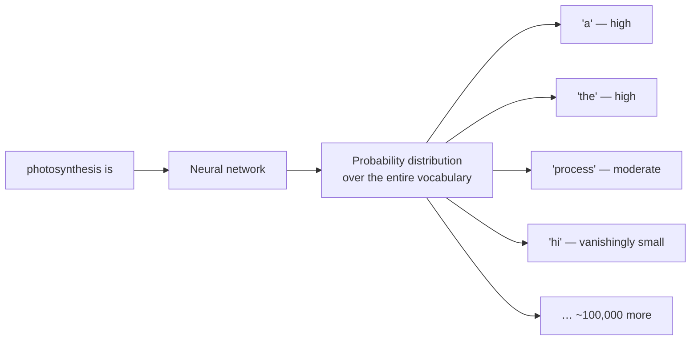
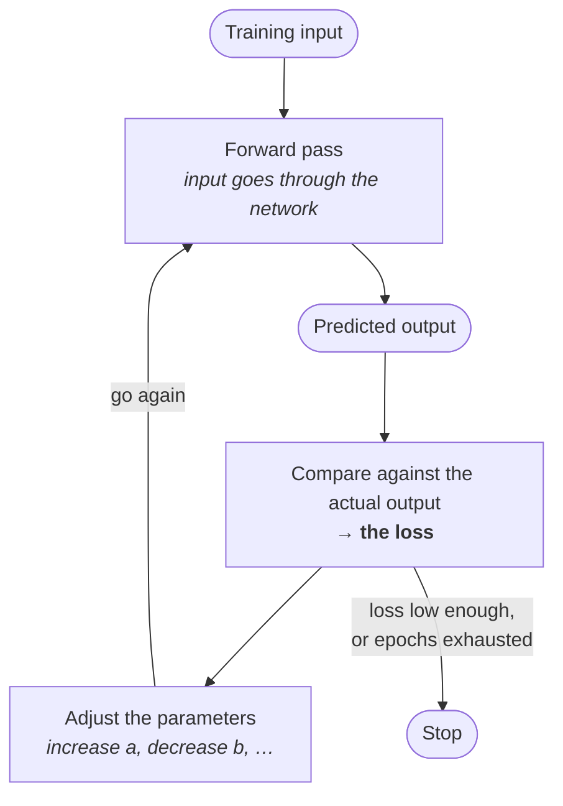

## The objective, stated exactly

There is one sentence to memorise here, and everything else in this note is commentary on it:

> [!important] **Given a sequence of tokens, predict the probability distribution over what the next token should be.**

Read the last part carefully. Not *predict the next token* — predict the **probability distribution over** the next token. The model does not output one answer. It outputs a number for **every token in its vocabulary**, saying how likely each one is to come next.

---

## Why the corpus teaches this

Take the word *photosynthesis*, and consider two articles that might both be sitting in the training corpus.

> **Article A** — *Photosynthesis is a process where plants, algae, and some bacteria use sunlight, water, and carbon dioxide to make food and release oxygen.*

> **Article B** — *Green plants and algae can use light energy to make their own food. This process is called photosynthesis. Almost all life on earth depends on this process.*

Same subject. Completely different sequences of words — and therefore, after tokenization, completely different sequences of tokens.

Now give the network the fragment **"photosynthesis is"** and ask what comes next. Candidates include `a`, `the`, `process` — and also, in principle, `hi`, and every other token in the vocabulary. Each gets a probability:

Across an enormous corpus, some continuations occur far more often than others, and the distribution learns to reflect that.

---

## The loop itself

This is how *any* neural network trains — LLMs are just a specific case.

Step by step:

1. **Forward pass.** You push an input through the network and it produces an output. (The name matters — this direction is called the forward pass.)
2. **Measure the loss.** You look at that output and see how far it is from the actual output. That distance is **the loss**, computed by a **loss function**.
3. **Adjust.** Based on how far off you were, you modify the network.
4. **Repeat.**

> [!info] Step 2 is the same measurement as before, unchanged. Earlier, at x = 10 the true value was 30; one line predicted 28 — close — and another predicted −9, which is 39 away. Loss is that idea, generalised.

### What "modify the network" means

The network *is* a mathematical function. So modifying it means modifying the function.

Concretely: if the function is $y = ax^2 + bx + c$, then training means finding the best values of **a**, **b** and **c** such that the function approximates your data.

Those constants are the **parameters** — in neural-network vocabulary, **weights and biases**.

> [!important] **The DJ console.**
>
> Picture a DJ at a console, turning knobs to get the pitch and bass right. How far each knob moves is decided by the DJ — **based on feedback from the crowd**. If people aren't responding, they push the bass up and pull the pitch down.
>
> Training is that. Your knobs are the parameters. Your crowd feedback is the loss.

And the starting position is worth being clear about. A fresh network **knows nothing** — it has learned nothing, so its first output will be wildly far from the truth. So you nudge: increase `a`, decrease `b` slightly, increase `c` slightly. Try again. Now it is a bit better, but not right. Nudge again.

**This back-and-forth is the entire training process.** The algorithm that decides how to nudge is called **back-propagation**, covered later.

---

## Applied to an LLM

Same loop, with the LLM's specifics filled in:

| Generic step | For an LLM |
|---|---|
| Input | a sequence of tokens from the web corpus |
| Predicted output | a probability distribution over the next token |
| Actual output | what actually came next in the corpus |
| Loss | how far the predicted distribution is from the expected one |
| Adjustment | tune billions of parameters |

> [!danger] **Large language models are not simple equations like `ax² + bx + c`.** They are very complex ones, and the parameters to tune number in the **billions or trillions**.
>
> This cannot be done by hand. It is not tedious — it is impossible. Dedicated algorithms are the only way, which is why back-propagation exists and why GPUs matter.

**And it runs for months.** Not hours.

---

## The training window

> [!question]- When predicting the next token, does the model look at all the text before it, or only the last N tokens?
> Only a fixed span — there is a **window**:
>
> > During training you define a **window** of text. Say the window is **1024 tokens**. The model takes a chunk of 1024 tokens and predicts the next possible token — take 1023 tokens, predict the 1024th.
>
> You then slide that window over your enormous corpus, taking different chunks. **Different models keep different window sizes** — 1,000 tokens, 5,000, more.
>
> *Which* parts of that window matter for the prediction is the job of the attention mechanism.

---

## When does it stop?

Two stopping conditions, either of which can apply:

- a certain number of **epochs** — full passes over the training data — has been completed
- the **loss has been reduced to an acceptable level**

It is a continuous mechanism: check the loss, reduce the loss, move forward, feed another input, check again. Not just for LLMs — for any neural network.

---

## Two more questions worth keeping

**What is the model's output compared against?** The corpus you trained on. If you used Common Crawl, comparison is against Common Crawl. Whatever corpus of text you used, that is the ground truth.

**Where are these tokens stored?** Not in a SQL or NoSQL database, but in **vector databases** — dedicated stores that hold text in this numeric, vector form. There are also "vectorless" strategies where you store the raw text instead and feed the full raw text to the model.

> [!info] That is a forward reference. Vector databases become central much later, when the subject is retrieval rather than training.

**Is there a train/test split like normal machine learning?** Not in the usual form. In standard ML you split a dataset into training and testing sets, train on one and measure accuracy on the other. LLM pre-training does not do exactly that — it keeps generating probability distributions over the next token across the corpus, with the transformer's attention mechanism weighing relevance as it goes.
