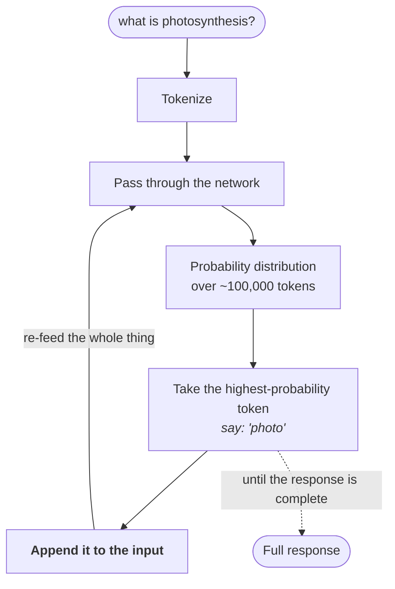

Pre-training finishes. Months of compute, terabytes of text, billions of parameters nudged into place. What you have at the end has a name.

> The output of pre-training is called the **base model**.

This note is what a base model is, what it can do, and — more usefully — what it cannot.

---

## What it has become

A base model has seen an enormous corpus of data. Over that corpus it generated a vast number of probability distributions, measured its loss, and **moved its parameters** accordingly. It has learned how its parameters should sit.

What you get out is precise, and modest:

> A neural network capable of producing the **next token in a sequence, based on a probability distribution**.

That is all. Give it `hello how are` and it will very likely continue with `you`. Give it `hello how` and it might continue `is the weather today`.

This is the **G** in GPT — *generative*. Generation is exactly this and nothing more.

---

## How generation actually works

> [!question]- When I ask about photosynthesis, does the model go and look that word up in the text it was trained on?
> **No.** And getting this wrong makes everything downstream confusing, so it is worth being exact.
>
> > [!danger] **It is not a substring lookup.** The model does not search the training corpus at inference time. It does not hold the corpus at all. The corpus shaped its parameters during training and then went away.

Here is what actually happens:

1. Take the input — *what is photosynthesis?* — and **tokenize** it into token IDs.
2. Pass those tokens through the network.
3. Get back a probability distribution across the whole vocabulary — on the order of a hundred thousand tokens, each with a probability. One might be 0.00001%, another 0.002%, and so on.
4. Take the highest-probability token. Say it is `photo`.
5. **Append that token to the input**, and feed the whole thing back through the network.
6. Get a new distribution. Take the top token. Append. Re-feed.

And repeat until the response is complete.

> [!important] The model generates **one token at a time**, and each new token becomes part of the input for the next one. There is no plan, no lookahead, no sentence assembled in advance. This is why it is called **autoregressive** generation, and it explains a great deal of LLM behaviour you will meet later.

During training this same loop runs, and at every forward pass the loss gets computed and the parameters keep getting tuned — for months.

---

## Inference

While we are here, the term for the other half of a model's life:

> **Inference** is the phase where you are actually *using* the neural network — the parameters are now fixed, the model is trained, and you are getting output from it.

Training tunes parameters. Inference uses them. They are different activities with different hardware profiles, which is part of the answer to why CPUs still exist.

> [!info] **This is where your job is.** Inference is described as the layer where an AI engineer spends the majority of their time. Everything in this chapter about pre-training is context; the work is on this side of the line.

---

## What a base model cannot do

This is the important half of the note, because it is what motivates the two stages after it.

At this point the model has done exactly one thing: read a huge amount of internet text and tuned its parameters. So:

### It cannot reason through a task

Ask a base model:

> **What is 2 + 5?**

It will **not** do what you want. It will not look at that and think: *this is a mathematical computation, the operator is +, the operands are 2 and 5, so I apply addition and arrive at 7.*

What it will do is predict the next token. That token might be `7`. It might equally be `the`. It might be something else entirely, depending on what tended to follow strings like that in the internet documents it read.

Getting the right answer, if it happens, is a statistical accident rather than a computation.

### It cannot behave as an assistant

No assistant-level behaviour. No agentic behaviour. You cannot build agents on top of it or hold a conversation with it, because **conversation was never in its training data** — pre-training filled it with blog posts, articles and web pages, not dialogue.

### It cannot remember anything new

Anything you tell it during use is not retained.

| Capability | Base model |
|---|---|
| Produce the next token by probability | ✅ |
| Reason through a problem | ❌ |
| Behave as an assistant or agent | ❌ |
| Memorise new information you give it | ❌ |

---

## Real base models

Models that are **only pre-trained on a raw corpus of text, without alignment post-processing**, are called base models — or raw base models. Real examples:

| Model | Note |
|---|---|
| **Llama 3 base models** | Meta Llama 3 **8B** and Llama 3 **70B** |
| **Mistral 7B** | |
| **GPT-2** | |
| **GPT-3 — the original Davinci release** | a purely pre-trained base model |

Those `8B` and `70B` suffixes are **parameter counts**, and that is what "small" versus "large" language model means:

> [!important] **Small and large refer to the number of parameters.** You will hear "a 1 trillion parameter model", "a 30 billion parameter model". Parameters are the `a`, `b`, `c` of the curve-fitting example — the knobs on the DJ console.
>
> You can see this concretely in a tool like **LM Studio**, where you pick a model to download and its parameter count is right there in the name. Even if you never train a model, **you should know what the word parameter refers to** when you choose one.

---

## What happens next

On top of these base models you run the two remaining stages — **supervised fine-tuning** and **reinforcement learning** — to turn a next-token generator into a general-purpose assistant.

---

> [!tip] Interview framing
> "The base model is what falls out of pre-training: a neural network that produces the next token by probability distribution, and nothing else. The mechanism is autoregressive — you tokenize the input, forward-pass it, get a distribution over the whole vocabulary, take the top token, **append it to the input**, and feed the whole thing back. One token at a time, each becoming input for the next. The misconception worth correcting is that it's a lookup — it isn't searching the training corpus at inference time; the corpus shaped the parameters and then went away. And what a base model can't do is the interesting part: ask it 'what is 2 + 5' and it won't identify an operator and operands and compute — it'll just predict a likely next token, which might be 7 or might be 'the'. It can't act as an assistant because dialogue was never in its training data, and it can't retain anything new. Llama 3 8B, Mistral 7B and the original GPT-3 Davinci are real examples. That gap is exactly what supervised fine-tuning and RL exist to close."
