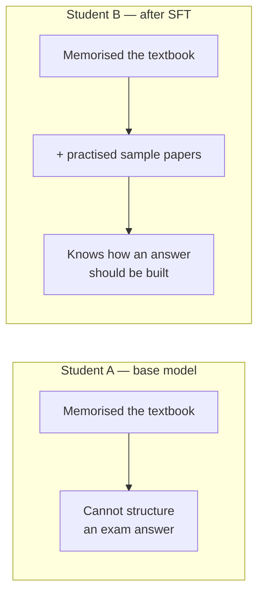
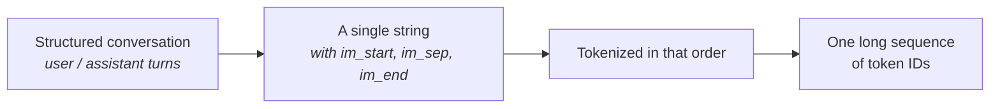

[[10-The-Base-Model]] ended with a model that predicts the next token and cannot do anything else. Now begins **post-training** — the phase whose whole purpose is to *turn the LLM into an assistant*.

The first step of it is **supervised fine-tuning**, usually shortened to **SFT**.

> **Supervised fine-tuning** is the process of continuing the training of your base model on a **curated set of conversations**.

---

## Why a model that read everything still can't answer anything

The analogy here is the best one in the chapter, and it earns its place because it explains a *failure*, not just a process.

> You are in class 10. You have learned your basic books — the English textbook, the Hindi textbook, the mathematics textbook. All of your core material.
>
> Now, to do well in the exam, you work through **sample paper books**. Why? Because the questions that actually appear in an exam look different from the text in the textbook.

Now consider two students.

**Student A has memorised every single word of the textbook.** Nearly every sentence. Is that enough to answer exam questions?

**No** — because that student does not know **when to use which set of sentences for which question**. They have rote-learned the material without learning how to deploy it.

**Student B has learned the books *and* practised sample papers.** They have seen how last year's questions were phrased and how an answer is supposed to be represented.

> Asked to prove a theorem about circles, Student B knows the shape of the answer: first write the problem statement, then set out your considerations, then cite the reference theorems, then begin the proof.

That structure was never in the textbook. It came from the sample papers.

> [!important] **Student A is a base model.** It has absorbed an enormous corpus and cannot structure an answer. SFT is handing it the sample papers.



---

## What the training data looks like

In SFT you feed the model a large quantity of **conversations** — and specifically **multi-turn** conversations.

> A **multi-turn conversation** is a back-and-forth: you say something, the assistant replies, you say something else, the assistant replies again. It is a continuous exchange, not a single message and a single output.

The base model's parameters then get fine-tuned against this new data, so it learns how to reply as a **helpful assistant** across different situations.

This fine-tuning can target a specific domain — a model that will only ever write code — or aim at general-purpose behaviour. Either way, what changes is the *kind* of text it is adapting to:

| Stage | What it learns from |
|---|---|
| Pre-training | internet text — blog posts, articles, tweets, pages |
| **SFT** | **conversation-based text** — how to be helpful, how to answer properly |

---

## How a conversation becomes tokens

Put a conversation into a token visualiser and you can watch this happen. Take:

```
user       →  what is 2 plus 2
assistant  →  the value of adding 2 and 2 is 4
user       →  what is the value of pi
assistant  →  the value of pi approximated to 2 decimal points is 3.14
```

That is not what gets fed in. What gets fed in has **special tokens** interleaved to mark structure:

```
im_start  user  im_sep  what is 2 plus 2  im_end
im_start  assistant  im_sep  the value of adding 2 and 2 is 4  im_end
im_start  user  im_sep  what is the value of pi  im_end
…
```

| Special token | Role |
|---|---|
| `im_start` | the start of a message |
| the role that follows it | who is speaking — **user** or **assistant** |
| `im_sep` | separator between the role and the message body |
| `im_end` | the end of that message |

> [!question]- Are `im_start` / `im_sep` / `im_end` just flags telling the model who is speaking?
> **Yes** — they are separator tokens, and that is exactly what they are for.



> [!important] **Under the hood it is a one-dimensional, long sequence of tokens. Nothing more, nothing less.**
>
> Even with a hundred thousand conversations, everything eventually collapses to a flat token sequence — the same thing [[08-Tokenization]] produced from raw web text. The structure lives entirely in those special tokens.

---

## The InstructGPT paper

The landmark result here is a **2022 OpenAI paper**, *Training Language Models to Follow Instructions with Human Feedback* — usually called **InstructGPT**.

**The problem it names.** Before it, base models like GPT-3 were trained on one core objective: predict the next word. So:

> Ask GPT-3 to **"write a poem about space"** and it might not write a poem. It might simply **auto-complete** the text — continue the sentence rather than obey the instruction.

**The core problem is misalignment**, and the paper's framing of it is worth quoting in substance:

> [!danger] **The misalignment trap.** Standard LLMs are trained on raw internet text. Internet text contains great information — and it also contains **toxicity, incorrect facts, and unstructured ramblings**.
>
> The statistically likely next word is not necessarily the word you need.

**What it did.** InstructGPT bridged the gap by taking a GPT-3 model and aligning it using **reinforcement learning from human feedback (RLHF)** — the subject of [[12-Reinforcement-Learning]]. Human labellers wrote the instructions defining how a conversation should go, and the model learned from those.

**The result that makes the point:**

> [!important] A **1.3 billion parameter** InstructGPT model **beat the original 175 billion parameter GPT-3** in human preference tests.
>
> That is a model **135 times smaller** winning on the thing users actually care about. Alignment is not a polish step applied at the end — it can dominate raw scale.

---

## Who writes all those conversations

Humans. Paid ones. There are dedicated companies supplying fine-tuning datasets for the SFT stage:

**Scale AI · Surge AI · Labelbox**

These are **infrastructure companies**, and the analogy for what that means is a good one:

> To build ships you need a shipyard. But you cannot simply build ships — a ship needs an engine, several kinds of steel, many different metals. Other companies supply those. Your expertise is building ships, not smelting steel plate, so you outsource.

Google and OpenAI are optimised for AI research and for training models. Supplying quality datasets is a different competence, so it is bought in. That is what makes these data companies foundational to the whole AI stack rather than incidental to it.

---

## Two stages, in one line each

The compression worth memorising:

| Stage | What the model is doing |
|---|---|
| **Pre-training** | reading all the characters |
| **SFT** | reading **worked examples and their expected solutions** |

So it learns that if someone asks *what is 2 + 2*, this is how you reply. And if someone asks *what is binary search*, you reply with example code in Python, plus time complexity and space complexity.

In other words: it learns **how experts actually answer**, and how humans actually talk to each other.

---

## What SFT still doesn't fix

> [!question]- How does the model know whether to just continue the text or actually work something out?
> The honest answer is that **after SFT you still have a model that generates the next token**. That is what any LLM does. What changed is the data it was tuned on — the base model's corpus had no conversations in it, only raw internet text, so it did not know how to compute, answer, or think.

> [!info] **Chain of thought, flagged for later.** The course returns to this with chain-of-thought prompting: give a model examples *and a way to think*, and it learns that for a certain kind of question, the next tokens it should generate are the **reasoning**, not the answer.
>
> The example given: *how much profit do I make buying a stock at 100 and selling at 120?* You show it that the buy price is 100, the sell price is 120, so the profit per unit is 20, and for 10 units that is 20 × 10 = 200.
>
> **The next token generated is not the direct answer. It is the sequence of thinking.** That idea is what makes reasoning models work, and it gets its own treatment later in the course.

---

## Guarantees

**It guarantees** that the model adopts the *form* of helpful assistant behaviour — it will respond to instructions rather than auto-complete them.

**It does not guarantee correctness.** SFT teaches the shape of a good answer, not the truth of one. A well-structured wrong answer is exactly what SFT optimises toward if the training conversations contain one.

**It is bounded by the labellers.** Everything the model learns about "a good reply" comes from what human annotators wrote. Their blind spots become the model's.

---

> [!tip] Interview framing
> "Supervised fine-tuning is the first post-training stage — you continue training the base model on curated multi-turn conversations. The analogy that explains why it's needed: a student who memorised the entire textbook still can't answer an exam question, because they don't know when to use which material. Sample papers teach the structure of an answer. That's exactly the base model's problem, since its corpus was blog posts and articles with no dialogue in it. Mechanically the conversations get flattened into one long token sequence with special tokens — im_start, the role, im_sep, the message, im_end — marking who's speaking. The landmark result is InstructGPT, the 2022 OpenAI paper: before it, asking GPT-3 to write a poem might just get you an auto-completion rather than a poem, because the objective was next-word prediction over raw internet text that contains toxicity and errors alongside good information. The number I'd quote is that a 1.3 billion parameter InstructGPT beat the 175 billion parameter GPT-3 on human preference — alignment beating a 135× size advantage."
