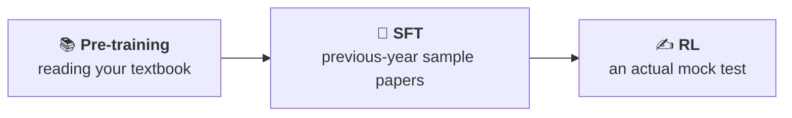
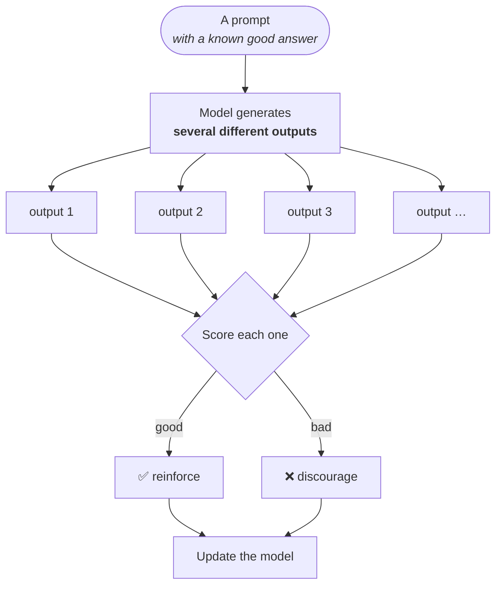
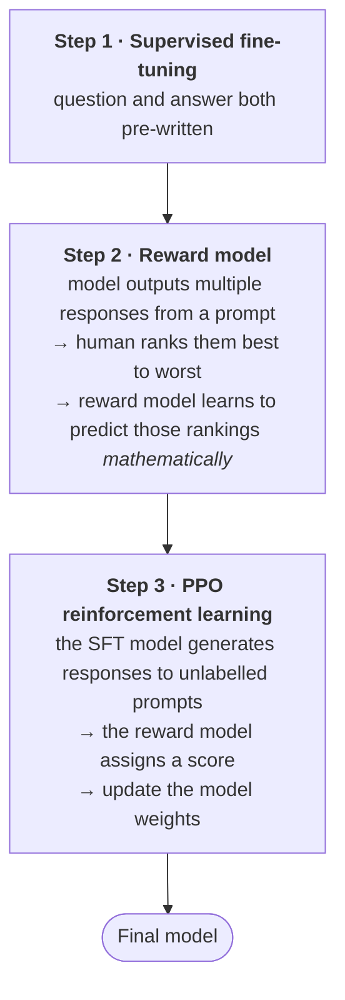

**Reinforcement learning** is the third and final stage. After supervised fine-tuning the model answers like an assistant; this pushes it one step further.

---

## The analogy, completed

This is where the schooling metaphor pays off in full:

| Stage | What you get | What is missing |
|---|---|---|
| Pre-training | a large corpus absorbed; knows what text follows what | no idea how to answer |
| SFT | question-and-answer pairs, both written for you | never had your **own** work judged |
| **RL** | you produce answers, someone **grades them** | — |

> In a mock test you submit your own answers to a teacher. The teacher marks the paper and gives feedback: *this isn't the right way to do it · this answer is wrong · you should explain this question a bit more.*
>
> That feedback on **your own work** is the thing the first two stages cannot provide.

---

## The mechanics

You give the network a problem or sample prompt, and instead of asking for *an* answer you ask it to generate **several different outputs**. Then you score them — this one is good, this one is bad, this one is good.

### A worked prompt

> **If I sell 20 units of Google stock at $400, which I bought at $350, what is my profit?**

Crucially, **as the human verifier you already know the answer.** That is what makes scoring possible.

The model takes multiple turns and produces a different output each time. You mark each one.

> [!important] **"Bad" is not only about the final answer.**
>
> An output can be marked bad because of **how it approached the problem** — how it arrived at the answer — even if the number at the end is right. There are different criteria on which good and bad get decided, and the reasoning path is one of them.
>
> This is the detail that makes RL different in kind from SFT rather than just more of it.

And it is not restricted to problems with numeric answers. Another prompt used:

> **Explain the merge sort algorithm in a simple manner.**

The model produces several explanations, and you score which are good. There is no arithmetic to check — only judgement about quality.

---

## Why this works: the two benefits

**1 · The model practises on its own output.**

Every one of those candidate answers was generated by the model itself, not written by a human labourer. It is getting feedback on **something it produced**, and we supply only the judgement of good or bad.

That is a genuine economic difference from SFT, where every training example had to be written by a person.

**2 · The model discovers reasoning strategies.**

Because it generates five different ways of reaching an answer, and the best one gets reinforced, the model learns *which style of reasoning works for which kind of question*.

> The payoff comes later. Given a new task, the model can work out for itself: **this is a known good way to arrive at this kind of answer** — and use that approach.

This is where reasoning ability actually comes from, and it connects directly to the chain-of-thought material flagged earlier.

---

## The RLHF pipeline, step by step

The full picture — **reinforcement learning from human feedback**, the technique named in the InstructGPT paper — runs in three steps, of which SFT was the first.

> [!important] The pivot between step 1 and step 2 is the thing to hold on to.
>
> In **SFT** we supplied the question *and* the answer. From **step 2 onward the answer is generated by the model** — humans only rank what comes back.
>
> And the **reward model** is the clever piece: rather than having a human score every single generation forever, you train a separate model to predict how a human would rank an output. Then step 3 can run at scale, with the reward model doing the grading and the weights updating from its scores.

---

## DeepSeek R1

Worth knowing who published this.

> [!info] **DeepSeek**, the Chinese model, was the first to release a **dedicated paper** explaining this reinforcement learning technique publicly — the **DeepSeek R1** paper. They showed that on mathematics problems it increased benchmark accuracy substantially.
>
> The nuance: **other companies were already doing it.** DeepSeek R1 was not necessarily first to the method — it was first to put the whole thing together **publicly**. The paper gets its own treatment later.

---

## How much of this do you need?

> [!question]- How many scored question-answer pairs does reinforcement learning actually need?
> **A lot.** Not ten questions, not twenty. Tuning a model this way needs a very large volume of scored generations — which is why, once again, this is not something an individual does.

---

> [!tip] Interview framing
> "Reinforcement learning is the third stage, and the analogy completes the set — pre-training is reading the textbook, SFT is previous-year sample papers, RL is sitting a mock test and having it graded. Mechanically you give the model a prompt whose answer you know, have it generate several different outputs, and score them. The key detail is that an output can be marked bad for **how it reached the answer**, not just for the answer itself — which is what teaches reasoning strategy rather than just correctness. Two benefits: the model is practising on its own generations rather than human-written examples, and because it produces several routes to an answer and the best gets reinforced, it learns which reasoning approach suits which question. The full RLHF loop is three steps: SFT with pre-written answers, then a reward model trained on human rankings of the model's own outputs, then PPO where the reward model scores unlabelled generations and the weights update. DeepSeek R1 was the first paper to explain the technique publicly, though other labs were already doing it."
