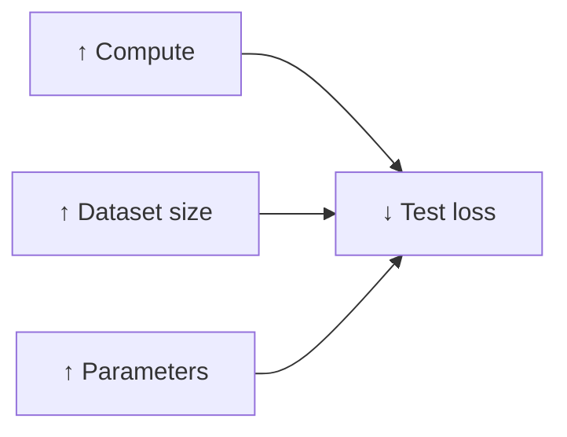
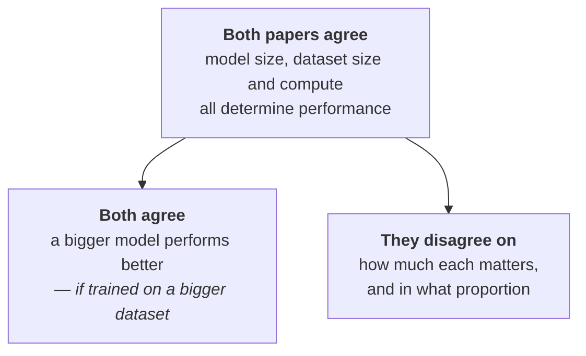

A question from the room, near the end of the session, which is the right question to end on:

> **What makes a model more powerful — the number of parameters, the size, or the training data?**

Two research papers answer it, and they do not fully agree. Both were set as reading.

> [!info] This note covers **only what was explained in the lecture** about these two papers. Reading them properly is a separate exercise.
>
> - **Scaling Laws for Neural Language Models** — OpenAI, 2020 · [arxiv.org/pdf/2001.08361](https://arxiv.org/pdf/2001.08361)
> - **Training Compute-Optimal Large Language Models** — DeepMind, 2022 · [arxiv.org/pdf/2203.15556](https://arxiv.org/pdf/2203.15556)
>
> Several authors of the first are now at Anthropic and elsewhere.

---

## Paper 1 — Scaling Laws for Neural Language Models (OpenAI, 2020)

The abstract's central claim, in its own words:

> *We study empirical scaling laws for language model performance on the cross-entropy loss. The loss scales as a power law with model size, dataset size, and the amount of compute used for training, with some trends spanning over seven orders of magnitude.*

Unpacked, that is:

| Term in the paper | What it means here |
|---|---|
| **cross-entropy loss** | the loss the model generates — the measure from [[09-The-Training-Loop]] |
| **model size** | the **number of parameters** |
| **dataset size** | the corpus you trained on |
| **amount of compute** | how much you trained it — how many iterations you could afford |

And the finding: **increase any of the three and the loss goes down.**

The paper shows this as three curves, and they all point the same way:

Test loss on the vertical axis; compute, dataset size and parameters on the horizontal axes. In all three cases, the loss decreases.

> The authors ran a large number of experiments training language models, and concluded that **how well a model performs depends directly on the size of the model, the training dataset, and how much you have trained it.**

### The three letters

The paper names them, and they recur constantly in this literature:

| Symbol | Meaning |
|---|---|
| **N** | number of parameters |
| **D** | dataset size |
| **C** | compute |

### Universality of overfitting

> *Performance improves predictably as long as we scale up N and D in tandem, but enters a regime of diminishing returns if either N or D is held fixed while the other increases.*

In other words: **increase both N and D together and performance keeps improving. Freeze one of them and you hit diminishing returns.**

Then the specific number, which is the part worth memorising:

> [!important] *The performance penalty depends predictably on the ratio* **N^0.74 / D** *— meaning every time we increase the model size by **8×**, we only need to increase the data by roughly **5×** to avoid a penalty.*
>
> So the two do **not** have to grow at the same rate. Grow the model eightfold, grow the data about fivefold, and you incur no penalty. Fail to do that and the paper reports underperformance.

### Universality of training

The paper's second useful claim:

> *Training curves follow predictable power laws whose parameters are roughly independent of model size. By extrapolating the early part of the training curve, we can roughly predict the loss that would be achieved if training for much longer.*

What that means practically: plot loss against training steps and the shape is **predictable**. If a training run is going to last a very long time, **most of the loss reduction happens in the early phases** — so you can look at the beginning of the curve and forecast where it will end up.

> [!info] That is enormously valuable given the economics. If a run costs millions, being able to extrapolate from the first fraction of it — rather than waiting months to find out — is the difference between one expensive experiment and many.

The paper also covers related practical facts, such as the optimal **batch size** to use.

### The figure

A series of training runs with models ranging from **10³ to 10⁹ parameters** — 10⁹ being a billion. The horizontal axis is tokens processed; the vertical axis is test loss.

The result is exactly what you would expect from the above: **smaller models have higher loss.** A billion-parameter model's loss is significantly lower than a small model's.

### On architecture

One more finding, which came up when a student asked whether there is an algorithm for deciding the number of parameters:

> The scaling-law paper reports that **how you distribute the parameters** — how you architect the internal layers — has **relatively little effect** on accuracy. What matters is the **number** of parameters.

> [!info] **Wide versus broad**, as used in the lecture. Look back at the artificial neural network diagram in [[01-What-Is-An-LLM]], which has two hidden layers.
>
> - Replace those two hidden layers with **20 hidden layers** → a very **wide** model.
> - Keep a **single hidden layer** but give it a great many activation functions → a very **broad** model.
>
> The claim is that if the parameter count is high, whether you went wide or broad does not matter much.

---

## Paper 2 — Training Compute-Optimal LLMs (DeepMind, 2022)

A newer paper — 2022 against 2020 — and, as the lecture puts it, with newer work come newer findings.

They also trained a large number of language models. Their conclusion:

> [!important] For training a model where you want to **optimise on compute**, the **model size** (number of parameters) and the **number of training tokens** (your dataset) should scale at **equal rates**.
>
> **For every doubling of the model size, your training tokens should also double.**

That is a direct contradiction of the first paper's ratio. Set them side by side:

| | OpenAI 2020 | DeepMind 2022 |
|---|---|---|
| If you grow the model **8×** | grow the data **~5×** | grow the data **8×** |
| Relationship | N^0.74 / D — **sub-proportional** | **proportional**, equal rates |
| On architecture | matters relatively little | **also matters**, at some level |

The DeepMind study additionally holds that parameter count matters **and** architecture matters to some degree — where the earlier paper had largely dismissed the architectural question. They derived equations relating how much compute and data you have to how you should increase parameters for good accuracy.

---

## Where they agree

It would be a mistake to read these as opposed. The disagreement is narrower than it looks:

> Both follow the same trajectory: size of the model, dataset size and compute matter. **How much** they matter, and **in what proportion**, is where the two takes differ. The DeepMind one is the more recent.

And the shared bottom line, which is the answer to the question this note opened with:

> **The bigger your model is, the better its performance will be — provided it is also trained on a bigger dataset.**

---

## What that costs

Someone asked what training GPT actually cost. There is no reliably published number, but the estimate given was blunt:

> [!danger] **Easily $100 million.**
>
> And the reason is now fully assembled from everything in this folder: you need **compute** ([[03-Why-GPUs]]), you need a **dataset** ([[07-Pre-Training-The-Data]]), you need **multiple training runs** ([[09-The-Training-Loop]]), and after all that you still need **post-training** — SFT ([[11-Supervised-Fine-Tuning]]) and reinforcement learning ([[12-Reinforcement-Learning]]).

---

## Guarantees

**They guarantee** predictability, which is their real contribution. Before this work, whether a bigger model would be better was a guess; after it, the relationship is a curve you can extrapolate.

**They do not guarantee the coefficients transfer.** The two papers disagree on the exponent using similar methods — which is itself the caution. A scaling law is an empirical fit over a particular family of models, not a law of nature.

**Bigger is only better in tandem.** The single most misread version of this work is "more parameters = better model". Both papers say the opposite when data is held fixed: scaling one alone enters diminishing returns.
