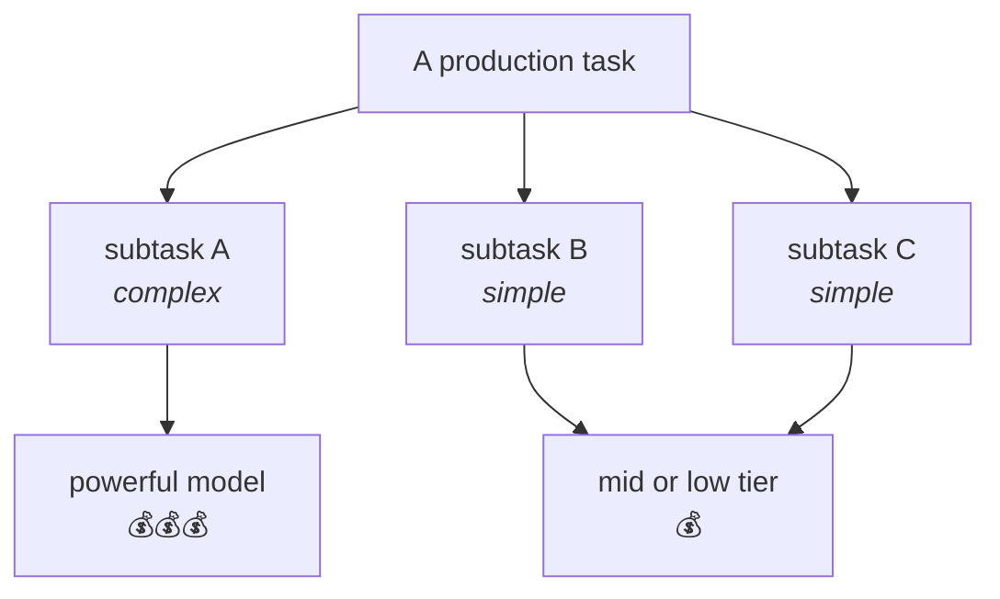
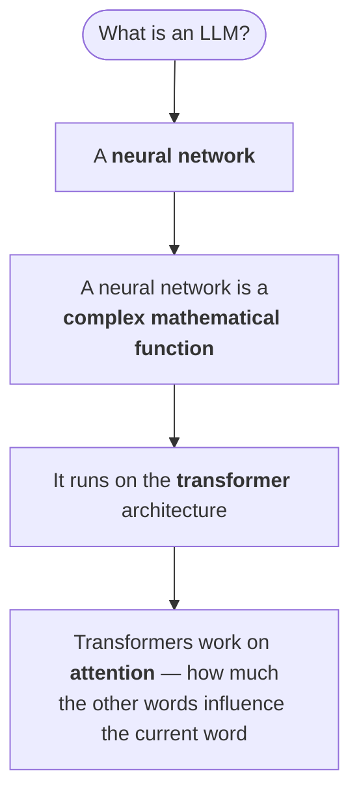
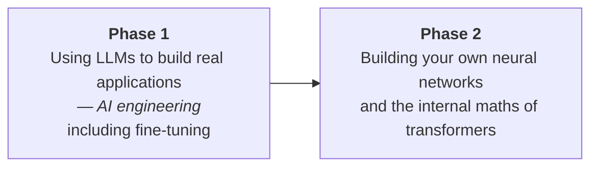

The fair question:

> **Does any of this actually matter to us as AI engineers?**

The answer is honest and slightly deflating, and it is the most practically useful thing in the chapter.

---

## Mostly, no

> [!important] For the **majority — 90% to 95% — of tasks, how a model was trained is not going to matter to you.**
>
> What matters is that you **understand what an LLM is**, and that you understand **which LLM is good for which type of task**.

Fine-tuning does draw on some of this theory. And if you go into **AI research** you will be training models and devising architectures, so all of it matters. But for AI *engineering* the relevant skill is knowing what a model is capable of and whether that capability is relevant to your task.

So why does the second half — picking the right model — matter so much? Because **LLMs are costly**.

---

## How LLM pricing works

Open any provider's model pricing page and you will find **two** prices per model, not one:

| | Charged per |
|---|---|
| **Input price** | every million tokens you send **in** |
| **Output price** | every million tokens the model generates **out** |

As an illustration of the shape: **$5 per million input tokens** and **$30 per million output tokens**.

Two patterns hold generally:

**Output costs more than input.** Usually considerably more. The reason:

> There is a lot of internal pre-processing and **internal reasoning** happening. For every step of that reasoning the model is also generating tokens — and you pay for those too.

This is the direct financial version of the earlier warning about not over-optimising token counts: the "wasted" tokens are frequently the thinking, and the thinking is what makes the answer good.

**More powerful means more expensive.** Within any model family there is a cheapest tier and a most capable tier, and the price gap between them is large.

---

## The consequence: don't use one model for everything

This is the practical rule, and it is stated flatly:

> [!danger] **It is not the case that you take the most powerful model and start building your application on it. That is not how it is done.**

In production, there is a good chance your task **subdivides into smaller subtasks**. And then you choose per subtask:

An example from a real project: multiple sub-level tasks, where some were handled by **Claude Haiku**, some by **Sonnet**, and some by **Opus** — the small, mid and large tiers of the same family, assigned by how hard the subtask was.

**Cost optimisation is part of the design**, not an afterthought.

---

## What actually decides which model

Two properties:

| Property | Meaning |
|---|---|
| **The configuration — how big the model is** | its **number of parameters** |
| **Its reasoning capabilities** | covered later, alongside chain of thought |

Both feed directly into cost. A model's price is largely decided by how many parameters have to be loaded and used, and by how much reasoning it does.

### How do you tell whether a task is complex?

> [!question]- How do you tell whether a task needs a bigger model or a cheaper one?
> Two contrasting examples:
>
> > **Simple.** You read a row from a database with five or seven columns, and you need to infer something from those values. You can query the database yourself, it is a very small amount of data, and you feed it to the model. **Even a simple LLM can do this.**
>
> > **Complex.** You have a **thousand-page PDF** and you want to determine whether a company is fraudulent. That will probably need a considerably more powerful model.

And an admission worth keeping:

> [!info] **Some of it is trial and error.** There is no formula. You try a cheaper model, see whether it holds up, and escalate if it does not.
>
> But note the catch: **even the trial and error costs you.** Every experiment is billed. That is a real argument for thinking carefully before testing rather than brute-forcing your way through the model list.

---

## The takeaway from the whole chapter

Rebuilt from scratch, the whole chapter compresses to this.

And how one is made:

| Phase | What happens | Why it isn't enough on its own |
|---|---|---|
| **Pre-training** | take a large corpus of text, convert it to tokens, feed it to the network so it learns | what it learns is **predicting the next token**, which is *not that useful* |
| **Supervised fine-tuning** | feed it good conversations | so it knows **how to reply** |
| **Reinforcement learning** | give it questions, have it generate multiple answers, rate the better ones | so it improves further |

Plus the scaling relationship:

> The bigger the network — that is, the **higher the number of parameters** — the better its performance. But you will need **higher compute** and a **larger dataset** to match.

> [!important] If someone asks you what an LLM is, this is the answer in two sentences:
>
> **An LLM is a neural network that runs on top of the transformer architecture.** The transformer architecture works on an **attention mechanism**, which works out how much influence the other words have on the current word under consideration.

---

## What comes next

Useful for orientation:

| When | Content |
|---|---|
| This week | Getting started **interacting with LLMs** — the OpenAI API, and coding around it |
| Week 2 | **Chain of thought** — why reasoning matters, and why a model cannot think in a single shot or a single token. Prompting throughout |
| Week 3 onward | **Agentic infrastructure** and agentic work |

The first two weeks are introductory interaction plus a lot of prompting; transformer internals come in the second phase.

> [!info] **Homework:** read both scaling-law papers and understand how the training aspects affect LLMs.
>
> And the advice attached to it, which is good general advice for reading any paper: **if you hit a term you don't understand, look it up with an LLM.** That is how you build the habit of reading papers rather than bouncing off them.

---

> [!tip] Interview framing
> "For most AI engineering work — 90 to 95% of it — how the model was trained doesn't matter. What matters is knowing what an LLM is and which one fits which task, and the reason that matters is cost. Providers charge separately for input and output tokens, and output is usually several times more expensive, because the internal reasoning generates tokens you pay for. So in production you decompose the task and assign models per subtask — on one project I'd point to using Haiku for the simple steps, Sonnet for the middle ones and Opus only where it's genuinely needed. The anti-pattern is picking the most capable model and building everything on it. How you judge complexity is partly experience — inferring something from a five-column database row is simple, deciding whether a company is fraudulent from a thousand-page PDF is not — and partly trial and error, keeping in mind that the trial and error is itself billed."
