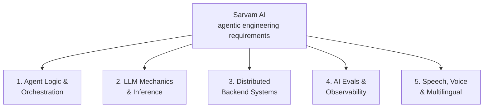

# Sarvam AI — Technical Competency Analysis and Preparation Roadmap

> Agentic engineering roles. Requirements breakdown, gap analysis, and a four-month plan.

---

## Company context

Sarvam AI is India's sovereign AI research and deployment enterprise, valued at **$1.5 billion** following a **$234 million** funding round led by HCLTech, Bessemer Venture Partners, Lightspeed, Peak XV, and Khosla Ventures. It is commissioned under the Ministry of Electronics and Information Technology's **IndiaAI Mission** to build native foundational infrastructure for **22 Indian languages**.

The company operates across the entire stack:

| Layer | Products |
|---|---|
| Foundation models | Sarvam 30B, Sarvam 105B |
| Speech | Saaras v3 (speech-to-text), Bulbul v3 (text-to-speech) |
| Visual document intelligence | Sarvam Vision |
| Agentic orchestration | Enterprise platform |

---

## The five competency buckets

### The misconception to kill first

A common candidate assumption is that an Agentic Engineer can work purely at the framework level — building ReAct loops, chaining high-level API calls — without understanding model internals.

> [!important] At Sarvam AI, agentic workflows run **directly on top of proprietary models and optimized inference engines**. Execution latency, tool-calling schema compliance, context window degradation, and deployment viability are all bound to model-level mechanics: subword tokenization, KV-cache allocation, attention variants, and quantized inference. The framework layer alone cannot explain or fix any of them.

---

## 1. Agentic frameworks and production orchestration

Engineers are expected to move beyond stateless prompt chains into complex, stateful, non-deterministic **graph architectures**. Production workflows use cyclic state-machine frameworks — LangGraph, Google Agent Development Kit (ADK), LlamaIndex.

- **Stateful multi-agent graphs** with dynamic supervisor routing, isolated per-agent tool registries, parent–child sub-graph execution, and role-based access control.
- **Model Context Protocol (MCP)** implementation to standardize tool definitions, resource sampling, and prompt context across enterprise deployments.
- **Interrupt-driven Human-in-the-Loop (HITL)** workflows that pause safely during ambiguous entity resolution or high-stakes tool execution, persist exact graph state to durable checkpointers, and resume seamlessly.
- **Strict structured outputs** via Pydantic, JSON Schema, or grammar-guided decoding, to guarantee deterministic payload formatting during function calls.

---

## 2. LLM mechanics, tokenization, and inference efficiency

Foundation models are not treated as black boxes here. Agent effectiveness in production depends on optimizing the model interaction layer directly.

**Attention variants.** Standard Multi-Head Attention (MHA), Grouped Query Attention (GQA) as used in Sarvam 30B, and Multi-Head Latent Attention (MLA) as deployed in Sarvam 105B. You must be able to *quantify* how each reduces memory footprint during extended agentic loops.

**Tokenization for Indic scripts.** Subword dynamics, Byte-Pair Encoding, Unicode normalization. The key metric is **token fertility**:

| Tokenizer | Tokens per word |
|---|---|
| Sarvam's specialized Indic tokenizers | **1.4 – 2.1** |
| Generic open-weight models | **3.0 – 4.0+** |

That gap is roughly a 2× reduction in both cost and context consumption for the same text.

**Inference serving.** vLLM, TensorRT-LLM, Triton Inference Server — with working knowledge of PagedAttention, speculative decoding, continuous batching, and KV-cache management to prevent OOM during long context turns.

**Context engineering.** Sliding-window compaction, semantic memory retrieval, prompt pruning, and dynamic system-prompt injection to prevent agent drift and hallucination across multi-turn execution.

---

## 3. Systems engineering, concurrency, and air-gapped deployment

Agents run as high-throughput, mission-critical services inside enterprise and public-sector environments.

- **Async Python** — `asyncio`, FastAPI, Pydantic v2 — alongside a performant backend language (Go or Rust).
- **Distributed systems** — asynchronous task queues (Kafka, AWS SQS, RabbitMQ), connection pooling, distributed locking (Redis Redlock), thread/worker pool concurrency.
- **Security-constrained runtimes** — Docker, Kubernetes, or K3s tailored for air-gapped, on-premise, or SOC2 / ISO 27001 compliant deployments.
- **Production API layers** — REST, gRPC, Server-Sent Events, and NDJSON streaming over long-lived HTTP sessions to expose agent progress in real time.

---

## 4. AI evaluation, observability, and data pipelines

Systematic quality control, to stop non-deterministic degradation in enterprise applications.

- **Automated evaluation harnesses** — trajectory evaluation, tool selection recall, exact-match code execution parsing, LLM-as-a-judge.
- **Distributed tracing and agent observability** — Signoz, Datadog, OpenLIT, or LangSmith — profiling token costs, tool execution latencies, and step-by-step failures.
- **Unstructured ingestion for RAG** — document parsing (PDFs via Sarvam Vision), hybrid dense/sparse search (BM25 + vector embeddings), reranking models, and vector database operations (Qdrant, Weaviate, Chroma).

---

## 5. Speech, voice AI, and multilingual integration

Given the flagship conversational products — Sarvam Samvaad, Saaras v3, Bulbul v3 — agentic engineers routinely interface with real-time speech components.

- **Bi-directional streaming pipelines** over WebSockets and WebRTC for low-latency STT and TTS.
- **Voice Activity Detection**, audio framing, signal denoising, and barge-in handling, holding **p95 end-to-end voice loop latency under 800 ms**.
- **Voice transport integration** — LiveKit, Pipecat, Twilio Media Streams, Exotel — wired into agentic state machines.
- **Code-switching** — input and output alternating between Indian languages and English *within a single turn*.

---

## Buckets summary

| Category | Primary competencies | Key technologies |
|---|---|---|
| **Agent orchestration** | Cyclic graph execution, state persistence, MCP server implementation, HITL interrupt architectures, structured schema enforcement | LangGraph, MCP, Pydantic, DynamoDB/Redis checkpointers |
| **LLM & model mechanics** | Attention math (GQA, MLA), tokenization efficiency, KV-cache optimization, native function calling, vLLM inference | PyTorch, HuggingFace, vLLM, Sarvam 30B/105B APIs |
| **Systems & backend** | High-concurrency async runtimes, worker pools, distributed locks, streaming protocols, air-gapped containerization | Python (FastAPI, asyncio), Go, Docker, K3s, Redis, PostgreSQL, gRPC |
| **Evals & observability** | Trajectory benchmarking, deterministic scoring, distributed tracing, hybrid RAG retrieval | LangSmith, OpenLIT, Signoz, Datadog, RAGAS, Qdrant, Weaviate |
| **Voice & multilingual** | Low-latency audio streaming, VAD, code-switching handling, voice transport integration | WebSockets, WebRTC, Saaras v3, Bulbul v3, LiveKit, Pipecat, Twilio |

---

# Candidate profile evaluation

Strong alignment in backend systems engineering and basic multi-agent development. Critical gaps in model-level mechanics and evaluation methodology.

## Existing strengths

**Production agent work.** A multi-agent HRMS platform on FastAPI and LangGraph — permission-scoped routing, tool registries, stateful orchestration.

**State and resilience patterns.** DynamoDB checkpointing for per-thread state isolation, TTL caching to shield flaky upstream APIs, and interrupt-driven HITL workflows with fuzzy-ranked entity resolution. These mirror the production patterns expected at Sarvam.

**Concurrency at scale.** Re-architecting a data ingestion engine from **25,000 → 300,000** records/day via worker-pool concurrency, connection pooling, and Redis distributed locking.

## Critical gaps

### 1. The LLM-mechanics misconception

The assumption that deep LLM knowledge is required for an *AI Engineer* but not an *Agentic Engineer* does not survive contact with Sarvam. They train their own models and build their own inference layers; agentic engineers optimize execution over those specific models.

Without MLA, KV-cache allocation boundaries, subword token fertility, and function-calling fine-tuning, you cannot diagnose non-deterministic tool failures, manage context window costs, or minimize production latency.

### 2. No formal evaluation methodology

Runtime engineering (checkpointing, NDJSON streaming) is present; systematic evaluation is not. Sarvam explicitly mandates an **evals mindset**. The expectation is designing automated harnesses measuring trajectory correctness, tool selection recall, and output drift across model iterations.

### 3. No real-time voice or streaming audio

Project experience is text-based HTTP/NDJSON. The core platform is real-time speech. WebSockets, WebRTC, VAD, and streaming voice transports are all unaddressed.

### 4. No vector search or air-gapped infrastructure

Database experience concentrates on MySQL, DynamoDB, S3, Redis. The role needs dedicated vector databases (Qdrant, Weaviate), hybrid retrieval (dense embeddings + sparse BM25), and minimal-dependency containerization (Docker, K3s) for air-gapped or security-hardened environments.

---

# Role differentiation

## Applied AI Engineer (Sarvam Agents) / Forward Deployed Software Engineer

Operates at the intersection of product engineering, customer deployment, and applied research. Owns delivery of agentic solutions — voice agents, document intelligence workflows, enterprise automation — directly into client environments.

Technical focus: context engineering, stateful LangGraph design, MCP integration, custom eval harnesses, cost/latency optimization, real-time voice orchestration (LiveKit, Pipecat, Twilio).

Demands high agency, systems thinking, customer-facing technical communication, and adaptation to diverse client infrastructure.

## Backend Engineer (Autonomous Agents / Chanakya Platform)

Builds the core platform, execution runtimes, and infrastructural "atoms" powering the ecosystem: production MCP servers, minimal-dependency containerized runtimes for air-gapped environments, unstructured ingestion pipelines (PDFs, audio transcripts, geospatial feeds), high-throughput low-latency API gateways.

Requires advanced distributed systems design, async Python with Go or Rust, container orchestration (Docker, K3s, Kubernetes), database scaling (PostgreSQL, Redis, Qdrant), and security-hardened API architecture.

## Side by side

| Dimension | Applied AI Engineer / FDSE | Backend Engineer (Autonomous Agents / Chanakya) |
|---|---|---|
| **Primary focus** | Applied customer solutions, agent workflows, voice integration | Core infrastructure, MCP runtimes, API gateways, data pipelines |
| **Key frameworks** | LangGraph, Google ADK, LiveKit, Pipecat, LlamaIndex, RAGAS | FastAPI, asyncio, Pydantic, Docker, K3s, Go/Rust, Qdrant |
| **Model interaction** | Context engineering, tool calling, prompt tuning, trajectory evals | Low-latency inference integration, payload validation, token streaming |
| **Deployment context** | Enterprise cloud, client VPCs, WhatsApp, voice streaming channels | Air-gapped, security-hardened, on-premise, minimal-dependency |
| **Core competency** | High agency, client problem translation, rapid prototyping to production | Distributed systems design, high concurrency, API design, reliability |

---

# The assessment process

Four to five rounds, testing practical engineering capability, domain knowledge, and problem solving.

### Stage 1 — Portfolio screening and timed practical assessment

Resume and portfolio screen focused on practical software engineering, open-source contributions, and AI/NLP project work.

Frequently followed by a **timed practical build** — for example, a functional VAD pipeline or a real-time streaming data processor inside a strict **2.5-hour** window. Graded on detection accuracy, resource optimization (CPU/GPU load reduction), code organization, edge-case handling, and latency (target: **p95 under 800 ms**).

### Stage 2 — Technical phone screen

**45–60 minutes** with an engineer or researcher. Foundational CS plus role-specific concepts: data structures, algorithms, async Python execution models, system design fundamentals, subword tokenization mechanics (how BPE handles Indic morphology), and basic transformer attention.

### Stage 3 — Deep technical AI and agentic architecture

**60–90 minutes** on model internals and agentic system design.

*Model side:* derive or explain attention computation over $Q, K, V$; compare MHA vs. GQA vs. MLA; explain positional encodings (RoPE); discuss Pre-LN vs. Post-LN normalization.

*Agent side:* LangGraph state isolation, DynamoDB vs. Redis checkpointing trade-offs, custom MCP server construction, schema validation, context compaction. Plus: how you would design a deterministic evaluation harness to catch trajectory drift.

### Stage 4 — High-scale systems and AI infrastructure design

**60 minutes** of architecture. Representative prompts: a real-time voice translation and agent orchestration API supporting **1,000,000 concurrent interactions/day across 12 Indian languages**; or an air-gapped document ingestion platform with zero external internet access.

Probes scalability, message queue selection (Kafka vs. SQS), vector database sharding, caching strategy, rate limiting, and inference latency management.

### Stage 5 — Founder and leadership conversation

**30–45 minutes** on high agency, cultural fit, alignment with the sovereign-AI-for-India mission, technical philosophy, and effectiveness in an outcome-oriented startup.

---

# Four-month preparation roadmap

## Month 1 — Foundation model mechanics, transformers, tokenization

*Objective: stop treating LLMs as external black-box APIs.*

**Week 1 — Attention.** Derive and implement single-head and multi-head self-attention ($Q, K, V$) from scratch in PyTorch. Analyze GQA (Sarvam 30B) and MLA (Sarvam 105B), calculating theoretical KV-cache memory savings during long-context generation. Study positional encodings, contrasting sinusoidal with RoPE.

**Week 2 — Tokenization and Indic scripts.** Implement BPE. Evaluate token fertility across languages. Benchmark standard open-source tokenizers against Sarvam's Indic tokenizers on Devanagari and South Indian scripts. Build text normalization utilities handling Unicode NFC/NFD and Indic grapheme cluster boundaries.

**Week 3 — Inference serving and memory.** KV-cache allocation math — exact GPU VRAM footprint for context length $L$, batch size $B$, layer count $N$, hidden dimension $D$. Stand up local serving with vLLM: PagedAttention, continuous batching, speculative decoding. Profile Time to First Token and Time Per Output Token under varying concurrency.

**Week 4 — Fine-tuning and function calling.** SFT alongside PEFT techniques (LoRA, QLoRA). Analyze how function-calling prompts are formatted at the token level and enforced via grammar-guided decoding (Outlines, vLLM guided decoding).

## Month 2 — Agent orchestration, MCP, evals infrastructure

**Week 5 — Advanced LangGraph.** Supervisor-worker multi-agent graphs, sub-graph delegation, conditional branching, exception handling. Implement state compaction that prunes long execution histories without losing critical state variables.

**Week 6 — MCP.** Study the specification. Build custom FastMCP servers exposing tools, resources, and prompts over Stdio and SSE transports. Enforce payload validation with Pydantic v2. Construct a multi-tenant MCP gateway that dynamically injects user permissions into tool calls.

**Week 7 — Evaluation harnesses.** Build an evaluation pipeline from scratch benchmarking trajectory correctness, tool selection recall, and output accuracy via LLM-as-a-judge. Wire it into CI/CD to catch prompt and tool regressions automatically.

**Week 8 — Advanced RAG.** Hybrid retrieval combining dense vector search (Qdrant/Weaviate) with sparse BM25, merged via Reciprocal Rank Fusion. Integrate Sarvam Vision for structured extraction from complex PDFs.

## Month 3 — Real-time audio, voice AI, high-concurrency systems

**Week 9 — Async Python.** `asyncio` internals, task groups, backpressure handling, process pools for CPU-bound work. Implement rate limiting, connection pooling, and circuit breakers with FastAPI and Redis.

**Week 10 — Bi-directional audio streaming.** A FastAPI WebSocket service processing streaming PCM/Opus audio. Integrate VAD to detect speech boundaries, manage barge-in, and profile frame transmission latency.

**Week 11 — Voice orchestration.** Integrate Saaras v3 (STT) and Bulbul v3 (TTS) into LiveKit or Pipecat. Implement turn-taking logic, buffer management, and pipeline optimization to hit **p95 under 800 ms** end to end.

**Week 12 — Enterprise distributed infrastructure.** Kafka or AWS SQS for asynchronous worker-pool processing. Production Dockerfiles and Kubernetes/K3s manifests for minimal-dependency, air-gapped environments.

## Month 4 — Sovereign-scale design, portfolio, interview drills

**Week 13 — Systems design.** Practice high-scale AI architecture: a multilingual voice agent handling **1,000,000 daily queries across 12 Indian languages**. Address GPU pool load balancing, vector database sharding, multi-region data routing, API rate limiting.

**Weeks 14–15 — Capstones.** Complete and document two open-source projects tailored to the Sarvam stack. Clean architecture, real test coverage, Docker containerization, and READMEs carrying latency and evaluation benchmarks.

**Week 16 — Drills.** Timed algorithm sessions, whiteboard transformer math, and mock leadership interviews rehearsing high agency and mission alignment.

## Execution schedule

| Month | Focus | Core competencies | Tangible deliverable |
|---|---|---|---|
| **1** | Model mechanics & tokenization | Self-attention in PyTorch, GQA/MLA KV-cache math, BPE fertility scripts, vLLM serving | PyTorch transformer module + Indic token fertility benchmark suite |
| **2** | Agent graphs & evals infra | LangGraph sub-graphs, FastMCP server, automated trajectory eval harness, hybrid RAG | Production FastMCP server + automated trajectory eval pipeline |
| **3** | Streaming voice AI & systems | asyncio, WebSockets/WebRTC audio, VAD, LiveKit integration | Sub-800 ms real-time voice agent on Saaras v3 + Bulbul v3 |
| **4** | Sovereign system design & portfolio | Large-scale AI architecture, repo finalization, timed coding and design drills | Published capstone repositories + system design dossier |

---

# Capstone blueprints

Two open-source projects engineered to demonstrate stack alignment during resume screening.

## Capstone 1 — Production-grade multilingual voice agent with native MCP architecture

A real-time multilingual conversational voice agent for enterprise workflows such as banking or customer support.

- **Transport.** FastAPI backend running a WebSocket server over streaming PCM/Opus audio. VAD detects speech boundaries, manages barge-in, and holds latency down.
- **Speech.** Saaras v3 for streaming recognition, Bulbul v3 for synthesis, across Hindi, Tamil, and English code-mixed input.
- **Orchestration.** A stateful LangGraph graph connected to a custom FastMCP server exposing validated enterprise API tools via Pydantic v2 schemas.
- **State.** DynamoDB checkpointers for thread state; Redis for session locking and TTL caching.
- **Delivery.** Fully containerized, with a benchmark suite measuring p95 voice loop latency.

## Capstone 2 — Autonomous agent evaluation harness and KV-cache latency profiler

An open-source framework profiling multi-agent trajectory accuracy, tool selection correctness, and inference efficiency across Indic-focused models.

- **Trajectory engine.** Runs benchmarks comparing agent execution paths against gold-standard paths using LLM-as-a-judge.
- **Metrics.** Tool-selection precision and recall, schema compliance rate, context compaction loss, subword token fertility across Indian languages.
- **Inference profiler.** TTFT, TPOT, and KV-cache memory consumption against vLLM endpoints across expanding context lengths.
- **Tracing.** OpenLIT and OpenTelemetry, exporting execution metrics to a Signoz dashboard.

---

# Strategic recommendations

1. **Refactor the core mental model.** Drop the assumption that agentic engineering is separable from LLM mechanics. Prioritize attention architectures (GQA, MLA), tokenization dynamics, KV-cache allocation limits, and function-calling mechanics.

2. **Lead with production backend mechanics on the resume.** FastAPI, LangGraph, DynamoDB checkpointing, Redis locking, worker-pool concurrency. Reframe past projects around state persistence, latency profiling, and system resilience.

3. **Execute the roadmap in order.** Keep the monthly progression, with equal weight on transformer math, MCP server construction, streaming voice, and sovereign system design.

4. **Publish and document the capstones.** Build, dockerize, publish. READMEs must carry latency benchmarks, architecture diagrams in text form, and clear setup guides.
