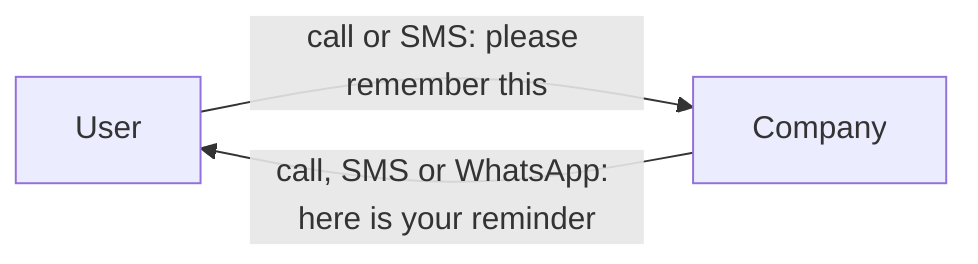
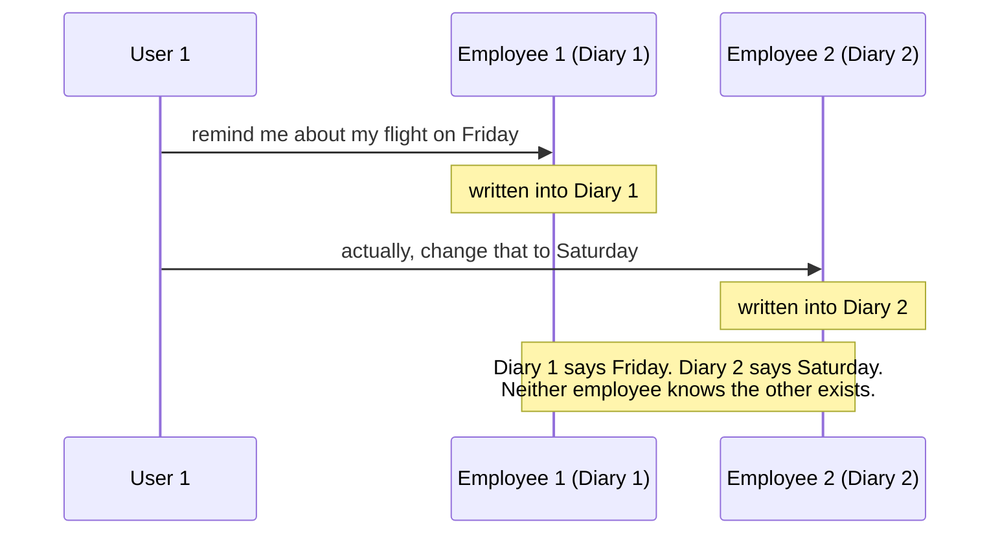
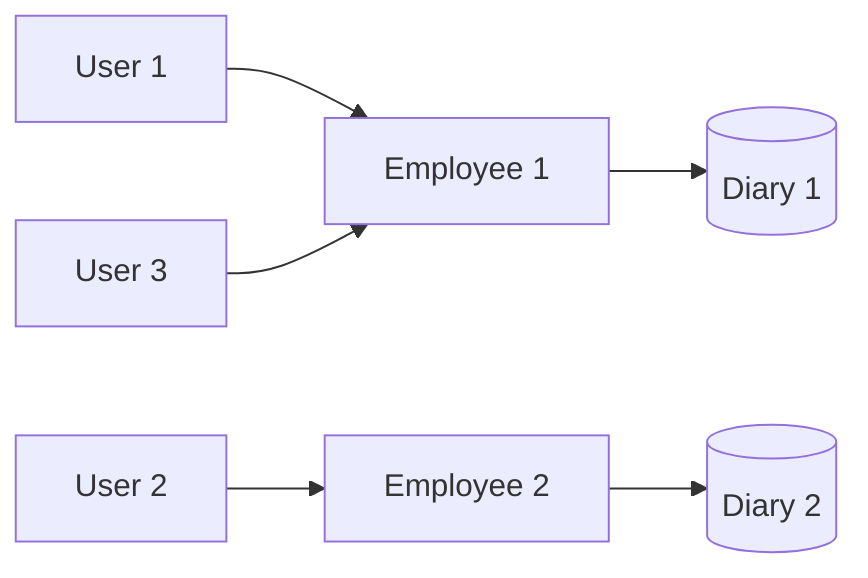

Backend engineering is usually presented as a pile of tools — a framework, a database, a cache, a message queue — and the tools arrive before the problems they solve. This note does the opposite. It starts with a company that owns no computers at all, runs it until it visibly falls apart, and only then asks what piece of software each failure was quietly demanding.

# Three steps that repeat

These three repeat for every idea that follows.

1. **Understand the concept.** What the thing is, on its own terms.
2. **Understand the flow.** How data actually moves through the operation — what happens first, what happens next, what is waiting on what.
3. **Build a working system.** Not a diagram of one. A running one.

Do those three consistently for each new idea and the next gets easier, because most of backend engineering is the same handful of problems wearing different clothes.

# The startup

People forget things. They forget assignments, they forget appointments, they forget genuinely important business tasks. So the business is simple: **we remember things for people, and we remind them at the right moment.**

That is two responsibilities, not one, and it is worth separating them now because they stay separate all the way down.

- **Accept and store** whatever a user asks us to remember.
- **Deliver** the reminder back to them at the time they asked for.

Nothing about this is technically ambitious. That is the point — we want the problems to come from the situation, not from the ambition.

# Version zero: two phone numbers and a diary

Assume for a moment that nobody at this company knows how software is built. We have an idea and no engineering. What can we ship this week?

We can ship a phone number. We give ours to the users, we take theirs, and we announce a three-month free trial to pull in the first customers.

- **To register a reminder**, the user calls us or sends an SMS.
- **To deliver a reminder**, we call them, SMS them, or send a WhatsApp message.

That is a real, working reminder service. It has customers and it does the job.

> [!important] **The user does not care how you do it.**
> If you are hungry and you order food, you are not thinking about the dispatch algorithm assigning a rider. You are thinking about whether the order went through and when the food arrives. Two food delivery companies can have wildly different internals and you would never know, because what reaches you is the same: the order was accepted, and the food showed up. Our users are identical. They want the reminder registered and the reminder delivered. **How** we remember it is our problem and must stay our problem.

# The thing you built without noticing

The moment you exchange phone numbers you have built something with a name: a **communication standard**. It is an agreement on how two parties are allowed to talk to each other.

It matters that the standard is fixed, and it matters that it is announced. If you never decide how people are supposed to reach you, they will invent their own ways. Someone will email you, because email obviously exists and seems like a reasonable channel. You never offered email. Nobody is watching that inbox. Their reminder is lost, and from their side you simply failed.

So the standard has to be **stated, consistent, and not quietly deviated from.** Both sides have to know the rules, and both sides have to follow them.

# The diary

Where does a reminder actually go once someone phones it in? Into a diary. A physical paper one.

This is a genuinely reasonable choice for a company with no software. Diaries already have dates printed on them, which is exactly the shape of the data. Someone calls on the 20th and says to remind them on the 25th of December to wish their business colleagues a Merry Christmas — you turn to the 25th of December and write it down. Later, you can always turn back to that page and read it.

It works. Now let us break it.

# Breaking the diary

## You can lose it

The diary is the only copy. If it is lost, stolen, or torn, every reminder every customer ever gave you is gone at once. Losing user data is losing money, and it is also the one failure a reminder service cannot survive — the entire promise was that we would not forget.

What this failure is asking for is **backups**. Every time the diary gains new data, that data needs to exist somewhere else too.

## You cannot search it

One diary with a handful of entries is fine. One diary with thousands of entries across hundreds of customers is not. Answering the question of what a specific user asked us to do means reading pages until you find it.

What this is asking for is **efficient retrieval** — some way to find a specific entry that does not involve scanning everything.

## One diary and many employees fight over it

At first the company is one person doing everything. Then it grows. Now when a user calls, employee one might answer, or employee two might answer, and whoever answers needs to write in the diary.

There is one diary. Everybody rushes for it. Two people cannot write in it at the same time, so somebody waits, and while they wait the customer is on the phone listening to silence.

## Many diaries drift apart

The obvious fix is to give every employee their own diary. That removes the fight entirely — and immediately creates a worse problem.

The user called once and got employee one. They called again to update the reminder and the call routed to employee two. Employee two has no idea a Friday entry exists, so they write Saturday in their own diary. Now the company holds two contradictory answers to the same question and no way to tell which is correct.

What this is asking for is **keeping copies in sync** — the problem you inherit the instant you have more than one copy of anything.

## The relationship manager fix, and what it costs

There is a way out that needs no technology: give every user a permanent assigned employee. User one always reaches employee one. Employee one holds everything about user one, and employee two knows nothing about user one and never needs to.

This genuinely works. Each user's data lives in exactly one place, so it cannot contradict itself. But look at what has been traded away — every user is now dependent on one specific person being available.

## It does not scale

Suppose an employee is the relationship manager for a hundred users. Most of the time this is fine. Then two of those hundred call at the same moment.

One of them waits. Not because the company is out of employees — there might be twenty others sitting idle — but because those twenty are the wrong employees. They do not have this user's diary.

More users means more employees, and an overloaded employee gets slower and starts making mistakes. What this is asking for is a way to **handle more load without every request being pinned to one specific worker.**

## The diary is written in a private language

The last failure is the one people miss, and it is the most expensive.

An employee writes in their diary however they like. Their own shorthand, their own abbreviations, their own ordering. It works perfectly, for them.

Then they leave the company. You hand their diary to a replacement, who opens it and cannot read it. **The data is physically present and practically worthless.** The company did not lose the diary — it lost the ability to interpret it.

> [!important] **Data that only one person can read is not stored, it is hostage.**
> The fix is to mandate the format up front: every diary is written the same way, so any employee can pick up any diary and be useful immediately. This is not bureaucracy for its own sake. It is what makes the data outlive the person who wrote it.

# What the diary and the employee actually were

Step back and the manual company has exactly two moving parts, and both have names in the technical world.

| In the manual company | What it really is |
|---|---|
| The **diary** — where reminders are written and read back | Your **storage solution** |
| The **employee** — who takes the call, understands the request, writes it down, calls back | Your **request processing solution** |

Every complaint above attaches to one or the other. No employees means no requests get handled. No diary means nothing is remembered.

# The full list, before a single line of code exists

This is what the situation demanded, purely from watching a paper-and-telephone company operate:

| The failure | What it is asking for |
|---|---|
| The diary can be lost or destroyed | Backups |
| Finding one entry means reading everything | Efficient retrieval |
| Employees fight over the single diary | Handling concurrent access |
| Separate diaries contradict each other | Keeping copies in sync |
| One employee, a hundred users, simultaneous calls | Scale |
| A departing employee takes the meaning with them | A standard, documented format |
| Users invent their own ways to reach you | A stated communication standard |

Not one of those problems was invented by computers. They exist in a company with no computers at all. Software does not create these problems — it is what we reach for once we admit the manual version cannot solve them.

# The decision to automate

So the founder makes the obvious call: remove the manual layer. No more employees answering phones, no more paper. Build a piece of software that does all of it, and call the service **Remindly**.

Which raises the question everything else follows from. We are going to write a program. Our users are somewhere else entirely, on their own phones and laptops. **How does a piece of software running on our machine end up talking to a piece of software running on theirs?**
