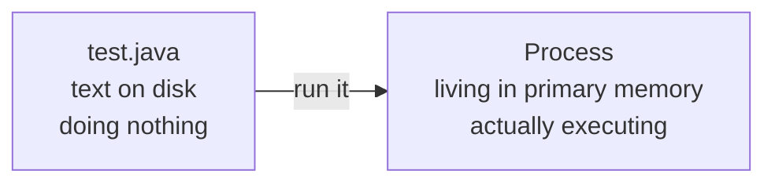
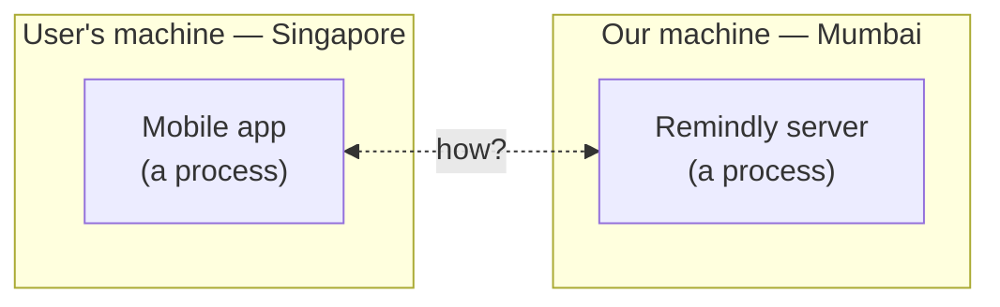
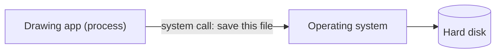
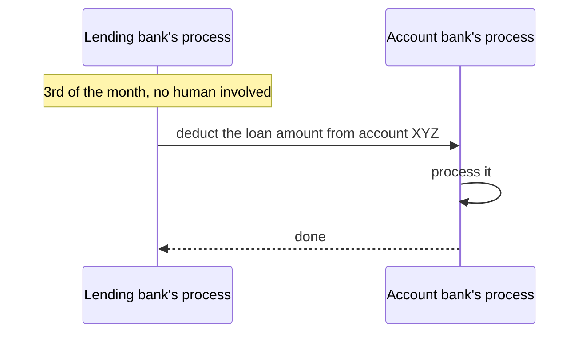
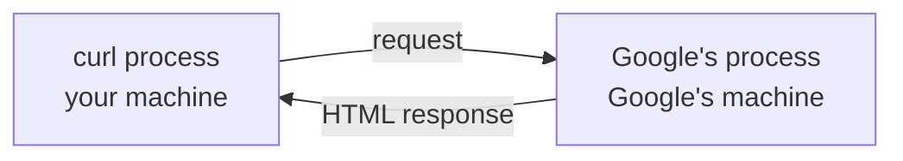

We decided to replace the phone-and-diary company with software. Before we can ask how our software talks to our users, we have to be precise about what a piece of running software actually is — because the answer turns out to be the thing that defines client and server.

# A program is just text

Building software starts with writing a set of instructions in some programming language. That set of instructions is called a **program**, and there is nothing more to the definition than that: a program is a set of instructions.

Put them in a file — `test.java`, or `test.py` — and look at what you have. A file on disk containing characters. It is not doing anything. It cannot do anything. It is text, and it will sit there being text forever.

> [!info] **Compiled or interpreted does not matter here.**
> Different languages take different routes from source text to something the machine executes. That distinction is real and it matters elsewhere. For understanding backends it can be set aside — what matters is only that at some point you **run** the thing.

# Running it makes a process

The moment you run that program, it stops being text and becomes a **process**.

> [!important] **A process is a program under execution.**
> That is the whole definition. The program is the instructions sitting still; the process is those instructions actually being carried out.

The transition is what changes everything:



A process is no longer on the hard disk. It lives in **primary memory** — RAM — and it has been handed things it did not have as a file:

- **A process ID.** A unique number identifying it. Your machine is running a great many processes at once — the browser, the antivirus, the terminal, a text editor — so each needs an identifier to be told apart from the others.
- **A dedicated memory area.** Its own region of RAM that belongs to it. That region is itself divided into parts, among them a stack and a heap.

Every application you can point at is a process. The browser you are reading this in is a process. So is the terminal, so is the antivirus, so is the text editor.

## Processes you cannot see

Not every process has a window. Open a text editor and you can see it and click on it — that one runs in the foreground. But something also has to notice each key you press and put the right character on screen, and you have never seen that program's window because it does not have one.

A process that runs in the background with no interface is called a **daemon process**. It is worth knowing the name now, because it is about to break a definition that most people carry around.

# The client is a process too

Back to Remindly. We write our software, we run it, and it becomes a process on our machine. Fine.

But our users need to reach it, and they will reach it through something we give them — a mobile app, a web app, whatever it is. That app runs on **their** machine. Their phone, their laptop, their tablet.

Which means it is also a process. It is a program that somebody wrote, running on somebody's machine, living in that machine's memory.



So the actual problem is now stated exactly: **two processes, on two machines, physically far apart, need to communicate.** The user might be in Australia or Singapore or India while our machine sits in Mumbai.

## Why that is different from anything you have done before

You have already made processes communicate, and it was easy — which is exactly why the hard version needs pointing out.

Open a drawing program, draw a few shapes, save the file. To write that file to disk, the drawing program does not do it itself. It asks the operating system to, through a **system call**. That is one process talking to another.



No internet was involved. No network. Both parties were on the same machine, and the operating system was right there to be asked.

Our situation has none of that. Two machines, thousands of kilometres apart, no shared operating system, nothing physically connecting them. That is a genuinely different problem and it needs genuinely different machinery.

# Client and server, defined properly

This is the point where the first real piece of vocabulary arrives: **client-server architecture**. And it is worth being careful, because the definition most people carry is wrong in a way that will mislead you later.

> [!warning] **The common definition is too narrow.**
> Most people will tell you the client is the part the user interacts with and the server is the part where the logic lives. That description fits many cases, which is why it survives. But it quietly implies that a client must be something with a screen and buttons, and that is false — and the false part is where the interesting examples live.

Here are the definitions worth holding onto:

> [!important] **Client:** any process that makes a request for a task to be done.

> [!important] **Server:** any process capable of accepting an incoming request, processing it, and returning a response.

Read those again and notice what is absent. No mention of a user interface. No mention of a screen, a button, or a human. Both definitions start with the same three words — any process.

So a client can be a web app, a mobile app, a tablet app, a smartwatch app, a daemon process you cannot see, or a program you wrote in C++ and ran five seconds ago. What makes it a client is not what it looks like. It is that **it asked for something**.

And in our case the mapping is straightforward: the app on the user's phone is the client, and the Remindly software on our machine is the server.

# Three clients with no interface at all

The definition earns its keep when you look at requests nobody clicked a button to send.

## A loan repayment

You borrow money from one bank and repay it monthly. Your account is at a different bank. On the 3rd of every month, the loan amount leaves your account.



Nobody sits at the lending bank on the 3rd deciding it is a good time to collect loans. A process running on their machines triggers the request on schedule. That process is a **client** — it asked for something. The receiving bank's process is the **server**.

## A scheduled investment

The same shape. You set up a recurring investment so that on the 5th of every month, ₹15,000 leaves your account and goes into the investment. You are not there. You did not press anything. One process makes the request, another process serves it.

## A subscription auto-payment

You subscribe to a fitness service and pay ₹500 monthly through a card or a payment app. On the 1st of each month the service pulls that ₹500.

There is nobody at the fitness company working through a list of subscribers and clicking a button for each one. Processes on their machines raise the requests automatically. **The fitness company's processes are the clients. The card or payment provider's processes are the servers.**

> [!important] Notice which way round that is. The company you pay is the client here, and your bank or payment provider is the server. Client and server are roles in a single exchange, not permanent labels on companies or machines.

# Watch it happen

You can be a client yourself in one line. This is a terminal command, not a file:

```bash
# terminal — the whole request is this one line
1  curl https://www.google.com
```

Press enter and HTML pours down the screen. That is the actual page source, roughly 85,000 characters of it, and the first line of it looks like this:

```html
1  <!doctype html><html itemscope="" itemtype="http://schema.org/WebPage" lang="en-IN"><head>...
```

Trace what just happened. You typed a command in a terminal. That command ran a program called `curl`, which knows how to make network requests. Running it created a **process on your machine**. That process contacted machines owned by Google, asked for a page, and was given one.



Google is not running on your laptop. Their software runs on their machines. So the `curl` process is the client and Google's process is the server — and at no point was there a window, a button, or anything to click. There was a process that asked, and a process that answered.

# One piece of vocabulary that trips people up

Strictly, a server is a process. In practice you will constantly hear people call the **whole machine** the server — I have a server running, the server is on that box over there, we need to restart the server.

That usage is fine and you should not fight it. Just translate it correctly in your head: when someone says the machine is the server, what they mean is that **a process capable of accepting requests is running on that machine.** The process is still the server. The machine is where it lives.

# Where this leaves us

We know what our two ends are. A client process on the user's device, a server process on ours, on machines far enough apart that no cable will ever join them.

What we still have no answer for is the connection itself. Two processes that have never met, on opposite sides of the world, with no shared operating system to mediate — **what makes it possible for one to say anything the other can understand?**
