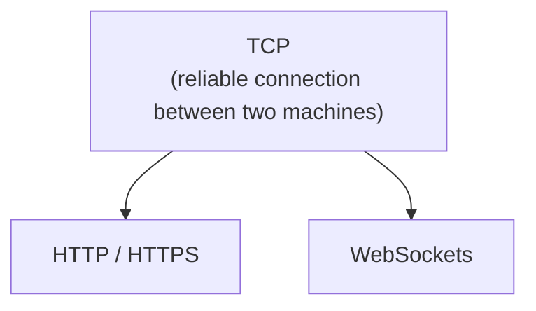
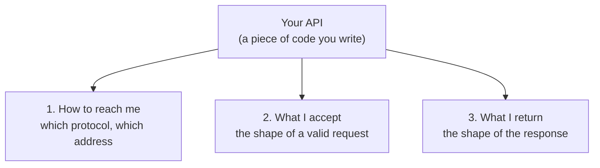
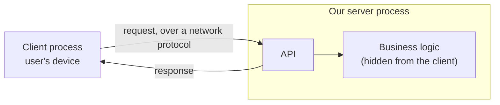

# A protocol is a set of rules

That is the definition, and it is not a technical one. A protocol is an agreed set of rules for how an interaction is conducted.

You follow protocols constantly without calling them that.

## Making a phone call

Consider everything that has to be true before you can speak to someone by phone:

1. You need a SIM.
2. That SIM needs enough credit to place a call.
3. You need the other person's number.
4. Both of you need to be in a valid network range.
5. You open the dial pad, enter the number, and press call.
6. Your phone then does a considerable amount of work you never see, and the other phone rings.

Skip any step and it does not work. That ordered set of requirements is a protocol.

## Talking to a bank

You cannot walk into a bank, hand cash to whoever is nearest, and announce that it should go into your account. Banks have a procedure:

1. Fill in a form with the details.
2. Join the queue.
3. Submit the form.
4. Answer any verification questions the cashier asks.
5. The cash is deposited.

## Getting a visa

Nor can you walk into an embassy and ask for a visa. You book an appointment, you pay for the booking, you arrive fifteen or twenty minutes early, you queue, you present your documents, and the process runs its course.

## Speaking to someone with no shared language

You are in Italy talking to somebody who speaks only Italian. There are three ways through:

- You learn Italian, and speak it with their grammar and their pronunciation.
- They learn English, and you both use English.
- A translator sits between you, converting each direction.

All three work. All three amount to the same thing: **agreeing on the form the communication will take before any of it happens.**

> [!important] **Notice what every one of these has in common.** In each case one side does not understand the other's world. You do not know what a bank does with your money once it leaves the counter. You do not know how an embassy evaluates an application. The bank does not want to explain its internal economics to you, and the embassy does not want to explain its assessment process. The procedure exists precisely so that **neither side has to understand the other's internals.** You follow the steps, the thing gets done.

That last point is worth holding onto. When you deposit cash, you watch the cashier do something at their terminal and then hand you a receipt. What did they actually do? Where did the money go? You have no idea, and you do not need one. The internals are hidden, and the hiding is a feature.

# Network protocols

Two processes on remote machines have exactly the problem those analogies describe, so they need exactly the same answer: an agreed set of rules. For processes, those rules are called **network protocols**, and the good news is that you do not have to invent them. They already exist, one for each broad kind of communication.

| Protocol | Stands for | Used for |
|---|---|---|
| **SMTP** | Simple Mail Transfer Protocol | Sending email |
| **FTP** | File Transfer Protocol | Transferring files |
| **HTTP** | HyperText Transfer Protocol | Loading web pages and most API traffic |
| **HTTPS** | HTTP plus a layer of security | Everything HTTP does, encrypted |
| **WebSockets** | — | Ongoing two-way conversation between client and server |

Sending an email, transferring a file, and loading a website are all communication, but they are different enough in shape that each gets its own set of rules. Pick the protocol that matches what you are trying to do.

## They stack

Protocols are not a flat list. Some are built on top of others.

HTTP does not handle the raw business of getting bytes reliably from one machine to another — **TCP** does that, and HTTP sits on top of it. WebSockets sit on TCP as well.

Which means using HTTP is more layered than it looks. Before any HTTP request can be sent:

1. A **three-way handshake** happens between the two machines.
2. That handshake establishes a **TCP connection**.
3. Only then does the **HTTP request travel over that connection, formatted the way HTTP demands.**
4. The response comes back in the **corresponding HTTP format.**

You do not get to skip steps or reorder them. It is the same as driving: there are rules for being on the road, everyone follows them, and that shared compliance is the only reason the system works at all.

## Why wireless is unavoidable

If your phone and laptop are next to each other, you can join them with a cable and move data across it. If they are merely in the same room, Bluetooth or Wi-Fi will do.

Now put the client in Singapore and the server in Mumbai. No cable is going to join those two machines. The connection has to be wireless, across enormous distance, hopping through infrastructure neither party controls.

> [!info] **You do not need the physics.** How a signal reaches the nearest tower, how towers relay onward — that is genuinely not required here. What matters is the consequence: the machines are far apart, nothing physical links them, and therefore an agreed set of rules is the only thing making the conversation possible.

## And why you only need this at all because of distance

Worth stating plainly, because it explains why any of this exists: **if your client and your server were on the same machine, almost none of this effort would be necessary.** The operating system would be sitting right there to pass messages between them, exactly as it does when a drawing program saves a file.

Every protocol in the table above is a response to one fact — the two processes are not on the same machine.

# But a protocol is not enough

Suppose you have sorted out the protocol. You know the rules for approaching an embassy: appointment booked, fee paid, arrived early, queued correctly. You are standing in front of the counter.

Everyone there speaks only Spanish.

You followed the procedure perfectly and you still cannot get anything done, because **knowing how to reach someone is not the same as knowing what to say.**

Our client has the identical gap. It can establish a connection to our server. It still has no idea how to ask for a reminder to be stored, what form that request should take, or what it will get back.

# The API

That gap is filled by an **API** — Application Programming Interface.

> [!warning] **The full form tells you nothing.** Application Programming Interface is an accurate name that explains none of the idea. Ignore it and learn the concept instead.

Our server can remember things. It also has business logic inside it that nobody outside is entitled to see. So it needs to publish a way in — a defined set of things the outside world is allowed to ask for, without revealing anything about how those things are done.

> [!important] **An API is the mechanism by which a server exposes its functionality to the outside world, so that anyone can use that functionality without knowing how it works internally.**

Which is exactly what the bank's form is. The form is the bank's API. You do not know what happens after you hand it over, and you do not need to — you need to know how to fill it in and what you get back. **The embassy's application is the embassy's API, and it is why you cannot simply announce that you would like a student visa.** That request is not in the interface. What is in the interface is: complete this specific form correctly, bring it with the fee, submit it.

## Two shops, same goods, different APIs

The clearest illustration is two ways of running a grocery store.

| | **Counter model** | **Trolley model** |
|---|---|---|
| How you ask | Tell an employee at the counter what you want | Walk the aisles and pick items up yourself |
| Who fetches | The employee | You |
| Payment | With the same employee | At a checkout queue at the front |
| Staff needed | Employees on every counter | Employees only on checkout |

Both shops sell the same groceries. **The functionality is identical; the interface to it is completely different.** Whichever one you choose, that choice is your API — the published way the outside world gets at what you have.

# An API is a contract

There is a second way to say the same thing that makes the obligations clearer.

> [!important] **An API is a contract.** It defines how the client and the server will communicate, and once it is defined, both sides are bound by it.

Different APIs have different contracts, and they should — different servers do genuinely different things. How you interact with a bank has nothing in common with how you interact with a shopping site, which has nothing in common with how you interact with Remindly, because the functionality behind each is unrelated. You do not care how any of them achieve it. You care about how to ask.

So the contract has to specify three things, and this is what you are actually writing when you write an API:

The bank fits the pattern exactly: **to reach it, in the old days, you went to your nearest branch. What it accepts is cash and its own form. What it returns is a receipt.**

## An API does not have to involve a network

Your browser exposes functions that JavaScript running on a page can call. There is no HTTP involved in calling one, no SMTP, no FTP, no network protocol of any kind — the code and the browser are on the same machine.

It is still an API. It is a published interface to functionality whose internals you do not see.

So the relationship is not what people assume. **HTTP does not use APIs, and APIs do not require HTTP.** An API is the contract; a protocol is one thing that contract might specify. An API may use HTTP, or SMTP, or nothing at all, depending on where the two parties are.

## Which is why an API cannot just be a function

If everything is on one machine, exposing functionality is easy — you expose a function and other code calls it.

That option vanishes the moment the two parties are on different machines. **A process running on one machine cannot invoke a function written on another.** There is no shared memory, no shared address space, nothing to call into.

So for us, the contract has to be expressed in a form that survives being sent across a network — which is why our API will be defined in terms of a network protocol and a data format rather than function signatures.

# Where this leaves us

Remindly now has a shape. We give users a client. We run a server process. That server publishes an API, the client makes requests against it, and **a network protocol carries them**.

But saying we will define a contract is not the same as knowing how to write one. What should the request look like? What format should the data take? People have been arguing about that for decades and have left behind a set of established answers, each with a name and a set of opinions attached.
