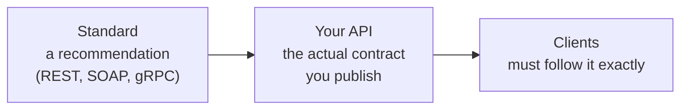
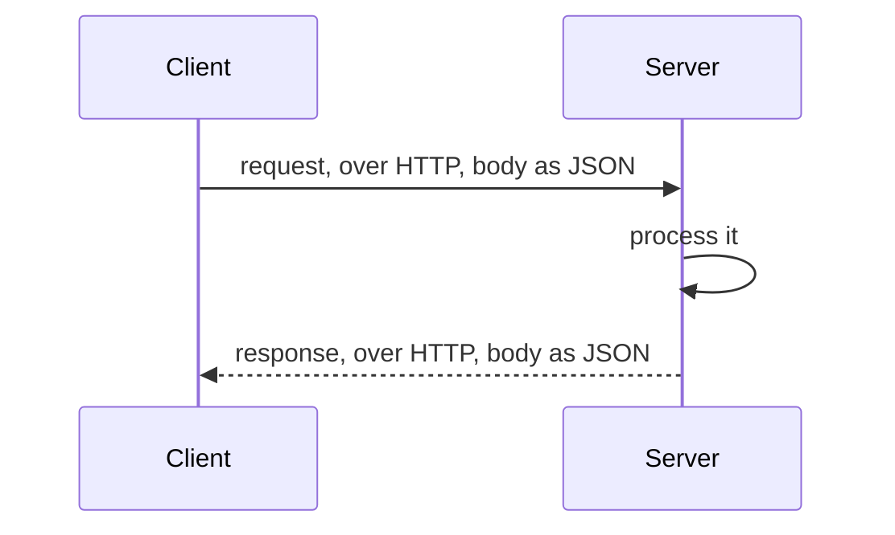

We know an API is a contract stating how to reach a server, what it accepts, and what it returns. Now the practical question: when you sit down to write one, what should it look like? People have been answering that for decades, and the answers have names.

# Standards are recommendations, not laws

Before the names, the category. SOAP, REST and the rest are **standards**, and the word standard is misleading if you read it as compulsory.

> [!important] **A standard here is a recommendation.** It says: if you want to define an API, here is a sensible way. Follow it and everyone will understand you immediately. Deviate and nothing crashes — you have just made yourself harder to work with.

## The food standards analogy

Every country has a food authority that publishes rules — sodium below some level, iron above another. India's rules are not the same as the United States' rules, which are not the same as Europe's.

Follow Europe's recommendations exactly and you will sell in Europe without friction. Deviate from them and you may not be able to sell there — but you might sell perfectly well in India, whose rules you did happen to meet.

That is the entire nature of a recommendation. Following it is smooth. Not following it is not a crime; it is a cost, and sometimes a cost you are willing to pay.

## Recommendation versus contract

There is a second layer worth separating, because they are easy to confuse.

A central banking authority publishes recommendations for how banks should operate. Some are strict, some are loose. An individual bank takes those recommendations, makes its own amendments where they are permitted, and from that produces the actual rules for doing business with **that bank**.



> [!important] The standard is optional guidance to you. **Your API is not optional guidance to your clients.** Once you have published a contract, anyone who wants your functionality follows it or gets nothing. You are free to write it however you like; they are not free to ignore it.

# The four you will hear about

| Standard | Era | Data format it recommends |
|---|---|---|
| **SOAP** | The primary approach in the early 2000s | XML |
| **REST** | The dominant approach today | JSON |
| **RPC** — including gRPC and Thrift | Newer, growing | Protocol buffers |
| **GraphQL** | Newer, growing | Its own query format |

Two of these are worth knowing deeply — REST and RPC. The other two are named here so the landscape makes sense.

## What the data actually looks like

The most visible difference between these standards is the shape of the data on the wire. Here is one reminder from our service, expressed three ways.

**XML**, which SOAP uses. It looks a great deal like HTML — reasonably so, since XML is the older, more general language that HTML resembles:

```xml
1  <reminder>
2    <reminderId>4171</reminderId>
3    <userId>88</userId>
4    <message>Flight to Mumbai</message>
5    <remindAt>2026-08-29T10:00:00Z</remindAt>
6    <channels>
7      <channel>sms</channel>
8      <channel>whatsapp</channel>
9    </channels>
10   <delivered>false</delivered>
11 </reminder>
```

**JSON**, which REST uses:

```json
1  {
2    "reminderId": 4171,
3    "userId": 88,
4    "message": "Flight to Mumbai",
5    "remindAt": "2026-08-29T10:00:00Z",
6    "channels": ["sms", "whatsapp"],
7    "delivered": false
8  }
```

> [!warning] **JSON has nothing to do with JavaScript.** It looks like a JavaScript object, and that resemblance is where the name comes from, but it is a language-independent data format. Java, Python, Go and everything else read and write it happily. The resemblance is cosmetic.

**Protocol buffers**, which gRPC uses. These work differently — you do not write the data, you write a schema describing its shape, and a compiler generates the code that turns real data into a compact binary form:

```protobuf
1  // reminder.proto
2  syntax = "proto3";
3
4  package remindly;
5
6  message Reminder {
7    int64  reminder_id = 1;
8    int64  user_id     = 2;
9    string message     = 3;
10   string remind_at   = 4;
11   repeated string channels = 5;
12   bool   delivered   = 6;
13 }
```

> [!info]  The numbers after each field are field tags, not values — they are how the binary encoding identifies each field.

# REST in a little more depth

**REST** stands for Representational State Transfer, and as with API, the expansion clarifies nothing. Learn the recommendations instead.

REST answers the two questions any API contract must answer.

## Which protocol

REST recommends **HTTP**.

That is a recommendation like any other. Use a different protocol and your code does not break and your system does not crash — you have deviated, and your consumers will have to accommodate you rather than reaching for the tooling they already have.

## Which data format

REST recommends **JSON**, in both directions. The client sends JSON, the server answers with JSON.

Again — a recommendation. If you would rather send plain text, you can. Nothing catches fire. You can follow every other REST recommendation faithfully and send text instead of JSON, and you will have a working API that is slightly unusual.



# RPC, and why protocol buffers

RPC-style standards such as gRPC also use HTTP — but specifically **HTTP 2.0**, out of the box rather than as an option.

For data they use **protocol buffers**, which are **serialised in a very compact way**. That compactness is the point: **less data on the wire means faster transfer**.

> [!info] **A number for the compactness claim.** Encoding the identical reminder above in all three formats, as it would actually be sent:
>
> | Format | Bytes |
> |---|---|
> | XML | 243 |
> | JSON | 142 |
> | Protocol buffers | 60 |
>
> Protobuf is roughly **2.4× smaller than JSON** and **4× smaller than XML** for this record. Measured locally with `protoc`; the ratio varies with the data, and short strings like these flatter the binary format less than numeric-heavy payloads would.

# WebSockets are not on this list

A reasonable question at this point is whether WebSockets belong in the table above as another way of writing an API. They do not, and the reason is a useful check on whether the two ideas have separated properly.

**WebSocket is a network protocol.** Like HTTP, it is built on top of TCP. What distinguishes it is that it is far more two-way — a genuine ongoing conversation rather than a request followed by a response.

So it sits in the protocol column, not the standard column. You can absolutely build an API whose contract names WebSocket as its protocol. That is choosing your protocol, which every API must do. It is not choosing a style of contract.

| | Names one of these |
|---|---|
| **Network protocol** | HTTP, HTTPS, WebSockets, SMTP, FTP |
| **API standard** | SOAP, REST, RPC (gRPC, Thrift), GraphQL |

An API standard usually recommends a protocol — REST recommends HTTP, gRPC requires HTTP/2. That recommendation is the only place the two columns touch.

# What you are actually writing

Pulling it together, since this is the thing to carry forward:

You write your business logic. Then you write a further piece of code that exposes it — declaring how someone connects to you, what data you accept, and what data you return. There are standards that recommend how to write that piece of code, and you may follow them fully, partly, or not at all.

The moment you have written it, it stops being your choice and becomes everyone else's constraint. That is what makes it a contract.

# Where this leaves us

Remindly can now accept requests. **A client connects over a protocol, sends a request in a format we published, and gets a response.**

And we still have not solved the problem that started all of this. When a user tells us to remember their flight on Friday, **where does that actually go?** We replaced the employee with a server process and the telephone with a protocol. Nothing at all has replaced the diary.
