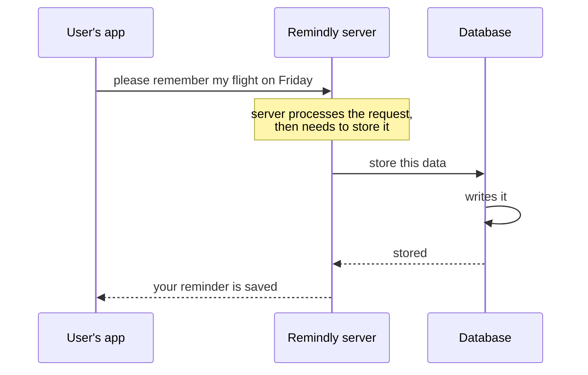
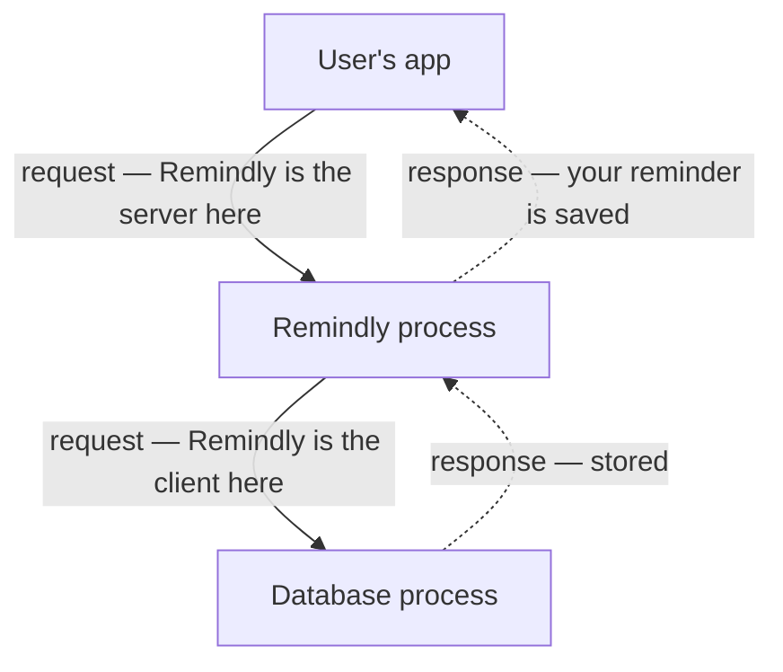
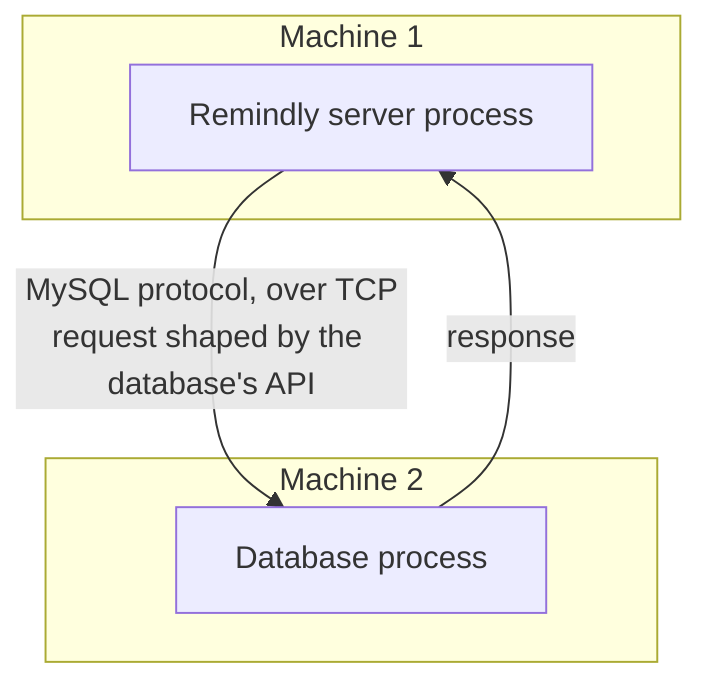

The manual company had a diary. When we automated it away, we replaced the employee with a server process and the telephone with a protocol — but nothing at all replaced the diary. A user tells Remindly to remember their flight on Friday, our server accepts the request, and then it has nowhere to put it.

# The obvious answers, and why they fail

Start with what anyone would reach for first.

## A text file

Write each reminder as a line in a file. It is the closest digital equivalent of the diary and it does technically work.

- **Structure is painful.** A text file has no notion of fields. Every piece of code that reads it has to agree on exactly how a line is laid out, and any change to that layout breaks everything at once.
- **Finding anything means reading everything.** There is no way to jump to one user's reminders. You scan from the top.
- **Two writers collide.** If two requests try to modify the same row at the same moment, the outcomes get interesting in the worst sense — one overwrites the other, or you end up with a half-written line that is neither.

That last one should feel familiar. It is the same problem as two employees reaching for the one shared diary, and automating the company did not make it go away.

## A spreadsheet

A spreadsheet at least gives you columns, which fixes the structure complaint. It introduces a different one.

Spreadsheets encourage **redundancy** — the same fact stored in more than one place. Keep two spreadsheets that both contain a user's phone number, change it in one, and the other is now wrong. Nothing tells you. Nothing stops you. You simply have two answers to one question and no way to know which is current.

Which, again, is a problem we have already met: this is the two-diaries divergence, in software.

> [!important] **Both failures are inherited, not new.** Contention over a shared file and divergence between copies were problems the paper company had. Storing data in a file or a spreadsheet does not solve them — it reproduces them, faster.

# Databases

What we need is storage built for this on purpose. That is a **database management system** — DBMS, or just a database.

> [!important] A database is software **optimised for two things**: storing data, and retrieving it. Everything the text file was bad at — structure, search, concurrent access, avoiding redundancy — is what a database exists to be good at.

## Which one

There is no single answer, because there is no single kind of data.

| Kind | Example | Suited to |
|---|---|---|
| **Relational (RDBMS)** | MySQL, PostgreSQL | Structured data with clear relationships between records |
| **NoSQL, document** | MongoDB | Flexible or changing record shapes |
| **Time series** | — | Measurements stamped with a time, arriving continuously |
| **Graph** | — | Data where the connections matter as much as the records |

> [!info] NoSQL is a category rather than a single design. Document databases and graph databases both live under it, and they are quite different from each other.

**Choosing the right one for your use case is your job as an engineer.** It is not a detail to be settled later — the database is where your data actually lives, and the choice shapes what is cheap and what is painful for as long as the system exists.

## And it can still be lost

Picking a database does not retire the backup problem. The machine can crash. Somebody can delete data they should not have. The diary could be lost and so can this.

So backups remain a thing the backend engineer owns. Nothing about moving to a database makes the data safe by itself.

# A test of whether client and server really landed

Here is a question worth stopping on, because getting it right confirms the definitions from earlier actually took hold.

A database is software. Someone wrote that program. When it runs it becomes a process, and it usually runs on a **different machine** from your server.

So when a user's reminder needs storing:

In the second exchange, which one is the client?

**Our server is the client.** It is the process making a request for a task to be done. The database process is the **server** — it accepts the request, processes it, and returns a response.

> [!important] This is why people say **database server** and it is not a redundant phrase. It confuses people who believe there is one server in a system and that it is the thing they wrote. Any process capable of accepting a request is a server. Our Remindly process is a server to the user's app and a client to the database, at the same time, because **client and server are roles within an exchange, not permanent identities.**

# Which means the database needs a protocol and an API too

Follow the logic through, because it lands somewhere satisfying.

The database process runs on a different machine from our server. Two processes, two machines. So they need a **network protocol** — the same requirement as before, for the same reason.

Different databases use different protocols. **MySQL publishes a client/server protocol specification** describing exactly how a process may communicate with a MySQL database, and that protocol runs over **TCP** — the same foundation HTTP and WebSockets are built on.

And the database must also expose an **API**: a declaration of how to reach it, what requests it accepts, and what it returns. It has internals it does not show you — how rows are physically stored, how a query is planned and executed — and you neither see them nor need to.

> [!info] **Databases deviate from the standards in the last note, and that is fine.** They generally do not speak REST or gRPC; they define their own contracts suited to their own work. They are still APIs. This is a good example of a recommendation being reasonably ignored by people with a reason to.

The same three ideas, one layer down. Two processes on different machines, a protocol to carry the conversation, an API to define what can be said. That repetition is the point of learning it from first principles — you will keep meeting the same shape.

# Where this leaves us

Remindly is now a real system on paper. A client on the user's device, a server exposing an API, a protocol between them, and a database holding the data.

It is also, at this moment, exactly one server and exactly one database. That is a perfectly good system right up until the moment the startup succeeds — at which point every one of those single components becomes the thing that can take Remindly down on its own.
