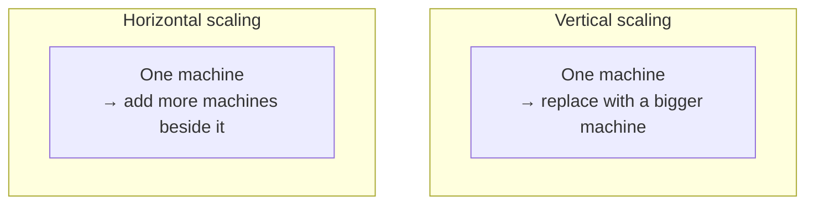
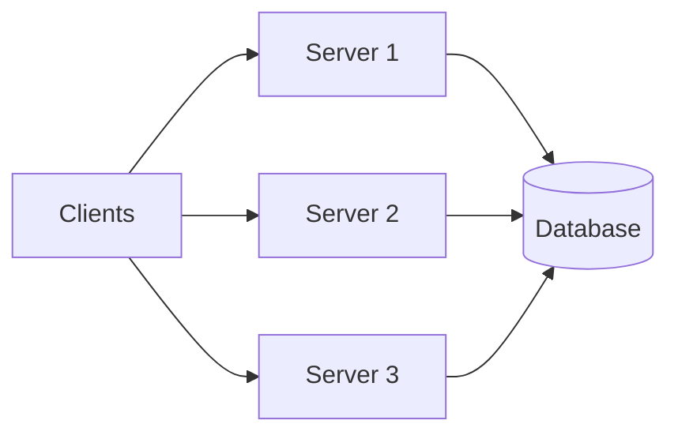
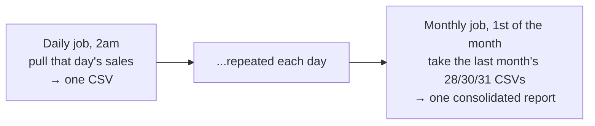
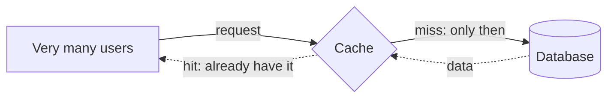
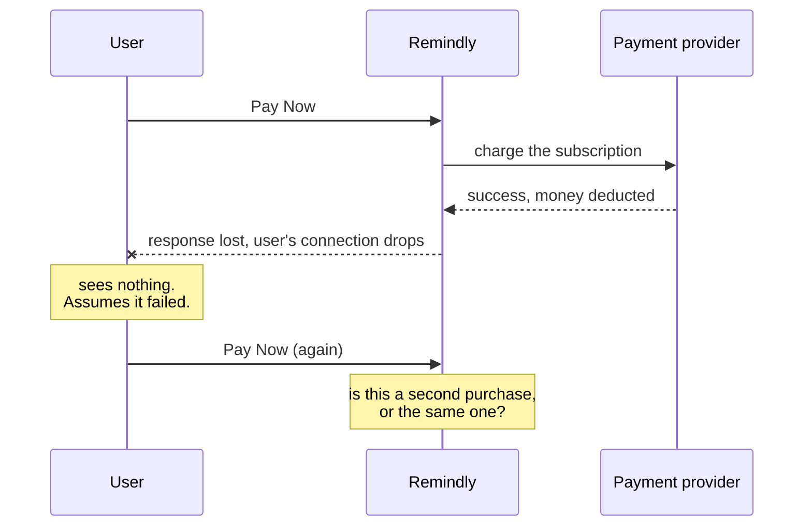

There is a version of backend engineering that people carry around in their heads: a client calls an API, the server makes a database call, the database returns data, everyone is happy. That picture is not wrong — it is just the first five percent. This note is the rest, laid out as the sequence of things that break once Remindly starts succeeding.

# First, why is any of it fast?

Before breaking things, a fair question. A request leaves a phone, crosses to our server, our server calls the database, the database answers, the server answers the phone. That is several network hops and it feels like it should be slow. It is not. Why?

## The machines are extremely fast

From time and space complexity analysis, the standard working figure is that a system can comfortably execute on the order of **10⁸ to 10⁹ instructions per second**. Anything our server does to process one reminder is trivial against that number. Computation is essentially never the bottleneck at this scale.

## The distance is the part that costs

What does cost is **network latency**, and one of its largest contributors is plain physical distance. A request crossing continents has further to travel than one crossing a city.

So place your server near your users. A client in India talking to a server in Singapore is a shorter trip than the same client talking to a server on the other side of the world.

> [!tip] **You can feel this yourself.** Take a cloud machine in the United States, connect to it from India over SSH, and type. There is a visible lag between pressing a key and seeing the character. Take a machine in Mumbai instead and the lag largely disappears. Nothing changed except distance.

There are other tools for it — a CDN, for instance, puts unchanging data physically closer to users so the request never travels far. Which one applies depends on your use case, and this is a design decision driven by your business requirements rather than a setting you switch on.

# The single point of failure

Remindly is running on one server. The startup works, users arrive, and requests pile up.

There is a hard limit to how much any one machine can process. You have seen it on your own laptop — run enough software and it starts to lag. A server is no different. Enough concurrent requests and it becomes overwhelmed, and when it goes down, Remindly goes down entirely.

> [!important] A component whose failure takes the whole system with it is a **single point of failure**, usually written SPOF. One server serving every request is the most obvious one there is.

# Vertical scaling

The instinctive fix is the one you would apply to a slow laptop: buy a more powerful laptop. Replace the machine with a bigger machine — more RAM, more CPU.

That is **vertical scaling**: increasing the capacity of a single machine.

It works, and it has two hard limits.

## There is a ceiling

You cannot buy an infinitely powerful machine. There is a most-powerful-machine-that-exists, and once you are on it there is nowhere further to go.

## The price curve turns against you

More interesting than the ceiling is what happens on the way to it. Bigger hardware does not cost proportionally more — it costs disproportionately more.

Working through actual RAM prices:

| Purchase | Approximate price |
|---|---|
| One 4GB DDR4 module | ₹2,649, call it ₹2,500 |
| Four 4GB modules (16GB total) | ₹10,000 |
| One 16GB module | also around ₹10,000 |
| One 128GB module | around ₹1,50,000 |
| Thirty-two 4GB modules (128GB total) | 32 × ₹2,500 = **₹80,000** |

At 16GB the two routes cost the same. At 128GB, buying it as a single unit costs roughly **₹1,50,000 against ₹80,000** for the equivalent capacity in small modules — close to double for the same number of gigabytes.

> [!info] These are indicative retail figures, not a benchmark. Prices move and better deals exist. The shape of the curve is the point, not the exact numbers.

> [!info] **A tangent worth chasing.** Why does an old machine get slower over time, when the hardware is physically the same as the day you bought it? Something is genuinely changing in the disks and the RAM. It lives in operating systems material and is worth reading up on.

# Horizontal scaling

So take the same frustration and solve it the other way. Instead of one laptop that does everything and is never fast enough, buy three ordinary laptops and split the work:

- L1 for coding
- L2 for gaming
- L3 for video editing

Because the workloads differ, the machines can differ. The video editing machine might be the powerful one; the coding machine might be modest, since a light Linux setup on 8GB of RAM is more than enough for that job.

Nothing here increased the power of a machine. You **added machines**. That is **horizontal scaling**.



Applied to Remindly, a request from a client can now be handled by any one of several servers.



> [!warning] **Horizontal scaling is not the final answer to scale.** It is easy to come away believing that once traffic grows you simply add servers and the problem is solved permanently. It is not. Much more is involved, and the diagram above already contains the next failure.

## Which it does

Look at where every arrow ends. Three servers, one database. Every one of those servers talks to the same database machine.

The database is now the single point of failure. Removing the SPOF from the application tier moved it one layer down rather than eliminating it — so the database needs scaling too, and that is a different problem with its own set of answers.

## And more machines need more machinery

Spinning up several servers does not by itself distribute anything. Something has to decide which server receives a given request. That is a **load balancer**, and attaching one correctly is its own topic.

# Scheduling

Remindly has a second responsibility we have not touched since the very beginning: actually **delivering** the reminders.

Nobody is going to sit and check hourly which reminders are due and send them. The system has to do it — every day at 10am, find the reminders due for that hour and dispatch them by SMS or a messaging app.

That needs an automated scheduling mechanism, and there are two broad ways to get one.

## A dedicated job scheduler

Cloud platforms provide services for exactly this. You give them a script, a schedule expressed as a cron expression, and they run it. Jobs can also **depend on other jobs**, which matters more than it sounds.

A worked example from industry practice — consolidating a monthly sales report:



Every day at 2am a job pulls that day's sales from the database and writes a CSV. Over a month that produces thirty or so files. Then on the first of the next month, a second job takes however many files the previous month produced — 28, 30, 31 — and consolidates them into the full monthly report. The second job is meaningless unless the first has been running, which is what job dependency expresses.

## Your own machine and a cron expression

The simpler route: take a machine you already run in the cloud, put a script on it, and set a cron expression — every two days at 10am, run this. The script can be in any language.

Both approaches are legitimate. Which you pick is another engineering decision.

# Authentication and authorization

Remindly is a paid service. Which raises a question the system currently cannot answer: when a request arrives, is this a real user, and are they allowed to do this?

Two distinct things, usually shortened to **auth**:

- **Authentication** — are you who you claim to be?
- **Authorization** — given who you are, are you permitted to do this particular thing?

Both matter here. Without them anyone can use the service for free. With them you can enforce real rules — a paying user gets full access, while a free-tier user is limited to, say, two requests a month and is refused politely once they have used them up.

Every API request has to pass through this, and building it is the backend engineer's job.

> [!info] **How authentication is done has moved on considerably.** It used to be a username and a password and little else. Today it commonly involves two-factor authentication — a one-time code by SMS or automated call, or a code from an authenticator app.

# Rate limiting and DDoS

Now the harder version of the same problem. Suppose the user is genuinely paid and genuinely authenticated — and malicious.

Instead of making four or five requests a day from the app, they point a bot at your API and send **a million requests per second**. Every one of them passes authentication, because the account is real. Your system is overwhelmed anyway, and legitimate users get nothing.

> [!important] **DDoS stands for Distributed Denial of Service.** The attack overwhelms your servers with traffic until they start failing, and the service is thereby denied to everyone else. The word denial describes the outcome for your real users.

The defence is **rate limiting** — capping how many requests a given caller may make in a given window. Auth cannot do this, because the requests are authentic. It is a separate mechanism and, again, yours to build.

# Caching

A different shape of load. Switch examples for a moment to an online shop running a sale.

The sale homepage features five flagship items — a laptop, a phone, two sets of headphones, one more — and shows the **live price and live stock** of each. The sale starts and enormous numbers of people land on that page at once.

Every one of those visits queries the database for the same five items. The database is doing identical work, over and over, and it will fall over.

But notice the thing that makes this fixable: **everybody is being shown the same data.** There is no reason to compute it per visitor. Put a caching layer in front, compute it once, serve it many times.



Deciding what to cache, for how long, and what to do when it goes stale is the backend engineer's call.

# Logs and alerts

Something will go wrong that none of the above covers. A perfectly valid user makes a perfectly valid request, and it fails, because of a bug or a failure somewhere inside the system.

How would you even find out?

You need two separate things, and it is worth keeping them separate:

1. **You need to know it happened.** That is an **alert** — when something fails, the engineers responsible are notified rather than discovering it from an angry customer.
2. **You need the history of what happened.** That is **logging** — a written trail detailed enough to reconstruct the failure after the fact.

A useful log trail for this failure would read something like:

```text
1  a request arrived at 14:02:11 for user 88
2  the server accepted it
3  the server attempted to connect to the database
4  the database connection raised an exception
5  the request failed
```

Now the engineer knows not just that a request failed but where it failed and why. Writing the right logs into your application, and setting up alerts that fire on the right conditions, is yours to do.

# Talking to services you do not control

Remindly takes payments, and we are not a payment company. So we hand payments to a third-party payment provider.

Which introduces a dependency we cannot fix when it breaks.

## What if the provider is down?

The provider stops responding, or stops accepting requests from us. What should our system do?

Give up and tell the user the payment failed? Or retry? If retry — **how many times, and how far apart?** Every second? Every minute? Until when?

There is no default answer. The backend engineer decides, and the decision has real consequences in both directions.

> [!info] This does not disappear if you build your own payment service. Large companies often do run their own, and it can be unresponsive too. The dependency becomes internal, not absent.

## The double payment

Now the subtle one, and it is the best problem of the lot.

A user pays for a subscription. The payment goes through and the money is deducted. **Then their internet drops for a few seconds** — right before the response reaches them.

From their side, nothing happened. No confirmation, no receipt. So they do the reasonable thing and press Pay Now again.



So: do we deduct twice? Do we refuse and risk being wrong? If we did take the money twice, do we refund it automatically? How would we even tell this apart from a user who genuinely wants to buy twice?

The system cannot distinguish the two from the request alone. Making it distinguishable is a design problem, and it is the backend engineer's.

# Concurrency

One more, from a different domain. A ticket booking application, two people, one seat, at the same instant.

Do both of them get it? Obviously not. So how do you guarantee that exactly one does, when both requests are in flight simultaneously and neither has finished?

This is a concurrency problem, and it is the same shape as two employees reaching for one diary — the problem the very first note raised and did not solve. It has followed us all the way here.

# And the list keeps going

Beyond everything above, still waiting:

- **Microservices.** Splitting one system into many introduces a further set of problems that simply do not exist in a single application.
- **Query performance.** Does the table have the right index? And separately — even when the right index exists, **is your query actually using it?** Those are two different failures.
- **Choosing the API style.** REST, RPC or GraphQL, decided per situation.
- **Scaling the database**, in its own right, with its own approaches.

# The tools that address all this

For context rather than commitment, the landscape:

| Concern | Common tools |
|---|---|
| Writing the server logic | Spring Boot, Flask, Ruby on Rails |
| Relational storage | MySQL, PostgreSQL |
| Other storage | MongoDB, Redis |
| Distributing load | Load balancers |
| Authentication | Passwords, authenticator apps, SMS and call-based one-time codes, two-factor schemes |

> [!info] **Services do not have to share a language.** One microservice can be Python, another Java, another Ruby, because they communicate through APIs rather than by calling each other's functions. The contract is what they share — not the runtime.

# The framing to carry forward

Two things are worth taking away more than any individual item on the list.

The first is what backend engineering actually consists of. It starts small — make two processes talk, store some data. Then problems accumulate at every layer: at the server, at the database, between services, in the queries, in the scheduling, in the failure paths. **Creating a server with an API that stores data in a database is not backend engineering.** It is the first thing backend engineering does, before the real work of making the system resilient, scalable and maintainable.

The second is about how to study it:

> [!important] **Aim to become a backend engineering nerd with the help of Spring Boot, rather than a Spring Boot nerd.** The framework is the vehicle. If you understand the first principles — why processes need protocols, why an API is a contract, why one server is a single point of failure — then moving to a different framework in a different language is not a new subject. It is the same subject with different syntax.
