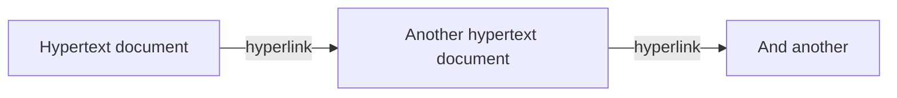
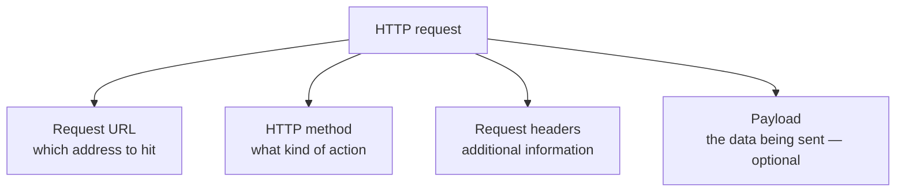
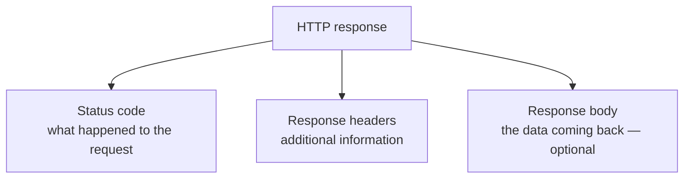
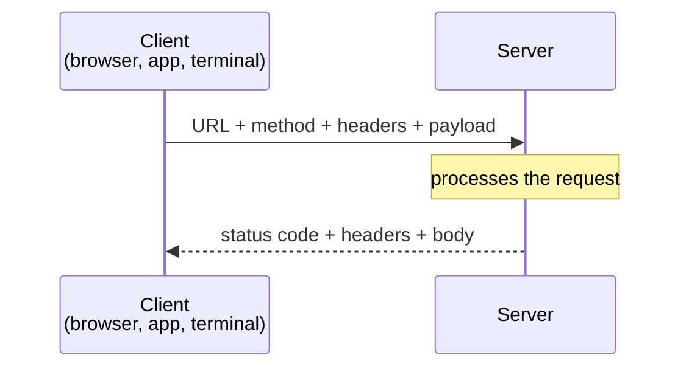

SSH showed what a protocol does. This one is the protocol you will spend most of your time with, so it gets taken apart rather than just demonstrated.

# What the name means

**HTTP** stands for HyperText Transfer Protocol — and unusually for a technical abbreviation, the expansion is genuinely informative. It is a protocol containing rules that facilitate the transfer of hypertext.

Which raises the obvious question.

## Hypertext

A **hypertext** is a document made of text and **hyperlinks**. A hyperlink is a link that, when followed, takes you to another hypertext.



You already know this from **HTML** — HyperText Markup Language. A markup language for writing hypertext, which is why the word appears in both names.

> [!info] **A markup language is not a programming language.** It has no logical capability — no conditions, no loops, no computation. It describes the structure and presentation of a document and nothing else.

So the pairing is neat: HTML is the language for writing hypertext, HTTP is the protocol for transferring it.

## And then it outgrew its name

HTTP was defined to move hypertext documents around. It was then extended considerably, and today it carries images, plain text, JSON and much else besides.

> [!important] HTTP became a general-purpose vessel. **Modern APIs mostly use HTTP to move JSON**, which has nothing to do with hypertext — the protocol simply turned out to be a good way to move anything. It now underpins the large majority of web and mobile applications.

# Watching one happen

Open any site, right-click, choose Inspect, and go to the **Network** tab. Every network request the page makes is logged there.

Interact with the page — scroll, open something, add an item to a cart — and requests appear. Adding an item to a cart is a good one to inspect, because its purpose is obvious from its name.

The first thing shown for that request is that it is **HTTPS**.

> [!info] **HTTPS is HTTP plus a layer of security.** Everything true of HTTP is true of HTTPS. How the security works is a separate topic; nothing in the anatomy below changes.

# A request has parts

When a client makes an HTTP request, it is not sending one thing. It is sending several components together.



## Request URL

Which address the request is going to. This has enough going on inside it to deserve separate treatment.

## HTTP method

A signal about what kind of action is being performed. On a cart request it shows as `POST`.

> [!warning] **A method indicates. It does not guarantee.** The method is a signal of what is probably happening — and a developer has full freedom to make it lie. A `DELETE` suggests something is being deleted, a `GET` suggests data is being retrieved, but a `GET` can be written to delete records and nothing prevents it. Write your server well and the method matches reality. Write it badly and the method actively misleads whoever reads your API.

MDN's reference on HTTP request methods is the place to look them up.

## Request headers

Additional information travelling alongside the request. The most immediately useful is **`Content-Type`**, which declares what kind of content the request is carrying — necessary now that HTTP can carry plain text, images, JSON and more.

```text
1  Content-Type: application/json
```

That value says the body is JSON.

## Payload

The actual data the client is sending. In DevTools this appears under Payload, and if `Content-Type` says JSON then JSON is what you will find there.

> [!info] **The payload is optional.** Plenty of HTTP requests carry no data at all — a request to fetch something usually has nothing to send.

# A response has parts too

The server processes the request and replies, and the reply is assembled the same way.



## Status code

A number indicating what happened to the request — whether it succeeded, failed, or something else.

> [!warning] **Status codes are indicators too, and they can lie in exactly the same way.** If the code is written carelessly, a request that genuinely failed can come back carrying a success code. That is worse than an unhelpful error, because it fails silently.

## Response headers

Additional information from the server — the date, and `Content-Type` again, this time describing what the server is sending back.

## Response body

The data the server produced. Optional, like the request payload — some responses have nothing to return beyond the status code.

# The whole exchange



Both directions carry a bundle of components rather than a single blob, and two of those components — the method and the status code — are **claims about intent rather than facts about behaviour**. Everything else is data.

That distinction is the one to carry forward. Much of what makes an API pleasant or miserable to consume comes down to whether its methods and status codes tell the truth.
