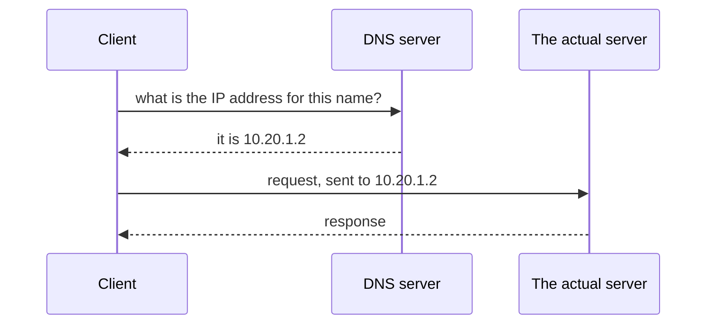
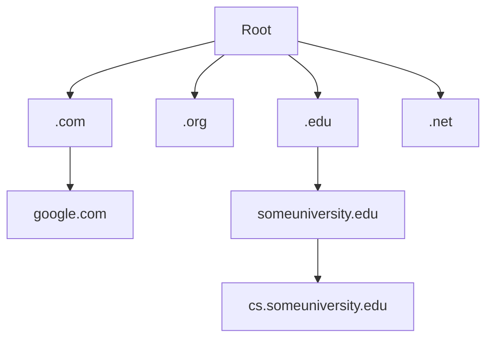

Reaching a machine requires its IP address. Nobody types IP addresses. That gap is filled by a system worth understanding, because it is itself a plain client-server arrangement.

# Names instead of numbers

An address like `10.20.1.2` is unambiguous and hard to remember. So people use a name instead — a **URL**, Uniform Resource Locator: a string that identifies a resource.

```text
1  http://www.google.com
```

Behind the scenes the connection is still made to an IP address. The name is a stand-in, adopted purely because humans are bad at remembering numbers.

Which leaves a question. If your code contains a name rather than an address, **how does the client find the address?**

# DNS

The answer is **DNS** — Domain Name Server. And the definition is pleasingly ordinary:

> [!important] A DNS server is a **server** — a process, running on a machine, that accepts a particular kind of request. It accepts a URL and returns the IP address that URL maps to. That is its whole job.



There is no special magic here. Everything from the earlier definitions applies — it is a process accepting requests and returning responses, and it needed an address of its own to be reachable in the first place.

There are many DNS servers across the internet, and different services use different ones.

# Getting a name of your own

Buy a domain — say `mostfreshpizza.com` — from a domain registrar, and it does nothing yet. It is a name pointing at nothing.

What you do next is **map an IP address to it**, so that anyone asking for that name is directed to the machine you want. Registrars provide the controls for this.

> [!info] **It will not take effect immediately, and the registrar will tell you so.** The mapping has to be propagated to a great many DNS servers across the internet, so that whichever one a given client asks has the current answer. That spreading takes time — usually minutes, sometimes longer.

# Looking it up yourself

On Linux or macOS there is a tool for this:

```bash
# terminal
1  dig www.google.com +short
```

```text
1  142.251.154.119
2  142.251.151.119
3  142.251.156.119
4  142.251.157.119
5  142.251.152.119
```

> [!info] **`dig` stands for Domain Information Groper.** It performs a **DNS lookup** — you supply a name, it returns the IP addresses mapped to it. Note that a single name can map to several addresses, which is one of the ways large services spread load across many machines. There is a Windows equivalent worth looking up if you need it.

## Public resolvers

Some DNS servers are well known. Google runs public ones at:

```text
1  8.8.8.8
2  8.8.4.4
```

> [!important] Look at what those are: **IP addresses**. Even a DNS server is a process on a machine, and a machine needs an address before anything can reach it. The system that resolves names has to be reachable by number, or nothing could get started.

# How a lookup is organised

DNS is not one enormous list. It is **hierarchical**, arranged as a tree, and a lookup walks down it.



| Level | What sits there |
|---|---|
| **Root** | The top of the tree |
| **Top-level domain (TLD)** | `.com`, `.org`, `.io`, `.edu`, `.net` |
| **Second-level domain** | `google.com`, `someuniversity.edu` |
| **Subdomain** | `cs.someuniversity.edu` |

A lookup splits the name into its parts and follows the branch. Resolving something ending in `.com` means the `.com` branch is the only relevant one and every other branch is ignored immediately — which is what stops a lookup from being a search through everything.

# A term you will see

**Remote address** generally refers to the IP address of the remote machine you are connecting to. When it appears in developer tools next to a request, that is what it is showing.

# Where this leaves the addressing story


The three requirements never changed — protocol, address, port. DNS is the convenience layer that lets you supply a name where an address is required, and it is built from exactly the same parts as everything else: processes accepting requests, returning responses, reachable at an address.
