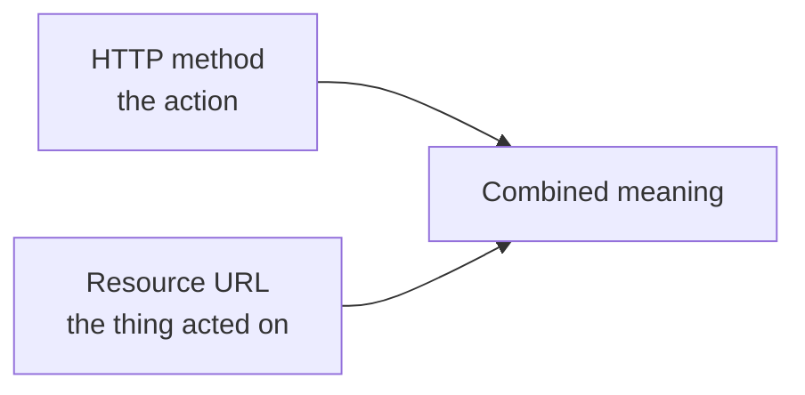
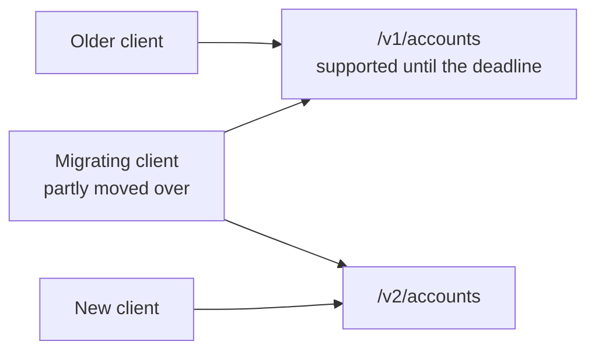

An API is a contract exposing your functionality without exposing your internals. There are several established styles for writing one, and REST is where to start. This note is its actual recommendations, and what happens when you ignore them.

# Why start with REST

Two reasons, and neither is that it is the best.

**It is the most widely used.** REST has dominated API design long enough that most applications you use depend on it, there are a great many experienced developers who have worked with nothing else, and entire frameworks were built around it. Ruby on Rails is so tightly coupled to REST conventions that following them makes building in it dramatically easier — and deviating makes it harder.

**It is simple.** REST APIs are easy to write and easy to read. Once you know the recommendations, an unfamiliar REST API becomes legible almost immediately.

## What it gets wrong

Worth knowing up front, because the industry is moving:

| Problem with REST | Addressed by |
|---|---|
| Performance | gRPC, Thrift |
| Type safety | gRPC, Thrift, GraphQL |
| Third-party library dependency | gRPC and others |

RPC approaches are gaining ground for exactly these reasons. Inside Google, products communicate with each other over gRPC and nothing else — REST appears only when a Google service has to reach something outside the ecosystem, such as a bank, because the bank publishes REST. Uber's Go codebase leans heavily on gRPC. Amazon runs its own RPC flavour.

> [!info] None of that makes REST obsolete. It makes REST the thing to learn first and the thing you will most often meet.

# The recommendations

Five of them. All are recommendations — deviating breaks nothing.

## 1. Use HTTP

The recommended communication protocol for a REST API is HTTP.

## 2. Exchange JSON

Data goes in both directions as JSON.

## 3. Make URLs resource-oriented

This is the substantial one.

A **resource** is the data you are representing or acting on — the real entity behind the operation. In a food delivery application the resources are things like users, orders, restaurants, delivery partners and invoices.

Now list the operations such an application performs: list restaurants, list the dishes at a restaurant, add a dish to a cart, check out the cart, create an order, check an order's status.

> [!important] **Every operation attaches to an entity.** Checking an order's status is about the order. Adding a dish is about the dish. Listing restaurants is about the restaurant. That entity is the resource, and REST says the URL should name it.

So URLs are built around nouns:

```text
1  https://example.com/orders
2  https://example.com/orders/1
```

The first names the collection. The second names one specific order, identified by an id.

## 4. Combine the method with the URL

Resource-oriented URLs create an immediate problem. Given `/orders`, what is being asked for? Fetching them? Deleting them? Creating one?

**The URL alone cannot say.** It names a noun; it carries no verb.

> [!important] The verb comes from the **HTTP method**. Method plus URL together identify both the action and the resource it acts on.

| Method | Used for |
|---|---|
| `GET` | Fetching or downloading data |
| `POST` | Creating something |
| `PUT` / `PATCH` | Updating something |
| `DELETE` | Deleting something |

Applied to a collection and to a single item:

| Method and URL | What it means |
|---|---|
| `POST /customers` | Create a new customer |
| `GET /customers` | Fetch all customers |
| `PUT /customers` | Update the customers |
| `DELETE /customers` | Delete all customers |
| `POST /customers/1` | By convention, an error — you do not create a thing that already has an id |
| `GET /customers/1` | Fetch the customer with id 1 |
| `PUT /customers/1` | Update customer 1, if it exists |
| `DELETE /customers/1` | Delete customer 1, if it exists |

And resources combine, because some operations are genuinely about a relationship between two of them:

| Method and URL | What it means |
|---|---|
| `GET /customers/1/orders` | Retrieve all orders belonging to customer 1 |
| `POST /customers/1/orders` | Create a new order for customer 1 |
| `PUT /customers/1/orders` | Update all orders of customer 1 |
| `DELETE /customers/1/orders` | Delete all orders of customer 1 |



> [!warning] **Nothing enforces any of this.** You can put whatever logic you like behind `POST /customers/1/orders`. Your server will not crash and your code will not fail. What breaks is comprehension — anyone reading your API will conclude it creates an order for customer 1, and they will be wrong. The cost of deviating is confusion, paid by everyone who uses your API.

## 5. Return a relevant status code

A good REST API returns an HTTP status code that reflects what actually happened.

Status codes are grouped into ranges, and the range carries the broad meaning while the specific number carries the detail:

| Range | Meaning |
|---|---|
| **1xx** | Informational |
| **2xx** | Success |
| **3xx** | Redirection — what you asked for is somewhere else |
| **4xx** | Client error — the server was fine, the request was not |
| **5xx** | Server error — the request was fine, the server was not |

> [!important] **The 4xx/5xx split is a statement about whose fault it is.** A 5xx says the client did everything correctly and something went wrong on the server — a bug, a crash, a machine that went down. A 4xx says the server was working and the request was the problem, typically because the client did not follow the published contract. The server only knows the contract it exposed; a request that ignores it gets refused.

Ones worth knowing now:

| Code | Meaning | When |
|---|---|---|
| `200` | OK | The thing you wanted happened |
| `201` | Created | Something was created. Preferred over 200 for creation |
| `202` | Accepted | Accepted, still being processed — see below |
| `404` | Not Found | You asked for a resource that does not exist |
| `500` | Internal Server Error | Something broke on the server |
| `501` | Not Implemented | The contract exists; the logic behind it has not been written yet |

**202 is the interesting one.** Some operations take time — sending an email can take a minute or several. The provider has accepted your request but has not finished acting on it; the work is happening in the background, asynchronously. Returning 200 would claim it is done. **202 says accepted, still in progress**, which is the truth.

```bash
# terminal — a real REST API, checking what each request returns
1  curl -s -o /dev/null -w "%{http_code}\n" https://fakestoreapi.com/products/1
2  curl -s -o /dev/null -w "%{http_code}\n" https://fakestoreapi.com/nonexistentpath
```

```text
1  200
2  404
```

> [!info] **Verified.** An existing resource returns 200; a path that does not exist returns 404.

You do not need to memorise the full list. Familiarity comes from writing code that returns them. MDN's reference is the place to look them up.

# API versioning

Not one of the five, but strongly recommended and almost always worth doing.

## The problem

Suppose you run an online-first bank and expose `POST /accounts`. It works for two years, and other companies build products on top of it.

Then you find a better design. The new version accepts its request data in a different shape.

You cannot simply switch it. Every company depending on the old shape would break the moment you did, and none of them can migrate instantly — each has to change code, test it, and deploy. Announcing that the old API is gone today means they are broken today, and they will leave.

## The fix

Put a version in the URL from the very beginning:

```text
1  POST /v1/accounts
2  POST /v2/accounts
```

Both run at once. You tell consumers the old version is supported for a further six months, and they migrate on their own schedule.



> [!important] Notice the middle case. A large application does not migrate all at once — some parts move to v2 while others still call v1. **Versioning is what makes gradual migration possible**, and gradual is the only realistic kind.

## Why do it even when you think you will not need it

Versioning costs nothing. It adds no meaningful effort and no performance penalty, and it makes an API maintainable and extensible later. Even with no new functionality planned, you may eventually want to offer better performance, and that can require a changed contract.

Real APIs do this routinely — authentication APIs at large platforms have moved across versions, and a public vaccine-availability API run by a government was versioned the same way.

# Beyond the basics

Large organisations publish their own API design guidance on top of the general conventions — Microsoft and Google Cloud both have well-known ones, covering things like pagination and filtering. They are recommendations too.

> [!tip] **Read them after you have written some APIs, not before.** Once you have built a few, you discover that not everything is black and white and that you will sometimes have good reason to deviate. Guidance read in that light is far more useful than guidance read as rules.

# Who the contract is for

One practical framing to end on. In a working team, the front-end developers come to the backend engineer and ask what the contract is — which URL, which method, what request shape, what response shape.

They do not ask what logic sits behind it, because that is not their concern and never was. **They need to know how to connect, not how it works.** That is the whole idea of an API, arriving as a normal Tuesday conversation.

Which also makes reading other people's API documentation a skill worth practising deliberately. A backend engineer does not only publish APIs — they consume plenty of them, and the habit of working out someone else's contract from their docs pays off constantly.
