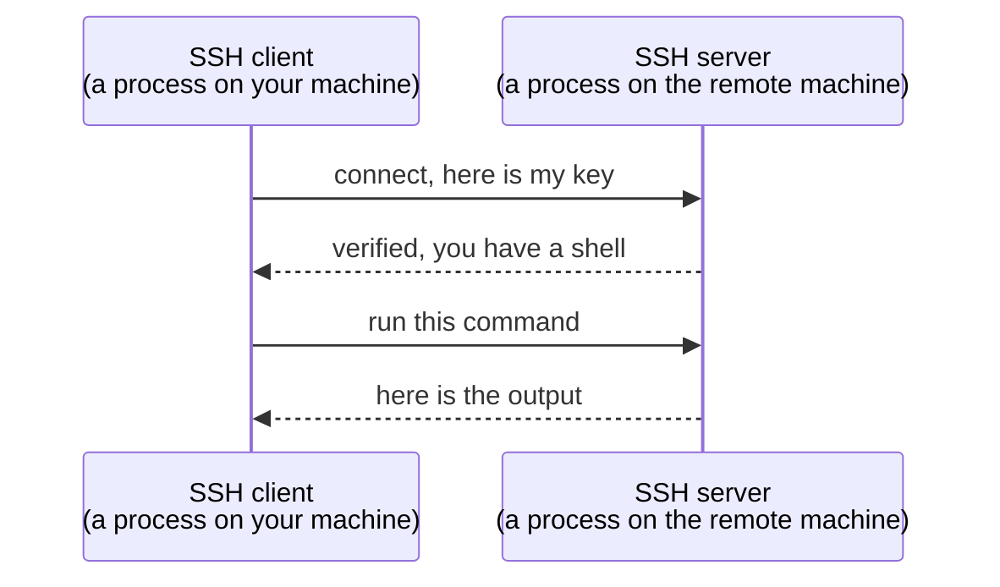

A network protocol is a set of rules that lets two processes on two machines communicate. That is a clean definition and it is also completely abstract. The fastest way to make it concrete is to pick a protocol, rent a machine on the other side of the world, and use one to reach the other.

# SSH

**SSH** stands for Secure Shell, and **it is a network protocol** — so by definition it is a **set of rules for one particular kind of communication.**

The kind it handles: **logging into a remote machine and running commands on it, securely.**

> [!info] **Remote** means a machine that is not physically near you — not something you could reach with a cable. It is somewhere else entirely, and the only way to it is over a network.


The valuable part is that **none of it has to be invented**. How to establish the connection, how to prove who you are, how to encrypt what passes between the two — all of it is already specified by the protocol, and tools already exist that implement it.

# Renting a machine to try it on

To connect to a remote machine you need a remote machine, and you do not have to buy one. You can rent.

**AWS** — Amazon Web Services — is one place to do that. Alongside its retail and video businesses, Amazon runs a cloud computing business: enormous buildings full of machines, called **data centres**, spread around the world. Those machines provide **compute** (processors that run your work) and **storage** (disks that hold your data). Microsoft Azure and Google Cloud Platform do the same thing.

> [!info] You never touch the machine. You cannot walk into the data centre and pick it up. It is rented to you and you reach it the only way available — over a network. Which is exactly why a protocol like SSH exists.

## Launching one

The service for renting a machine on AWS is **EC2**, and launching an instance is renting a machine. The decisions it asks for map onto things worth noticing:

| What it asks | What it means |
|---|---|
| **Name** | A label for you, nothing more |
| **Operating system** | Linux, Windows, macOS. Amazon Linux is Amazon's own Linux flavour |
| **Instance type** | How much RAM and how many CPU cores |
| **Key pair** | The credential you will log in with |
| **Network settings** | Who is allowed to reach this machine, and how |
| **Storage** | How much disk |

The instance type list is worth pausing on, because it is vertical scaling with a price tag attached. The options run from tiny up to machines with over a thousand gigabytes of memory and nearly two hundred CPU cores. A free-tier machine with **1GB of RAM and 2 CPU cores** is enough here — and it will feel fast, because it is not carrying the overhead of the dozens of applications your own laptop is running.

## The key pair

Logging into any machine needs credentials. Your own laptop asks for a password; a rented machine needs the same assurance that you are entitled to get in.

SSH handles this with a **key pair** rather than a password. You create one, and a file is downloaded to your machine. That file is now the thing that gets you in.

The network setting to notice is the one allowing SSH traffic from anywhere. **It means any machine on the internet may attempt to connect over SSH — but only one holding the key will succeed.**

## Locking down the key file

Before the key can be used, its file permissions have to be tightened:

```bash
# terminal
1  chmod 400 sample-pair.pem
```

> [!important] **Why this is required.** `400` makes the file readable by its owner and by nobody else — not writable, not executable, not visible to other users on the machine. SSH refuses to use a key file that is loosely permissioned, on the grounds that a private key readable by anyone is not private. Working out what the digits mean is a worthwhile detour into Linux file permissions.

# The SSH client is just a process

Before connecting, one definition pays off.

A **client** is any process that makes a request. So what is an **SSH client**? A process running on your machine that is capable of making SSH requests. That is the entire definition — no special category, just the general one applied.

Most Linux and macOS machines already have one installed. You can check:

```bash
# terminal
1  ssh -V
```

```text
1  OpenSSH_9.7p1, LibreSSL 3.3.6
```

So in this exchange **your machine is the client** and the rented machine is the server. Same two roles as always.

# Connecting

With a running instance, a key file, and its permissions fixed:

```bash
# terminal — the shape of the command
1  ssh -i sample-pair.pem ec2-user@<public-address-of-the-instance>
```

Three pieces: 
1. `-i` names the key file to identify yourself with, 
2. then the user to log in as, 
3. then the address of the machine. 

The first connection asks you to confirm you trust the host; after that you are in.

The clearest proof that anything happened is to ask which machine you are on, before and after:

```bash
# terminal — before connecting
1  whoami
2  # → your own username
```

```bash
# terminal — after connecting
1  whoami
2  # → ec2-user
```

Different answer, different machine. From here everything you type runs **on the rented machine, not yours**:

```bash
# terminal — running on the remote machine
1  ls
2  mkdir temp
3  ls
4  touch s.py
5  python3 --version
```

You can create directories, write files, check what is installed, and run code. The machine happens to have `python3` available but not `python`, which is worth knowing before assuming either.

Press `Ctrl-D` to close the session and you are back on your own machine.

> [!tip] **Terminate the instance when you are finished.** A rented machine you have stopped using is still rented.

# What the demo was actually for

Strip away AWS and the whole thing reduces to one point:



There was a specific type of communication needed — log into a distant machine and run commands, without anyone in between being able to read what passes. A protocol already existed for exactly that. Both sides followed its rules, and it worked.

> [!important] **That is what a protocol buys you.** For a given kind of communication, pick the protocol built for it, follow its rules on both ends, and the communication happens. You do not implement the mechanism; you conform to it.
