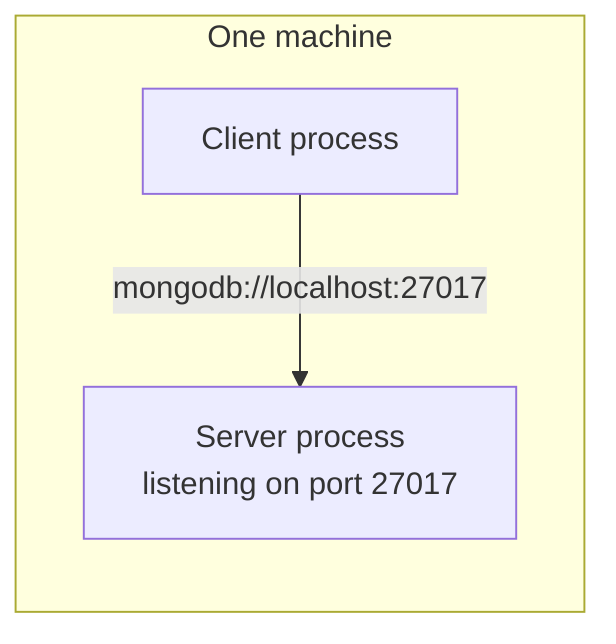

A client has to reach a server. Knowing the protocol is not enough — the client also has to know **where to send the request**. Getting from a request URL to a specific process on a specific machine turns out to need three separate pieces of information, and there is a good everyday analogy for why.

# Why it is hard at all

Making a phone call needs the other person's number and a country code. Reaching a server is the same problem in a much bigger space.

> [!info] **The internet is a network of computer networks.** A **computer network** is a set of interconnected computing systems — the Wi-Fi at your home joining your phone, laptop and tablet is one. The internet is many such networks connected to each other.

Somewhere in all of that sits the machine running the server. The client has to identify it precisely.

# Three things, borrowed from parcel delivery

To deliver a parcel, a courier needs three things:

| For a parcel | For a network request |
|---|---|
| **Where to deliver** — the address | The **IP address** of the machine |
| **How to deliver** — courier, air, rail | The **network protocol** to use |
| **Whom to deliver to** — the name on the parcel | The **port number** of the process |

The third is the one people skip, and it is the one that makes the rest work. Several people live at one address, so the name matters. Several processes run on one machine, so something equivalent is needed.

## Where: the IP address

An **IP address** is a numerical label assigned uniquely to every device connected to a computer network. Because it is unique, it identifies one machine unambiguously.

> [!important] **An IP address belongs to the machine, not to the process.** The server is a process. The IP address is of the machine that process is running on. Conflating the two is where a lot of confusion starts.

They are written as dotted numbers such as `10.20.1.2`. There is more than one notation — IPv4 and IPv6 — and the differences are their own topic.

## How: the network protocol

Which set of rules the conversation will follow: SSH, HTTP, FTP, or another. This is the part covered already.

## Whom: the port number

Your machine is running a great many processes at once — a browser, an antivirus, a text editor, a music player, some code you wrote. If a request arrives at the machine, which of them is it for?

A **port number** is a logical, unique number associated with a process on a machine. It is the name on the parcel.

> [!important] **Not every process needs one.** A program that sorts an array needs no port — nothing connects to it and it connects to nothing. A port is needed only when a process must be reachable over a network. Write a server that people should be able to connect to and you give that process a port.

# Socket address

Put the three together and you have a **socket address**:

```text
1  http://10.20.1.2:3000
2  ^^^^   ^^^^^^^^^ ^^^^
3  how    where     whom
```

Protocol, then `://`, then the IP address, then a colon, then the port.

> [!warning] **A socket address has nothing to do with WebSockets.** The word socket appears in both and they are unrelated. WebSockets is a protocol. A socket address is an address. Do not let the shared word connect them in your head.

# You do not always write the port

Connect to a rented machine over SSH and the command carries a key, a user and an address — but no port:

```bash
# terminal
1  ssh -i sample-pair.pem ubuntu@<public-address>
```

It still works, because **every protocol has a default port**. Leave the port out and the default is assumed.

| Protocol | Default port |
|---|---|
| SSH | 22 |
| HTTP | 80 |
| MySQL | 3306 |
| MongoDB | 27017 |

This is also why web addresses rarely show a port. HTTP defaults to 80, servers are commonly configured to receive HTTP traffic there, so there is nothing to write.

# How many ports there are

Ports are logical numbers, and the range is fixed:

> [!important] There are **2¹⁶ = 65,536** ports, numbered **0 to 65,535**. You cannot use a number outside that range.

They are divided into three bands:

| Range | Purpose |
|---|---|
| **0 – 1023** | Reserved for core system services and well-known protocols — HTTP on 80, SSH on 22 |
| **1024 – 49151** | Available for your own applications. MySQL sits at 3306 here, MongoDB at 27017 |
| **49152 – 65535** | Dynamic and private, unassigned, used temporarily by client applications |

> [!tip] **Do not squat on a port something you depend on already uses.** Putting your server on 3306 when you also run MySQL means one of them has to move, and it will be an irritating afternoon.

# The client end configures all three

Whatever acts as the client — a browser, an API testing tool, or code you wrote in any language — the same three things get configured: protocol, address, port. Then a **route** on top of that identifies what specifically you are asking for.

```bash
# terminal — protocol, host, and a route; port omitted, so HTTPS default is used
1  curl https://fakestoreapi.com/products/1
```

```json
1  {"id":1,"title":"Fjallraven - Foldsack No. 1 Backpack, Fits 15 Laptops","price":109.95,
2   "category":"men's clothing","rating":{"rate":3.9,"count":120}}
```

# When both ends are on your own machine

This is the part that catches people out, and getting it wrong is avoidable.

While developing, you run your server on your laptop and your client on the same laptop. Two processes, one machine.

> [!important] **They do not need the internet to talk to each other.** Not slow internet, not flaky internet — none at all. You need the internet only to reach a machine on a **different** computer network. Two processes on one machine are not even two machines.

If your application is not working locally, the internet is not the reason. That failure mode is worth ruling out permanently.

## What you still need, and what you can drop

Since both processes share a machine, you do not need to state the machine's IP address. You substitute a name for it:

```text
1  mongodb://localhost:27017
2  mongodb://127.0.0.1:27017
```

`localhost` and `127.0.0.1` both mean this machine, and either can stand in for the address.

But look at what has **not** gone away. The **protocol is still there** — `mongodb://` in the lines above — and the **port is still there**, because your machine is still running many processes and the client still has to say which one it wants. Only the address was replaced.

| | Away from your machine | On your machine |
|---|---|---|
| Protocol | required | **required** |
| Address | the machine's IP | `localhost` or `127.0.0.1` |
| Port | required | **required** |



**A database GUI connecting to a database server on the same laptop does exactly this.** Its default connection string is `mongodb://localhost:27017` — protocol, then `localhost`, then the port. No IP address, no internet, and it connects.

# The remaining gap

Three things get a request to the right process: an IP address, a protocol, a port.

Except almost nobody types an IP address. You type a name. Something has to turn one into the other.
