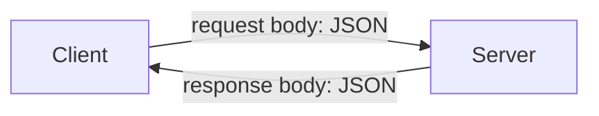

HTTP can carry anything. Modern APIs mostly use it to carry one particular format, so that format is worth knowing properly before building anything that speaks it.

# What JSON is

**JSON** stands for JavaScript Object Notation.

> [!warning] **JSON has nothing to do with JavaScript.** You do not need JavaScript to create JSON, read it, send it, or do anything else with it. Java, Python, Go and everything else handle it perfectly well. The name is a historical artefact, and it misleads a lot of people.

What JSON actually is: **a way of representing data as key-value pairs.**

You open a pair of curly braces and write keys and values inside:

```json
1  {
2    "name": "iPhone 11",
3    "price": 999,
4    "company": "Apple"
5  }
```

Keys are strings. Values can be strings, numbers, and several other things.

## Nesting

A value can itself be another JSON object, which is what makes the format able to describe anything with structure:

```json
1  {
2    "name": "iPhone 11",
3    "price": 999,
4    "company": "Apple",
5    "features": {
6      "color": "black",
7      "memory": "1 TB"
8    }
9  }
```

`features` is a key whose value is a nested object with keys of its own.

## Where the name came from

JavaScript has a data type called an object, and a JavaScript object is written as key-value pairs inside curly braces — visually identical to the above.

JSON was inspired by that syntax, and took its name from the resemblance. **The resemblance is the entire connection.** It is a syntax that was borrowed, not a dependency.

# Why not just a text file

The obvious alternative is to write the data into a plain text file:

```text
1  name iPhone 11
2  price 999
3  company Apple
4  features
5      color black
6      memory 1 TB
```

It is readable, and it has two real problems.

- **Nesting is awkward.** Representing that `color` belongs inside `features` requires a convention — indentation, here. Nothing enforces it.
- **There is no standardisation.** One person indents, another does not. One uses a space between key and value, another a colon. Every reader has to agree with every writer, and nothing checks that they do.

Which makes processing it fragile. Any parser has to encode assumptions no one wrote down.

> [!important] **JSON removes the ambiguity.** The structure is fixed: key-value pairs, braces for nesting. Every key states what its value is, and the format is the same everywhere. A parser knows what it is getting without any private agreement.

# Why not XML

Before JSON, the same job was done with **XML**, which uses tags rather than key-value pairs:

```xml
1  <product>
2    <name>iPhone 11</name>
3    <price>999</price>
4    <company>Apple</company>
5    <features>
6      <color>black</color>
7      <memory>1 TB</memory>
8    </features>
9  </product>
```

That is the same information, structured unambiguously. It also costs more.

> [!important] **Every key is written twice** — once in the opening tag and once in the closing tag — plus the angle brackets and slashes around each. For a format whose purpose is to be transmitted, paying twice for every key is a real cost.

Measured on the two documents above, as they would actually be sent:

| Format | Bytes |
|---|---|
| JSON | 95 |
| XML | 145 |

XML is roughly **1.5× larger** for identical data. That is not a catastrophe on one record; multiplied across every request a busy service handles, it is bandwidth spent on nothing.

> [!info] **Verified.** Both documents parse cleanly, and the byte counts are of the minified forms.

That inefficiency is a large part of why JSON displaced XML, and JSON is now among the most widely used data transfer formats in modern applications.

# One practical note

Stored in a file, JSON uses the `.json` extension, the same way plain text uses `.txt`

# What it is for



A client needs to send structured data to a server and get structured data back, across a network, between programs that may be written in entirely different languages. **JSON is unambiguous enough to parse reliably, compact enough not to waste bandwidth, and tied to no particular language.**
