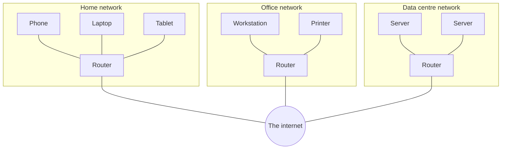
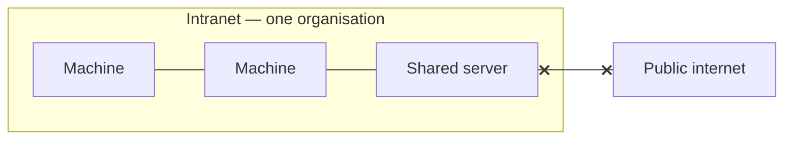
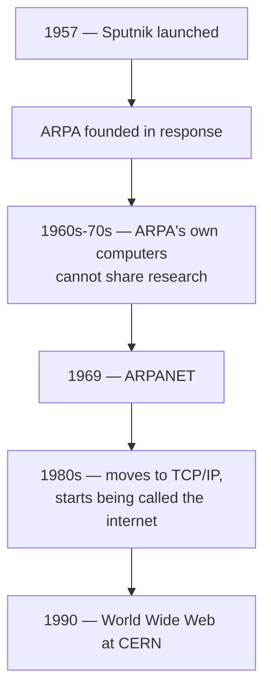

Everything a backend system does rests on machines being able to reach each other. That capability has a history, and knowing where it came from makes the vocabulary stop being arbitrary.

# Network

Start with the plain English word, before any computers.

> [!important] A **network** is a group or system of interconnected people or items.

A country's railway is a network. Not just the trains — the stations, the junctions, the tracks, the ticketing, the routing, and everyone working across all of it. Every part has a role, and the whole thing functions because they are connected.

A **computer network** is that idea applied to machines:

> [!important] **Computers connected to each other, by cable or wirelessly, form a computer network.**

## Why bother

Two reasons, and they are the same reason twice.

**Sharing resources.** You have written some code or a document and need it on your teammate's machine. Connected, that is trivial. Unconnected, it is not possible at all.

**Communication.** Phones sharing files directly between them are doing this over Wi-Fi and Bluetooth — a small network, formed for the purpose.

> [!info] Take computer networks away and every form of resource sharing and remote communication stops. That is the scale of what the idea buys.

# Internet

> [!important] **The internet is a network of computer networks.**

Your home Wi-Fi joins your phone, laptop and tablet — **one small computer network.** Your neighbours have their own. Offices, universities and data centres have theirs. **Connect all of those together and the result is the internet**: a web of interconnected networks rather than one giant network of machines.

Each box is a complete computer network on its own, working perfectly well with nothing outside it. The internet is what you get by joining them.

## Intranet

The same technology, deliberately closed off.

> [!important] An **intranet** is a private internet. Machines inside it can reach each other freely. Nothing outside can reach in, and machines inside typically cannot reach out.

A research organisation might connect every machine across all its sites, so staff can share code and data — while none of those machines can open a public website, and nobody outside can reach them. The technology is identical; the boundary is the point.

The crossed line is the whole difference. Inside, everything reaches everything. Across that line, nothing moves in either direction.

# How it got here

The history is short and each step follows from the last.

**1957.** The Soviet Union launches Sputnik, the first satellite — a serious advance in communications.

**The response.** The United States government founds **ARPA**, the Advanced Research Projects Agency, to push scientific and technological work.

**1960s to 70s.** ARPA becomes a large research facility spread across the country, and hits a mundane problem: its computers cannot talk to each other. Two teams researching the same topic at different sites have no way to share what they have. So ARPA builds a communication system for its own machines.

**1969.** That system is **ARPANET** — the direct ancestor of the internet, built to solve an internal file-sharing problem.

**1980s.** ARPANET migrates from its original transmission protocol to **TCP/IP**. Other government, research and academic machines join, and around this point the name **internet** takes over.

**1990.** Researchers at **CERN** have the same problem ARPA had — sharing information — and they work in **hyperlink-based documents**, where one document links to another. **Tim Berners-Lee** introduces the **World Wide Web**: a system for storing and retrieving those linked documents over the network.

> [!info] **The web is not the internet.** The internet is the network of networks. The web is one thing built on top of it — a system of linked documents. Email is another. They are applications of the internet, not the internet itself.

**Then browsers.** Before Internet Explorer or Firefox there were **Mosaic** and **Netscape**, the first browsers that could render what the web served.

**Then the shift in what it was for.** Early web pages were things you **read**. Later ones were things you **contributed to** — social media, anything where users put content up rather than only taking it down. The infrastructure did not change; what people did with it did.

# Protocols

One idea makes all of it work, and it is not technical.

Travel between countries requires agreed rules — your own country's rules stop at its border, so something shared has to exist for goods and people to cross. Networks have exactly the same requirement: machines in different countries, run by different people, still have to agree on how to exchange anything at all.

> [!important] A **protocol** is a set of rules. A **network protocol** is a set of rules and regulations for communicating and sharing information over a network.

Which network is not the point. It applies equally to your home Wi-Fi and to the whole internet.

Different jobs need different rules, so there are many:

| Protocol | For |
|---|---|
| **HTTP** — HyperText Transfer Protocol | Web pages and most API traffic |
| **TCP** — Transmission Control Protocol | Reliable delivery |
| **UDP** — User Datagram Protocol | Fast delivery without those guarantees |
| **IP** — Internet Protocol | Addressing and routing |
| **SMTP** — Simple Mail Transfer Protocol | Sending email |

> [!important] Sending an email is not the same operation as loading a page, so it does not use the same rules. Follow SMTP's steps correctly and mail is delivered. That is all a protocol is: **do these things in this order and the thing works.**
