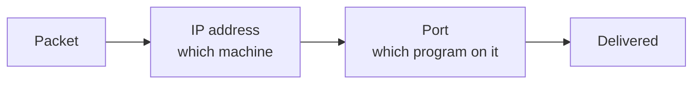

Two machines want to exchange data. Three questions have to be answered before anything can move: how the data is broken up, where it is going, and which program at that destination should receive it.

# Data travels in packets

You cannot put an arbitrary volume of water through a pipe. The pipe has a capacity, and exceeding it does not make the water arrive faster. A railway track carries one train at a time regardless of how many are waiting.

Networks are the same. **There is a limit to what can be in flight**, so data is not sent as one block.

> [!important] Data to be sent is divided into smaller chunks called **packets**.

Three things follow from that:

**Loss becomes survivable.** If a packet goes missing, one small piece is missing — and a small piece can be requested again. Lose one large transfer and there is nothing to recover from.

**The network stays manageable.** Many small units can be **scheduled**, **routed** and **interleaved**. One enormous unit cannot.

**Capacity is used properly.** Small units keep the link busy rather than waiting on one large transfer to clear.

> [!info] This is why a network can carry many conversations at once. If every transfer occupied the link whole, nothing else could move until it finished.

# Where it is going: the address

Sending a parcel requires a destination. So does a packet.

> [!important] Every message over a network needs **destination details** that uniquely identify the receiving machine. That identifier is its **address** — in practice, its **IP address**.

The machines at the edges of the network — the laptops, phones and servers that actually produce and consume data — are called **end systems**. An address identifies one of them.

# Which program: the port

The address gets a packet to the right machine, and that is not enough.

Deliver a parcel to a house where several people live and the address alone does not say who it is for. The **name** on the parcel does.

Your machine is the house. A browser, a chat client, a music player and a database are all running at once, and a packet arriving for the browser must not be handed to the chat client.

> [!important] A machine may run many networked programs. To tell them apart when receiving messages, each gets a **port number**.

## The numbers

A port is a **16-bit** number, so the range is fixed:

> **0 to 2¹⁶ − 1, which is 0 to 65535.**

Divided into three bands, each with a different purpose:

| Range | Name | Meaning |
|---|---|---|
| **0 – 1023** | Well-known ports | Reserved for specific, standard applications |
| **1024 – 49151** | Registered ports | Used by known but non-system software |
| **49152 – 65535** | Dynamic ports | Unassigned, available for temporary or future use |

**Well-known ports** are fixed by convention across the whole internet — HTTP on 80, HTTPS on 443. A packet arriving on one of those has a use case already agreed.

**Registered ports** are where third-party software lives. Your operating system knows what HTTP and SMTP are; it has no idea that someone would write a particular database or web framework. So MongoDB defaults to 27017, SQL Server to 1433, and development servers commonly sit on 3000 or 4000.

> [!info] These are defaults, not rules. Nothing stops you running a database on a different port — you simply have to tell every client connecting to it, because they will look for the default otherwise.

**Dynamic ports** are unassigned, kept for temporary use and future need.

# Address plus port

Put the two together and the destination is fully specified:

> [!important] That combination — address and port — is called a **socket**.

> [!warning] A socket in this sense has nothing to do with **WebSockets**. They share a word and nothing else. WebSockets is a protocol; a socket here is an address paired with a port.
