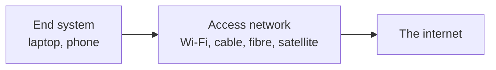

Packets need somewhere to travel. Between your machine and the rest of the internet sits physical infrastructure and a company that owns it — worth knowing about, because the shape of today's internet is largely explained by what already existed when it arrived.

# Access networks

> [!important] An **access network** is the medium through which an end system connects to the internet.

Your machine is the end system. The access network is whatever it connects **through** to reach everything else.

# The card that makes it possible

Before any of that, the machine needs hardware capable of joining a network at all.

> [!important] A **network interface card**, also called a network interface adapter, is the hardware that lets a computer attach to a network.

Many kinds of network exist — wired, wireless, this technology or that — and the card is what presents a single consistent way for the machine to connect to any of them. When something says a network interface card is required, it means this: the hardware that puts the machine on a network.

# The kinds of connection

| Type | What it uses |
|---|---|
| **DSL** | Existing telephone lines |
| **Cable** | A dedicated cable line |
| **Fibre** | Fibre optic cable — the fastest of these |
| **Satellite** | A satellite link, no ground infrastructure needed |
| **Wi-Fi** | A wireless local link to one of the above |
| **Dial-up** | Telephone lines, older and far slower — and it ties up the line while in use |

Each carries data at a different rate, which is most of what distinguishes one internet connection from another.

# DSL, and why it mattered

**DSL** — **Digital Subscriber Line** — deserves singling out, because it explains the industry rather than just the technology.

> [!important] **DSL uses the existing telephone network to carry internet traffic.**

Two facts make that possible, and neither is obvious. **The wires were already there** — telephone lines reached most buildings, laid decades earlier, paid for and working. And **a telephone call uses only a fraction of what a copper pair can carry**, so there was a great deal of unused capacity sitting in the ground in front of every building. DSL is what happens when equipment is finally built that can use the rest of it.

That second fact has a consequence you would have noticed at the time. **The telephone keeps working while you browse**, because the call and the data travel on the same pair without getting in each other's way. Dial-up, which came before it, could not manage that — it disguised data as a telephone call, so being online meant the line was engaged and nobody could ring the house.

And the first fact is what made it decisive commercially. Building a separate nationwide network for internet access would have been enormously expensive. Using wires that were already in the ground was not.

The full path from a home to the internet, with the equipment named:

![[Backend Engineering/03-Computer-Networks/Images/dsl-to-internet.png]]

Left to right: the router in the building, the telephone line itself, and then two pieces of equipment belonging to the provider.

**The DSLAM** — Digital Subscriber Line Access Multiplexer — sits in the telephone exchange, where the lines from every nearby building arrive. Its job is **multiplexing**: gathering the traffic from hundreds of separate lines onto one high-capacity connection heading onward, and separating it back out again on the return. Running an onward cable per line would simply move the one-wire-per-building problem a step down the road.

**The BRAS** — Broadband Remote Access Server — is where a line becomes a customer. It establishes that this connection belongs to someone with an account in good standing, applies the speed they actually bought, gives them an address the rest of the internet can reach them at, and only then lets the traffic onto the network beyond.

> [!info] Notice the split between the two. The DSLAM deals in **physical things** — copper, sockets, which line a piece of traffic arrived on. The BRAS deals in **accounts and entitlements** — who this is, what they pay for, whether they are allowed through. Neither knows how to do the other's job.

Only the leftmost box is in your home. Everything else is the telephone company's, which is exactly the point of what follows.

## Which is why your phone company sold you internet

> [!important] DSL is generally provided by the **same company that supplies the telephone service** — because they own the wires it runs on.

And that is where the term you use every month comes from:

> **An ISP — Internet Service Provider — is a company that provides end users with internet access.**

The first ones were **telephone companies**. They already had the infrastructure and the customers; adding internet service on top was the obvious move. Later ISPs built cable and fibre, but the category was created by the fact that a telephone network already existed.

> [!info] Wireless followed the same logic. Early mobile internet used dongles with a SIM card, running over the existing mobile telephone network for the same reason DSL used the fixed one. Whatever was already there got used.

# Why this is worth knowing

You will not configure DSL. What is worth carrying is the pattern.

> [!important] **New infrastructure gets built on top of old infrastructure wherever possible**, because the old infrastructure is already paid for. The internet reached homes over telephone wires, and mobile internet reached phones over mobile telephone networks.

The same instinct shows up in software constantly — **building on something that already exists rather than starting again** — and it is the reason a great many technical decisions look arbitrary until you know what was there first.
