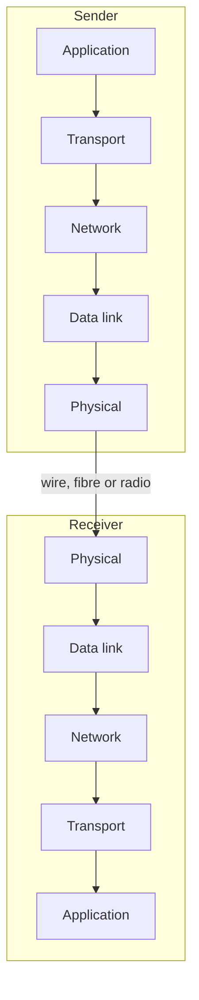
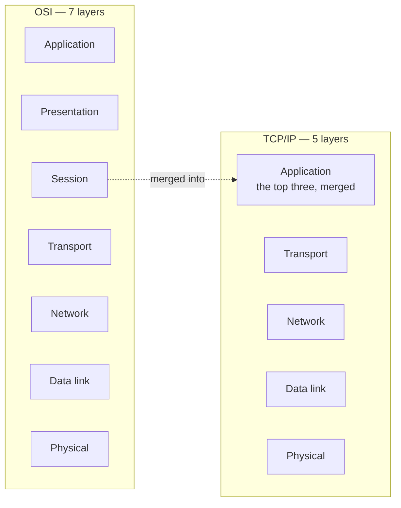

Sending data across a network is not one action. It is a sequence of separate jobs, each handled by a different part of the system — and the arrangement of those jobs is the single most important structure in computer networking.

# The shape of it

Order something online and it does not travel from the vendor to your hand in one motion. It goes from the vendor to a truck, to a regional warehouse, to a local warehouse, to a courier, to you. Each stage does one job and hands the parcel to the next.

School admission is the same shape. An application department takes the form, a test department administers a test, an evaluation department marks it, a results department decides, a fees department takes payment — and only then does anyone reach a classroom. Each department has one responsibility and passes you to the next.

> [!important] A network works this way. Sending data means passing it down through a series of **layers**, each doing one job. Receiving means passing it back up through the same layers in reverse.

The sender's goal is to get data **down** to the physical layer, where it becomes signals on a wire. The receiver's begins at the physical layer and works **up** until an application can display it.

# Two models

There are two standard descriptions of these layers.

| | **OSI** | **TCP/IP** |
|---|---|---|
| Layers | **7** | **5** |
| Difference | Splits the top into three | Combines those three into one |

**OSI** has: Application, Presentation, Session, Transport, Network, Data Link, Physical.

**TCP/IP** has: Application, Transport, Network, Data Link, Physical.

> [!important] They describe the same reality. TCP/IP takes OSI's top three layers — application, presentation and session — and treats them as a single **application** layer. Everything below is identical in both.

> [!info] **TCP/IP is what is actually used.** OSI is the more detailed teaching model and remains the common reference for naming layers, but real systems are built and discussed in terms of the five.

# What each layer does

Working down from the application, which is the direction data travels when you send something.

## Application

The programs you actually use — a browser, an email client, a chat application. This is where sending begins: you write the message and hand it off.

## Presentation

How the data should be presented for transmission.

- **Compression**, if the data should be made smaller before it travels
- **Encryption**, if it should be unreadable in transit

## Session

Managing the **session** between the two parties — the state of being logged in, and everything that persists across a sequence of exchanges rather than a single one.

> [!info] These top three all run on the end devices themselves, which is why TCP/IP merges them. From the network's point of view they are one thing: the machine at the edge.

## Transport

> [!important] **Takes the large block of data arriving from above and divides it into small chunks — and manages those chunks.**

Managing is the substantial part: making sure the division does not lose anything, or deliberately accepting that loss is possible when speed matters more. That choice is what separates the two transport protocols, TCP and UDP.

## Network

**Routing.** The data is now packets, and each has to find a path across the network to its destination.

## Data link

Several related jobs at the level of a single link:

- **Error and flow control** — detecting corruption in transit, and pacing the sender
- **Multiplexing and demultiplexing** — combining several streams onto one link and separating them again
- **Addressing** — which machine on this link a packet is for

## Physical

The actual medium. Copper, fibre optic, or radio to a satellite. Data here is signals — electrical, optical, or waves — and nothing more abstract than that.

# Why this is worth knowing properly

Two reasons, and the second is the one that surprises people.

**It is the most examined topic in networking.** Most computer networks questions are about the stack in some form.

**And it is not fixed.** A large social network was found to have inserted **two additional custom layers between the application and transport layers**, for securing data and moving it faster to the next machine.

> [!important] That is only possible if you understand the stack as a structure rather than a fixed list. **Layers are separated responsibilities, not immovable furniture.** When a system needs a responsibility the standard layers do not provide, a layer can be added — and reasoning about where it belongs requires knowing what each existing layer is for.
