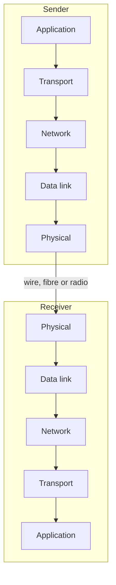
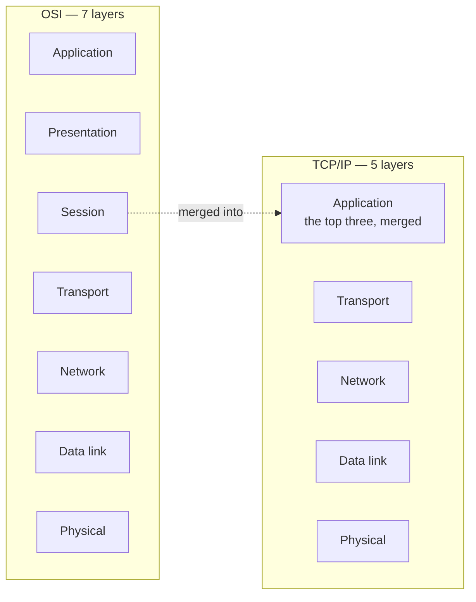

Sending data across a network is not one action. It is a sequence of separate jobs, each handled by a different part of the system — and the arrangement of those jobs is the single most important structure in computer networking.

# The shape of it

Order something online and it does not travel from the vendor to your hand in one motion. It goes from the vendor to a truck, to a regional warehouse, to a local warehouse, to a courier, to you. Each stage does one job and hands the parcel to the next.

School admission is the same shape. An application department takes the form, a test department administers a test, an evaluation department marks it, a results department decides, a fees department takes payment — and only then does anyone reach a classroom. Each department has one responsibility and passes you to the next.

> [!important] A network works this way. Sending data means passing it down through a series of **layers**, each doing one job. Receiving means passing it back up through the same layers in reverse.

The **sender's** goal is to get data **down** to the physical layer, where it becomes signals on a wire. The **receiver's** begins at the physical layer and **works** **up** until an application can display it.

# Two models

There are two standard descriptions of these layers.

| | **OSI** | **TCP/IP** |
|---|---|---|
| Layers | **7** | **5** |
| Difference | Splits the top into three | Combines those three into one |

**OSI** has: Application, Presentation, Session, Transport, Network, Data Link, Physical.

**TCP/IP** has: Application, Transport, Network, Data Link, Physical.

> [!important] They describe the same reality. TCP/IP takes OSI's top three layers — application, presentation and session — and treats them as a single **application** layer. Everything below is identical in both.

> [!info] **TCP/IP is what is actually used.** OSI is the more detailed teaching model and remains the common reference for naming layers, but real systems are built and discussed in terms of the five.

# What each layer does

Working down from the application, which is the direction data travels when you send something.

## Application

The programs you actually use — a browser, an email client, a chat application. This is where sending begins: you write the message and hand it off.

## Presentation

How the data should be presented for transmission.

- **Compression**, if the data should be made smaller before it travels
- **Encryption**, if it should be unreadable in transit

## Session

Managing the **session** between the two parties — **the state of being logged in**, and everything that persists across a sequence of exchanges rather than a single one.

> [!info] These top three all run on the end devices themselves, which is why TCP/IP merges them. From the network's point of view they are one thing: the machine at the edge.

## Transport

> [!important] **Takes the large block of data arriving from above and divides it into small chunks — and manages those chunks.**

Managing is the substantial part: **making sure the division does not lose anything**, or deliberately accepting that loss is possible when speed matters more. That choice is what separates the two transport protocols, TCP and UDP.

## Network

**Routing.** The data is now packets, and each has to find a path across the network to its destination.

## Data link

Several related jobs at the level of a single link:

- **Error and flow control** — detecting corruption in transit, and pacing the sender
- **Multiplexing and demultiplexing** — combining several streams onto one link and separating them again
- **Addressing** — which machine on this link a packet is for

That last one is easy to confuse with the network layer's addressing, and the difference is worth fixing now.

> [!important] The **network layer** addresses the **final destination** — a machine that may be on the other side of the world. The **data link layer** addresses **the next machine along**, which is usually a router a few metres away.

Which produces a distinction that surprises people:

> [!important] **The network-layer address stays the same for the whole journey. The data-link address changes at every hop.** Each router receives a frame, strips the link-layer wrapper, reads the unchanged destination address inside, decides where to send it next, and wraps it in a **new** link-layer wrapper addressed to that next machine.

So the question each layer answers is different. The network layer asks where is this ultimately going. The data link layer asks who do I hand it to right now.

## Physical

The actual medium. Copper, fibre optic, or radio to a satellite. **Data here is signals** — electrical, optical, or waves — and nothing more abstract than that.

# What passing down actually does

Now that each layer has a name and a job, the handover between them is worth looking at, because it is not simply moving data along. Each layer **wraps** **what it received in its own header** — **a small block of control information that layer's counterpart on the other side will need** — and treats everything it was given as opaque payload.

![[Backend Engineering/03-Computer-Networks/Images/encapsulation-through-the-layers.png]]

Read it top to bottom. Your application's data is handed to transport, which puts a header in front of it and calls the whole thing a segment. That segment is handed to the network layer, which puts an IP header in front of **all** of it. That in turn goes to the data link layer, which adds a header and a footer around the lot. By the time it reaches the wire, the original data is buried under three layers of wrapping.

> [!important] **Each layer only reads its own header.** The network layer looks at the IP header to decide where to route, and never opens what is inside. That is what makes the layers independent: a layer can be changed entirely as long as it keeps handing the next one down a block it can wrap.

On the receiving side the same thing happens in reverse. Each layer strips off the header it recognises and hands the remainder up, until the application gets back exactly the data that was sent.

> [!info] The illustration uses UDP as the transport protocol, but the shape is identical with TCP — a TCP header in place of the UDP one, everything else the same.

## The same data, under five names

Each wrapping produces something with its own name. The names are used constantly and they refer to the same data at different depths.

| Layer | The unit is called |
|---|---|
| Application | **Data** or a **message** |
| Transport | A **segment** under TCP, a **datagram** under UDP |
| Network | A **packet** |
| Data link | A **frame** |
| Physical | **Bits** — signals on the medium |

> [!important] Nothing is converted between these. **A frame is a packet with a link-layer header and footer around it**, and a packet is a segment with an IP header in front of it. The names describe how much wrapping is currently on, not different kinds of thing.

# The stack is a structure, not a fixed list

Everything so far describes five layers as though the number were settled. It is not.

A large social network was found to be running **two additional custom layers of its own, inserted between the application and transport layers** — one for securing data, one for moving it to the next machine faster than the standard arrangement managed.

> [!important] That is possible because **a layer is a separated responsibility, not a piece of immovable furniture.** Nothing about the design forbids adding one. What it requires is that the new layer accept a block from above, do its job, and hand a block down — which is exactly the contract the encapsulation mechanism defines.

Which is why the layers are worth knowing properly rather than memorising in order.

> [!important] Deciding **where** a new responsibility belongs is only possible if you know what each existing layer is already responsible for. Securing data before it is divided into segments is a different decision from securing each segment after the fact, and the difference is which layer you put it above.
