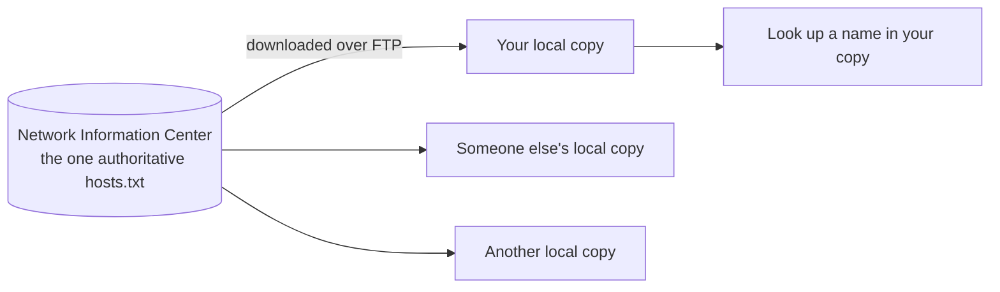
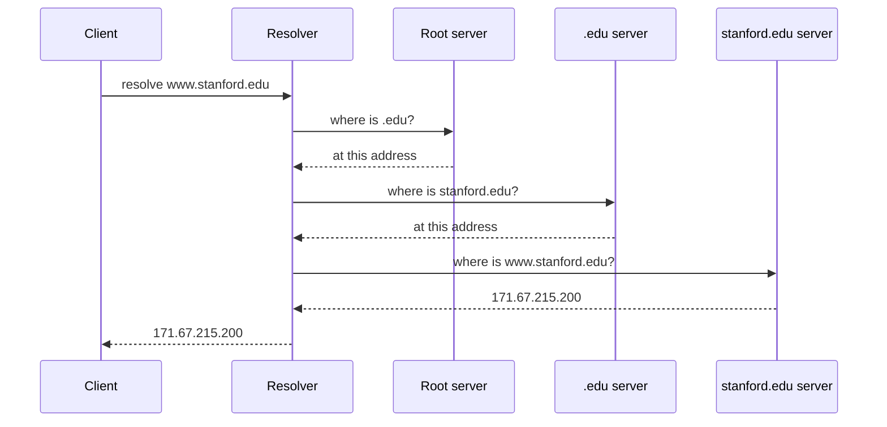
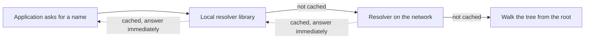

The top of the stack is where the protocols you actually use live, and one of them has to run before any of the others can start: nothing can be sent to a name until that name becomes an address. Something has to hold that mapping. The interesting part is not that it exists but what it had to be built like — because the requirements ruled out almost every obvious design.

# Before there was a system

The first version was a file.

> [!important] **`hosts.txt`** was a single text file containing every name-to-address mapping on the internet, maintained centrally by an organisation called the Network Information Center.

Using it worked like this. Your machine kept a local copy. When you wanted to reach a name, you looked it up in your copy. If your copy was old, or the name you wanted was not in it, you downloaded a fresh copy over FTP and looked again.

It is worth saying plainly that **this was a reasonable design at the time.** The internet was small enough that one file could describe it and one organisation could maintain it.

## Where it broke

Three things, and the first is the one people notice.

**It does not scale.** Every machine downloading a complete list of every name, repeatedly, is impossible once there are millions of names.

**It is a single point of failure.** Corrupt or lose that file and name resolution stops working for everyone, everywhere.

**Updates are slow and manual.** A new name is useless until every machine that cares has downloaded a fresh copy.

# What the replacement had to be

The design of DNS follows from four requirements, and each one eliminates a simpler design.

> [!important] **It must handle an enormous number of records.** The internet was growing daily and there was no ceiling in sight.

> [!important] **Control must be distributed.** Not merely the data — the authority. An organisation should be able to manage its own names without asking anyone. If one body has to approve every new name under `stanford.edu`, that body becomes the bottleneck the moment there are more than a few thousand.

> [!important] **It must survive failures.** No single machine whose loss stops resolution. This is the direct answer to `hosts.txt`.

> [!important] **It can be read-mostly and loosely consistent.** New names are added continually, but they are looked up vastly more often than they are added. And a mapping that changed thirty seconds ago does not have to be visible everywhere immediately — it is acceptable for part of the internet to see the old answer for a while.

That last requirement is the one that unlocks everything.

> [!important] **Read-mostly plus loose consistency means the answers can be cached.** If immediate consistency were required, every lookup would have to reach the authoritative source, and the system would be exactly as centralised as the file it replaced. Accepting staleness is what makes caching legitimate, and caching is what makes the system fast.

The tree structure this produces — root, top-level domain, second-level domain, subdomain — is covered in [[04-DNS]]. What follows is what happens when a lookup actually runs against that tree.

# Two kinds of query

> [!important] A **recursive** query asks one server to resolve the entire name and come back with a final answer. A **non-recursive** query resolves a single step and returns a pointer to whoever knows the next step.

Both are involved in an ordinary lookup, at different levels. Your machine asks recursively, because it wants an address and does not want to do the work. The server it asks then makes a series of non-recursive queries on your behalf.

# A lookup, step by step

The machine doing the work is called the **resolver**. Follow it resolving `www.stanford.edu` from cold, knowing nothing.

**The client asked once.** The resolver made three separate queries, each resolving one level, each answered with a pointer rather than a final address until the last.

## And every step is cached

The resolver stores each answer as it goes. Which changes what the next lookup costs:

> [!important] Ask for `harvard.edu` next and the resolver **already knows where the `.edu` server is**. It skips the root entirely and starts one level down. Ask for `cs.stanford.edu` and it skips two levels, because it knows where `stanford.edu` is answered.

The root servers would be overwhelmed within seconds if every lookup on the internet started at them. Caching is what keeps the load at the top of the tree survivable.

# Who is actually authoritative

> [!important] An **authoritative server** holds the real DNS records for a domain — the definitive mapping, not a cached copy of it. Every organisation with a public website or email is expected to provide one.

There are two ways to have one:

| Approach | What it means |
|---|---|
| **Run it yourself** | A dedicated DNS server you own and operate |
| **Delegate it** | Point at a provider's name servers and let them serve your records |

Delegating is what most organisations do, and it is where the word authoritative comes from: you have handed the authority for your records to someone else's servers.

# The message that comes back

A DNS response is not just an address. It has a defined structure, and each part answers a different question.

| Section | Holds |
|---|---|
| **Header** | Flags, an opcode saying this is a query, a status saying whether anything went wrong, an identifier |
| **Question** | The name that was asked about, repeated back |
| **Answer** | The address it maps to |
| **Authority** | Which name servers are authoritative for this domain |
| **Additional** | Supporting records, typically the addresses of those name servers |

The question section being echoed back is worth noticing. A response has to be matchable to the request that caused it, and repeating the question is how that is done.

The authority and additional sections together tell you where the answer really came from. If a domain's records are served by a provider's name servers, the authority section names them and the additional section gives their addresses.

> [!info] `dig` shows all five sections. `dig <name> +short` suppresses everything except the answer, which is what you want when you only need the address.

# Caching on your own machine

The resolver is not the first cache in the path. Your own operating system caches too.

> [!important] The **local resolver library** is part of the operating system. When a lookup returns, it stores the mapping locally, so a repeat lookup for the same name is answered without any network traffic at all.

Only when nothing local matches does the query leave the machine.

> [!info] Which resolver your machine asks is usually not configured by hand. **DHCP** — Dynamic Host Configuration Protocol — is what hands your machine its network settings when it joins a network, and the resolver's address arrives as part of that.

Three layers, each answering what it can and passing on what it cannot.

# What caching costs

Caching is what makes DNS work. It is also what makes this attack possible.

> [!important] **DNS cache poisoning** is getting a false mapping into a cache. If an attacker can persuade a resolver that `stanford.edu` lives at their address, every client that resolver serves is sent there — and keeps being sent there for as long as the entry survives.

Notice that nothing was broken to achieve this. The client asked correctly and the resolver answered from its cache, exactly as designed. **The victim is the trust placed in a stored answer, and that trust is the same property that makes the whole system fast.**
